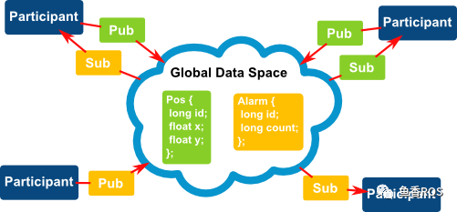
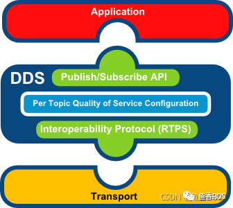

# 动手学ROS2
1.为什么要学习ROS2？
2.学了本课程能够做什么？
ROS2强大之处在于其生态系统，基于ROS2的软件库和工具集，针对不同种类的机器人和应用场景，衍生出了一系列机器人框架，用于如导航，规划，协同。
3.本教程适合学习对象有哪些？
4.课程规划
5.学习资源

## CH1 ROS2介绍与安装

### 章节导读
基础篇-Linux
入门篇-ROS2介绍安装
进阶篇-架构与中间件

### 基础篇-Linux
#### 1.Linux与Ubuntu系统介绍
##### 1.Linux是什么
这里需要了解下什么是操作系统，以及Linux内核是什么？

操作系统：管理计算机硬件与软件资源的计算机程序。

内核：内核是驱动硬件的程序。

基于硬件的第一层软件扩充，提供操作系统的最基本的功能，是操作系统工作的基础，它负责管理系统的进程、内存、设备驱动程序、文件和网络系统，决定着系统的性能和稳定性。

基于Linux内核衍生出了很多Linux系操作系统，Ubuntu就是其中之一。

##### 2.Ubuntu是什么

##### 3.Ubuntu系统版本

##### 4. CPU架构

你需要知道的常见架构有：

- amd64
- arm
- aarch64
- x86/i386(不常用)
根据电脑使用的CPU架构不同，你安装Ubuntu系统时应该选择对应的Ubuntu安装镜像包。

同时注意：不同架构的不同操作系统的软件安装包也是不兼容的。

##### 5. Ubuntu权限管理

- Linux 系统中的 超级用户 root 账号通常 用于系统的维护和管理，对操作系统的所有资源 具有所有访问权限
- sudo 命令用来以其他身份来执行命令，预设的身份为 root，所以我们可以使用sudo + 命令来提升操作权限
- chmod 命令可以用于修改文件权限

##### 6. Ubuntu如何安装软件
你需要知道的是：

- 使用apt从服务器下载安装，你需要提前添加服务器地址和服务器的秘钥，这一步就叫添加源或者换源
- 使用源码进行编译安装，你需要下载源码和源码的各种依赖，之后编译出程序拷贝到系统中
- 为什么可以使用apt安装？其实就是软件开发者在自己电脑上编译好程序，把程序打包上传到服务器，你就可以从服务器下载安装了

#### 2.在虚拟机中安装Ubuntu系统

##### 1.下载Ubuntu系统镜像
!!! tip

    最好是LTS版本，因为LTS版本的软件库比较稳定，不会出现软件库中的软件版本不兼容的问题。
##### 2.安装虚拟机软件
!!! tip
    VMware
##### 3.安装Ubuntu系统

#### 3.玩转Ubuntu之常用命令

##### 1.学会打开终端
!!! tip
    
    Ctrl+Alt+T
##### 2.学会常用命令
ls
cd
pwd
mkdir
rmdir
touch
rm
cp
mv
cat
more
less
head
tail

#### 4.玩转Ubuntu之编程工具

!!! info
    做机器人最常用的两门语言就是C++和Python，同时这两门语言也是编程语言流行度排行榜数一数二的。


#### 5.玩转Ubuntu之常用软件

!!! info
    VSCode

### 入门篇-ROS2介绍安装

#### 1.ROS2前世今生
要说ROS2，那就不得不提起ROS，ROS就是传说中的机器人操作系统，英文全称（Robot Operating System），但ROS本身并不是一个操作系统，而是可以安装在现在已有的操作系统上（Linux、Windows、Mac）上的软件库和工具集。

ROS出生于2007年，ROS的出现解决了机器人各个组件之间的通信问题，同时基于ROS的完善的通信机制，越来越多的优秀的机器人算法集成到了ROS中来。

现在的ROS功能已经变得非常的丰富和强大。但随着对ROS功能上要求越来越多，一些原始的架构和设计不能够满足目前的使用需求，这也是ROS2出现的原因。

ROS2继承了ROS原有的优秀之处，同时又带来了很多新的功能,ROS2相对于ROS更加的强大。

##### 1.1 ROS为什么会出现
ROS的设计目的是：简化在各种机器人平台上创建复杂而强大的机器人行为的任务即不重复造轮子

在ROS没有出现之前，做一个机器人是非常复杂的一件事情，因为一个机器人需要涉及到多个部分，而且这些部分之间还要进行通信。

例如设计一个轮式移动机器人，我们对其进行拆解。可以分为感知、决策、控制三个部分。


感知部分有：激光雷达、深度相机、IMU、里程计、碰撞感知、建图
决策部分有：路径规划（navigation）算法、定位算法
控制部分有：轮子驱动
机器人复杂之处就在于此，如果想要整个机器人可以跑起来，那么必须要有一个东西将上面的几个部分合理的连接到一起，这个东西就是ROS。

ROS的作用就像我们的身体的神经系统一样，通过神经系统将我们身体的各个部分接入大脑。

##### 1.2 为什么还要有ROS2

2007年ROS开发人员设计和制作ROS时，当时只想着简化机器人的开发，并没有想到过今天那么多的功能需求，比如商业化要求的稳定性、生命周期管理、多机协同、数据加密等。就像小鱼建房子时没想要未来会用全自动洗衣机一样~

ROS发展的后面的几年里，机器人对ROS的功能要求越来越多，ROS开发人员只能在原有的ROS上修修补补。

随着ROS不断的添加新功能，ROS变得越来越臃肿，祖传代码也越来越多。ROS开发人员发现在原有的ROS架构上修修补补十分消耗头发，于是像小鱼决定把房子推倒重建一样，ROS官方也重新设计制作了ROS2。

##### 1.3 ROS2介绍

#### 2.ROS与ROS2的对比

##### 2.1 ROS问题举例
上节课说到ROS的设计目标是简化机器人的开发，如何简化呢？ROS为此设计了一整套通信机制（话题、服务、参数、动作）。

通过这些通信机制，ROS实现了将机器人的各个组件给的连接起来，在设计这套通信机制的时候就设计了一个叫做Ros Master的东西，所有节点（可以理解为某一个组件，比如：激光雷达）的通信建立必须经过这个主节点。

一旦Ros Master主节点挂掉后，就会造成整个系统通信的异常,此时避障策略将会失效，如果机器人正在运行，碰到障碍物会径直装上去，机毁人亡！

ROS的不稳定这个问题在虽然对大家做机器人研究问题不大，但如果是想基于ROS做商业化机器人（比如无人驾驶汽车），就会造成非常严重的后果，小鱼在工作中可没为这个问题发愁

除了不稳定这个问题，ROS还有很多其他地方存在着问题：

通信基于TCP实现，实时性差、系统开销大
对Python3支持不友好，需要重新编译
消息机制不兼容
没有加密机制、安全性不高

##### 2.2 ROS2与ROS架构对比
所以在ROS2中，首当其冲的将ROS的主节点干掉了，这里放一张网上流传最广的ROS/ROS2架构图，接下来就会按照这篇架构图给大家讲解。

该图出自论文：Exploring the Performance of ROS2，论文在线阅读地址：https://www.researchgate.net/profile/Takuya-Azumi/publication/309128426_Exploring_the_performance_of_ROS2/links/5c908801299bf14e7e84ce61/Exploring-the-performance-of-ROS2.pdf


##### 2.3 ROS2新概念例举
可用Python编写的Launch文件
多机器人协同通信支持
支持安全加密通信
同一个进程支持多个节点、
支持Qos服务质量
支持节点生命周期管理
高效的进程间通信
##### 2.4 更详细的对比
https://zhuanlan.zhihu.com/p/423581728

#### 3.动手安装ROS2

##### 3.1 一键安装

##### 3.2 手动安装

- 第一步： ctrl + alt + T 打开终端

- 第二步：添加源

```bash
echo "deb [arch=$(dpkg --print-architecture)] https://repo.huaweicloud.com/ros2/ubuntu/ $(lsb_release -cs) main" | sudo tee /etc/apt/sources.list.d/ros2.list > /dev/null
```

- 第三步：添加秘钥

```bash
sudo apt install curl gnupg2 -y
curl -s https://gitee.com/ohhuo/rosdistro/raw/master/ros.asc | sudo apt-key add -
```

- 第四步：更新

```bash
sudo apt update
```

- 第五步：安装

```bash
sudo apt install ros-humble-desktop
```

- 第六步：安装额外依赖

```bash
sudo apt install python3-argcomplete -y
```

- 第七步：设置环境变量

```bash
source /opt/ros/humble/setup.bash
```

避免每次都要手动source，可以将上面的命令写入到~/.bashrc文件中

```bash
echo "source /opt/ros/humble/setup.bash" >> ~/.bashrc
```

##### 3.3 出现问题可以这样卸载
    
```bash
sudo apt remove ros-humble-*
sudo apt autoremove
```

##### 3.4 ROS2到底装在哪里了
```bash
cd /opt/ros/humble/
ls
```

#### 4.ROS2初体验

##### 4.1 你说我听

- 第一步：打开终端
ctrl + alt + T

- 第二步：启动倾听者
```bash
ros2 run demo_nodes_py listener
```

- 第三步：启动新的终端
ctrl + alt + T

- 第四步：启动说话者
```bash
ros2 run demo_nodes_cpp talker
```
##### 4.2 涂鸦小乌龟

- 第一步：启动小乌龟
```bash
ros2 run turtlesim turtlesim_node
```

- 第二步：启动键盘控制
```bash
ros2 run turtlesim turtle_teleop_key
```

##### 4.3 RQT可视化

保持前两个游戏运行，打开新的终端，输入命令：

```bash
rqt
```

选择插件

比如Introspection/Node Graph

### 进阶篇-架构与中间件

#### 1.ROS2架构

##### 1.1 架构图


##### 1.2 操作系统层
操作系统层比较好理解，ROS2本身就是基于Linux、Windows或者macOS系统建立的，驱动计算机硬件、底层网络通信等实现都是交由操作系统来实现的。

##### 1.3 DDS实现层
要想理解这一层就需要你了解DDS是什么? 以及为什么ROS2框架中会有多个DDS的实现。

- DDS是什么？
DDS，全称 Data Distribution Service (数据分发服务)。是由对象管理组 (OMG) 于 2003 年发布并于 2007 年修订的开分布式系统标准。

通过类似于ROS中的话题发布和订阅形式来进行通信，同时提供了丰富的服务质量管理来保证可靠性、持久性、传输设置等。

- DDS实现层用来做什么？

DDS实现层其实就是对不同常见的DDS接口进行再次的封装，让其保持统一性，为DDS抽象层提供统一的API。

##### 1.4 抽象DDS层-RMW

这一层将DDS实现层进一步的封装，使得DDS更容易使用。原因在于DDS需要大量的设置和配置（分区，主题名称，发现模式，消息创建,...），这些设置都是在ROS2的抽象层中完成的。

##### 1.5 ROS客户端库RCL

RCL（ROS Client Library）ROS客户端库，其实就是ROS的一种API，提供了对ROS话题、服务、参数、Action等接口。

!!! info
    GUI：图形用户界面
    CLI：命令行界面
    API: 应用程序编程接口

**ROS2客户端库**

ROS的客户端库就是上面所说的RCL，不同的语言对应着不同的rcl，但基本功能都是相同的。

比如Python语言提供了rclpy来操作ROS2的节点话题服务等，而C++则使用rclcpp提供API操作ROS2的节点话题和服务等。

所以后面我们使用Python和C++来编写ROS2节点实现通讯等功能时，我们就会引入rclpy和rclcpp的库。


上面这张图是ROS2，API的实现层级，最新下面的是第三方的DDS，rmw（中间件接口）层是对各家DDS的抽象层，基于rmw实现了rclc，有了rclc，我们就可以实现各个语言的库，大家都知道C语言是各个语言的鼻祖（汇编除外）所以基于rclc，ROS2官方实现了rclpy和rclcpp.

##### 1.6 应用层
应用层就是我们写代码以及ROS2开发的各种常用的机器人相关开发工具所在的层了。后面我们写的所有代码其实都是属于这一层的。

#### 2.中间件DDS架构
本文主要带你了解DDS是什么、ROS2使用DDS所带来的优缺点，以及ROS2为了让DDS在机器人开发上变得简单做了哪些努力。

##### 2.1 中间件

**中间件是什么？**

顾名思义

中间件就是介于某两个或者多个节点中间的组件。干嘛用的呢？

就是提供多个节点中间通信用的。

官方解释：

> 中间件是一种独立的系统软件或服务程序，分布式应用软件借助这种软件在不同的技术之间共享资源。中间件位于客户机/ 服务器的操作系统之上，管理计算机资源和网络通讯。是连接两个独立应用程序或独立系统的软件。相连接的系统，即使它们具有不同的接口，但通过中间件相互之间仍能交换信息。执行中间件的一个关键途径是信息传递。通过中间件，应用程序可以工作于多平台或OS环境。

**ROS中间件VS ROS2中间件**


> ROS1-MW:ROS1的中间件是ROS组织自己基于TCP/UDP机制建立的，为了维护该部分ROS1组织花费了大量的精力，但是依然存在很多问题。

> ROS2-MW:ROS2采用了第三方的DDS作为中间件，将DDS服务接口进行了一层抽象，保证了上层应用层调用接口的统一性。

基于DDS的互相发现协议，ROS2终于干掉了ROS1中的Master节点。

##### 2.2 DDS和ROS2架构

ROS2为每家DDS供应商都开发了对应的DDS_Interface即DDS接口层，然后通过DDS Abstract抽象层来统一DDS的API。


ROS2架构中的DDS部分


##### 2.3 DDS通讯模型
DDS的模型是非常容易理解，我们可以定义话题的数据结构（类似于ROS2中的接口类型）。下图中的例子:

Pos：一个编号id的车子的位置x,y
DDS的参与者(Participant)通过发布和订阅主题数据进行通信。



DDS的应用层通过DDS进行数据订阅发布，DDS通过传输层进行数据的收发。



##### 2.4 DDS的优势与劣势

**优势**
- 发布/订阅模型：简单解耦，可以轻松实现系统解耦
- 性能：在发布/订阅模式中，与请求/回复模式相比，延迟更低，吞吐量更高。
- 远程参与者的自动发现：此机制是 DDS 的主要功能之一。通信是匿名的、解耦的，开发者不必担心远程参与者的本地化。
- 丰富的 Qos 参数集，允许调整通信的各个方面：可靠性、持久性、冗余、寿命、传输设置、资源......
- 实时发布订阅协议 ( RTPS )：该协议几乎可以通过任何传输实现，允许在 UDP、TCP、共享内存和用户传输中使用 DDS，并实现不同 DDS 实现之间的真正互操作性。


**劣势**

- API复杂，DDS 的灵活性是以复杂性为代价的。
- 系统开销相对较大.
- 社区支持问题，但ROS2近两年来使用DDS后社区表现还是不错的。

##### 2.5 ROS2为什么要使用DDS
- DDS已经应用在军事、潜艇各个领域，稳定性实时性经过实际检验。
- 使用DDS需要维护的代码要少得多，可以让ROS2开发人员腾出手专注机器人开发。
- DDS有定义好的行为和规范并且有完善的文档。
- DDS提供了推荐的用例和软件API，有较好的语言支持。

## CH2 ROS2第一个节点

### 章节导读

#### 1.章节介绍
本节我们将正式踏上ROS2的学习之旅，本章节同样的也分为三个部分。

- 入门篇，主要介绍Python和C++的程序运行时如何查找依赖。
- 基础篇，主要介绍ROS2的基础概念，同时重点的介绍ROS2的客户端库，并带你动手编写ROS2的节点。
- 进阶篇，主要对ROS2的节点进一步的介绍，同时扩展了生命周期节点，节点发现机制和功能包的运行原理进行介绍。

#### 2.食用方法
如果你不会C++或者Python语言，可以先简单学习下基本语法。

如果你对Python包加载过程和CMake比较熟悉可以直接跳过基础篇。

如果你对ROS2的基础概念和节点编写方法比较熟悉，可以直接跳过入门篇。

#### 3.章节目录
- 基础篇-编程基础

    - 1.C++编译工具之CMake
    - 2.Python打包工具之Setup
    - 3.CMake依赖查找流程
    - 4.Python依赖查找流程

- 入门篇-动手使用ROS2

    - 1.ROS2节点与工作空间
    - 2.ROS2编译器之Colcon
    - 3.ROS2客户端库知多少
    - 4.使用RCLCPP编写节点
    - 5.使用RCLPY编写节点

- 进阶篇-ROS2系统

    - 1.五种不同的方式编写节点
    - 2.在同一个进程组织多个节点
    - 3.生命周期节点介绍
    - 4.ROS2节点发现机制原理
    - 5.Colcon编译原理与进阶使用
    - 6.ROS2包运行原理
    - 7.ROS2客户端库源码导读

### 基础篇-编程基础

#### 1.使用g++编译ROS2节点

##### 1.1 动态链接库介绍

程序编译一般需要经预处理、编译、汇编和链接几个步骤。在实际应用中，有些公共代码需要反复使用，就把这些代码编译成为“库”文件。在链接步骤中，链接器将从库文件取得所需的代码，复制到生成的可执行文件中，这种库称为静态（链接）库，其特点是可执行文件中包含了库代码的一份完整拷贝，缺点是被多次使用就会多份冗余拷贝。还有一种库，就是程序在开始运行后调用库函数时才被载入，这种库独立于现有的程序，其本身不可执行，但包含着程序需要调用的一些函数，这种库称为动态（链接）库（Dynamic Link Library）。

在widows平台下，静态链接库是.lib文件，动态库文件是.dll文件。在linux平台下，静态链接库是.a文件，动态链接库是.so文件。

##### 1.2 用g++编译ROS2的C++节点

##### 1.2.1 编写ROS2的C++节点

编写一个ROS2的C++节点非常简单，只需三行代码即可完成。

打开终端，创建chapt2/basic目录，用VSCODE打开d2lros2目录。

##### 1.2.2 编译
一定要记住这个错误 No such file or directory，这将是你接下来机器人学习工作生涯中最常见的错误之一。原因我们在代码里包含了"rclcpp/rclcpp.hpp"头文件，但是g++找不到这个头文件，解决方法就是告诉g++这个头文件的目录。

请记住上面错误中的undefined reference to xxxxx，这将是你接下来机器人学习工作生涯中另一个最常见的错误。原因在于g++找不到库文件，解决方法就是我们帮助它定位到库文件的位置，并通过-L参数指定库目录，-l（小写L）指定库的名字。

##### 1.3 运行

#### 2.使用make编译ROS2节点
1. 安装make
```bash
sudo apt install make
```

2. 编写Makefile文件
```txt
# Makefile文件
...
```

3. 编译
在make同级目录下打开终端，输入命令：
```bash
make build
```

4. 运行
```bash
./first_node
```

打开新终端，输入命令：
```bash
ros2 node list
```
#### 3.使用CMakeLists.txt编译ROS2节点
虽然通过make调用Makefile编译代码非常的方便，但是还是需要我们手写gcc指令来编译，那有没有什么办法可以自动生成Makefile呢？

答案是有的，那就是cmake工具。

cmake通过调用CMakeLists.txt直接生成Makefile。

1. 安装cmake
```bash
sudo apt install cmake
```

2. 编写CMakeLists.txt文件
```txt
...
```

3. 编译
我们一般会创建一个新的目录，运行cmake并进行编译，这样的好处是不会显得那么乱。
```bash
mkdir build
cd build
```
创建好文件夹，接着运行cmake指令，..代表到上级目录找CMakeLists.txt。

```bash
cmake ..
```
运行完cmake你应该可以在build目录下看到cmake自动生成的Makefile了，接着就可以运行make指令进行编译

```bash
make
```

4. 运行
```bash
./first_node
```

#### 4.使用CMake依赖查找流程
上面我们用g++、make、cmake三种方式来编译ros2的C++节点。用cmake虽然成功了，但是CMakeLists.txt的内容依然非常的臃肿，我们需要将其进一步的简化。

1. 优化CMakeLists.txt
```txt
cmake_minimum_required(VERSION 3.22)
project(first_node)

find_package(rclcpp REQUIRED)
add_executable(first_node first_ros2_node.cpp)
target_link_libraries(first_node rclcpp::rclcpp)
```
接着继续生成和编译
```bash
cmake ..
make
```
是不是非常的神奇，为什么可以浓缩成那么短的几句指令呢？

2.find_package查找路径
find_package查找路径对应的环境变量如下。

```bash
<package>_DIR
CMAKE_PREFIX_PATH
CMAKE_FRAMEWORK_PATH
CMAKE_APPBUNDLE_PATH
PATH
```
打开终端，输入指令：
```bash
echo $PATH
```
#### 5.Python依赖查找流程
python的打包和引入依赖的方式相比C++要容易太多。本节小鱼带你来通过几个实例学习下Python的路径查找机制。
1.编写ROS2的Python节点
在d2lros2/d2lros2/chapt2/basic新建second_ros2_node.py，输入下面的内容
```python
# 导入rclpy库，如果Vscode显示红色的波浪线也没关系
# 我们只是把VsCode当记事本而已，谁会在意记事本对代码的看法呢，不是吗？
import rclpy
from rclpy.node import Node
# 调用rclcpp的初始化函数
rclpy.init() 
# 调用rclcpp的循环运行我们创建的second_node节点
rclpy.spin(Node("second_node"))
```
2.运行Python节点
打开终端，输入指令

```bash
ls
python3 second_ros2_node.py
```

打开新的终端，输入指令

```bash
ros2 node list
```

3. Python包查找流程
Python3运行import rclpy时候如何找到它的呢？答案是通过环境变量PYTHONPATH

Ctrl+C打断节点运行，接着输入下面指令
    
```bash
echo $PYTHONPATH
```
4.删除路径实验

请你记住这个报错信息ModuleNotFoundError: No module named 'xxx'，这也是你未来学习过程中可能会经常会遇到的。


#### 6.Python工具之Setup


### 入门篇-动手使用ROS2

### 进阶篇-ROS2系统


## CH3 ROS2节点通讯之话题与服务

## CH4 ROS2节点通讯之参数与动作

## CH5 常用工具