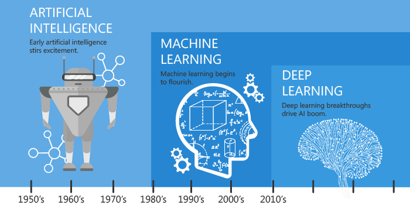

# AI 基础

{: width="100%"}

AI 进化史: [https://www.linkedin.com/pulse/biggest-confusion-cleared-ai-vs-ml-dl-ashwin-kumar/](https://www.linkedin.com/pulse/biggest-confusion-cleared-ai-vs-ml-dl-ashwin-kumar/)

## 机器学习

-  :simple-coursera:{ .lg .middle } __机器学习__
    
    ---

    **进度：** [✅]
    
    **评价** 吴恩达在 Coursera 上的机器学习课程。这门课程是基于 Matlab/Octave 的，现在的新版是基于 Python 的。
    
    [:octicons-arrow-right-24: <a href="https://www.coursera.org/learn/machine-learning-course/" target="_blank"> 课程主页 </a>](#)

## 深度学习

-  :simple-coursera:{ .lg .middle } __深度学习专项课程 🏆__
    
    ---

    **进度：** [✅]

    **内容：** 5 门课程
    
    吴恩达在 Coursera 上的深度学习专项课程。这个专项课程包含了 5 门课程：
    
    - 神经网络和深度学习
    - 改善深层神经网络：超参数调试、正则化和优化
    - 结构化机器学习项目
    - 卷积神经网络
    - 序列模型
    
    **评价** 这个专项课程几乎涵盖了深度学习的方方面面，非常推荐，需要注意的是，这个专辑比较花费时间，如果有时间可以静下来慢慢学。
    
    [:octicons-arrow-right-24: <a href="https://www.coursera.org/specializations/deep-learning" target="_blank"> 课程主页 </a>](#)

-   :fontawesome-brands-square-github:{ .lg .middle } __动手学深度学习 🏆__

    --- 

    **状态：** [✅ 完成 1,2,3,4,5,18] [🚧 进行中 17]

    **评价** 一本非常好的深度学习入门书籍，免费开源，中文版也有。这本书还在不断更新中，但是已经非常好了，非常推荐。

    [:octicons-arrow-right-24: <a href="https://zh.d2l.ai/" target="_blank"> 书籍主页 </a>](#)

