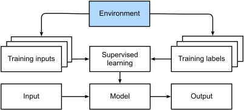
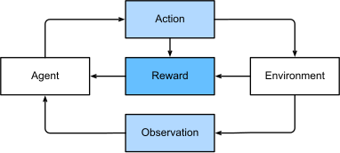

# CH01 - Introduction

## Machine Learning In Daily Life

"Hi, Siri" is good example.

A typical training process.

## Key Components
1. Data
2. Model
3. Objective Function
4. Optimization Algorithms

### Data

Garbage in, garbage out. Data quality is even more important than the model itself.

#### Some key concepts:
- Sample
- Feature
- Label
- Dimensionality

#### Data Division
- Training Set
- Validation Set
- Test Set

### Model

There is no one-size-fits-all model. The model should be selected according to the data and the task.

### Objective Function

The objective function is used to measure the quality of the model.

### Optimization Algorithms

Most of problems comes down to optimization problems. The optimization algorithms are used to find the optimal parameters of the model.

## Kinds of Machine Learning

### Supervised Learning

- Regression

- Classification

- Tagging

- Search and Ranking

- Recommender Systems

- Sequence Learning

### Unsupervised Learning

- Clustering

- Dimensionality Reduction

    - Principal Component Analysis (PCA)

- Causality and Probabilistic Graphical Models

- Generative Models

### Interacting with an Environment 

Online Learning / Adaptive Learning

### Reinforcement Learning

Reinforcement learning gives a very general statement of a problem in which an agent interacts with an environment over a series of time steps. At each time step, the agent receives some observation from the environment and must choose an action that is subsequently transmitted back to the environment via some mechanism (sometimes called an actuator), when, after each loop, the agent receives a reward from the environment. This process is illustrated in Fig. 1.3.7. The agent then receives a subsequent observation, and chooses a subsequent action, and so on. The behavior of a reinforcement learning agent is governed by a policy. In brief, a policy is just a function that maps from observations of the environment to actions. The goal of reinforcement learning is to produce good policies.

!!! note
    Any supervised learning problem can be cast as a reinforcement learning problem. But RL is more powerful than supervised learning.

- Key problems：
  - Credit Assignment
  - Observability
  - Exploration and Exploitation (sometimes, the agent need to give up some reward in order to gain new knowledge)

## Roots
...

## The Road to Deep Learning
...

## Success Stories
...

## The Essence of Deep Learning
...

## Summary

Machine learning studies how computer systems can leverage experience (often data) to improve performance at specific tasks. It combines ideas from statistics, data mining, and optimization. Often, it is used as a means of implementing AI solutions. As a class of machine learning, representational learning focuses on how to automatically find the appropriate way to represent data. Considered as multi-level representation learning through learning many layers of transformations, deep learning replaces not only the shallow models at the end of traditional machine learning pipelines, but also the labor-intensive process of feature engineering. Much of the recent progress in deep learning has been triggered by an abundance of data arising from cheap sensors and Internet-scale applications, and by significant progress in computation, mostly through GPUs. Furthermore, the availability of efficient deep learning frameworks has made design and implementation of whole system optimization significantly easier, and this is a key component in obtaining high performance.

