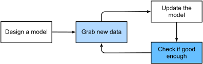
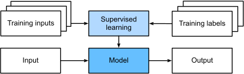
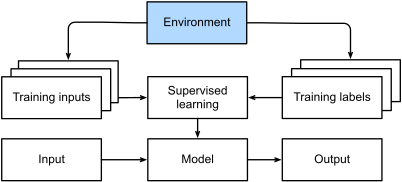
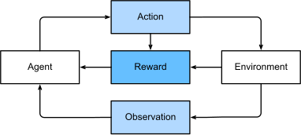

# CH01 - 引言

## 日常生活中的机器学习

“Hi,Siri” 就是一个很好的例子。

一个典型的训练过程。

## 关键组成部分
1. 数据
2. 模型
3. 目标函数
4. 优化算法

### 数据
垃圾进，垃圾出。数据质量比模型本身更重要。

#### 一些关键概念：
- 样本
- 特征
- 标签
- 维度

#### 数据划分
- 训练集
- 验证集
- 测试集

### 模型

没有一种模型适用于所有场景。模型应该根据数据和任务进行选择。

### 目标函数

目标函数用于衡量模型的质量。

### 优化算法

大多数问题归结为优化问题。优化算法用于找到模型的最优参数。

## 机器学习的种类

### 监督学习

- 回归

- 分类

- 标注

- 搜索与排序

- 推荐系统

- 序列学习

### 无监督学习

- 聚类

- 降维

    - 主成份分析（PCA）是一种常用的降维方法。

- 因果与概率图模型

- 生成模型与判别模型

### 与环境交互

在线学习 / 适应性学习

### 强化学习

强化学习给出了一种非常一般的问题陈述，其中一个代理在一系列时间步长内与环境进行交互。在每个时间步长，代理从环境中接收一些观察并必须选择一个动作，该动作随后通过某种机制（有时称为执行器）传输回环境，当在每个循环之后，代理从环境中获得奖励。这个过程如图1.3.7所示。然后代理接收后续观察，并选择后续动作，依此类推。强化学习代理的行为由策略决定。简而言之，策略只是一个将环境观察映射到动作的函数。强化学习的目标是产生好的策略。

!!! note
    任何机器学习问题都可以转化为强化学习问题。

- 关键问题
  - 奖励分配
  - 客观车型
  - 探索与利用 （有的时候智能体需要放弃一部分奖励以获取知识）

## 根源
...

## 通往深度学习之路
...

## 成功案例
...

## 深度学习的特点
...

## 小结

机器学习研究计算机系统如何利用经验（通常是数据）来提高特定任务的性能。它结合了统计学、数据挖掘和优化的思想。通常，它是被用作实现人工智能解决方案的一种手段。

表示学习作为机器学习的一类，其研究的重点是如何自动找到合适的数据表示方式。深度学习是通过学习多层次的转换来进行的多层次的表示学习。

深度学习不仅取代了传统机器学习的浅层模型，而且取代了劳动密集型的特征工程。

最近在深度学习方面取得的许多进展，大都是由廉价传感器和互联网规模应用所产生的大量数据，以及（通过GPU）算力的突破来触发的。

整个系统优化是获得高性能的关键环节。有效的深度学习框架的开源使得这一点的设计和实现变得非常容易。