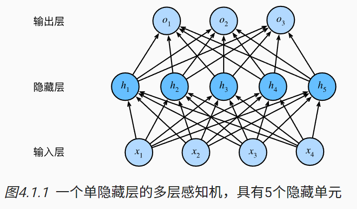
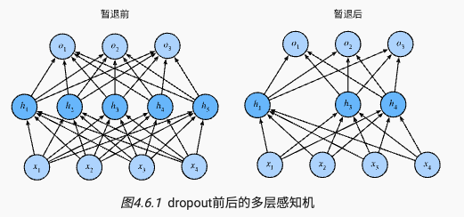
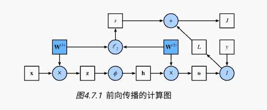

# 多层感知机
在 3节中， 我们介绍了softmax回归（ 3.4节）， 然后我们从零开始实现了softmax回归（ 3.6节）， 接着使用高级API实现了算法（ 3.7节）， 并训练分类器从低分辨率图像中识别10类服装。 在这个过程中，我们学习了如何处理数据，如何将输出转换为有效的概率分布， 并应用适当的损失函数，根据模型参数最小化损失。 我们已经在简单的线性模型背景下掌握了这些知识， 现在我们可以开始对深度神经网络的探索，这也是本书主要涉及的一类模型。

## 4.1 多层感知机

### 4.1.1 隐藏层
!!! note
    线性->非线性

我们在 3.1.1.1节中描述了仿射变换， 它是一种带有偏置项的线性变换。 首先，回想一下如 图3.4.1中所示的softmax回归的模型架构。 该模型通过单个仿射变换将我们的输入直接映射到输出，然后进行softmax操作。 如果我们的标签通过仿射变换后确实与我们的输入数据相关，那么这种方法确实足够了。 但是，仿射变换中的线性是一个很强的假设。

#### 4.1.1.1 线性模型可能会出错

#### 4.1.1.2 在网络中加入隐藏层
**我们可以通过在网络中加入一个或多个隐藏层来克服线性模型的限制， 使其能处理更普遍的函数关系类型。** 要做到这一点，最简单的方法是将**许多全连接层堆叠在一起**。 每一层都输出到上面的层，直到生成最后的输出。 我们可以把前$L-1$层看作**表示**，把最后一层看作**线性预测器**。 这种架构通常称为多层感知机（multilayer perceptron），通常缩写为MLP。 下面，我们以图的方式描述了多层感知机（ 图4.1.1）。

这个多层感知机有4个输入，3个输出，其隐藏层包含5个隐藏单元。 输入层不涉及任何计算，因此使用此网络产生输出只需要实现隐藏层和输出层的计算。 因此，这个多层感知机中的层数为2。 注意，这两个层都是全连接的。 每个输入都会影响隐藏层中的每个神经元， 而隐藏层中的每个神经元又会影响输出层中的每个神经元。

然而，正如 3.4.3节所说， **具有全连接层的多层感知机的参数开销可能会高得令人望而却步**。 即使在不改变输入或输出大小的情况下， 可能在参数节约和模型有效性之间进行权衡。

#### 4.1.1.3 从线性到非线性
!!! note
    每一层：仿射变换+激活函数

#### 4.1.1.4 通用近似定理
多层感知机可以通过隐藏神经元，捕捉到输入之间复杂的相互作用， 这些神经元依赖于每个输入的值。 我们可以很容易地设计隐藏节点来执行任意计算。 例如，在一对输入上进行基本逻辑操作，**多层感知机是通用近似器**。 **即使是网络只有一个隐藏层，给定足够的神经元和正确的权重， 我们可以对任意函数建模，尽管实际中学习该函数是很困难的。** 神经网络有点像C语言。 C语言和任何其他现代编程语言一样，能够表达任何可计算的程序。 但实际上，想出一个符合规范的程序才是最困难的部分。

而且，**虽然一个单隐层网络能学习任何函数， 但并不意味着我们应该尝试使用单隐藏层网络来解决所有问题。 事实上，通过使用更深（而不是更广）的网络，我们可以更容易地逼近许多函数。** 我们将在后面的章节中进行更细致的讨论。

### 4.1.2 激活函数
激活函数（activation function）通过计算加权和并加上偏置来确定神经元是否应该被激活， 它们将输入信号转换为输出的可微运算。 大多数激活函数都是非线性的。 由于激活函数是深度学习的基础，下面简要介绍一些常见的激活函数。

#### 4.1.2.1 ReLU函数
最受欢迎的激活函数是修正线性单元（Rectified linear unit，ReLU）， 因为它实现简单，同时在各种预测任务中表现良好。 ReLU提供了一种非常简单的非线性变换。 给定元素x，ReLU函数被定义为该元素与0的最大值：

$$\text{ReLU}(x) = \max(x, 0).$$

通俗地说，ReLU函数通过将相应的活性值设为0，仅保留正元素并丢弃所有负元素。 

#### 4.1.2.2 Sigmoid函数
对于一个定义域在$R$上的实值函数，我们可以将其输出转换为区间$(0,1)$上的值。 这种映射是通过**sigmoid函数**完成的。 sigmoid函数是一个平滑且可微的函数，其输出值在大部分定义域上都接近于0或1。sigmoid函数通常又被称为挤压函数，因为它将实数映射到区间(0,1)。sigmoid函数定义为：
$$\sigma(x) = \frac{1}{1+e^{-x}}.$$

在最早的神经网络中，科学家们感兴趣的是对“激发”或“不激发”的生物神经元进行建模。 因此，这一领域的先驱可以一直追溯到人工神经元的发明者麦卡洛克和皮茨，他们专注于阈值单元。 阈值单元在其输入低于某个阈值时取值0，当输入超过阈值时取值1。

当人们逐渐关注到到基于梯度的学习时， sigmoid函数是一个自然的选择，因为它是一个平滑的、可微的阈值单元近似。 当我们想要将输出视作二元分类问题的概率时， sigmoid仍然被广泛用作输出单元上的激活函数 （sigmoid可以视为softmax的特例）。 然而，sigmoid在隐藏层中已经较少使用， 它在大部分时候被更简单、更容易训练的ReLU所取代。 在后面关于循环神经网络的章节中，我们将描述利用sigmoid单元来控制时序信息流的架构。

Sigmoid 函数的导数为：
$$\sigma'(x) = \sigma(x)(1-\sigma(x)).$$

其主要问题在于，当输入值非常大或非常小时，sigmoid函数的梯度会消失，这会导致训练困难。

#### 4.1.2.3 Tanh函数
与sigmoid函数类似，双曲正切函数（tanh）也可以将其输出压缩到区间(-1,1)上。tanh函数定义为：
$$\tanh(x) = \frac{1-e^{-2x}}{1+e^{-2x}}.$$

当输入在0附近时，tanh函数接近线性变换。 函数的形状类似于sigmoid函数， 不同的是tanh函数关于坐标系原点中心对称。

tanh函数的导数为：

$$\tanh'(x) = 1 - \tanh^2(x).$$

当输入接近0时，tanh函数的导数接近最大值1。 与我们在sigmoid函数图像中看到的类似， 输入在任一方向上越远离0点，导数越接近0。

总结一下，我们现在了解了如何结合非线性函数来构建具有更强表达能力的多层神经网络架构。 顺便说一句，这些知识已经让你掌握了一个类似于1990年左右深度学习从业者的工具。 在某些方面，你比在20世纪90年代工作的任何人都有优势， 因为你可以利用功能强大的开源深度学习框架，只需几行代码就可以快速构建模型， 而以前训练这些网络需要研究人员编写数千行的C或Fortran代码。

### 4.1.3 小结
- 多层感知机在输出层和输入层之间增加一个或多个全连接隐藏层，并通过激活函数转换隐藏层的输出
- 常用的激活函数包括ReLU函数、sigmoid函数和tanh函数。

## 4.2 多层感知机的从零开始实现
我们已经在 4.1节中描述了多层感知机（MLP）， 现在让我们尝试自己实现一个多层感知机。 为了与之前softmax回归（ 3.6节 ） 获得的结果进行比较， 我们将继续使用Fashion-MNIST图像分类数据集 （ 3.5节）。

#### 4.2.1 初始化模型参数
回想一下，Fashion-MNIST中的每个图像由 
个灰度像素值组成。 所有图像共分为10个类别。 忽略像素之间的空间结构， 我们可以将每个图像视为具有784个输入特征 和10个类的简单分类数据集。 首先，我们将实现一个具有单隐藏层的多层感知机， 它包含256个隐藏单元。 注意，我们可以将这两个变量都视为超参数。 **通常，我们选择2的若干次幂作为层的宽度。 因为内存在硬件中的分配和寻址方式，这么做往往可以在计算上更高效。
**

我们用几个张量来表示我们的参数。 注意，对于每一层我们都要记录一个权重矩阵和一个偏置向量。 跟以前一样，我们要为损失关于这些参数的梯度分配内存。

#### 4.2.2 定义激活函数
~

#### 4.2.3 定义模型
因为我们忽略了空间结构， 所以我们使用reshape将每个二维图像转换为一个长度为num_inputs的向量。 只需几行代码就可以实现我们的模型。

#### 4.2.4 损失函数
由于我们已经从零实现过softmax函数（ 3.6节）， 因此在这里我们直接使用高级API中的内置函数来计算softmax和交叉熵损失。 回想一下我们之前在 3.7.2节中 对这些复杂问题的讨论。 我们鼓励感兴趣的读者查看损失函数的源代码，以加深对实现细节的了解。

#### 4.2.5 训练模型
~
#### 4.2.6 小结
手动实现一个简单的多层感知机是很容易的。然而如果有大量的层，从零开始实现多层感知机会变得很麻烦（例如，要命名和记录模型的参数）。

## 4.3 多层感知机的简洁实现
本节将介绍通过高级API更简洁地实现多层感知机。

### 4.3.1 定义模型
与softmax回归的简洁实现（ 3.7节）相比， 唯一的区别是我们添加了2个全连接层（之前我们只添加了1个全连接层）。 第一层是隐藏层，它包含256个隐藏单元，并使用了ReLU激活函数。 第二层是输出层。

训练过程的实现与我们实现softmax回归时完全相同， 这种模块化设计使我们能够将与模型架构有关的内容独立出来。

### 4.3.2 小结
- 我们可以使用高级API更简洁地实现多层感知机。
- 对于相同的分类问题，多层感知机的实现与softmax回归的实现相同，只是多层感知机的实现需要添加多个全连接层。

## 4.4 模型选择、欠拟合和过拟合
作为机器学习科学家，我们的目标是发现**模式（pattern）**。 但是，我们如何才能确定模型是真正发现了一种泛化的模式， 而不是简单地记住了数据呢？ 例如，我们想要在患者的基因数据与痴呆状态之间寻找模式， 其中标签是从集合痴呆轻度认知障碍健康
中提取的。 因为基因可以唯一确定每个个体（不考虑双胞胎）， 所以在这个任务中是有可能记住整个数据集的。

我们不想让模型只会做这样的事情：“那是鲍勃！我记得他！他有痴呆症！”。 原因很简单：当我们将来部署该模型时，模型需要判断从未见过的患者。 只有当模型真正发现了一种泛化模式时，才会作出有效的预测。

**更正式地说，我们的目标是发现某些模式， 这些模式捕捉到了我们训练集潜在总体的规律。** 如果成功做到了这点，即使是对以前从未遇到过的个体， 模型也可以成功地评估风险。 **如何发现可以泛化的模式是机器学习的根本问题。**

困难在于，当我们训练模型时，我们只能访问数据中的小部分样本。 最大的公开图像数据集包含大约一百万张图像。 而在大部分时候，我们只能从数千或数万个数据样本中学习。 在大型医院系统中，我们可能会访问数十万份医疗记录。 当我们使用有限的样本时，可能会遇到这样的问题： **当收集到更多的数据时，会发现之前找到的明显关系并不成立。**

**将模型在训练数据上拟合的比在潜在分布中更接近的现象称为过拟合（overfitting）， 用于对抗过拟合的技术称为正则化（regularization）。** 在前面的章节中，有些读者可能在用Fashion-MNIST数据集做实验时已经观察到了这种过拟合现象。 在实验中调整模型架构或超参数时会发现： 如果有足够多的神经元、层数和训练迭代周期， 模型最终可以在训练集上达到完美的精度，此时测试集的准确性却下降了。

### 4.4.1 训练误差和泛化误差
为了进一步讨论这一现象，我们需要了解训练误差和泛化误差。 **训练误差（training error）**是指， 模型在训练数据集上计算得到的误差。 **泛化误差（generalization error）**是指， 模型应用在同样从原始样本的分布中抽取的无限多数据样本时，模型误差的期望。

**问题是，我们永远不能准确地计算出泛化误差。 这是因为无限多的数据样本是一个虚构的对象。 在实际中，我们只能通过将模型应用于一个独立的测试集来估计泛化误差， 该测试集由随机选取的、未曾在训练集中出现的数据样本构成。**

下面的三个思维实验将有助于更好地说明这种情况。 假设一个大学生正在努力准备期末考试。 一个勤奋的学生会努力做好练习，并利用往年的考试题目来测试自己的能力。 尽管如此，在过去的考试题目上取得好成绩并不能保证他会在真正考试时发挥出色。 例如，学生可能试图通过死记硬背考题的答案来做准备。 他甚至可以完全记住过去考试的答案。 另一名学生可能会通过试图理解给出某些答案的原因来做准备。 在大多数情况下，后者会考得更好。

类似地，考虑一个简单地使用查表法来回答问题的模型。 如果允许的输入集合是离散的并且相当小， 那么也许在查看许多训练样本后，该方法将执行得很好。 但当这个模型面对从未见过的例子时，它表现的可能比随机猜测好不到哪去。 这是因为输入空间太大了，远远不可能记住每一个可能的输入所对应的答案。 例如，考虑28x28像素的灰度图像。 如果每个像素可以取256个灰度值中的一个，那么总共有$256^{784}$种可能的图像。这意味着指甲大小的低分辨率灰度图像的数量比宇宙中的原子要多得多。 即使我们可能遇到这样的数据，我们也不可能存储整个查找表。

最后，考虑对掷硬币的结果（类别0：正面，类别1：反面）进行分类的问题。 假设硬币是公平的，无论我们想出什么算法，泛化误差始终是$\frac{1}{2}$。 然而，对于大多数算法，我们应该期望训练误差会更低（取决于运气）。 考虑数据集${0, 1, 1, 1, 0, 1}$. 我们的算法不需要额外的特征，将倾向于总是预测多数类， 从我们有限的样本来看，它似乎是1占主流。 在这种情况下，总是预测类1的模型将产生$\frac{1}{3}$的误差，这比我们的泛化误差要好得多。当我们当我们逐渐增加数据量，正面比例明显偏离$\frac{1}{2}$的可能性将会降低，我们的训练误差与泛化误差相匹配。

#### 4.4.1.1 统计学系理论
由于泛化是机器学习中的基本问题， 许多数学家和理论家毕生致力于研究描述这一现象的形式理论。 在同名定理（eponymous theorem）中， 格里文科和坎特利推导出了训练误差收敛到泛化误差的速率。 在一系列开创性的论文中， Vapnik和Chervonenkis 将这一理论扩展到更一般种类的函数。 这项工作为统计学习理论奠定了基础。

在我们目前已探讨、并将在之后继续探讨的监督学习情景中， 我们假设训练数据和测试数据都是从相同的分布中独立提取的。 这通常被称为**独立同分布假设（i.i.d. assumption）**， 这意味着对数据进行采样的过程没有进行“记忆”。 换句话说，抽取的第2个样本和第3个样本的相关性， 并不比抽取的第2个样本和第200万个样本的相关性更强。

要成为一名优秀的机器学习科学家需要具备批判性思考能力。 假设是存在漏洞的，即很容易找出假设失效的情况。 如果我们根据从加州大学旧金山分校医学中心的患者数据训练死亡风险预测模型， 并将其应用于马萨诸塞州综合医院的患者数据，结果会怎么样？ 这两个数据的分布可能不完全一样。 此外，抽样过程可能与时间有关。 比如当我们对微博的主题进行分类时， 新闻周期会使得正在讨论的话题产生时间依赖性，从而违反独立性假设。

有时候我们即使轻微违背独立同分布假设，模型仍将继续运行得非常好。 比如，我们有许多有用的工具已经应用于现实，如人脸识别、语音识别和语言翻译。 毕竟，几乎所有现实的应用都至少涉及到一些违背独立同分布假设的情况。

有些违背独立同分布假设的行为肯定会带来麻烦。 比如，我们试图只用来自大学生的人脸数据来训练一个人脸识别系统， 然后想要用它来监测疗养院中的老人。 这不太可能有效，因为大学生看起来往往与老年人有很大的不同。

在接下来的章节中，我们将讨论因违背独立同分布假设而引起的问题。 目前，即使认为独立同分布假设是理所当然的，理解泛化性也是一个困难的问题。 此外，能够解释深层神经网络泛化性能的理论基础， 也仍在继续困扰着学习理论领域最伟大的学者们。

**当我们训练模型时，我们试图找到一个能够尽可能拟合训练数据的函数。 但是如果它执行地“太好了”，而不能对看不见的数据做到很好泛化，就会导致过拟合。 这种情况正是我们想要避免或控制的。 深度学习中有许多启发式的技术旨在防止过拟合。**

#### 4.4.1.2 模型复杂性

**当我们有简单的模型和大量的数据时，我们期望泛化误差与训练误差相近。** **当我们有更复杂的模型和更少的样本时，我们预计训练误差会下降，但泛化误差会增大。** 模型复杂性由什么构成是一个复杂的问题。 一个模型是否能很好地泛化取决于很多因素。 例如，具有更多参数的模型可能被认为更复杂， 参数有更大取值范围的模型可能更为复杂。 通常对于神经网络，我们认为需要更多训练迭代的模型比较复杂， 而需要早停（early stopping）的模型（即较少训练迭代周期）就不那么复杂。

我们很难比较本质上不同大类的模型之间（例如，决策树与神经网络）的复杂性。 就目前而言，一条简单的经验法则相当有用： 统计学家认为，能够轻松解释任意事实的模型是复杂的， 而表达能力有限但仍能很好地解释数据的模型可能更有现实用途。 在哲学上，这与波普尔的科学理论的可证伪性标准密切相关： 如果一个理论能拟合数据，且有具体的测试可以用来证明它是错误的，那么它就是好的。 这一点很重要，因为所有的统计估计都是事后归纳。 也就是说，我们在观察事实之后进行估计，因此容易受到相关谬误的影响。 目前，我们将把哲学放在一边，坚持更切实的问题。

本节为了给出一些直观的印象，我们将重点介绍几个倾向于影响模型泛化的因素。

- 可调整参数的数量。当可调整参数的数量（有时称为自由度）很大时，模型往往更容易过拟合。

- 参数采用的值。当权重的取值范围较大时，模型可能更容易过拟合。

- 训练样本的数量。即使模型很简单，也很容易过拟合只包含一两个样本的数据集。而过拟合一个有数百万个样本的数据集则需要一个极其灵活的模型。

### 4.4.2 模型选择
在机器学习中，我们通常在评估几个候选模型后选择最终的模型。 这个过程叫做模型选择。 有时，需要进行比较的模型在本质上是完全不同的（比如，决策树与线性模型）。 又有时，我们需要比较不同的超参数设置下的同一类模型。

例如，训练多层感知机模型时，我们可能希望比较具有 不同数量的隐藏层、不同数量的隐藏单元以及不同的激活函数组合的模型。 为了确定候选模型中的最佳模型，我们通常会使用验证集。

#### 4.4.2.1 验证集
原则上，在我们确定所有的超参数之前，我们不希望用到测试集。 如果我们在模型选择过程中使用测试数据，可能会有过拟合测试数据的风险，那就麻烦大了。 如果我们过拟合了训练数据，还可以在测试数据上的评估来判断过拟合。 但是如果我们过拟合了测试数据，我们又该怎么知道呢？

因此，我们决不能依靠测试数据进行模型选择。 然而，我们也不能仅仅依靠训练数据来选择模型，因为我们无法估计训练数据的泛化误差。

在实际应用中，情况变得更加复杂。 虽然理想情况下我们只会使用测试数据一次， 以评估最好的模型或比较一些模型效果，但现实是测试数据很少在使用一次后被丢弃。 我们很少能有充足的数据来对每一轮实验采用全新测试集。

解决此问题的常见做法是将我们的数据分成三份， 除了训练和测试数据集之外，还增加一个验证数据集（validation dataset）， 也叫验证集（validation set）。 但现实是验证数据和测试数据之间的边界模糊得令人担忧。 除非另有明确说明，否则在这本书的实验中， 我们实际上是在使用应该被正确地称为训练数据和验证数据的数据集， 并没有真正的测试数据集。 因此，书中每次实验报告的准确度都是验证集准确度，而不是测试集准确度。

#### 4.4.2.2 k折交叉验证
当训练数据稀缺时，我们甚至可能无法提供足够的数据来构成一个合适的验证集。 这个问题的一个流行的解决方案是采用k折交叉验证。 这里，原始训练数据被分成k个不重叠的子集。 然后执行
次模型训练和验证，每次在k-1个子集上进行训练， 并在剩余的一个子集（在该轮中没有用于训练的子集）上进行验证。 最后，通过对k次实验的结果取平均来估计训练和验证误差。

### 4.4.3 欠拟合和过拟合
当我们比较训练和验证误差时，我们要注意两种常见的情况。 首先，我们要注意这样的情况：训练误差和验证误差都很严重， 但它们之间仅有一点差距。 如果模型不能降低训练误差，这可能意味着模型过于简单（即表达能力不足）， 无法捕获试图学习的模式。 此外，由于我们的训练和验证误差之间的泛化误差很小， 我们有理由相信可以用一个更复杂的模型降低训练误差。 这种现象被称为欠拟合（underfitting）。

另一方面，当我们的训练误差明显低于验证误差时要小心， 这表明严重的过拟合（overfitting）。 注意，过拟合并不总是一件坏事。 特别是在深度学习领域，众所周知， 最好的预测模型在训练数据上的表现往往比在保留（验证）数据上好得多。 最终，我们通常更关心验证误差，而不是训练误差和验证误差之间的差距。

是否过拟合或欠拟合可能取决于模型复杂性和可用训练数据集的大小， 这两个点将在下面进行讨论。

#### 4.4.3.1 模型复杂性
～

#### 4.4.3.2 数据集大小
另一个重要因素是数据集的大小。 训练数据集中的样本越少，我们就越有可能（且更严重地）过拟合。 随着训练数据量的增加，泛化误差通常会减小。 此外，一般来说，更多的数据不会有什么坏处。 对于固定的任务和数据分布，模型复杂性和数据集大小之间通常存在关系。 给出更多的数据，我们可能会尝试拟合一个更复杂的模型。 能够拟合更复杂的模型可能是有益的。 如果没有足够的数据，简单的模型可能更有用。 对于许多任务，深度学习只有在有数千个训练样本时才优于线性模型。 从一定程度上来说，深度学习目前的生机要归功于廉价存储、互联设备以及数字化经济带来的海量数据集。

### 4.4.4 多项式回归
#### 4.4.4.1 生成数据集
～
#### 4.4.4.2 对模型进行训练和测试
～
#### 4.4.4.3 三阶多项式函数拟合（正常）
～
#### 4.4.4.4 线性函数拟合（欠拟合）
～

#### 4.4.4.5 高阶多项式函数拟合（过拟合）
～

### 4.4.5 小结
- 欠拟合是指模型无法继续减少训练误差。过拟合是指训练误差远小于验证误差。

- 由于不能基于训练误差来估计泛化误差，因此简单地最小化训练误差并不一定意味着泛化误差的减小。机器学习模型需要注意防止过拟合，即防止泛化误差过大。

- 验证集可以用于模型选择，但不能过于随意地使用它。

- 我们应该选择一个复杂度适当的模型，避免使用数量不足的训练样本。

## 4.5 权重衰减
前一节我们描述了过拟合的问题，本节我们将介绍一些正则化模型的技术。 我们总是可以通过去收集更多的训练数据来缓解过拟合。 但这可能成本很高，耗时颇多，或者完全超出我们的控制，因而在短期内不可能做到。 假设我们已经拥有尽可能多的高质量数据，我们便可以将重点放在正则化技术上。

在训练参数化机器学习模型时， 权重衰减（weight decay）是最广泛使用的正则化的技术之一， 它通常也被称为$L_2$正则化。 这项技术通过函数与零的距离来衡量函数的复杂度， 因为在所有函数$f$中，$f=0$是最简单的。 但是我们应该如何精确地测量一个函数和零之间的距离呢？ 没有一个正确的答案。 事实上，函数分析和巴拿赫空间理论的研究，都在致力于回答这个问题。

一种简单的方法是通过线性函数$f(\mathbf{x}) = \mathbf{w}^\top \mathbf{x}$的权重向量$\mathbf{w}$的某个范数来度量函数的复杂度。 选择什么范数是一个设计决策。 在权重衰减的背景下，$L_2$范数是最受欢迎的选择，通常导致学到的权重参数的元素平方和的减小。要保证权重向量比较小， 最常用方法是将其范数作为惩罚项加到最小化损失的问题中。 将原来的训练目标最小化训练标签上的预测损失， 调整为最小化预测损失和惩罚项之和。

此外，为什么我们首先使用$L_2$范数，而不是$L_1$范数。事实上，这个选择在整个统计领域中都是有效的和受欢迎的。$L_2$正则化线性模型构成经典的岭回归（ridge regression）算法，而$L_1$正则化线性回归是基于套索回归（lasso regression）的。这两种方法在统计学和机器学习领域都有着深远的影响。使用$L_2$范数的一个原因是它对权重向量的大分量施加了巨大的惩罚。这使得我们的学习算法偏向于在大量特征上均匀分布权重的模型。在实践中，这可能使它们对输入中的微小变化更为鲁棒。相比之下，$L_1$正则化则更容易产生稀疏权重向量，这可以作为特征选择的一种简单方法。在实践中，这意味着模型更容易将注意力集中在少量的特征上。

根据之前章节所讲的，我们根据估计值与观测值之间的差异来更新$w$。 然而，我们同时也在试图将$w$的大小缩小到零。 这就是为什么这种方法被称为权重衰减。 我们仅考虑惩罚项，优化算法在训练的每一步衰减权重。 与特征选择相比，权重衰减为我们提供了一种连续的机制来调整函数的复杂度。较小的$\mathbf{lambda}$对应较少约束的$w$，而较大的$\mathbf{lambda}$对应较强的约束。

是否对相应的偏置$b^2$进行惩罚在不同的实践中会有所不同， 在神经网络的不同层中也会有所不同。 通常，网络输出层的偏置项不会被正则化。

### 4.5.1 高维线性回归
~ 
### 4.5.2 从零开始实现

#### 4.5.2.1 初始化模型参数

#### 4.5.2.2 定义$L_2$范数惩罚

#### 4.5.2.3 定义训练代码实现

#### 4.5.2.4 忽略正则化直接开始训练

#### 4.5.2.5 使用权重衰减

### 4.5.3 简洁实现

### 4.5.4 小结
- 正则化是处理过拟合的常用方法：在训练集的损失函数中加入惩罚项，以降低学习到的模型的复杂度。

- 保持模型简单的一个特别的选择是使用惩罚的权重衰减。这会导致学习算法更新步骤中的权重衰减。

- 权重衰减功能在深度学习框架的优化器中提供。

- 在同一训练代码实现中，不同的参数集可以有不同的更新行为。

## 4.6 暂退法 （Dropout）
在 4.5节 中， 我们介绍了通过惩罚权重的$L_2$范数来正则化统计模型的经典方法。 在概率角度看，我们可以通过以下论证来证明这一技术的合理性： 我们已经假设了一个**先验**，即**权重的值取自均值为0的高斯分布**。 **更直观的是，我们希望模型深度挖掘特征，即将其权重分散到许多特征中， 而不是过于依赖少数潜在的虚假关联。**

### 4.6.1 重新审视过拟合
当面对更多的特征而样本不足时，线性模型往往会过拟合。 相反，当给出更多样本而不是特征，通常线性模型不会过拟合。 不幸的是，线性模型泛化的可靠性是有代价的。 简单地说，线性模型没有考虑到特征之间的交互作用。 对于每个特征，线性模型必须指定正的或负的权重，而忽略其他特征。

泛化性和灵活性之间的这种基本权衡被描述为偏差-方差权衡（bias-variance tradeoff）。 线性模型有很高的偏差：它们只能表示一小类函数。 然而，这些模型的方差很低：它们在不同的随机数据样本上可以得出相似的结果。

深度神经网络位于偏差-方差谱的另一端。 与线性模型不同，**神经网络并不局限于单独查看每个特征，而是学习特征之间的交互。** 例如，神经网络可能推断“尼日利亚”和“西联汇款”一起出现在电子邮件中表示垃圾邮件， 但单独出现则不表示垃圾邮件。

即使我们有比特征多得多的样本，深度神经网络也有可能过拟合。 2017年，一组研究人员通过在随机标记的图像上训练深度网络。 这展示了神经网络的极大灵活性，因为人类很难将输入和随机标记的输出联系起来， 但通过随机梯度下降优化的神经网络可以完美地标记训练集中的每一幅图像。 想一想这意味着什么？ 假设标签是随机均匀分配的，并且有10个类别，那么分类器在测试数据上很难取得高于10%的精度， 那么这里的泛化差距就高达90%，如此严重的过拟合。

深度网络的泛化性质令人费解，而这种泛化性质的数学基础仍然是悬而未决的研究问题。 我们鼓励喜好研究理论的读者更深入地研究这个主题。 本节，我们将着重对实际工具的探究，这些工具倾向于改进深层网络的泛化性。

### 4.6.2 扰动的稳健性
在探究泛化性之前，我们先来定义一下什么是一个“好”的预测模型？ 我们期待“好”的预测模型能在未知的数据上有很好的表现： 经典泛化理论认为，为了缩小训练和测试性能之间的差距，应该以简单的模型为目标。 简单性以较小维度的形式展现， 我们在 4.4节 讨论线性模型的单项式函数时探讨了这一点。 此外，正如我们在 4.5节 中讨论权重衰减（$L_2$ 正则化）时看到的那样， 参数的范数也代表了一种有用的简单性度量。

简单性的另一个角度是平滑性，即函数不应该对其输入的微小变化敏感。 例如，当我们对图像进行分类时，我们预计向像素添加一些随机噪声应该是基本无影响的。 1995年，克里斯托弗·毕晓普证明了 具有输入噪声的训练等价于Tikhonov正则化 (Bishop, 1995)。 这项工作用数学证实了“要求函数光滑”和“要求函数对输入的随机噪声具有适应性”之间的联系。

然后在2014年，斯里瓦斯塔瓦等人 (Srivastava et al., 2014) 就如何将毕晓普的想法应用于网络的内部层提出了一个想法： 在训练过程中，他们建议在计算后续层之前向网络的每一层注入噪声。 因为当训练一个有多层的深层网络时，注入噪声只会在输入-输出映射上增强平滑性。

这个想法被称为暂退法（dropout）。 暂退法在前向传播过程中，计算每一内部层的同时注入噪声，这已经成为训练神经网络的常用技术。 这种方法之所以被称为暂退法，因为我们从表面上看是在训练过程中丢弃（drop out）一些神经元。 在整个训练过程的每一次迭代中，标准暂退法包括在计算下一层之前将当前层中的一些节点置零。

需要说明的是，暂退法的原始论文提到了一个关于有性繁殖的类比： 神经网络过拟合与每一层都依赖于前一层激活值相关，称这种情况为“共适应性”。 作者认为，暂退法会破坏共适应性，就像有性生殖会破坏共适应的基因一样。

那么关键的挑战就是如何注入这种噪声。 一种想法是以一种无偏向（unbiased）的方式注入噪声。 这样在固定住其他层时，每一层的期望值等于没有噪音时的值。

### 4.6.3 实践中的暂退法
通常，我们在测试时不用暂退法。 给定一个训练好的模型和一个新的样本，我们不会丢弃任何节点，因此不需要标准化。 然而也有一些例外：一些研究人员在测试时使用暂退法， 用于估计神经网络预测的“不确定性”： 如果通过许多不同的暂退法遮盖后得到的预测结果都是一致的，那么我们可以说网络发挥更稳定。

### 4.6.4 从零开始实现
～
#### 4.6.4.1 定义模型参数
～
#### 4.6.4.2 定义模型
我们可以将暂退法应用于每个隐藏层的输出（在激活函数之后）， 并且可以为每一层分别设置暂退概率： 常见的技巧是在靠近输入层的地方设置较低的暂退概率。 
#### 4.6.4.3 训练和测试
～
### 4.6.5 简洁实现
～
### 4.6.6 小结
- 暂退法在前向传播过程中，计算每一内部层的同时丢弃一些神经元。

- 暂退法可以避免过拟合，它通常与控制权重向量的维数和大小结合使用的。

- 暂退法将活性值h替换为具有期望值h的随机变量。

- 暂退法仅在训练期间使用。

## 4.7 前向传播、反向传播和计算图
我们已经学习了如何用小批量随机梯度下降训练模型。 然而当实现该算法时，我们只考虑了通过前向传播（forward propagation）所涉及的计算。 在计算梯度时，我们只调用了深度学习框架提供的反向传播函数，而不知其所以然。

梯度的自动计算（自动微分）大大简化了深度学习算法的实现。 在自动微分之前，即使是对复杂模型的微小调整也需要手工重新计算复杂的导数， 学术论文也不得不分配大量页面来推导更新规则。 本节将通过一些基本的数学和计算图， 深入探讨反向传播的细节。 首先，我们将重点放在带权重衰减（$L_2$正则化）的单隐藏层多层感知机上。

### 4.7.1 前向传播
前向传播（forward propagation或forward pass） 指的是：按顺序（从输入层到输出层）计算和存储神经网络中每层的结果。

### 4.7.2 前向传播计算图
绘制计算图有助于我们可视化计算中操作符和变量的依赖关系。 图4.7.1 是与上述简单网络相对应的计算图， 其中正方形表示变量，圆圈表示操作符。 左下角表示输入，右上角表示输出。 注意显示数据流的箭头方向主要是向右和向上的。

### 4.7.3 反向传播

### 4.7.4 训练神经网络

在训练神经网络时，前向传播和反向传播相互依赖。 对于前向传播，我们沿着依赖的方向遍历计算图并计算其路径上的所有变量。 然后将这些用于反向传播，其中计算顺序与计算图的相反。

以上述简单网络为例：一方面，在前向传播期间计算正则项 (4.7.5)取决于模型参数$W^(1)$和$W^(2)$的当前值。 它们是由优化算法根据最近迭代的反向传播给出的。 另一方面，反向传播期间参数 (4.7.11)的梯度计算， 取决于由前向传播给出的隐藏变量h的当前值。

因此，在训练神经网络时，在初始化模型参数后， 我们交替使用前向传播和反向传播，利用反向传播给出的梯度来更新模型参数。 **注意，反向传播重复利用前向传播中存储的中间值，以避免重复计算。 带来的影响之一是我们需要保留中间值，直到反向传播完成。 这也是训练比单纯的预测需要更多的内存（显存）的原因之一。 **此外，这些中间值的大小与网络层的数量和批量的大小大致成正比。 因此，使用更大的批量来训练更深层次的网络更容易导致内存不足（out of memory）错误。

### 4.7.5 小结
- 前向传播在神经网络定义的计算图中按顺序计算和存储中间变量，它的顺序是从输入层到输出层。

- 反向传播按相反的顺序（从输出层到输入层）计算和存储神经网络的中间变量和参数的梯度。

- 在训练深度学习模型时，前向传播和反向传播是相互依赖的。

- 训练比预测需要更多的内存。

## 4.8 数值稳定性和模型初始化
到目前为止，我们实现的每个模型都是根据某个预先指定的分布来初始化模型的参数。 有人会认为初始化方案是理所当然的，忽略了如何做出这些选择的细节。甚至有人可能会觉得，**初始化方案的选择**并不是特别重要。 相反，初始化方案的选择在神经网络学习中起着举足轻重的作用， 它对保持数值稳定性至关重要。 此外，这些初始化方案的选择可以与非线性激活函数的选择有趣的结合在一起。 我们选择哪个函数以及如何初始化参数可以决定优化算法收敛的速度有多快。 糟糕选择可能会导致我们在训练时遇到梯度爆炸或梯度消失。 本节将更详细地探讨这些主题，并讨论一些有用的启发式方法。 这些启发式方法在整个深度学习生涯中都很有用。

### 4.8.1 梯度消失和梯度爆炸
不稳定梯度带来的风险不止在于数值表示； 不稳定梯度也威胁到我们优化算法的稳定性。 我们可能面临一些问题。 要么是梯度爆炸（gradient exploding）问题： 参数更新过大，破坏了模型的稳定收敛； 要么是梯度消失（gradient vanishing）问题： 参数更新过小，在每次更新时几乎不会移动，导致模型无法学习。

#### 4.8.1.1 梯度消失

#### 4.8.1.2 梯度爆炸

#### 4.8.1.3 打破对称性

### 4.8.2 初始化模型参数

#### 4.8.2.1 默认初始化
在前面的部分中，例如在 3.3节中， 我们使用正态分布来初始化权重值。如果我们不指定初始化方法， 框架将使用默认的随机初始化方法，对于中等难度的问题，这种方法通常很有效。

#### 4.8.2.2 Xavier初始化

###  4.8.3 额外阅读

### 4.8.4 小结

- 梯度消失和梯度爆炸是深度网络中常见的问题。在参数初始化时需要非常小心，以确保梯度和参数可以得到很好的控制。

- 需要用启发式的初始化方法来确保初始梯度既不太大也不太小。

- ReLU激活函数缓解了梯度消失问题，这样可以加速收敛。

- 随机初始化是保证在进行优化前打破对称性的关键。

- Xavier初始化表明，对于每一层，输出的方差不受输入数量的影响，任何梯度的方差不受输出数量的影响。

## 4.9 环境和分布偏移
前面我们学习了许多机器学习的实际应用，将模型拟合各种数据集。 然而，我们从来没有想过数据最初从哪里来？以及我们计划最终如何处理模型的输出？ 通常情况下，开发人员会拥有一些数据且急于开发模型，而不关注这些基本问题。

许多失败的机器学习部署（即实际应用）都可以追究到这种方式。 有时，根据测试集的精度衡量，模型表现得非常出色。 但是当数据分布突然改变时，模型在部署中会出现灾难性的失败。 更隐蔽的是，有时模型的部署本身就是扰乱数据分布的催化剂。 举一个有点荒谬却可能真实存在的例子。 假设我们训练了一个贷款申请人违约风险模型，用来预测谁将偿还贷款或违约。 这个模型发现申请人的鞋子与违约风险相关（穿牛津鞋申请人会偿还，穿运动鞋申请人会违约）。 此后，这个模型可能倾向于向所有穿着牛津鞋的申请人发放贷款，并拒绝所有穿着运动鞋的申请人。

这种情况可能会带来灾难性的后果。 首先，一旦模型开始根据鞋类做出决定，顾客就会理解并改变他们的行为。 不久，所有的申请者都会穿牛津鞋，而信用度却没有相应的提高。 总而言之，机器学习的许多应用中都存在类似的问题： 通过将基于模型的决策引入环境，我们可能会破坏模型。

虽然我们不可能在一节中讨论全部的问题，但我们希望揭示一些常见的问题， 并激发批判性思考，以便及早发现这些情况，减轻灾难性的损害。 有些解决方案很简单（要求“正确”的数据），有些在技术上很困难（实施强化学习系统）， 还有一些解决方案要求我们完全跳出统计预测，解决一些棘手的、与算法伦理应用有关的哲学问题。

### 4.9.1 分布偏移的类型

#### 4.9.1.1 协变量偏移

#### 4.9.1.2 标签偏移

#### 4.9.1.3 概念偏移

### 4.9.2 分布偏移示例

#### 4.9.2.1 医学诊断

#### 4.9.2.2 自动驾驶汽车

#### 4.9.2.3 非平稳分布

#### 4。9.2.4 更多案例

### 4.9.3 分布偏移纠正

#### 4.9.3.1 经验风险与实际风险

#### 4.9.3.2 协变量偏移纠正

#### 4.9.3.3 标签偏移纠正

#### 4.9.3.4 概念偏移纠正

### 4.9.4 学习问题的分类法

#### 4.9.4.1 批量学习

#### 4.9.4.2 在线学习

#### 4.9.4.3 老虎机

#### 4.9.4.4 控制

#### 4.9.4.5 强化学习

#### 4.9.4.6 考虑到环境

### 4.9.5 机器学习中的公平，责任和透明度

### 4.9.6 小结
- 在许多情况下，训练集和测试集并不来自同一个分布。这就是所谓的分布偏移。

- 真实风险是从真实分布中抽取的所有数据的总体损失的预期。然而，这个数据总体通常是无法获得的。经验风险是训练数据的平均损失，用于近似真实风险。在实践中，我们进行经验风险最小化。

- 在相应的假设条件下，可以在测试时检测并纠正协变量偏移和标签偏移。在测试时，不考虑这种偏移可能会成为问题。

- 在某些情况下，环境可能会记住自动操作并以令人惊讶的方式做出响应。在构建模型时，我们必须考虑到这种可能性，并继续监控实时系统，并对我们的模型和环境以意想不到的方式纠缠在一起的可能性持开放态度。

## 4.10 实战Kaggle比赛：房价预测

～