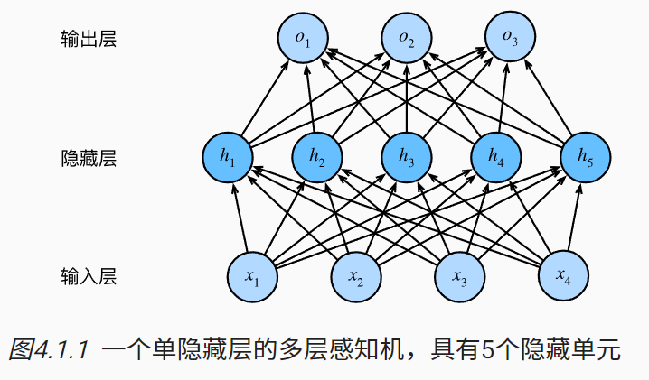

# 多层感知机
在 3节中， 我们介绍了softmax回归（ 3.4节）， 然后我们从零开始实现了softmax回归（ 3.6节）， 接着使用高级API实现了算法（ 3.7节）， 并训练分类器从低分辨率图像中识别10类服装。 在这个过程中，我们学习了如何处理数据，如何将输出转换为有效的概率分布， 并应用适当的损失函数，根据模型参数最小化损失。 我们已经在简单的线性模型背景下掌握了这些知识， 现在我们可以开始对深度神经网络的探索，这也是本书主要涉及的一类模型。

## 4.1 多层感知机

### 4.1.1 隐藏层
!!! note
    线性->非线性

我们在 3.1.1.1节中描述了仿射变换， 它是一种带有偏置项的线性变换。 首先，回想一下如 图3.4.1中所示的softmax回归的模型架构。 该模型通过单个仿射变换将我们的输入直接映射到输出，然后进行softmax操作。 如果我们的标签通过仿射变换后确实与我们的输入数据相关，那么这种方法确实足够了。 但是，仿射变换中的线性是一个很强的假设。

#### 4.1.1.1 线性模型可能会出错

#### 4.1.1.2 在网络中加入隐藏层
**我们可以通过在网络中加入一个或多个隐藏层来克服线性模型的限制， 使其能处理更普遍的函数关系类型。** 要做到这一点，最简单的方法是将**许多全连接层堆叠在一起**。 每一层都输出到上面的层，直到生成最后的输出。 我们可以把前$L-1$层看作**表示**，把最后一层看作**线性预测器**。 这种架构通常称为多层感知机（multilayer perceptron），通常缩写为MLP。 下面，我们以图的方式描述了多层感知机（ 图4.1.1）。

这个多层感知机有4个输入，3个输出，其隐藏层包含5个隐藏单元。 输入层不涉及任何计算，因此使用此网络产生输出只需要实现隐藏层和输出层的计算。 因此，这个多层感知机中的层数为2。 注意，这两个层都是全连接的。 每个输入都会影响隐藏层中的每个神经元， 而隐藏层中的每个神经元又会影响输出层中的每个神经元。

然而，正如 3.4.3节所说， **具有全连接层的多层感知机的参数开销可能会高得令人望而却步**。 即使在不改变输入或输出大小的情况下， 可能在参数节约和模型有效性之间进行权衡。

#### 4.1.1.3 从线性到非线性
!!! note
    每一层：仿射变换+激活函数

#### 4.1.1.4 通用近似定理
多层感知机可以通过隐藏神经元，捕捉到输入之间复杂的相互作用， 这些神经元依赖于每个输入的值。 我们可以很容易地设计隐藏节点来执行任意计算。 例如，在一对输入上进行基本逻辑操作，**多层感知机是通用近似器**。 **即使是网络只有一个隐藏层，给定足够的神经元和正确的权重， 我们可以对任意函数建模，尽管实际中学习该函数是很困难的。** 神经网络有点像C语言。 C语言和任何其他现代编程语言一样，能够表达任何可计算的程序。 但实际上，想出一个符合规范的程序才是最困难的部分。

而且，**虽然一个单隐层网络能学习任何函数， 但并不意味着我们应该尝试使用单隐藏层网络来解决所有问题。 事实上，通过使用更深（而不是更广）的网络，我们可以更容易地逼近许多函数。** 我们将在后面的章节中进行更细致的讨论。

### 4.1.2 激活函数
激活函数（activation function）通过计算加权和并加上偏置来确定神经元是否应该被激活， 它们将输入信号转换为输出的可微运算。 大多数激活函数都是非线性的。 由于激活函数是深度学习的基础，下面简要介绍一些常见的激活函数。

#### 4.1.2.1 ReLU函数
最受欢迎的激活函数是修正线性单元（Rectified linear unit，ReLU）， 因为它实现简单，同时在各种预测任务中表现良好。 ReLU提供了一种非常简单的非线性变换。 给定元素x，ReLU函数被定义为该元素与0的最大值：

$$\text{ReLU}(x) = \max(x, 0).$$

通俗地说，ReLU函数通过将相应的活性值设为0，仅保留正元素并丢弃所有负元素。 

#### 4.1.2.2 Sigmoid函数

#### 4.1.2.3 Tanh函数

### 4.1.3 小结

## 4.2 多层感知机的从零开始实现

## 4.3 多层感知机的简洁实现

## 4.4 模型选择、欠拟合和过拟合

## 4.5 权重衰减

## 4.6 暂退法

## 4.7 前向传播、反向传播和计算图

## 4.8 数值稳定性和模型初始化

## 4.9 环境和分布偏移

## 4.10 实战Kaggle比赛：房价预测