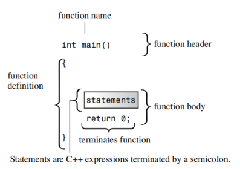
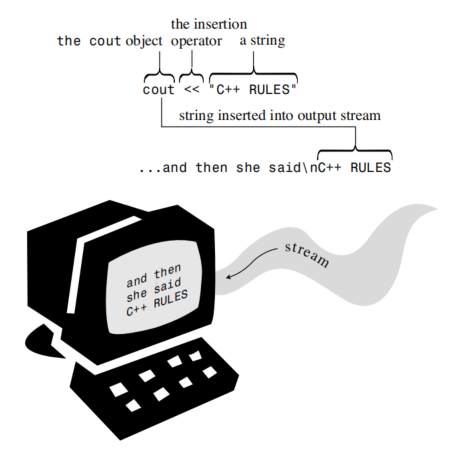
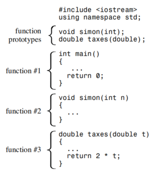

# Setting Out to C++
When you construct a simple home, you begin with the foundation and the framework. If you don’t have a solid structure from the beginning, you’ll have trouble later filling in the details, such as windows, door frames, observatory domes,and parquet ballrooms. Similarly, when you learn a computer language, you should begin by learning the basic structure for a program. Only then can you move on to the details, such as loops and objects.This chapter gives you an overview of the essential structure of a C++ program and previews some topics—notably functions and classes—covered in much greater
detail in later chapters. (The idea is to introduce at least some of the basic concepts gradually en route to the great awakenings that come later.)

## C++ Initiation

Listing 2.1 myfirst.cpp
```cpp
// myfirst.cpp - display a message

#include <iostream>                                 // a PREPROCESSOR directive
int main()                                          // function header
{                                                   // start of function body
    using namespace std;                            // make definitions visible
    cout << "Come up and C++ me some time.";        // message
    cout << endl;                                   // start a new line
    cout << "You won't regret it!" << endl;         // more output
    return 0;                                       // terminate main()
}    
```

!!! info
    If you’re used to programming in C, seeing cout instead of the printf() function might come as a minor shock. C++ can, in fact, use printf(), scanf(), and all the other standard C input and output functions, provided that you include the usual C stdio.h file. But this is a C++ book, so it uses C++’s input facilities, which improve in many ways upon the C versions.

### Features of the main() Function

main() function structure

```cpp
int main()
{
    // statements
    return 0;
}
```


!!! info Statesments and Semicolons
    A statement represents an action to be taken. To understand your source code, a compiler needs to know when one statement ends and another begins. Some languages use a statement separator. FORTRAN, for example, uses the end of the line to separate one statement from the next. Pascal uses a semicolon to separate one statement from the next. In Pascal you can omit the semicolon in certain cases, such as after a statement just before an END, when you aren’t actually separating two statements. (Pragmatists and minimalists will disagree about whether can implies should.) But C++, like C, uses a semicolon as a terminator rather than as a separator. The difference is that a semicolon acting as a terminator is part of the statement rather than a marker between statements. The practical upshot is that in C++ you should never omit the semicolon.

### The Function Header as an Interface

In general,a C++ function is activated, or called, by another function,and the function header describes the interface between a function and the function that calls it.The part preceding the function name is called the function return type; it describes information flow from a function back to the function that calls it.The part within the parentheses following the function name is called the argument list or parameter list; it describes information flow from the calling function to the called function.This general description is a bit confusing when you apply it to main() because you normally don’t call main() from other parts of your program.Typically, however, main() is called by startup code that the compiler adds to your program to mediate between the program and the operating system (Unix,Windows 7, Linux, or whatever). In effect, the function header describes the interface between main() and the operating system.

### C++ Comments

- `/**/` from C - multi-line comment
- `//` from C++ - single-line comment

### The C++ Preprocessor and the iostream File

### Header Filenames
| Kind of Header | Convention | Example | Comments |
| --------- | --------- | --------- | --------- |
| Old C style | Ends in .h | math.h | Usable by C and C++ programs |
| Old C++ style | Ends in .h | iostream.h | Usable by  C++ programs |
| New C++ styple | no extension | iostream | Usable by C++ programs, uses namespace std |
| Converted C | c prefix, no extension | cmath | Usable by C++ programs, might use non-C features, such as namespace std |

### Namespaces

### C++ Output with cout
 


### The Manipulator endl
~

### The Newline Character
~

### C++ Source Code Formatting
~

### Tokens and White Space in Source Code


### C++ Source Code Style

- One statement per line
- An opening brace and a closing brace for a function, each of which is on its own line
- Statements in a function indented from the braces
- No whitespace around the parentheses associated with a function name

## C++ Statements

Listing 2.2
```cpp
// carrot.cpp -- food processing program
// uses and displays a variable

#include <iostream>

int main()
{
    using namespace std;

    int carrots;            // declare an integer variable

    carrots = 25;           // assign a value to the variable
    cout << "I have ";
    cout << carrots;        // display the value of the variable
    cout << " carrots.";
    cout << endl;
    carrots = carrots - 1;  // modify the variable
    cout << "Crunch, crunch. Now I have " << carrots << " carrots." << endl;
    return 0;
}
```

### Declaration Statements and Variables

### Assignment Statements

### A New Trick for cout

## More C++ Statements

Listing 2.3 
```cpp
// getinfo.cpp -- input and output
#include <iostream>

int main()
{
    using namespace std;

    int carrots;

    cout <<  "How many carrots do you have?" << endl;
    cin >> carrots; // C++ input
    cout << "Here are two more. ";
    carrots = carrots + 2;
    // the next line concatenates output
    cout << "Now you have " << carrots << " carrots." << endl;
    return 0;
}
```
### Using cin

### Concatenating with cout

### cin and cout : A Touch of Class


## Functions

### Using a Function That Has a Return Value


Listing 2.4 

```cpp
// sqrt.cpp -- using the sqrt() function
#include <iostream>
#include <cmath> // or math.h

int main()
{
    using namespace std;

    double area;
    cout << "Enter the floor area, in square feet, of your home: ";
    cin >> area;
    double side;
    side = sqrt(area);
    cout << "That's the equivalent of a square " << side
         << " feet to the side." << endl;
    cout << "How fascinating!" << endl;
    return 0;
}
```

### Function Variations

### User Defined Functions
Listing 2.5
```cpp
// ourfunc.cpp -- defining your own function

#include <iostream>

void simon(int);    // function prototype for simon() 

int main()
{
    using namespace std;
    simon(3);   // call the simon() function
    cout << "Pick an integer: ";    
    int count;
    cin >> count;
    simon(count);   // call it again
    cout << "Done!" << endl;
    return 0;
}

void simon(int n) // define the simon() function
{
    using namespace std;
    cout << "Simon says touch your toes " << n << " times." << endl;
    // void functions don't need return statements
}
```

### Function Form



### Function Headers

### Using a User-Defined Function That Has a Return Value
Listing 2.6
```cpp
// convert.cpp -- converts stone to pounds
#include <iostream>
int stonetoIb(int); // function prototype
int main()
{
    using namespace std;
    int stone;
    cout << "Enter the weight in stone: ";
    cin >> stone;
    int pounds = stonetoIb(stone);
    cout << stone << " stone = ";
    cout << pounds << " pounds." << endl;
    return 0;
}

int stonetoIb(int sts)
{
    return 14 * sts;
}
```

### Placing the using Directive in Multifunction Programs
Listing 2.7
```cpp
// ourfunc1.cpp -- repositioning the using directive
#include <iostream>
using namespace std;
void simon(int);    // function prototype for simon()

int main()
{
    simon(3);   // call the simon() function
    cout << "Pick an integer: ";    
    int count;
    cin >> count;
    simon(count);   // call it again
    cout << "Done!" << endl;
    return 0;
}

void simon(int n) // define the simon() function
{
    cout << "Simon says touch your toes " << n << " times." << endl;
    // void functions don't need return statements
}
```


## Summary

A C++ program consists of one or more modules called functions. Programs begin executing at the beginning of the function called main() (all lowercase), so you should always have a function by this name.A function, in turn, consists of a header and a body.
The function header tells you what kind of return value, if any, the function produces and what sort of information it expects arguments to pass to it.The function body consists of a series of C++ statements enclosed in paired braces ({}).
C++ statement types include the following:

- Declaration statement—A declaration statement announces the name and the
type of a variable used in a function.
- Assignment statement—An assignment statement uses the assignment operator (=) to assign a value to a variable.
- Message statement—A message statement sends a message to an object, initiating some sort of action.
- Function call—A function call activates a function.When the called function terminates, the program returns to the statement in the calling function immediately following the function call.
- Function prototype—A function prototype declares the return type for a function, along with the number and type of arguments the function expects.
- Return statement—A return statement sends a value from a called function back to the calling function.

A class is a user-defined specification for a data type.This specification details how information is to be represented and also the operations that can be performed with the data.An object is an entity created according to a class prescription, just as a simple variable is an entity created according to a data type description.
C++ provides two predefined objects (cin and cout) for handling input and output.
They are examples of the istream and ostream classes, which are defined in the
iostream file.These classes view input and output as streams of characters.The insertion operator (<<), which is defined for the ostream class, lets you insert data into the output stream,and the extraction operator (>>), which is defined for the istream class, lets you extract information from the input stream. Both cin and cout are smart objects, capable of automatically converting information from one form to another according to the program context.
C++ can use the extensive set of C library functions.To use a library function, you should include the header file that provides the prototype for the function.
