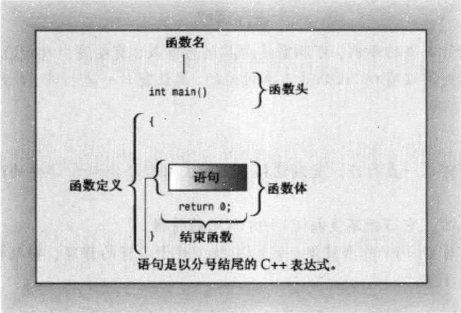
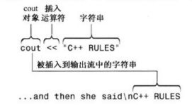
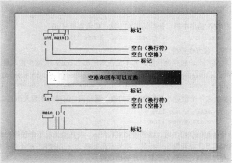
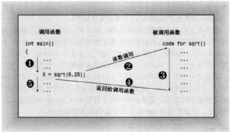
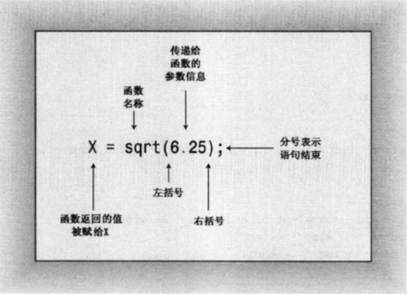

# 开始学习C++
本章对C++程序的基本结构做一概述，并预览后面将要介绍的主题。

## 进入C++

我的第一个C++程序：

```cpp
// myfirst.cpp - display a message

#include <iostream>                                 // a PREPROCESSOR directive
int main()                                          // function header
{                                                   // start of function body
    using namespace std;                            // make definitions visible
    cout << "Come up and C++ me some time.";        // message
    cout << endl;                                   // start a new line
    cout << "You won't regret it!" << endl;         // more output
    return 0;                                       // terminate main()
}    
```
!!!info
    事实上，C++能够使用printf(),scanf()等函数，和其他所有标准C输入输出函数，只需要包含常规C语言的stdio.h头文件即可。但是，C++提供了更为便利的stream类库，使得输入输出更为方便。

### main()函数

main函数的基本结构为函数头+函数体，其中函数头为：

```cpp
int main()
{
    // statements
    return 0;
}
```



!!! info
    C++与C一样使用终止符作为语句结束的标志，用来告诉程序编译器，这一行的语句已经结束了。通常来说，终止符是分号`;`。记住，分号不能省略。

函数头作为接口，接受传入的参数，执行函数体中的语句，然后返回一个值。main()函数的返回值为0，表示程序正常结束。如果程序异常结束，返回值为其他值，通常为1。如果函数头括号内没有任何内容，说明函数不接受任何参数，这种情况下最好用`void`关键字来表示。函数头前面的类型表示函数返回值的类型，如果函数不返回任何值，可以用`void`关键字表示。main函数的调用者是操作系统，因此main函数的返回值可以用来告诉操作系统程序的运行情况。

### C++注释

C++注释有两种，一种是`//`，另一种是`/* */`。`//`注释只能注释一行，`/* */`注释可以注释多行。前者来自C语言，后者是C++新增的注释方式。但是目前C语言也支持`//`注释。

!!! note
    总结，在C/C++中，`//`注释只能注释一行，`/* */`注释可以注释多行,两者都可以使用。

### C++预处理器和iostream文件

#include 是C++预处理器的一部分，它指示编译器在实际编译之前，先将iostream文件的内容包含到程序中。iostream文件包含了一些定义，使得程序能够使用cin和cout对象，这两个对象分别用于标准输入和标准输出。iostream文件中的定义都在std名称空间中，因此程序中使用cin和cout对象时，必须在它们前面加上std::前缀。

!!! note
    C++中的名称空间是一种将名称封装起来的方法，它可以避免名称冲突。例如，C++中有两个名为cout的对象，一个在std名称空间中，另一个在global名称空间中。如果不使用名称空间，那么编译器就无法区分这两个对象。但是，如果使用std::cout，编译器就能够区分它们了。


### 头文件名
像iostream这样的文件叫做包含文件（include file）—— 由于其被包含在其他文件中，也叫头文件（header file）—— 由于被包含在文件起始处。C++编译器只带了很多头文件，每个头文件都支持一组特定的工具。C语言的传统是，头文件使用扩展名h，将其作为一种通过名称标识文件类型的简单方式。例如，头文件math.h包支持各种各种C语言数学函数，但是C++用法改变了。现在，对老式C的头文件保留了扩展名h，C++仍然可以使用这种文件，而C++文件则没有扩展名。这些C头文件被转换为C++头文件，这些文件被重新命名，去掉了扩展名，前面加上c。例如，math.h被转换为cmath，stdio.h被转换为cstdio。这些文件的内容和以前一样，但是，它们使用了新的名称空间，因此，C++程序可以使用不是C的特性，比如命名空间。例如，C++程序可以使用cmath中的sqrt()函数，而不是math.h中的sqrt()函数。C++程序也可以使用cstdio中的printf()函数，而不是stdio.h中的printf()函数。


| 头文件类型 | 约定 | 示例 | 说明 |
| --------- | --------- | --------- | --------- |
| 旧式C头文件 | 以.h结尾 | stdio.h | C/C++程序可以使用 |
| 旧式C++头文件 | 以.h结尾 | iostream.h | C++程序可以使用 |
| 新式C++头文件 | 没有扩展名 | iostream | C++程序可以使用 |
| 转换后的C | 以c开头，没有扩展名 | cstdio | C++程序可以使用，可以使用不是C的特性，比如命名空间 |


### 名称空间/命名空间

名称空间是一种将名称封装起来的方法，它可以避免名称冲突。例如，C++中有两个名为cout的对象，一个在std名称空间中，另一个在global名称空间中。如果不使用名称空间，那么编译器就无法区分这两个对象。但是，如果使用std::cout，编译器就能够区分它们了。

包含了iostream文件之后，就可以使用std名称空间中的对象了。例如，可以使用std::cout对象来输出信息。但是，如果每次都要使用std::cout，就会显得很麻烦。因此，C++提供了using编译指令，它可以将名称空间中的对象引入到当前的名称空间中。例如，可以使用using编译指令将std名称空间中的cout对象引入到当前的名称空间中，这样就可以直接使用cout对象了。可以在函数外引入，也可以在函数内引入。但是，如果在函数内引入，那么只能在函数内使用，函数外不能使用。

### 使用cout进行C++输出
cout是C++的标准输出对象，它是ostream类的一个实例。cout对象使用<<运算符来输出信息。例如，可以使用cout对象输出一条信息，然后使用endl对象输出一个换行符。endl对象是一个特殊的值，它表示换行符。cout对象和endl对象都在std名称空间中，因此，必须在它们前面加上std::前缀。将字符串插入到输出流。



1. 控制符endl-重起一行
2. 换行符

### C++源代码的格式化
!!! note
    C++中回车的作用与空格或制表符相同，空格和回车可以交互位置，可以把一条语句放在多行，也可以把多条语句放在一行。但是，C++中的语句必须以分号结束，分号不能省略。

1. 标记与空白


2. C++代码风格
- 每条语句占一行
- 每个函数都有一个开始花括号和一个结束花括号，两个花括号各占一行
- 函数中的语句都行相对于函数的开始花括号缩进
- 与函数名相关的圆括号周围没有空白

## C++语句
```cpp
// carrot.cpp -- food processing program
// uses and displays a variable

#include <iostream>

int main()
{
    using namespace std;

    int carrots;            // declare an integer variable

    carrots = 25;           // assign a value to the variable
    cout << "I have ";
    cout << carrots;        // display the value of the variable
    cout << " carrots.";
    cout << endl;
    carrots = carrots - 1;  // modify the variable
    cout << "Crunch, crunch. Now I have " << carrots << " carrots." << endl;
    return 0;
}
```

### 声明语句和变量

!!! note
    在C语言中，所有的变量声明通常都位于函数的开始处。但是，在C++中，变量可以在任何地方声明（使用前）。但是，最好在函数的开始处声明变量，这样可以使得程序更加清晰。

### 赋值语句
~
### cout的新花样
~
## 其他C++语句

### 使用cin
cin 同 cout一样也是一种只能对象，它是istream类的一个实例。cin对象使用>>运算符来读取输入。例如，可以使用cin对象读取一个值，然后将其存储到一个变量中。cin对象和cout对象一样，都在std名称空间中。

### 使用cout进行拼接
~
### 类简介
类是用户定义的一种数据类型，要定义类，就要描述它能够表示什么信息和可对数据进行哪些操作。类之于对象就像类型之于变量。

## 函数
!!! info
    被调用的函数叫做被调用函数（called function），调用函数的函数叫做调用函数（calling function）。被调用函数的参数列表叫做形参（parameter），调用函数的参数列表叫做实参（argument）。形参和实参的类型必须匹配，但是名称可以不同。





!!! note
    在使用函数之前，C++编译器必须知道函数的参数类型和返回值类型，如果缺少这些信息，编译器将不知道如何解释返回值。C++中提供这种信息的方式是使用函数原型语句。函数原型语句之于函数，就像变量声明之于变量。在函数原型的结尾，需要使用一个分号来表示语句的结束。如果省略了分号，编译器将认为这是一个函数头，并要求提供函数体。

!!! warning
    不要混淆函数原型和定义，函数原型只是函数的声明，而不是函数的定义。函数原型只是告诉编译器函数的类型，而不是提供函数的代码。函数定义提供函数的代码。函数原型只定义接口，而不提供实现。函数定义提供实现，而不定义仅接口。

 
### 使用有返回值的函数
~
### 函数变体
~
### 用户定义的函数
```cpp
// ourfunc.cpp -- defining your own function
#include <iostream>
void simon(int);    // function prototype for simon() 

int main()
{
    using namespace std;
    simon(3);   // call the simon() function
    cout << "Pick an integer: ";    
    int count;
    cin >> count;
    simon(count);   // call it again
    cout << "Done!" << endl;
    return 0;
}

void simon(int n) // define the simon() function
{
    using namespace std;
    cout << "Simon says touch your toes " << n << " times." << endl;
    // void functions don't need return statements
}

```

1. 函数格式
首先有一个函数头，然后是花括号中的函数体。

```cpp
type functionname(parameterlist)
{
    statements
}
```

注意，C++同C一样，不允许将函数定义嵌套在另一个函数中，每个函数的定义都是独立的，所有函数的创建都是平等的。


### 用户定义的有返回值的函数
```cpp
// ourfunc.cpp -- defining your own function

#include <iostream>

void simon(int);    // function prototype for simon() 

int main()
{
    using namespace std;
    simon(3);   // call the simon() function
    cout << "Pick an integer: ";    
    int count;
    cin >> count;
    simon(count);   // call it again
    cout << "Done!" << endl;
    return 0;
}

void simon(int n) // define the simon() function
{
    using namespace std;
    cout << "Simon says touch your toes " << n << " times." << endl;
    // void functions don't need return statements
}
```


### 在多函数程序中使用using编译指令
将using namespace xxx；放在函数体外，所有文件内的函数都可以访问命名空间xxx中的对象。但是，如果将using namespace xxx；放在函数体内，那么只有在该函数内才可以访问命名空间xxx中的对象。

当前通行的理念是，只让需要访问名称空间std的函数访问它是更好的选择。

总之，让程序能够访问名称空间std的方法有多种，下面是其中四种：
- 将using namespace std；放在函数体外，所有文件内的函数都可以访问命名空间std中的对象。
- 将using namespace std；放在函数体内，只有在该函数内才可以访问命名空间std中的对象。
- 在特定的函数中使用类似using std::cout；这样的编译指令，只有该函数才可以访问命名空间std中的cout对象。
- 完全不使用using编译指令，而是使用std::cout；这样的语法，只有该语句才可以访问命名空间std中的cout对象。

## 总结
C++程序由一个或者多个被称为函数的模块组成。程序从main()函数开始执行，因此该函数必不可少。函数由函数头和函数体组成。函数头指出函数的返回值（如果有的话）的类型和函数期望通过参数传递给它的信息的类型。函数体由一系列花括号中的语句构成。

有多种类型的C++语句，包括下面6种：
- 声明语句：定义函数中使用的变量的名称和类型。
- 赋值语句：使用赋值运算符“=”给变量赋值。
- 消息语句：将消息发送给对象，激发某种行动。
- 函数调用：执行函数。被调用的函数执行完毕后，程序返回到函数调用语句后面的语句。
- 函数原型：声明函数的返回类型、函数接受的参数数量和类型。
- 返回语句：将一个值从被调用的函数那里返回到调用函数中。

类是用户定义的数据类型规范，它详细描述了如何表示信息以及可对数据执行的操作。对象是根据类规范创建的实体，就像简单变量是根据数据类型描述创建的实体一样。C++提供了两个用于处理输入和输出的预定义对象(cin和cout)，它们是istream 和 ostream 类的实例,这两个类是在 iostream 文件中定义的。为ostream 类定义的插入运算符(<<)使得将数据插入到输出流成为可能:为istrcam 类定义的抽取运算符(>>)能够从输入流中抽取信息。cin和 cout 都是智能对象，能够根据程序上下文自动将信息从一种形式转换为另一种形式。
C++可以使用大量的C库函数。要使用库函数，应当包含提供该函数原型的头文件。