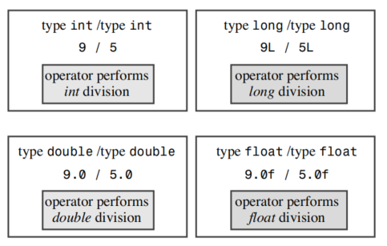

# Dealing with Data

The essence of object-oriented programming (OOP) is designing and extending your own data types. Before you can create your own types, you must know and understand the types that are built in to C++ because those types will be your building blocks. The built-in C++ types come in two groups: fundamental types and compound types.

## Simple Variables

!!! info
    To store an item of information in a computer, the program must keep track of three fundamental properties:
    - Where the information is stored
    - What value is kept there
    - What kind of information is stored

### Names for Variables
C++ encourages you to use meaningful names for variables.

Rules for naming variables:
- The only characters you can use in names are alphabetic characters, numeric digits,
and the underscore (_) character.
- The first character in a name cannot be a numeric digit.
- Uppercase characters are considered distinct from lowercase characters.
- You can’t use a C++ keyword for a name.
- Names beginning with two underscore characters or with an underscore character
followed by an uppercase letter are reserved for use by the implementation—that is,
the compiler and the resources it uses. Names beginning with a single underscore
character are reserved for use as global identifiers by the implementation.
- C++ places no limits on the length of a name,and all characters in a name are significant. However, some platforms might have their own length limits.

### Integer Types
Integers are numbers with no fractional part.

#### The short, int, long, and long long Integer Types

- A short integer is at least 16 bits wide.
- An int integer is at least as big as short.
- A long integer is at least 32 bits wide and at least as big as int.
- A long long integer is at least 64 bits wide and at least as big as long.

#### The sizeof Operator and the climits Header File

Table - Symbolic Constants in climits

| Symbolic Constant | Represents |
| --- | --- |
| CHAR_BIT | Number of bits in a char |
| CHAR_MAX | Maximum value for a char |
| CHAR_MIN | Minimum value for a char |
| SCHAR_MAX | Maximum value for a signed char |
| SCHAR_MIN | Minimum value for a signed char |
| UCHAR_MAX | Maximum value for an unsigned char |
| SHRT_MAX | Maximum value for a short |
| SHRT_MIN | Minimum value for a short |
| USHRT_MAX | Maximum value for an unsigned short |
| INT_MAX | Maximum value for an int |
| INT_MIN | Minimum value for an int |
| UINT_MAX | Maximum value for an unsigned int |
| LONG_MAX | Maximum value for a long |
| LONG_MIN | Minimum value for a long |
| ULONG_MAX | Maximum value for an unsigned long |
| LLONG_MAX | Maximum value for a long long |
| LLONG_MIN | Minimum value for a long long |
| ULLONG_MAX | Maximum value for an unsigned long long |


#### Initialization

Initialization combines assignment with declaration.

#### Initialization with C++11

C++11 introduced a new way to initialize variables called uniform initialization. This new method uses braces to enclose the initial value. For example, you can initialize an int variable to 5 using the following syntax:

```cpp
int a = 5;
```


### Unsigned Types
The four integer types introduced earlier have an unsigned variant that cannot store negative values. Its advantage is that it can increase the maximum value that a variable can store. For example, if short represents the range -32768 to +32767, the unsigned version represents the range 0-65535. Of course, unsigned types should only be used if the numerical value will not be negative, such as population, grain count, etc. To create an unsigned version of a basic integer type, simply modify the declaration using the unsigned keyword:

```cpp
unsigned short change;         // unsigned short type
unsigned int rovert;           // unsigned int type
unsigned quarterback;          // also unsigned int
unsigned long gone;            // unsigned long type
unsigned long long lang_ lang; // unsigned long long type
```

Note that unsigned itself is an abbreviation for unsigned int.

### Choosing an Integer Type
~

### Integer Literals
An integer literal is an explicitly written constant. C++ has three kinds of integer literals: decimal, octal, and hexadecimal.
- Decimal: A sequence of digits from 0 to 9.
- Octal: A sequence of digits from 0 to 7, starting with 0.
- Hexadecimal: A sequence of digits from 0 to 9 and A to F, starting with 0x or 0X.

### How C++ Decides What Type a Constant Is

The declaration of variables in a program informs the C++ compiler about the specific type of integral variables. But how does the compiler determine the type of constants? The answer is, unless there is a reason to store them as another type (such as using special suffixes to represent specific types, or the value being too large to be stored as an int), C++ stores integral constants as `int` type by default.

First, let's examine suffixes. Suffixes are letters placed after numeric constants to indicate their type. The suffixes 1 or L after an integer denote it as a long constant, u or U suffix denotes an unsigned int constant, and ul (in any order, uppercase or lowercase) denotes an unsigned long constant (since lowercase "l" looks like "1", uppercase "L" is preferred as a suffix). For example, on a system where int is 16 bits and long is 32 bits, the number 22022 is stored as an int, taking up 16 bits, while 22022L is stored as a long, occupying 32 bits. Similarly, 22022LU and 22022UL are both stored as unsigned long. C++11 provides suffixes 11 and LL for representing the type long long, as well as suffixes ull, UII, uLL, and ULL for representing the type unsigned long long.

Next, let's consider length. In C++, the rules for decimal integers differ slightly from hexadecimal and octal. For decimal integers without suffixes, the smallest type capable of storing the number will be used: int, long, or long long. On a computer system where int is 16 bits and long is 32 bits, 20000 is represented as an int, 40000 as a long, and 3000000000 as a long long. For hexadecimal or octal integers without suffixes, the smallest type capable of storing the number will be used: int, unsigned int, long, long long, or unsigned long long. In a computer system where 40000 is represented as a long, the hexadecimal number 0x9C40 (40000) will be represented as unsigned int. This is because hexadecimal is commonly used to represent memory addresses, which are unsigned, making unsigned int more suitable for representing 16-bit addresses than long.

### The char Type: Characters and Small Integers

Here, we introduce the last type of integer: the char type. As the name suggests, the char type is specifically designed for storing characters, such as numbers and letters. Programming languages solve the problem of character storage by using numerical encodings of letters. Although char is most commonly used for handling characters, it can also be used as an integer smaller than short.

#### Program Notes
~

#### Member Functions cout.put()
~

#### char literals
#### Character Literals

In C++, there are several ways to write character constants. For regular characters (such as letters, punctuation, and digits), the simplest method is to enclose the character in single quotes, representing the character's numerical encoding. This notation is preferred over numerical encoding as it is clearer and requires knowledge of the encoding. Some characters cannot be directly inputted from the keyboard into a program; for these characters, C++ provides a method called escape sequences. Escape sequences are character sequences that begin with a backslash (\) and are used to represent characters that cannot be directly inputted from the keyboard. For example, \n represents a newline character, \t represents a tab character, \b represents a backspace character, \r represents a carriage return character, \f represents a form feed character, \a represents an alert character, \\ represents a backslash, \? represents a question mark, \' represents a single quote, \" represents a double quote, \ooo represents a character with octal value ooo, and \xhh represents a character with hexadecimal value hh.

Table - Escape Sequences

| Character Name | ASCII Code | C++ Escape Sequence | Decimal ASCII Code | Hexadecimal ASCII Code |
| -------------- | ---------- | ------------------- | ------------------ | ---------------------- |
| Newline        | NL(LF)     | \n                  | 10                 | 0x0A                   |
| Horizontal Tab | HT         | \t                  | 9                  | 0x09                   |
| Vertical Tab   | VT         | \v                  | 11                 | 0x0B                   |
| Backspace      | BS         | \b                  | 8                  | 0x08                   |
| Carriage Return| CR         | \r                  | 13                 | 0x0D                   |
| Bell           | BEL        | \a                  | 7                  | 0x07                   |
| Backslash      | \          | \\                  | 92                 | 0x5C                   |
| Question Mark  | ?          | \?                  | 63                 | 0x3F                   |
| Single Quote   | '          | \'                  | 39                 | 0x27                   |
| Double Quote   | "          | \"                  | 34                 | 0x22                   |


#### Universal Character Names
~

#### signed char and unsigned char

Unlike int, char is neither inherently unsigned nor inherently signed by default. Whether it is signed or unsigned is determined by the implementation of C++, allowing compiler developers to match this type to hardware properties as closely as possible. However, C++ allows you to explicitly specify whether char is signed or unsigned. This way, you can ensure whether char type is signed or unsigned. To declare a signed char type, you can use signed char; to declare an unsigned char type, you can use unsigned char.

#### wcha_t
~

#### C++11 New Types: char16_t and char32_t

~

### bool Type

~

## The const Qualifier
The general format for creating constants is as follows:
```cpp
const type name = value;
```
For example:
```cpp
const int Months = 12;
```

!!! note
    In C, constants are defined using the `#define` preprocessor directive, while in C++, the const qualifier is used. It is better to use const to define constants in C++ rather than the `#define` preprocessor directive for several reasons:
    - const constants have data types, while macro constants do not. The compiler can perform type safety checks on const constants.
    - const constants have scope, while macro constants do not. In a file, const constants are only valid in the file where they are declared. The same name can be used for const constants in different files.
    - const constants are stored in memory, while macro constants are not. This means that const constants can be debugged, while macro constants cannot.

## Floating-Point Types

After understanding various C++ integer types, let's take a look at floating-point types, which constitute the second group of fundamental types in C++. Floating-point numbers can represent numbers with a fractional part, such as the gas mileage of a car (0.56 MPG), and they offer a larger range of values. If a number is too large to be represented as a long type, such as the number of bacteria in the human body (estimated to be over 100 trillion), floating-point types can be used to represent it.

Floating-point types can represent numbers with fractional parts, such as 2.5, 3.14159, and 122442.32. Computers store such values in two parts. One part represents the value, and the other part is used to scale the value up or down. **In other words, one part is for the value, and the other part is for the magnitude of the value.** Let's illustrate this with an example. For the numbers 34-1245 and 34124.5, except for the position of the decimal point, they are essentially the same. The first number can be represented as -0.341245 (base value) and -100 (scale factor), while the second number can be represented as 0.341245 (same base value) and 10000 (larger scale factor). The scale factor is responsible for moving the decimal point, hence the term "floating point." C++ internally represents floating-point numbers in a similar manner, but it's based on binary numbers, so the scale factor is powers of 2, not powers of 10. Fortunately, programmers don't need to understand the internal representation in detail. What's important is that floating-point numbers can represent decimal values, very large, and very small values, and their internal representation is vastly different from integers.

### Writing Floating-Point Numbers

C++ offers two ways to write floating-point numbers.

The first method is to use the commonly used standard decimal notation: even if the fractional part is 0 (e.g., 8.0), the decimal point ensures that the number is represented in floating-point format (rather than integer format).

The second method for representing floating-point values is called E-notation, which is most suitable for very large and very small numbers. E-notation ensures that the number is stored in floating-point format, even without a decimal point. Note that either E or e can be used, and the exponent can be positive or negative. However, there should be no spaces in the number.

!!! note
    Floating-point numbers are called so because the position of the decimal point is variable. For example, for the number 123.45, the decimal point can be moved one place to the left to get 12.345 or one place to the right to get 1234.5. This representation allows floating-point numbers to represent very large or very small numbers. For instance, floating-point numbers can represent the distance from the Earth to the Sun (approximately 93,000,000 miles) or 

### Floating-Point Types

Like ANSI C, C++ also has three floating-point types: float, double, and long double. The width and precision of these types vary depending on the C++ implementation. However, C++ requires that the float type be at least as precise as the double type, and the long double type be at least as precise as the double type. This means that if the double type is accurate to 6 decimal places, then the float type must also be accurate to 6 decimal places. Similarly, if the double type is accurate to 10 decimal places, then the long double type must also be accurate to 10 decimal places. This allows programmers to know the precision of each type without worrying about different C++ implementations having different precisions.

### Floating-Point Constants
~

### Advantages and Disadvantages of Floating-Point Numbers

Compared to integers, floating-point numbers have two main advantages: firstly, they can represent values between integers, and secondly, they can represent a larger range of values. On the other hand, floating-point arithmetic operations are typically slower than integer operations, and the precision will be reduced.

!!! note
    C++ classifies basic types into several families. Types such as signed char, short, int, and long are collectively referred to as **signed integer types**; their unsigned versions are collectively referred to as **unsigned integer types**; C++11 introduced long long. bool, char, wchar_t, signed integers, and unsigned integer types are collectively referred to as **integer types**; C++11 introduced char16_t and char32_t. float, double, and long double are collectively referred to as **floating-point types**. Integer and floating-point types are collectively referred to as **arithmetic types**.

## C++ Arithmetic Operators

C++ uses operators to perform arithmetic operations, providing several operators to perform the five basic arithmetic calculations: addition, subtraction, multiplication, division, and modulo. Each operator uses two values (operands) to compute the result. Operators and operands together form expressions.

!!! warning
    Precision in floating-point arithmetic operations needs to be carefully considered. If high precision is required, then double or long double types should be used.

### Operator Precedence and Associativity

!!! note
    When in doubt, use parentheses.

### Division Branching
!!! note
    The behavior of the division operator depends on the types of operands: if both operands are integers, C++ performs integer division; if at least one of the operands is a floating-point number, C++ performs floating-point division.

!!! note
    In fact, when operating on different types, C++ converts the operands to the same type, and the lower precision type is converted to the higher precision type before performing the operation.

The division operator represents three different operations: integer division, float division, and double division. C++ determines the meaning of the operator based on the context (here, the types of operands). Using the same symbol for multiple operations is called operator overloading. C++ has some built-in examples of overloading. C++ also allows for extending operator overloading so that it can be used for user-defined classes, hence an important OOP feature seen here.



### Modulus Operator
The modulus operator returns the remainder of integer division. For example, the remainder of 5 divided by 3 is 2, so the value of 5%3 is 2. The precedence of the modulus operator (%) is the same as multiplication and division, but its associativity is left-to-right.

### Type Conversion

C++'s rich set of types allows for selecting different types based on requirements, which also complicates computer operations. For example, the hardware compilation instructions involved in adding two short values may differ from adding two long values. With 11 integer types and 3 floating-point types, computers need to handle a variety of situations, especially when dealing with operations on different types. To handle this potential confusion, C++ automatically performs many type conversions:

- When assigning a value of one arithmetic type to a variable of another arithmetic type, C++ will convert the value.
- When expressions contain different types, C++ will convert the values.
- When passing arguments to functions, C++ will convert the values.

#### Conversions in Initialization and Assignment
C++ allows assigning a value of one type to a variable of another type. When doing so, the value will be converted to the type of the receiving variable.

Table - Potential Numeric Conversion Issues

| Conversion | Potential Issues |
| ---------- | ---------------- |
| Converting a larger floating-point type to a smaller floating-point type, such as double to float | Loss of precision (significant digits), the value may exceed the range of the target type, in which case the result will be undefined. |
| Converting a floating-point type to an integer type | Loss of the fractional part, the original value may exceed the range of the target type, in which case the result will be undefined. |
| Converting a larger integer type to a smaller integer type, such as long to short | The original value may exceed the range of the target type, typically only the rightmost bits are copied. |

!!! note
    When converting from a floating-point type to an integer, C++ discards the fractional part rather than rounding.

#### Conversion in {} Initialization (C++11)
~

#### Conversions in Expressions
What happens when two different arithmetic types appear in the same expression?
In this case, C++ performs two automatic conversions:
- First, some types are automatically converted when they appear.
- Second, some types are converted when they appear with other types in an expression.

#### Conversions When Passing Arguments
Type conversions when passing arguments are usually controlled by C++ function prototypes.

#### Explicit Type Casting
C++ allows overriding automatic type conversions using explicit type casting. Explicit type casting uses a special operator called the cast operator. The syntax of the cast operator is as follows:

```cpp
(type) value // from C
type (value) // from C++
```

### Auto Type Deduction (C++11)
C++11 introduces a type declaration called auto declaration. The auto declaration allows the compiler to infer the type of a variable. The basic syntax of the auto declaration is as follows:
```cpp
auto variable = value;
```

## Summary

C++’s basic types fall into two groups. One group consists of values that are stored as integers.The second group consists of values that are stored in floating-point format.The integer types differ from each other in the amount of memory used to store values and in whether they are signed or unsigned. From smallest to largest, the integer types are bool,char, signed char, unsigned char, short, unsigned short, int, unsigned int, long, unsigned long,and, with C++11, long long,and unsigned long long.There is also a wchar_t type whose placement in this sequence of size depends on the implementation. C++11 adds the char16_t and char32_t types, which are wide enough to hold 16-bit and 32-bit character codes, respectively. C++ guarantees that char is large enough to hold any member of the system’s basic character set, wchar_t can hold any member of the system’s extended character set, short is at least 16 bits, int is at least as big as short, and long is at least 32 bits and at least as large as int.The exact sizes depend on the implementation.

Characters are represented by their numeric codes.The I/O system determines whether a code is interpreted as a character or as a number.

The floating-point types can represent fractional values and values much larger than integers can represent.The three floating-point types are float, double,and long double. C++ guarantees that float is no larger than double and that double is no larger than long double.Typically, float uses 32 bits of memory, double uses 64 bits,and long double uses 80 to 128 bits.

By providing a variety of types in different sizes and in both signed and unsigned varieties, C++ lets you match the type to particular data requirements. 

C++ uses operators to provide the usual arithmetical support for numeric types:addition, subtraction, multiplication, division,and taking the modulus.When two operators seek to operate on the same value, C++’s precedence and associativity rules determine which operation takes place first.

C++ converts values from one type to another when you assign values to a variable, mix types in arithmetic,and use type casts to force type conversions. Many type conversions are “safe,” meaning you can make them with no loss or alteration of data. For example, you can convert an int value to a long value with no problems. Others, such as conversions of floating-point types to integer types, require more care.

At first, you might find the large number of basic C++ types a little excessive, particularly when you take into account the various conversion rules. But most likely you will eventually find occasions when one of the types is just what you need at the time,and you’ll thank C++ for having it.