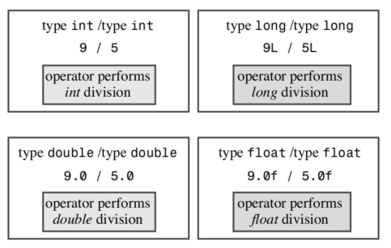

# 处理数据

面向对象编程(OOP)的本质是设计和扩展自己的数据类型。设计自己的数据类型就是让类型与数据匹配。在创建自己的类型之前，必须了解和理解 C++ 内置的类型，因为这些类型将是你的构建基础。内置的 C++ 类型分为两组：基本类型和复合类型。

## 简单变量

!!! info
    为了把信息记录在计算机中，程序必须跟踪三个基本属性：
    - 信息存储在哪里
    - 存储的值是什么
    - 存储的信息的类型是什么

### 变量名
C++ 鼓励你使用有意义的变量名。变量命名需要遵循以下规则：
- 名称中只能使用字母、数字和下划线(_)字符。
- 名称的第一个字符不能是数字。
- 大写字符与小写字符被视为不同的字符。
- 不能使用 C++ 关键字作为名称。
- 以两个下划线字符或下划线字符后跟大写字母开头的名称被实现保留，即编译器和它使用的资源。以单个下划线字符开头的名称被保留为全局标识符使用。
- C++ 对名称的长度没有限制，名称中的所有字符都是有效的。但是，某些平台可能有自己的长度限制。

!!! tip
    如果想要使用两个或者多个单词组成的名称，可以使用下划线或者从第二个单词开始，单词的第一个字母大写。比如 `my_variable` 或者 `myVariable`。

### 整型
整数就是没有小数部分的数字。计算机只能表示整数的一个子集，这个子集的大小取决于计算机的体系结构。不同的C++整型号使用不同的内存量来存储整数，使用的内存量越大，可以表示的整数范围就越大。另外，有的类型可以表示负数，有的类型不能。宽度用来表示一个整型类型所占用的内存量，宽度越大，可以表示的整数范围就越大。C++ 提供的基本整型类型有：char，short，int，long 和 long long。其中，每种类型都有两种形式：一种是有符号的，一种是无符号的，因此总共有 10 种整型类型。其中char有一些特殊属性，我们先介绍其他的整型类型。

### 整型short, int, long, 和 long long
计算机内存由一些叫做位（bit）的单元组成。C++的short，int，long和long long类型使用不同数量的位来存储整数，最多能够表示4种不同的整数宽度。C++提供了一种灵活的标准，它确保了最小长度，如下所示：
- short至少16位
- int至少与short一样长
- long至少32位，至少与int一样长
- long long至少64位，至少与long一样长

#### sizeof 运算符和 climits 头文件

表格 - climits中的符号常量

| 符号常量 | 表示 |
| --- | --- |
| CHAR_BIT | char 类型的位数 |
| CHAR_MAX | char 类型的最大值 |
| CHAR_MIN | char 类型的最小值 |
| SCHAR_MAX | signed char 类型的最大值 |
| SCHAR_MIN | signed char 类型的最小值 |
| UCHAR_MAX | unsigned char 类型的最大值 |
| SHRT_MAX | short 类型的最大值 |
| SHRT_MIN | short 类型的最小值 |
| USHRT_MAX | unsigned short 类型的最大值 |
| INT_MAX | int 类型的最大值 |
| INT_MIN | int 类型的最小值 |
| UINT_MAX | unsigned int 类型的最大值 |
| LONG_MAX | long 类型的最大值 |
| LONG_MIN | long 类型的最小值 |
| ULONG_MAX | unsigned long 类型的最大值 |
| LLONG_MAX | long long 类型的最大值 |
| LLONG_MIN | long long 类型的最小值 |
| ULLONG_MAX | unsigned long long 类型的最大值 |

#### 初始化

初始化将赋值与声明合并在一起

#### C++11 中的初始化

C++11 提供了一种新的初始化语法，称为统一初始化。这种语法使用花括号来初始化变量，如下所示：
```cpp
int a = 5;
int b(5);
int c{5};
int d = {5};
```

### 无符号类型
前面介绍的4种整型都有一种不能存储负数值的无符号变体，其优点是可以增大变量能够存儲的最大值。例如，如果 short表示的范围为-32768到+32767，则无符号版本的表示范围为0-65535。当然，仅当数值不会为负时才应使用无符号类型，如人口、粒数等。要创建无符号版本的基本整型，只需使用关键字unsigned 来修改声明即可：
```cpp
unsigned short change;         // unsigned short type
unsigned int rovert;           // unsigned int type
unsigned quarterback;          // also unsigned int
unsigned long gone;            // unsigned long type
unsigned long long lang_ lang; // unsigned long long type
```
注意，unsigned 本身是 unsigned int 的缩写。

### 选择整型类型
～

### 整型字面值
整型字面值是显式地书写的常量。c++ 有三种整型字面值：十进制、八进制和十六进制。
- 十进制：包含0-9的数字序列。
- 八进制：包含0-7的数字序列，以0开头。
- 十六进制：包含0-9和A-F的数字序列，以0x或0X开头。

### C++ 如何确定常量的类型
程序的声明将特定的整型变量的类型告诉了 C++编译器，但编译器是如何知道常量的类型呢？答案是，除非有理由存储为其他类型（如使用了特殊的后缀来表示特定的类型，或者值太大，不能存储为 int），否则 C++将整型常量存储为 int类型。

首先来看看后缀。后缀是放在数字常量后面的字母，用于表示类型。整数后面的1或L后缀表示该整数为long 常量，u 或U后缀表示 unsigned int 常量，ul（可以采用任何一种顺序，大写小写均可）表示 unsignedlong 常量（由于小写1看上去像1，因此应使用大写L作后缀）。例如，在int 为16位、long 为32位的系统上，数字 22022 被存储为 int， 占16 位，数字 22022L 被存储为long，占32 位。同样，22022LU 和 22022UL都被存储为 unsigned long。C++11提供了用于表示类型long long 的后缀11和LL，还提供了用于表示类型unsigned long long 的后缀ull、UII、uLL 和 ULL。

接下来考察长度。在C++中，对十进制整数采用的规则，与十六进制和八进制稍微有些不同。对于不带后缀的十进制整数，将使用下面几种类型中能够存储该数的最小类型来表示：int、long 或long long。在int 为16位、long 为32位的计算机系统上，20000 被表示为 int 类型，40000被表示long 类型，3000000000 被表示为 long long 类型。对于不带后缀的十六进制或八进制整数，将使用下面几种类型中能够存储该数的最小类型来表示：int、unsigned int long、unsigned long、long long 或 unsigned long long。在将 40000表示为long 的计算机系统中，十六进制数0x9C40（40000）将被表示 unsigned int。这是因为十六进制常用来表示内存地址，而内存地址是没有符号的，因此，usigned int 比long 更适合用来表示16位的地址。

### char 类型：字符和小整数
下面介绍最后一种整型：char类型。顾名思义，char类型是专门为存储字符（如数字和字母）而设计的。编程语言通过使用字母的数值编码解决了字符存储的问题。char虽然最常被用来处理字符，但是它也可以被用来作为比short更小的整型。

#### 程序说明
～

#### 成员函数cout.put()
～

#### char字面值
在C++中，书写字符常量的方式有多种。对于常规字符（如字母，标点符号，和数字），最简单的方法是将字符用当括号引起来，这种表示法代表的是字符的数值编码，这种表示方法优于数值编码，但是它更清晰，且需要知道编码方式。有些字符不能直接通过键盘输入到程序中，对于这些字符，C++提供了一种转义序列的方法。转义序列是以反斜杠（\）开头的字符序列，用于表示键盘无法直接输入的字符。例如，\n表示换行符，\t表示制表符，\b表示退格符，\r表示回车符，\f表示换页符，\a表示响铃符，\\表示反斜杠，\?表示问号，\'表示单引号，\"表示双引号，\ooo表示八进制值ooo的字符，\xhh表示十六进制值hh的字符。

表格 - 转义序列

| 字符名称 | ASCII码 | C++转义序列 | 十进制ASCII码 | 十六进制ASCII码 |
| -------- | ------ | ------------ | ------------ | -------------- |
| 换行符   | NL(LF) | \n           | 10           | 0x0A           |
| 水平制表符 | HT   | \t           | 9            | 0x09           |
| 垂直制表符 | VT   | \v           | 11           | 0x0B           |
| 退格符   | BS     | \b           | 8            | 0x08           |
| 回车符   | CR     | \r           | 13           | 0x0D           |
| 振铃符   | BEL    | \a           | 7            | 0x07           |
| 反斜杠   | \     | \\           | 92           | 0x5C           |
| 问号     | ?     | \?           | 63           | 0x3F           |
| 单引号   | '      | \'           | 39           | 0x27           |
| 双引号   | "      | \"           | 34           | 0x22           |


#### 通用字符名
～

#### signed char 和 unsigned char
与int不同的是，char在默认情况下既不是没有符号，也不是有符号的。是否有符号由C++的实现决定，这样编译器开发人员可以最大限度地将这种类型与硬件属性相匹配。然而，C++允许你显式地指定char是有符号的还是无符号的。这样，你就可以确保char类型是有符号的，还是无符号的。要声明有符号的char类型，可以使用signed char；要声明无符号的char类型，可以使用unsigned char。

#### wcha_t
～

#### C++11新增的类型：char16_t 和 char32_t
~

### bool 类型
~


## const 限定符
创建常量的通用格式如下：
```cpp
const type name = value;
```
例如
```cpp
const int Months = 12;
```

!!! note
    在C语言中，常量的定义使用`#define`预处理器指令，而在C++中，使用const限定符。在C++中最好使用const来定义常量而不是使用`#define`预处理器指令,有几个优点：
    - const常量有数据类型，而宏常量没有数据类型。编译器可以对const常量进行类型安全检查。
    - const常量有作用域，而宏常量没有作用域。在文件中，const常量只在声明它的文件中有效。在不同的文件中可以有同名的const常量。
    - const常量可以用于更为复杂的类型。
  

## 浮点数
了解各种_C++整型后，来看看浮点类型，它们是C++的第二组基本类型。浮点数能够表示带小数部分的数字，如-M!油箱的汽油里程数(0.56MPG)，它们提供的值范围也更大。如果数字很大，无法表示为long类型，如人体的细菌数(估计超过100兆)，则可以使用浮点类型来表示。
使用浮点类型可以表示诸如 2.5、3.14159和122442.32这样的数字，即带小数部分的数字。计算机将这样的值分成两部分存储。**一部分表示值，另一部分用于对值进行放大或缩小。**下面打个比方。对于数字34-1245和 34124.5,它们除了小数点的位置不同外,其他都是相同的。可以把第一个数表示为-0.341245(基准值)和-100(缩放因子)，而将第二个数表示为0.341245(基准值相同)和10000(缩放因子更大)。缩放因子的作用是移动小数点的位置，术语浮点因此而得名。C++内部表示浮点数的方法与此相同，只不过它基于的是二进制数，因此缩放因子是2的幂，不是10的幂。幸运的是，程序员不必详细了解内部表示。重要的是，浮点数能够表示小数值、非常大和非常小的值，它们的内部表示方法与整数有天壤之别。

### 书写浮点数
C++有两种书写浮点数的方式。
第一种是使用常用的标准小数点表示法:即使小数部分为0(如:8.0)，小数点也将确保该数字以浮点格式(而不是整数格式)表示。
第二种表示浮点值的方法叫做E表示法，E表示法最适合于非常大和非常小的数。E表示法确保数字以浮点格式存储，即使没有小数点。注意，既可以使用E也可以使用。，指数可以是正数也可以是负数。然而，数字中不能有空格。

!!! note
    被称为浮点数的原因是，小数点的位置是可变的。例如，对于数字123.45，可以将小数点向左移动一位，得到12.345，也可以将小数点向右移动一位，得到1234.5。这种表示方法使得浮点数能够表示很大或很小的数。例如，可以用浮点数表示地球到太阳的距离(约为93000000英里)，也可以用浮点数表示原子的直径(约为0.0000000001英寸)。


### 浮点类型

与ANSI C一样，C++也有3种浮点类型：float、double和long double。这些类型的宽度和精度因C++实现而异。然而，C++要求float类型至少与double类型一样精确，long double类型至少与double类型一样精确。这意味着，如果double类型精确到6位小数，那么float类型也要精确到6位小数。同样，如果double类型精确到10位小数，那么long double类型也要精确到10位小数。这样，程序员就可以知道每种类型的精度，而不必担心不同的C++实现会有不同的精度。


### 浮点常量
~

### 浮点数的优缺点
与整数相比，浮点数有两大优点：首先，可以表示整数之间的数值；其次，他们可以表示的范围更大。另外一方面，浮点数运算通常比整数运算要慢，且精度将会降低。


!!! note
    C++对基本类型进行分类，形成了若干个族。类型signedchar、short、int和long统称为**符号整型**;它们的无符号版本统称为**无符号整型**;C++11新增了longlong。bool、char、wchar_t、符号整数和无符号整型统称为**整型**;C++11新增了char16_t和char32_t。foat、double和long double 统称为**浮点型**。整数和浮点型统称**算术(arithmmetic)类型**。


## C++ 算数运算符
C++使用运算符来运算，它提供了几种运算符来完成5种基本的算数计算：假发、减法、乘法、除法和求模。每种运算符都使用两个值（操作数）来计算结果。运算符及操作数构成了表达式。

!!! warning
    浮点数运算的精度需要慎重考虑，如果需要高精度，那么应该使用double或者long double类型。

### 运算符优先级和结合性

!!! note
    总之，拿不准时，使用括号。


### 除法分支
!!! note
    除法运算符的行为取决于操作数的类型：如果两个操作数都是整数，那么C++执行整数除法；如果两个操作数中至少有一个是浮点数，那么C++执行浮点除法。


!!! note
    实际上，在对不同类型进行运算时，C++会将操作数转化为同一类型，并且较低精度的类型转换为较高精度的类型，然后再进行运算。

除法运算符表示了3种不同的运算:int除法、foat 除法和 double 除法。C++根据上下文(这里是操作数的类型)来确定运算符的含义。使用相同的符号进行多种操作叫做运算符重载(operator overloading)。C++有一些内置的重载示例。C++还允许扩展运算符重载，以便能够用于用户定义的类，因此在这里看到的是一个重要的OOP属性。



### 求模运算符
求模运算返回整数除法的余数。例如，5除以3的余数是2，因此5%3的值是2。求模运算符(%)的优先级与乘法和除法相同，但是它的结合性是从左到右的。

### 类型转换

C++丰富的类型允许根据需求选择不同的类型，这也使计算机的操作更复杂。例如，将两个 short 值相加涉及到的硬件编译指令可能会与将两个long值相加不同。由于有11种整型和3种浮点类型，因此计算机需要处理大量不同的情况，尤其是对不同的类型进行运算时。为处理这种潜在的混乱，C++自动执行很多类型转换:

- 将一种算术类型的值赋给另一种算术类型的变量时，C+f将对值进行转换
- 表达式中包含不同的类型时，C++将对值进行转换
- 将参数传递给函数时，C++将对值进行转换

#### 初始化和赋值进行的转换
C++允许将一种类型的值赋给另外一种类型的变量。这样做的时候，值将被转换为接受变量的类型。

表格 - 潜在的数值转换问题

| 转换 | 潜在的问题 |
| --- | --- |
| 将较大的浮点类型转换为较小的浮点类型，如将double转换为 float | 精度(有效数位)降低，值可能超出目标类型的取值范围，在这种情况下，结果将是不确定的 |
| 将浮点类型转换为整型 | 小数部分丢失，原来的值可能超出目标类型的取值范围，在这种情况下，结果将是不确定的 |
| 将较大的整型转换为较小的整型，如将Iong转换为short | 原来的值可能超出目标类型的取值范围，通常只复制右边的学节 |

!!! note
    在浮点类型转换为整数时，C++将舍弃小数部分，而不是四舍五入。

#### 以{}方式进行初始化时的转换（C++11）
~

#### 表达式中的转换
当同一个表达式中包含两种不同的算术类型时，将出现什么情况呢?
在这种情况下，C++将执行两种自动转换:
- 首先，一些类型在出现时便会自动转换。
- 其次，有些类型在与其他类型同时出现在表达式中时将被转换。

#### 传递参数时的转换
传递参数时的类型转换通常由C++函数原型控制。

#### 强制类型转换
C++允许使用强制类型转换来覆盖自动类型转换。强制类型转换使用一种特殊的运算符，称为强制类型转换运算符。强制类型转换运算符的语法如下：
```cpp
(type) value // from C
type (value) // from C++
```

### C++11中的auto声明

C++11新增了一种类型声明，称为auto声明。auto声明让编译器负责变量的类型推断。auto声明的基本语法如下：
```cpp
auto n = 100; // n的类型是int
auto x = 1.5; // x的类型是double
auto y = 1.5F; // y的类型是float
```

## 总结

C++的基本类型分为两组:一组由存储为整数的值组成，另一组由存储为浮点格式的值组成。整型之间通过存储值时使用的内存量及有无符号来区分。整型从最小到最大依次是:bol、char、signedchar、unsigned char、 short、unsigned short、int、unsigned int、long、unsigned long 以及C++11 新增的 long long和 unsigned long long。还有一种 wchart类型，它在这个序列中的位置取决于实现。C++11 新增了类型char16t和char32t，它们的宽度足以分别存储16和32位的字符编码。C++确保了char 足够大，能够存储系统基本字符集中的任何成员，而wchart则可以存储系统扩展字符集中的任意成员，short 至少为16位，而 int 至少与 short 一样长，long 至少为 32 位，且至少和 int 一样长。确切的长度取决于实现。字符通过其数值编码来表示。IO系统决定了编码是被解释为字符还是数字。浮点类型可以表示小数值以及比整型能够表示的值大得多的值。3种浮点类型分别是float、double 和long double。C++确保 float 不比 double 长,而 double 不比 longdouble长。通常,foat 使用 32位内存,double
使用64位，long double 使用 80到128位。通过提供各种长度不同、有符号或无符号的类型，C++使程序员能够根据特定的数据要求选择合适的类型。
C++使用运算符来提供对数字类型的算术运算:加、减、乘、除和求模。当两个运算符对同一个操作数进行操作时，C++的优先级和结合性规则可以确定先执行哪种操作。
对变量赋值、在运算电使用不同类型、使用强制类型转换时，C+将把值从一种类型转换为另一种类型。很多类型转换都是“安全的”，即可以在不损失和改变数据的情况下完成转换。例如，可以把int值转换为long值，而不会出现任何问题。对于其他一些转换，如将浮点类型转换为整型，则需要更加小心。开始，读者可能觉得大量的.C++基本类型有些多余，龙其是考虑到各种转换规则时。但是很可能最终将发现，某些时候，只有一种类型是需要的，此时您将感谢C++提供了这种类型。