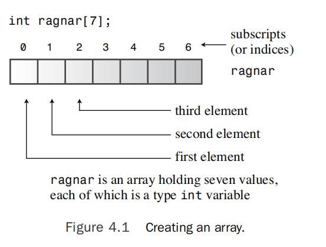

# Compound Types

Say you’ve developed a computer game called User-Hostile in which players match wits with a cryptic and abusive computer interface. Now you must write a program that keeps track of your monthly game sales for a five-year period. Or you want to inventory your accumulation of hacker-hero trading cards.You soon conclude that you need something more than C++’s simple basic types to meet these data requirements,and C++
offers something more—compound types.These are types built from the basic integer and floating-point types.The most far-reaching compound type is the class, that bastion
of OOP toward which we are progressing. But C++ also supports several more modest compound types taken from C.The array, for example, can hold several values of the same
type.A particular kind of array can hold a string, which is a series of characters. Structures can hold several values of differing types.Then there are pointers, which are variables that tell a computer where data is placed.You’ll examine all these compound forms (excepclasses) in this chapter, take a first look at new and delete and how you can use them to manage data,and take an introductory look at the C++ string class, which gives you an alternative way to work with strings.

## Introducing Arrays

!!! note
    An array is a data form that can hold several values,all of one type.

To create an array, you use a declaration statement.An array declaration should indicate three things:
- The type of value to be stored in each element
- The name of the array
- The number of elements in the array

This is the general form for declaring an array:
```cpp
typeName arrayName[arraySize];
```
Much of the usefulness of the array comes from the fact that you can access array elements individually.The way to do this is to use a subscript, or an index, to number the elements. C++ array numbering starts with zero.



Listing 4.1 arrayone.cpp

```cpp
// arrayone.cpp -- small arrays of integers
#include <iostream>
int main()
{
    using namespace std;
    int yams[3]; // creates array with three elements
    yams[0] = 7; // assign value to first element
    yams[1] = 8; // assign value to second element
    yams[2] = 6; // assign value to third element

    int yamcosts[3] = {20, 30, 5}; // create, initialize array

    cout << "Total yams = ";
    cout << yams[0] + yams[1] + yams[2] << endl;
    cout << "The package with " << yams[1] << " yams costs ";
    cout << yamcosts[1] << " cents per yam.\n";
    int total = yams[0] * yamcosts[0] + yams[1] * yamcosts[1];
    total = total + yams[2] * yamcosts[2];
    cout << "The total yam expense is " << total << " cents.\n";

    cout << "\nSize of yams array = " << sizeof yams;
    cout << " bytes.\n";
    cout << "Size of one element = " << sizeof yams[0];
    cout << " bytes.\n";
    return 0;
}
```
### Program Notes
~
### Initialization Rules for Arrays
You can use the initialization form only when defining the array.You cannot use it later,and you cannot assign one array wholesale to another.However, you can use subscripts and assign values to the elements of an array individually.

If you partially initialize an array, the compiler sets the remaining elements to zero. 

!!! tip
    It’s easy to initialize all the elements of an array to zero—just explicitly initialize the first element to zero and then let the compiler initialize the remaining elements to zero.

### C++11 Array Initialization
~

## Strings
A string is a series of characters stored in consecutive bytes of memory. C++ has two ways of dealing with strings.The first, taken from C and often called a **C-style string,** is the first one this chapter examines. Later, this chapter discusses an alternative method based on a **string class library**.

The idea of a series of characters stored in consecutive bytes implies that you can store a string in an array of char, with each character kept in its own array element. Strings provide a convenient way to store text information, such as messages to the user (“Please tell me your secret Swiss bank account number”) or responses from the user (“You must be joking”). C-style strings have a special feature:The last character of every string is the null character.This character, written \0, is the character with ASCII code 0,and it serves to mark the string’s end.

The null character plays a fundamental role in C-style strings.

!!! warning
    you should not treat nonstring character arrays as strings.

The cat array example makes initializing an array to a string look tedious—all those single quotes and then having to remember the null character. Don’t worry.There is a better way to initialize a character array to a string. Just use a quoted string, called a string constant or string literal.

!!! note
    Quoted strings always include the terminating null character implicitly, so you don’t have to spell it out.


!!! note
    Note that a string constant **(with double quotes)** is not interchangeable with a character constant **(with single quotes)**.

### Concatenating String Literals

Indeed,any two string constants separated only by whitespace (spaces, tabs,and newlines) are automatically joined into one.

### Using Strings in an Array
The two most common ways of getting a string into an array are to initialize an array to a string constant and to read keyboard or file input into an array.

Listing 4.2 stings.cpp

```cpp
// strings.cpp -- storing strings in an array
#include <iostream>
#include <cstring> // for the strlen() function
int main()
{
    using namespace std;
    const int Size = 15;
    char name1[Size]; // empty array
    char name2[Size] = "C++owboy"; // initialized array

    cout << "Howdy! I'm " << name2;
    cout << "! What's your name?\n";
    cin >> name1;
    cout << "Well, " << name1 << ", your name has ";
    cout << strlen(name1) << " letters and is stored\n";
    cout << "in an array of " << sizeof(name1) << " bytes.\n";
    cout << "Your initial is " << name1[0] << ".\n";
    name2[3] = '\0'; // set to null character
    cout << "Here are the first 3 characters of my name: ";
    cout << name2 << endl;
    return 0;
}
```

### Program Notes
First, note that the sizeof operator gives the size of the entire array, 15 bytes, but the strlen() function returns the size of the string stored in the array and not the size of the array itself. Also strlen() counts just the visible characters and not the null character.


### Adventures in String Input

Listing 4.3 instr1.cpp
```cpp
// instr1.cpp -- reading more than one string
#include <iostream>
int main()
{
    using namespace std;
    const int ArSize = 20;
    char name[ArSize];
    char dessert[ArSize];

    cout << "Enter your name:\n";
    cin >> name;
    cout << "Enter your favorite dessert:\n";
    cin >> dessert;
    cout << "I have some delicious " << dessert;
    cout << " for you, " << name << ".\n";
    return 0;
}
```
### Reading String Input a Line at a Time

Reading string input a word at a time is often not the most desirable choice. For instance, suppose a program asks the user to enter a city,and the user responds with New York or Sao Paulo.You would want the program to read and store the full names, not just New and Sao.To be able to enter whole phrases instead of single words as a string, you need a different approach to string input. Specifically, you need a line-oriented method instead of a word-oriented method.You are in luck, for the istream class, of which cin is an example, has some line-oriented class member functions: getline() and get(). Both read an entire input line—that is, up until a newline character. However, getline() then discards the newline character, whereas get() leaves it in the input queue. Let’s look at the details,
beginning with getline().

#### Line-Oriented Input with getline()
The getline() function reads a whole line, using the newline character transmitted by the Enter key to mark the end of input.

Listing 4.4 instr2.cpp
```cpp
// instr2.cpp -- reading more than one word with getline
#include <iostream>
int main()
{
    using namespace std;
    const int ArSize = 20;
    char name[ArSize];
    char dessert[ArSize];

    cout << "Enter your name:\n";
    cin.getline(name, ArSize); // reads through newline
    cout << "Enter your favorite dessert:\n";
    cin.getline(dessert, ArSize);
    cout << "I have some delicious " << dessert;
    cout << " for you, " << name << ".\n";
    return 0;
}
```

The program now reads complete names and delivers the user his just desserts! The getline() function conveniently gets a line at a time. It reads input through the newline character marking the end of the line, but it doesn’t save the newline character. Instead, it replaces it with a null character when storing the string.


#### Line-Oriented Input with get()
Let’s try another approach.The istream class has another member function, get(), which comes in several variations. One variant works much like getline(). It takes the same arguments, interprets them the same way,and reads to the end of a line. **But rather than read and discard the newline character, get() leaves that character in the input queue.** 


Listing 4.5 instr3.cpp
```cpp
// instr3.cpp -- reading more than one word with get() & get()
#include <iostream>
int main()
{
    using namespace std;
    const int ArSize = 20;
    char name[ArSize];
    char dessert[ArSize];

    cout << "Enter your name:\n";
    cin.get(name, ArSize).get(); // read string, then newline
    cout << "Enter your favorite dessert:\n";
    cin.get(dessert, ArSize).get();
    cout << "I have some delicious " << dessert;
    cout << " for you, " << name << ".\n";
    return 0;
}
```

#### Empty Lines and Other Problems

What happens after getline() or get() reads an empty line? The original practice was that the next input statement picked up where the last getline() or get() left off.
However, the current practice is that after get() (but not getline()) reads an empty line, it sets something called the failbit.The implications of this act are that further input is blocked, but you can restore input with the following command:
cin.clear();
Another potential problem is that the input string could be longer than the allocated space. If the input line is longer than the number of characters specified, both getline() and get() leave the remaining characters in the input queue. However, getline() additionally sets the failbit and turns off further input.

### Mixing String and Numeric Input

Mixing numeric input with line-oriented string input can cause problems. Consider the simple program in Listing 4.6.

Listing 4.6 mixtypes.cpp
```cpp
// mixtypes.cpp -- some type combinations
#include <iostream>
int main()
{
    using namespace std;
    cout << "Enter a number: ";
    int n;
    cin >> n;
    cout << "n = " << n << ", n * n = " << n * n << "\n";
    return 0;
}
```
You never get the opportunity to enter the address.The problem is that when cin reads the year, it leaves the newline generated by the Enter key in the input queue.Then cin.getline() reads the newline as an empty line and assigns a null string to the address array.The fix is to read and discard the newline before reading the address.This can be done several ways, including by using get() with a char argument or with no argument,as described in the preceding example.

You can make these calls separately:
```cpp
cin.get(); // read newline
cin.getline(address, ArSize);
```
Or you can combine them:
```cpp
cin.get(address, ArSize).get();
```
C++ programs frequently use pointers instead of arrays to handle strings.We’ll take up that aspect of strings after talking a bit about pointers. Meanwhile, let’s take a look at a more recent way to handle strings: the C++ string class.

## Introducing the String Class

## Unions

## Enumerations

## Pointers and the Free Store

## Pointers, Arrays, and Pointer Arithmetic

## Combinations of Types

## Array Alternatives

## Summary

## Chapter Review