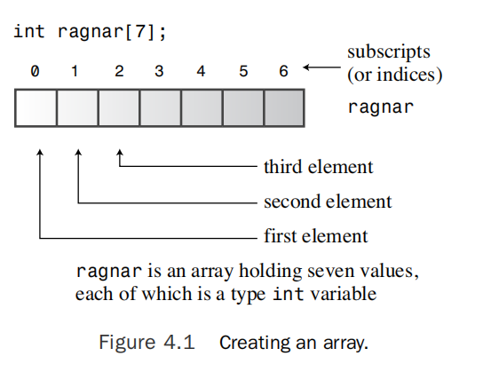

# 复合 类型

你开发了一个名为“User-Hostile”的电脑游戏，玩家在游戏中与一个晦涩而滥用的计算机界面竞技。现在，你需要编写一个程序，用于跟踪你每月游戏销售额，为期五年。或者你想要清点你积累的黑客英雄交易卡。你很快就得出结论，需要比C++的简单基本类型更多的东西来满足这些数据需求，而C++提供了更多——复合类型。这些类型是由基本整数和浮点类型构建的。最有影响力的复合类型是类，这是面向对象编程的堡垒。但是C++还支持来自C的几种更为谦逊的复合类型。例如，数组可以保存同一类型的多个值。特定类型的数组可以保存一个字符串，它是一系列字符。结构可以保存多个不同类型的值。然后还有指针，它们是变量，告诉计算机数据放在哪里。在本章中，你将研究所有这些复合形式（除了类），首次了解new和delete以及你如何使用它们来管理数据，并初步了解C++的字符串类，它为你提供了一种与字符串一起工作的替代方法。

## 介绍数组

!!! note
    数组是一种可以保存多个值的数据形式，所有值都是同一类型。

要创建一个数组，你需要使用一个声明语句。数组声明应该指出三件事：
- 要存储在每个元素中的值的类型
- 数组的名称
- 数组中的元素数量

这是声明数组的一般形式：
```cpp
typeName arrayName[arraySize];
```

数组的许多用处来自于你可以单独访问数组元素。这样做的方法是使用下标或索引来编号元素。C++数组编号从零开始。



清单 4.1 arrayone.cpp

```cpp
// arrayone.cpp -- small arrays of integers
#include <iostream>
int main()
{
    using namespace std;
    int yams[3]; // creates array with three elements
    yams[0] = 7; // assign value to first element
    yams[1] = 8; // assign value to second element
    yams[2] = 6; // assign value to third element

    int yamcosts[3] = {20, 30, 5}; // create, initialize array

    cout << "Total yams = ";
    cout << yams[0] + yams[1] + yams[2] << endl;
    cout << "The package with " << yams[1] << " yams costs ";
    cout << yamcosts[1] << " cents per yam.\n";
    int total = yams[0] * yamcosts[0] + yams[1] * yamcosts[1];
    total = total + yams[2] * yamcosts[2];
    cout << "The total yam expense is " << total << " cents.\n";

    cout << "\nSize of yams array = " << sizeof yams;
    cout << " bytes.\n";
    cout << "Size of one element = " << sizeof yams[0];
    cout << " bytes.\n";
    return 0;
}
```

### 程序说明
~

### 数组的初始化规则
你只能在定义数组时使用初始化形式。你不能在后面使用它，也不能将一个数组整体赋值给另一个数组。但是，你可以使用下标并单独为数组的元素赋值。

如果你部分初始化一个数组，编译器会将剩余的元素设置为零。

!!! tip
    将数组的所有元素初始化为零很容易——只需将第一个元素显式初始化为零，然后让编译器将剩余元素初始化为零。

### C++11 数组初始化
~

## 字符串
