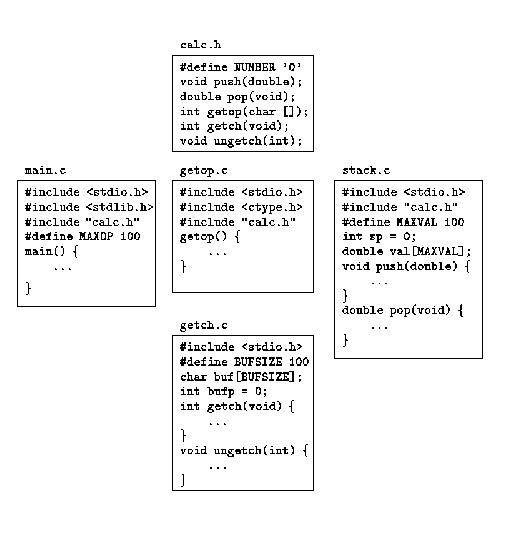
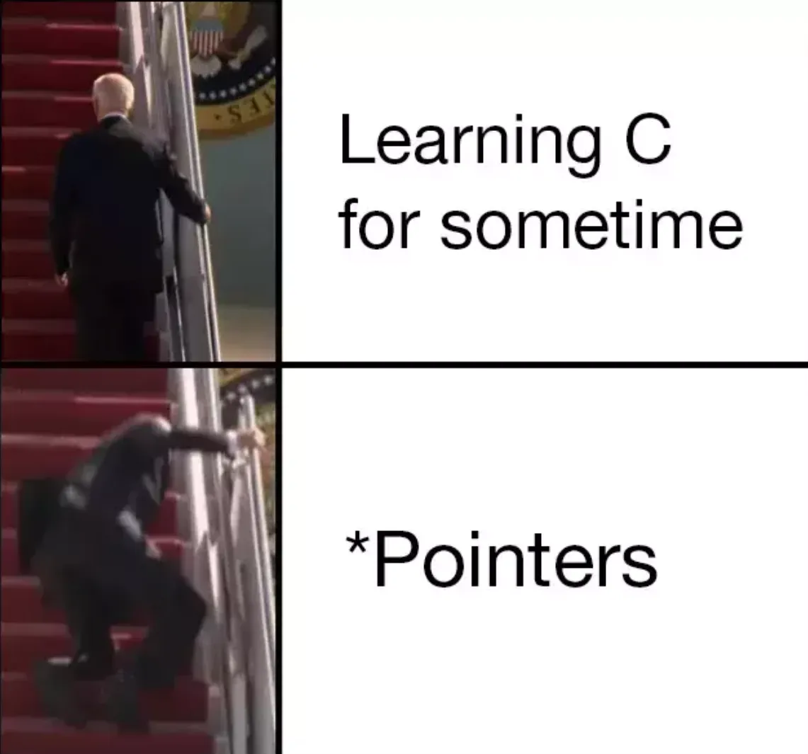
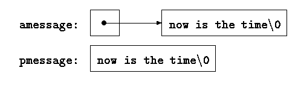

# C 语言学习笔记

<div class="grid cards" markdown>

-   :fontawesome-solid-book:{ .lg .middle } __C语言🎯__

    ---
    作者: Brian W. Kernighan & Dennis M. Ritchie

    [:octicons-arrow-right-24: <a href="https://kremlin.cc/k&r.pdf" target="_blank"> Download PDF </a>](#)

</div>

## 目录

- [x] CH1 导言
- [x] CH2 类型、运算符与表达式
- [x] CH3 控制流
- [x] CH4 函数与程序结构
- [x] CH5 指针与数组
- [x] CH6 结构
- [x] CH7 输入与输出
- [x] CH8 UNIX 系统接口

## CH1 - 导言

一些简单案例。

## CH2 - 类型、运算符与表达式
- **变量** 和 **常量** 是程序处理的两种基本数据对象。
- **声明语句** 说明变量的名字及类型，也可以指定变量的初值。
- **运算符** 指定将要进行的操作。
- **表达式** 则把变量与常量组合起来生成新的值。
- 对象的 **类型** 决定该对象可取值的集合以及可以对该对象执行的操作。

### 2.1 变量名
对变量的命名与符号常量的命名存在一些限制条件：
- 名字是由字母和数字组成的序列，但其第一个字符必须为字母
  - 下划线“_”被看做是字母，通常用于命名较长的变量名，以提高其可读性
  - 由于例程的名字通常以下划线开头，因此变量名不要以下划线开头
- 大写字母与小写字母是有区别的
  - 通常，变量名用小写字母，符号常量用大写字母
- 选择的变量名要能够尽量从字面上表达变量的用途，这样做不容易引起混淆。
  - 局部变量一般使用较短的变量名（尤其是循环控制变量）
  - 外部变量使用较长的名字

### 2.2 数据类型及长度
C 语言只提供了下列几种基本数据类型：

- char 字符型，一个字节, 可以存放本地字符集中的一个字符
- int 整型，通常反映了所用机器中整数的最自然长度 
- float 单精度浮点型
- double 双精度浮点型

此外，还可以在这些基本数据类型的前面加上一些限定符。short 与 long 两个限定符用于限定整型：

short int sh;
long int counter;

在上述这种类型的声明中，关键字 int 可以省略。通常很多人也习惯这么做。

short 与 long 两个限定符的引入可以为我们提供满足实际需要的不同长度的整型数。int 通常代表特定机器中整数的自然长度。short 类型通常为 16 位，1ong 类型通常为 32位，int 类型可以为 16 位或 32 位。各编译器可以根据硬件特性自主选择合适的类型长度，但要遵循下列限制：short 与 int 类型至少为 16 位，而 long 类型至少为 32 位，并且 short类型不得长于 int 类型，而 int 类型不得长于 long 类型。

类型限定符 signed 与 unsigned 可用于限定 char 类型或任何整型。unsigned 类型的数总是正值或 0，并遵守算术模 2^n定律，其中 n 是该类型占用的位数。例如，如果 char 对象占用 8 位，那么 unsigned char 类型变量的取值范围为 0～255，而 signed char 类型变量的取值范围则为-128～127（在采用对二的补码的机器上）。不带限定符的 char 类型对象是否带符号则取决于具体机器，但可打印字符总是正值。

### 2.3 常量

#### 整数常量

整数常量属于 int 类型。long 类型的常量以字母 l 或 L 结尾，如123456789L。如果一个整数太大以至于无法用 int 类型表示时，也将被当作 long 类型处理。无符号常量以字母 u 或 U 结尾。后缀 ul 或 UL 表明是 unsigned long 类型。

整型数除了用十进制表示外，还可以用八进制或十六进制表示。带前缀 0 的整型常量表示它为八进制形式；前缀为 0x 或 0X，则表示它为十六进制形式。

#### 浮点数常量

浮点数常量中包含一个小数点（如 123.4）或一个指数（如 1e-2），也可以两者都有。没有后缀的浮点数常量为 double 类型。后缀 f 或 F 表示 float 类型，而后缀 l 或 L 则表示 long double 类型。

#### 字符常量

一个字符常量是一个整数，书写时将一个字符括在单引号中。如果用字符'0'代替这个与具体字符集有关的值（比如 48），那么，程序就无需关心该字符对应的具体值，增加了程序的易读性。字符常量一般用来与其它字符进行比较，但也可以像其它整数一样参与数值运算。

!!! info "转义字符"
    ANSI C 语言中的全部转义字符序列如下所示：

    \a 响铃符       \\\\ 反斜杠

    \b 回退符       \? 问号

    \f 换页符       \' 单引号

    \n 换行符       \" 双引号
    
    \r 回车符       \ooo 八进制数

    \t 横向制表符   \xhh 十六进制数

    \v 纵向制表符

字符常量'\0'表示值为 0 的字符，也就是空字符（null）。我们通常用'\0'的形式代替 0，以强调某些表达式的字符属性，但其数字值为 0。

常量表达式是仅仅只包含常量的表达式。这种表达式在编译时求值，而不在运行时求值。它可以出现在常量可以出现的任何位置。

#### 字符串常量

字符串常量或字符串字面量以双引号括起来的字符序列表示。字符串常量是一个字符数组。字符串的内部表示在末尾有一个空字符'\0'，因此所需的物理存储比引号之间写入的字符数多一个。这种表示也解释了为什么字符串的长度没有限制；程序只需要扫描内存，直到找到'\0'来确定长度。标准库函数strlen(s)返回其字符串参数的长度，不包括'\0'。

我们应该搞清楚字符常量与仅包含一个字符的字符串之间的区别：'x'与"x"是不同的。前者是一个整数，其值是字母 x 在机器字符集中对应的数值（内部表示值）；后者是一个包含一个字符（即字母 x）以及一个结束符'\0'的字符数组。

#### 枚举常量

枚举常量是一种特殊的整型常量。枚举常量是由用户定义的标识符的列表。关键字 enum 说明符用于定义枚举类型，其形式为：

enum 枚举名 {枚举常量表}；

枚举常量表中的第一个枚举常量的默认值为 0，后续枚举常量的值依次加 1。枚举常量的值可以在定义时显式地赋值。如果没有显式地赋值，那么枚举常量的值将比前一个枚举常量的值大 1。枚举常量的值必须是整型常量，且不能重复。

枚举常量的作用域与其它变量的作用域相同，即从定义处到该枚举常量所在的块的结束处。枚举常量的类型为 int。

### 2.4 声明

所有变量都必须先声明后使用，尽管某些变量可以通过上下文隐式地声明。一个声明指定一种变量类型，后面所带的变量表可以包含一个或多个该类型的变量。

一个声明语句中的多个变量可以拆开在多个声明语句中声明。按照这种形式书写代码需要占用较多的空间，但便于向各声明语句中添加注释，也便于以后修改。

还可以在声明的同时对变量进行初始化。在声明中，如果变量名的后面紧跟一个等号以及一个表达式，该表达式就充当对变量进行初始化的初始化表达式。

如果变量不是自动变量，则只能进行一次初始化操作，从概念上讲，应该是在程序开始执行之前进行，并且初始化表达式必须为常量表达式。每次进入函数或程序块时，显式初始化的自动变量都将被初始化一次，其初始化表达式可以是任何表达式。默认情况下，外部变量与静态变量将被初始化为 0。未经显式初始化的自动变量的值为未定义值（即无效值）。

任何变量的声明都可以使用 const 限定符限定。该限定符指定变量的值不能被修改。对数组而言，const 限定符指定数组所有元素的值都不能被修改。const 限定符的使用可以提高程序的可读性，也可以帮助编译器检查程序中的错误。

### 2.5 算术运算符
二元算术运算符包括：+、-、*、/、%（取模运算符）。整数除法会截断结果中的小数部分。表达式 x % y 的结果是 x 除以 y 的余数，当 x 能被 y 整除时，其值为 0。

取模运算符%不能应用于 float 或 double 类型。在有负操作数的情况下，整数除法截取的方向以及取模运算结果的符号取决于具体机器的实现，这和处理上溢或下溢的情况是一样的。

二元运算符+和-具有相同的优先级，它们的优先级比运算符*、/和%的优先级低，而运算符*、/和%的优先级又比一元运算符+和-的优先级低。算术运算符采用从左到右的结合规则。

### 2.6 关系运算符与逻辑运算符
关系运算符包括下列几个运算符：
\> >= < <= 
它们具有相同的优先级。优先级仅次于它们的是相等性运算符：
== != 
关系运算符的优先级比算术运算符低。

逻辑运算符&&与||有一些较为特殊的属性，由&&与||连接的表达式按从左到右的顺序进行求值，并且，在知道结果值为真或假后立即停止计算。绝大多数 C 语言程序运用了这些属性。

根据定义，在关系表达式或逻辑表达式中，如果关系为真，则表达式的结果值为数值 1；如果为假，则结果值为数值 0。

### 2.7 类型转换
当一个运算符的几个操作数类型不同时，就需要通过一些规则把它们转换为某种共同的类型。一般来说，自动转换是指把“比较窄的”操作数转换为“比较宽的”操作数，并且不丢失信息的转换。不允许使用无意义的表达式，例如，不允许把 float 类型的表达式作为下标。针对可能导致信息丢失的表达式，编译器可能会给出警告信息，比如把较长的整型值赋给较短的整型变量，把浮点型值赋值给整型变量，等等，但这些表达式并不非法。

由于 char 类型就是较小的整型，因此在算术表达式中可以自由使用 char 类型的变量，这就为实现某些字符转换提供了很大的灵活性，比如，下面的函数 atoi 就是一例，它将一串数字转换为相应的数值。

将字符类型转换为整型时，我们需要注意一点。C 语言没有指定 char 类型的变量是无符号变量（signed）还是带符号变量（unsigned）。当把一个 char 类型的值转换为 int 类型的值时，其结果有没有可能为负整数？对于不同的机器，其结果也不同，这反映了不同机器结构之间的区别。在某些机器中，如果 char 类型值的最左一位为 1，则转换为负整数（进行“符号扩展”）。而在另一些机器中，把 char 类型值转换为 int 类型时，在 char 类型值的左边添加 0，这样导致的转换结果值总是正值。

C 语言的定义保证了机器的标准打印字符集中的字符不会是负值，因此，在表达式中这些字符总是正值。但是，存储在字符变量中的位模式在某些机器中可能是负的，而在另一些机器上可能是正的。为了保证程序的可移植性，如果要在 char 类型的变量中存储非字符数据，最好指定 signed 或 unsigned 限定符。

C 语言中，很多情况下会进行 **隐式的算术类型转换** 。一般来说，如果二元运算符（具有两个操作数的运算符称为二元运算符，比如+或*）的两个操作数具有不同的类型，那么在进行运算之前先要把“较低”的类型提升为“较高”的类型，运算的结果为较高的类型。

赋值时也要进行类型转换。赋值运算符右边的值需要转换为左边变量的类型，左边变量的类型即赋值表达式结果的类型。
前面提到过，无论是否进行符号扩展，字符型变量都将被转换为整型变量。当把较长的整数转换为较短的整数或 char 类型时，超出的高位部分将被丢弃。

在任何表达式中都可以使用一个称为强制类型转换的一元运算符强制进行显式类型转换。在下列语句中，表达式将按照上述转换规则被转换为类型名指定的类型：

(类型名) 表达式

### 2.8 自增与自减运算符
C 语言提供了两个用于变量递增与递减的特殊运算符。自增运算符++使其操作数递增 1，自减运算符使其操作数递减 1。

++与--这两个运算符特殊的地方主要表现在：它们既可以用作前缀运算符（用在变量前面，如++n）。也可以用作后缀运算符（用在变量后面，如 n++）。在这两种情况下，其效果都是将变量 n 的值加 1。但是，它们之间有一点不同。表达式++n 先将 n 的值递增 1，然后再使用变量 n 的值，而表达式 n++则是先使用变量 n 的值，然后再将 n 的值递增 1。

### 2.9 位运算符
C 语言提供了 6 个位操作运算符。这些运算符只能作用于整型操作数，即只能作用于带符号或无符号 char、short、int、long 类型：

- & 按位与（AND）
- | 按位或（OR）
- ^ 按位异或（XOR）
- << 左移
- >> 右移
- ~ 按位求反（一元运算符）

按位与运算符&经常用于屏蔽某些二进制位，例如：n = n & 0177;
该语句将 n 中除 7 个低二进制位外的其它各位均置为 0。

按位或运算符|常用于将某些二进制位置为 1，例如：x = x | SET_ON；
该语句将 x 中对应于 SET_ON 中为 1 的那些二进制位置为 1。

按位异或运算符^当两个操作数的对应位不相同时将该位设置为 1，否则，将该位设置为0。 
我们必须将位运算符&、|同逻辑运算符&&、||区分开来，后者用于从左至右求表达式的真值。例如，如果 x 的值为 1，Y 的值为 2，那么，x & y 的结果为 0，而 x && y 的值为 1

移位运算符<<与>>分别用于将运算的左操作数左移与右移，移动的位数则由右操作数指
定（右操作数的值必须是非负值）。因此，表达式 x << 2 将把 x 的值左移 2 位，右边空出的
2 位用 0 填补，该表达式等价于对左操作数乘以 4。

一元运算符~用于求整数的二进制反码，即分别将操作数各二进制位上的 1 变为 0，0 变为 1。

### 2.10 赋值运算符与表达式
大多数二元运算符（即有左、右两个操作数的运算符，比如+）都有一个相应的赋值运算符 op=，其中，op 可以是下面这些运算符之一：

`+ - * / % << >> & ^ |`

如果 expr1 和 expr2 是表达式，那么
`expr1 op= expr2` 

等价于：
`expr1 = (expr1) op (expr2)`


### 2.11 条件表达式

条件表达式 if-else 的一般形式为：

```c

if (表达式 1)
    语句 1
else if (表达式 2)
    语句 2
else if (表达式 3)
    语句 3
```

条件表达式形式（三元）：

`expr1 ? expr2 : expr3`

### 2.12 运算符优先级与求值次序

运算符优先级与求值次序表：

|               运算符               |                                                       含义                                                       |  优先级  |
| :--------------------------------: | :--------------------------------------------------------------------------------------------------------------: | :------: |
|             () [] -> .             |                                        括号、下标、结构成员、结构指针成员                                        | 从左到右 |
|  ! ~ ++ -- + - * & (类型) sizeof   |                 逻辑非、按位求反、自增、自减、正负号、间接寻址、取地址、强制类型转换、求字节长度                 | 从右到左 |
|               * / %                |                                                   乘、除、求余                                                   | 从左到右 |
|                + -                 |                                                      加、减                                                      | 从左到右 |
|               << >>                |                                                    左移、右移                                                    | 从左到右 |
|             < <= > >=              |                                          小于、小于等于、大于、大于等于                                          | 从左到右 |
|               == !=                |                                                   等于、不等于                                                   | 从左到右 |
|                 &                  |                                                      按位与                                                      | 从左到右 |
|                 ^                  |                                                     按位异或                                                     | 从左到右 |
|                 \|                 |                                                      按位或                                                      | 从左到右 |
|                 &&                 |                                                      逻辑与                                                      | 从左到右 |
|                \|\|                |                                                      逻辑或                                                      | 从左到右 |
|                 ?:                 |                                                    条件表达式                                                    | 从右到左 |
| = += -= *= /= %= <<= >>= &= ^= \|= | 赋值、赋值求和、赋值求差、赋值求积、赋值求商、赋值求余、赋值左移、赋值右移、赋值按位与、赋值按位异或、赋值按位或 | 从右到左 |
|                 ,                  |                                                       逗号                                                       | 从左到右 |

## CH3 - 控制流
程序语言中的控制流语句用于控制各计算操作执行的次序。

### 3.1 语句与程序块

#### 语句
在 x = 0、i++或 printf(...)这样的表达式之后加上一个分号（;），它们就变成了
语句。在 C 语言中，分号是语句结束符，而 Pascal 等语言却把分号用作语句之间的分隔符。

#### 程序块
用一对花括号“{”与“}”把一组声明和语句括在一起就构成了一个复合语句（也叫作程序块），复合语句在语法上等价于单条语句。右花括号用于结束程序块，其后不需要分号。

### 3.2 if-else 语句

```c
if {表达式} 
  语句 1 
else 
  语句 2
```

其中 else 部分是可选的。该语句执行时，先计算表达式的值，如果其值为真（即表达式的值
为非 0），则执行语句 1；如果其值为假（即表达式的值为 0），并且该语句包含 else 部分，
则执行语句 2。

由于 if 语句只是简单测试表达式的数值，因此可以对某些代码的编写进行简化。最明显
的例子是用如下写法
  if (表达式) 
来代替
  if (表达式 !0) 
某些情况下这种形式是自然清晰的，但也有些情况下可能会含义不清。

因为 if-else 语句的 else 部分是可选的，所以在嵌套的 if 语句中省略它的 else 部分将导致歧义。解决的方法是将每个 else 与最近的前一个没有 else 配对的 if 进行匹配。可以使用花括号来明确地指定 else 与哪个 if 匹配。

### 3.3 else-if 语句

```c
if (表达式) 
  语句
else if (表达式) 
  语句
else if (表达式) 
  语句
else if (表达式) 
  语句
else 
  语句
```
因此我们在这里单独说明一下。这种 if 语句序列是编写多路判定最常用的方法。其中的各表达式将被依次求值，一旦某个表达式结果为真，则执行与之相关的语句，并终止整个语句序列的执行。同样，其中各语句既可以是单条语句，也可以是用花括号括住的复合语句。

最后一个 else 部分用于处理“上述条件均不成立”的情况或默认情况，也就是当上面各条件都不满足时的情形。有时候并不需要针对默认情况执行显式的操作，这种情况下，可以把该结构末尾的
`else 语句` 部分省略掉；该部分也可以用来检查错误，以捕获“不可能”的条件。

### 3.4 switch 语句
!!! note "switch 语句"
    switch 语句是一种多路判定语句，它测试表达式是否与一些常量整数值中的某一个值匹配，并执行相应的分支动作。

```c
switch (表达式) { 
  case 常量表达式: 语句序列
  case 常量表达式: 语句序列
  default: 语句序列
}
```

每一个分支都由一个或多个 **整数值常量** 或 **常量表达式** 标记。如果某个分支与表达式的值匹配，则从该分支开始执行。各分支表达式必须互不相同。如果没有哪一分支能匹配表达式，则执行标记为 default 的分支。default 分支是可选的。如果没有 default 分支也没有其它分支与表达式的值匹配，则该 switch 语句不执行任何动作。各分支及 default 分支的排列次序是任意的。

例子：

```c
#include <stdio.h>
main() /* count digits, white space, others */
{
    int c, i, nwhite, nother, ndigit[10];
    nwhite = nother = 0;
    for (i = 0; i < 10; i++)
        ndigit[i] = 0;
    while ((c = getchar()) != EOF)
    {
        switch (c)
        {
        case '0':
        case '1':
        case '2':
        case '3':
        case '4':
        case '5':
        case '6':
        case '7':
        case '8':
        case '9':
            ndigit[c - '0']++;
            break;
        case ' ':
        case '\n':
        case '\t':
            nwhite++;
            break;
        default:
            nother++;
            break;
        }
    }
    printf("digits =");
    for (i = 0; i < 10; i++)
        printf(" %d", ndigit[i]);
    printf(", white space = %d, other = %d\n",
           nwhite, nother);
    return 0;
}
```

break 语句将导致程序的执行立即从 switch 语句中退出。 **在 switch 语句中，case的作用只是一个标号，因此，某个分支中的代码执行完后，程序将进入下一分支继续执行，除非在程序中显式地跳转。** 跳出 switch 语句最常用的方法是使用 break 语句与 return 语句。break 语句还可强制控制从 while、for 与 do 循环语句中立即退出。

依次执行各分支的做法有优点也有缺点。好的一面是它可以把若干个分支组合在一起完成一个任务，如上例中对数字的处理。但是，正常情况下为了防止直接进入下一个分支执行，每个分支后必须以一个 break 语句结束。从一个分支直接进入下一个分支执行的做法并不健全，这样做在程序修改时很容易出错。除了一个计算需要多个标号的情况外，应尽量减少从一个分支直接进入下一个分支执行这种用法，在不得不使用的情况下应该加上适当的程序注释。

作为一种良好的程序设计风格，在 switch 语句最后一个分支（即 default 分支）的后面也加上一个 break 语句。这样做在逻辑上没有必要，但当我们需要向该 switch 语句后添加其它分支时，这种防范措施会降低犯错误的可能性。

### 3.5 while 循环与 for 循环

在 while 循环语句
```c
while (表达式) 
  语句
```
中，首先求表达式的值。如果其值非 0，则执行语句，并再次求该表达式的值。这一循环过程
一直进行下去，直到该表达式的值为 0 为止，随后继续执行语句后面的部分。

```c
for 循环语句; 
for (表达式 1; 表达式 2; 表达式 3) 
语句
```
等价于

```c
表达式 1;
while (表达式 2) {
  语句
  表达式 3;
}
```
!!! warning "注意"
    当 while 或 for 循环语句中包含 continue 语句时，上述二者之间就不一定等价了。

从语法角度看，for 循环语句的 3 个组成部分都是表达式。最常见的情况是，表达式 1
与表达式 3 是赋值表达式或函数调用，表达式 2 是关系表达式。这 3 个组成部分中的任何部
分都可以省略，但分号必须保留。如果在 for 语句中省略表达式 1 与表达式 3，它就退化成
了 while 循环语句。如果省略测试条件，即表达式 2，则认为其值永远是真值，因此，下列
for 循环语句：
```c
for ( ; ; ) 
  语句
```
是一个“无限”循环语句，这种语句需要借助其它手段（如 break 语句或 return 语句）才
能终止执行。

在设计程序时到底选用 while 循环语句还是 for 循环语句，主要取决于程序设计人员的个人偏好。

例如，在下列语句中：
```c
 while ((c = getchar()) == ' ' || c == '\n' || c = '\t') 
 ; /* skip white space characters */ 
```
因为其中没有初始化或重新初始化的操作，所以使用 whi1e 循环语句更自然一些。

如果语句中需要执行简单的初始化和变量递增，使用 for 语句更合适一些，它将循环控制语句集中放在循环的开头，结构更紧凑、更清晰。通过下列语句可以很明显地看出这一点：
```c
 for (i = 0; i < n; i++) 
 ...
```

例子，重写atoi函数：

```c
#include <ctype.h>
/* atoi: convert s to integer; version 2 */
int atoi(char s[])
{
    int i, n, sign;
    for (i = 0; isspace(s[i]); i++) /* skip white space */
        ;
    sign = (s[i] == '-') ? -1 : 1;
    if (s[i] == '+' || s[i] == '-') /* skip sign */
        i++;
    for (n = 0; isdigit(s[i]); i++)
        n = 10 * n + (s[i] - '0');
    return sign * n;
}
```

把循环控制部分集中在一起，对于多重嵌套循环，优势更为明显。下面的函数是对整型数组进行排序的 Shell 排序算法。Shell 排序算法是 D. L. Shell 于 1959 年发明的，其基本思想是：先比较距离远的元素，而不是像简单交换排序算法那样先比较相邻的元素。这样可以快速减少大量的无序情况，从而减轻后续的工作。被比较的元素之间的距离逐步减少，直到减少为 1，这时排序变成了相邻元素的互换。

```c
/* shellsort: sort v[0]...v[n-1] into increasing order */
void shellsort(int v[], int n)
{
    int gap, i, j, temp;
    for (gap = n / 2; gap > 0; gap /= 2)
        for (i = gap; i < n; i++)
            for (j = i - gap; j >= 0 && v[j] > v[j + gap]; j -= gap)
            {
                temp = v[j];
                v[j] = v[j + gap];
                v[j + gap] = temp;
            }
}
```

逗号运算符“,”也是 C 语言优先级最低的运算符，在 for 语句中经常会用到它。被逗号分隔的一对表达式将按照从左到右的顺序进行求值，表达式右边的操作数的类型和值即为其结果的类型和值。
```c
#include <string.h>
/* reverse: reverse string s in place */
void reverse(char s[])
{
    int c, i, j;
    for (i = 0, j = strlen(s) - 1; i < j; i++, j--)
    {
        c = s[i];
        s[i] = s[j];
        s[j] = c;
    }
}
```
某些情况下的逗号并不是逗号运算符，比如分隔函数参数的逗号，分隔声明中变量的逗号等，这些逗号并不保证各表达式按从左至右的顺序求值。

应该慎用逗号运算符。逗号运算符最适用于关系紧密的结构中，比如上面的 reverse 函数内的 for 语句，对于需要在单个表达式中进行多步计算的宏来说也很适合。逗号表达式还适用于 reverse 函数中元素的交换，这样，元素的交换过程便可以看成是一个单步操作。

### 3.6 do-while 循环

我们在第 1 章中曾经讲过，while 与 for 这两种循环在循环体执行前对终止条件进行测试。与此相反，C 语言中的第三种循环——do-while 循环则在循环体执行后测试终止条件，这样循环体至少被执行一次。do-while 循环的语法形式如下：

```c
do 
  语句
while (表达式);
```

在这一结构中，先执行循环体中的语句部分，然后再求表达式的值。如果表达式的值为真，则再次执行语句，依此类推。当表达式的值变为假，则循环终止。

经验表明，do-while 循环比 while 循环和 for 循环用得少得多。尽管如此，do-while
循环语句有时还是很有用的。下面我们通过函数 itoa 来说明这一点。itoa 函数是 atoi 函数的逆函数，它把数字转换为字符串。这个工作比最初想像的要复杂一些。如果按照 atoi 函数中生成数字的方法将数字转换为字符串，则生成的字符串的次序正好是颠倒的，因此，我们首先要生成反序的字符串，然后再把该字符串倒置。

```c
/* itoa: convert n to characters in s */
void itoa(int n, char s[])
{
    int i, sign;
    if ((sign = n) < 0) /* record sign */
        n = -n;         /* make n positive */
    i = 0;
    do
    {                          /* generate digits in reverse order */
        s[i++] = n % 10 + '0'; /* get next digit */
    } while ((n /= 10) > 0);   /* delete it */
    if (sign < 0)
        s[i++] = '-';
    s[i] = '\0';
    reverse(s);
}
```

### 3.7 break 与 continue 语句

不通过循环头部或尾部的条件测试而跳出循环，有时是很方便的。break 语句可用于从for、while与do-while等循环中提前退出，就如同从switch语句中提前退出一样。break语句能使程序从 switch 语句或最内层循环中立即跳出。

下面的函数 trim 用于删除字符串尾部的空格符、制表符与换行符。当发现最右边的字符为非空格符、非制表符、非换行符时，就使用 break 语句从循环中退出。

```c
/* trim: remove trailing blanks, tabs, newlines */
int trim(char s[])
{
    int n;
    for (n = strlen(s) - 1; n >= 0; n--)
        if (s[n] != ' ' && s[n] != '\t' && s[n] != '\n')
            break;
    s[n + 1] = '\0';
    return n;
}
```

strlen 函数返回字符串的长度。for 循环从字符串的末尾开始反方向扫描寻找第一个不是空格符、制表符以及换行符的字符。当找到符合条件的第一个字符，或当循环控制变量 n 变为负数时（即整个字符串都被扫描完时），循环终止执行。读者可以验证，即使字符串为空或仅包含空白符，该函数也是正确的。

continue 语句与 break 语句是相关联的，但它没有 break 语句常用。continue 语句用于使 for、while 或 do-while 语句开始下一次循环的执行。在 while 与 do-while语句中，continue 语句的执行意味着立即执行测试部分；在 for 循环中，则意味着使控制转移到递增循环变量部分。 **continue 语句只用于循环语句，不用于 switch 语句。** 某个循环包含的 switch 语句中的 continue 语句，将导致进入下一次循环。

当循环的后面部分比较复杂时，常常会用到 continue 语句。这种情况下，如果不使用continue 语句，则可能需要把测试颠倒过来或者缩进另一层循环，这样做会使程序的嵌套更深。

### 3.8 goto 语句与标号

C 语言提供了可随意滥用的 goto 语句以及标记跳转位置的标号。从理论上讲，goto 语句是没有必要的，实践中不使用 goto 语句也可以很容易地写出代码。至此，本书中还没有使用 goto 语句。

但是，在某些场合下 goto 语句还是用得着的。最常见的用法是终止程序在某些深度嵌套的结构中的处理过程，例如一次跳出两层或多层循环。这种情况下使用 break 语句是不能达到目的的，它只能从最内层循环退出到上一级的循环。下面是使用 goto 语句的一个例子：

```c
for (...)
    for (...)
    {
        ... if (disaster) goto error;
    }
... error:
    /* clean up the mess */
```

标号的命名同变量命名的形式相同，标号的后面要紧跟一个冒号。标号可以位于对应的
goto 语句所在函数的任何语句的前面。标号的作用域是整个函数。

我们来看另外一个例子。考虑判定两个数组 a 与 b 中是否具有相同元素的问题。一种可能的解决方法是：

```c
for (i = 0; i < n; i++)
    for (j = 0; j < m; j++)
        if (a[i] == b[j])
            goto found;
/* didn't find any common element */
... found :
    /* got one: a[i] == b[j] */
    ...
```

所有使用了 goto 语句的程序代码都能改写成不带 goto 语句的程序，但可能会增加一些额外的重复测试或变量。例如，可将上面判定是否具有相同数组元素的程序段改写成下列形式：

```c
found = 0;
for (i = 0; i < n && !found; i++)
    for (j = 0; j < m && !found; j++)
        if (a[i] == b[j])
            found = 1;
if (found)
/* got one: a[i-1] == b[j-1] */
... else
    /* didn't find any common element */
    ...
```

大多数情况下，使用 goto 语句的程序段比不使用 goto 语句的程序段要难以理解和维护，少数情况除外，比如我们前面所举的几个例子。尽管该问题并不太严重，但我们还是建议尽可能少地使用 goto 语句。

!!! note
    总之，别用 goto 语句。

## CH4 - 函数与程序结构

函数可以把大的计算任务分解成若干个较小的任务，程序设计人员可以基于函数进一步构造程序，而不需要重新编写一些代码。一个设计得当的函数可以把程序中不需要了解的具体操作细节隐藏起来，从而使整个程序结构更加清晰，并降低修改程序的难度。C 语言在设计中考虑了函数的高效性与易用性这两个因素。C 语言程序一般都由许多小的函数组成，而不是由少量较大的函数组成。

### 4.1 函数的基本知识
```c
#include <stdio.h>
#define MAXLINE 1000 /* maximum input line length */
int getline(char line[], int max) int strindex(char source[], char searchfor[]);
char pattern[] = "ould"; /* pattern to search for */
/* find all lines matching pattern */
main()
{
    char line[MAXLINE];
    int found = 0;
    while (getline(line, MAXLINE) > 0)
        if (strindex(line, pattern) >= 0)
        {
            printf("%s", line);
            found++;
        }
    return found;
}
/* getline: get line into s, return length */
int getline(char s[], int lim)
{
    int c, i;
    i = 0;
    while (--lim > 0 && (c = getchar()) != EOF && c != '\n')
        s[i++] = c;
    if (c == '\n')
        s[i++] = c;
    s[i] = '\0';
    return i;
}
/* strindex: return index of t in s, -1 if none */
int strindex(char s[], char t[])
{
    int i, j, k;
    for (i = 0; s[i] != '\0'; i++)
    {
        for (j = i, k = 0; t[k] != '\0' && s[j] == t[k]; j++, k++)
            ;
        if (k > 0 && t[k] == '\0')
            return i;
    }
    return -1;
}
```
函数的定义形式如下：
```c
返回值类型 函数明(参数声明表) 
{ 
声明和语句
}
```

函数定义中的各构成部分都可以省略。最简单的函数如下所示：
```c
dummy() {}
```

该函数不执行任何操作也不返回任何值。这种不执行任何操作的函数有时很有用，它可以在程序开发期间用以保留位置（留待以后填充代码）。如果函数定义中省略了返回值类型，则默认为 int 类型。

程序可以看成是变量定义和函数定义的集台。函数之间的通信可以通过参数、函数返回值以及外部变量进行。函数在源文件中出现的次序可以是任意的。只要保证每一个函数不被分离到多个文件中，源程序就可以分成多个文件。

被调用函数通过 return 语句向调用者返回值，return 语句的后面可以跟任何表达式：
return 表达式；

在必要时，表达式将被转换为函数的返回值类型。表达式两边通常加一对圆括号，此处的括号是可选的。

调用函数可以忽略返回值。并且，return 语句的后面也不一定需要表达式。当 return语句的后面没有表达式时，函数将不向调用者返回值。当被调用函数执行到最后的右花括号而结束执行时，控制同样也会返回给调用者（不返回值）。如果某个函数从一个地方返回时有返回值，而从另一个地方返回时没有返回值，该函数并不非法，但可能是一种出问题的征兆。在任何情况下，如果函数没有成功地返回一个值，则它的“值”肯定是无用的。

### 4.2 函数返回非整型值

```c
#include <ctype.h>
/* atof: convert string s to double */
double atof(char s[])
{
    double val, power;
    int i, sign;
    for (i = 0; isspace(s[i]); i++) /* skip white space */
        ;
    sign = (s[i] == '-') ? -1 : 1;
    if (s[i] == '+' || s[i] == '-')
        i++;
    for (val = 0.0; isdigit(s[i]); i++)
        val = 10.0 * val + (s[i] - '0');
    if (s[i] == '.')
        i++;
    for (power = 1.0; isdigit(s[i]); i++)
    {
        val = 10.0 * val + (s[i] - '0');
        power *= 10;
    }
    return sign * val / power;
}
```

```c
#include <stdio.h>
#define MAXLINE 100
/* rudimentary calculator */
main()
{
    double sum, atof(char[]);
    char line[MAXLINE];
    int getline(char line[], int max);
    sum = 0;
    while (getline(line, MAXLINE) > 0)
        printf("\t%g\n", sum += atof(line));
    return 0;
}
```
!!! tip
    如果函数带有参数，则要声明它们；如果没有参数，则使用 void 进行声明。


### 4.3 外部变量
C 语言程序可以看成由一系列的外部对象构成，这些外部对象可能是变量或函数。形容词external 与 internal 相对的，internal 用于描述定义在函数内部的函数参数及变量。外部变量定义在函数之外，因此可以在许多函数中使用。由于 C 语言不允许在一个函数中定义其它函数，因此函数本身是“外部的”。默认情况下，外部变量与函数具有下列性质： **通过同一个名字对外部变量的所有引用（即使这种引用来自于单独编译的不同函数）实际上都是引用同一个对象（标准中把这一性质称为外部链接）** 。

因为外部变量可以在全局范围内访问，这就为函数之间的数据交换提供了一种可以代替函数参数与返回值的方式。任何函数都可以通过名字访问一个外部变量，当然这个名字需要通过某种方式进行声明。

!!! warning
    外部变量会使得程序间耦合关系增强，因此应该尽量避免使用外部变量。

外部变量的用途还表现在它们与内部变量相比具有更大的作用域和更长的生存期。自动变量只能在函数内部使用，从其所在的函数被调用时变量开始存在，在函数退出时变量也将消失。而外部变量是永久存在的，它们的值在一次函数调用到下一次函数调用之间保持不变。因此，如果两个函数必须共享某些数据，而这两个函数互不调用对方，这种情况下最方便的方式便是把这些共享数据定义为 **外部变量** ，而不是作为函数 **参数传递** 。

!!! info
    逆波兰表示法（Reverse Polish notation，RPN，或逆波兰记法），也叫后缀表达式（将运算符写在操作数之后）。逆波兰表示法中不需要圆括号，只要知道每个运算符需要几个操作数就不会引起歧义。

!!! note
    计算器实现：计算器程序的实现很简单。每个操作数都被依次压入到栈中；当一个运算符到达时，从栈中弹出相应数目的操作数（对二元运算符来说是两个操作数），把该运算符作用于弹出的操作数，并把运算结果再压入到栈中。

```c
while (下一个运算符或操作数不是文件结束指示符)
    if (是数)
        将该数压入到栈中
    else if (是运算符)
        弹出所需数目的操作数
        执行运算
        将结果压入到栈中
    else if (是换行符)
    弹出并打印栈顶的值 
    else 出错
```
栈的压入与弹出操作比较简单，但是，如果把错误检测与恢复操作都加进来，该程序就显得很长了，最好把它们设计成独立的函数，而不要把它们作为程序中重复的代码段使用。另外还需要一个单独的函数来取下一个输入运算符或操作数。

到目前为止，我们还没有讨论设计中的一个重要问题：把栈放在哪儿？也就是说，哪些例程可以直接访问它？一种可能是把它放在主函数 main 中，把栈及其当前位置作为参数传递给对它执行压入或弹出操作的函数。但是，main 函数不需要了解控制栈的变量信息，它只进行压入与弹出操作。因此，可以把栈及相关信息放在外部变量中，并只供 push 与 pop 函数访问，而不能被 main 函数访问。

把上面这段话转换成代码很容易。如果把该程序放在一个源文件中，程序可能类似于下列形式：

```c
#include... /* 一些包含头文件 */
#define...  /* 一些 define 定义 */
main 使用的函数声明
main(){...} 

push 与 pop 所使用的外部变量
void push(double f) { ... }
double pop(void) { ... }
int getop(char s[]){...} 
被 getop 调用的函数
```
我们在后面部分将讨论如何把该程序分割成两个或多个源文件。

main 函数包括一个很大的 switch 循环，该循环根据运算符或操作数的类型控制程序的转移。这里的 switch 语句的用法比 3.4 节中的例子更为典型。

```c
#include <stdio.h>
#include <stdlib.h> /* for atof() */
#define MAXOP 100   /* max size of operand or operator */
#define NUMBER '0'  /* signal that a number was found */
int getop(char[]);
void push(double);
double pop(void);
/* reverse Polish calculator */
main()
{
    int type;
    double op2;
    char s[MAXOP];
    while ((type = getop(s)) != EOF)
    {
        switch (type)
        {
        case NUMBER:
            push(atof(s));
            break;
        case '+':
            push(pop() + pop());
            break;
        case '*':
            push(pop() * pop());
            break;
        case '-':
            op2 = pop();
            push(pop() - op2);
            break;
        case '/':
            op2 = pop();
            if (op2 != 0.0)
                push(pop() / op2);
            else
                printf("error: zero divisor\n");
            break;
        case '\n':
            printf("\t%.8g\n", pop());
            break;
        default:
            printf("error: unknown command %s\n", s);
            break;
        }
    }
    return 0;
}
```

因为+与*两个运算符满足交换律，因此，操作数的弹出次序无关紧要。但是，-与/两个运算符的左右操作数必须加以区分。在函数调用中并没有定义两个 pop 调用的求值次序。为了保证正确的次序，必须像 main 函数中一样把第一个值弹出到一个临时变量中。
```c
push(pop() - pop()); /* WRONG */
```
```c
#define MAXVAL 100  /* maximum depth of val stack */
int sp = 0;         /* next free stack position */
double val[MAXVAL]; /* value stack */
/* push: push f onto value stack */
void push(double f)
{
    if (sp < MAXVAL)
        val[sp++] = f;
    else
        printf("error: stack full, can't push %g\n", f);
}
/* pop: pop and return top value from stack */
double pop(void)
{
    if (sp > 0)
        return val[--sp];
    else
    {
        printf("error: stack empty\n");
        return 0.0;
    }
}
```
如果变量定义在任何函数的外部，则是外部变量。因此，我们把 push 和 pop 函数必须共享的栈和栈顶指针定义在这两个函数的外部。

下面我们来看 getop 函数的实现。该函数获取下一个运算符或操作数。该任务实现起来比较容易。它需要跳过空格与制表符。如果下一个字符不是数字或小数点，则返回；否则，把这些数字字符串收集起来（其中可能包含小数点），并返回 NUMBER，以标识数已经收集起来了。

```c
#include <ctype.h>
int getch(void);
void ungetch(int);
/* getop: get next character or numeric operand */
int getop(char s[])
{
    int i, c;
    while ((s[0] = c = getch()) == ' ' || c == '\t')
        ;
    s[1] = '\0';
    if (!isdigit(c) && c != '.')
        return c; /* not a number */
    i = 0;
    if (isdigit(c)) /* collect integer part */
        while (isdigit(s[++i] = c = getch()))
            ;
    if (c == '.') /* collect fraction part */
        while (isdigit(s[++i] = c = getch()))
            ;
    s[i] = '\0';
    if (c != EOF)
        ungetch(c);
    return NUMBER;
}
```
这段程序中的 getch 与 ungetch 两个函数有什么用途呢？程序中经常会出现这样的情况：程序不能确定它已经读入的输入是否足够，除非超前多读入一些输入。读入一些字符以合成一个数字的情况便是一例：在看到第一个非数字字符之前，已经读入的数的完整性是不能确定的。由于程序要超前读入一个字符，这样就导致最后有一个字符不属于当前所要读入的数。

如果能“反读”不需要的字符，该问题就可以得到解决。每当程序多读入一个字符时，就把它压回到输入中，对代码其余部分而言就好像没有读入该字符一样。我们可以编写一对互相协作的函数来比较方便地模拟反取字符操作。getch 函数用于读入下一个待处理的字符，而 ungetch 函数则用于把字符放回到输入中，这样，此后在调用 getch 函数时，在读入新的输入之前先返回 ungetch 函数放回的那个字符。
```c
#define BUFSIZE 100
char buf[BUFSIZE]; /* buffer for ungetch */
int bufp = 0;      /* next free position in buf */
int getch(void)    /* get a (possibly pushed-back) character */
{
    return (bufp > 0) ? buf[--bufp] : getchar();
}
void ungetch(int c) /* push character back on input */
{
    if (bufp >= BUFSIZE)
        printf("ungetch: too many characters\n");
    else
        buf[bufp++] = c;
}
```

### 4.4 作用域规则
构成 C 语言程序的函数与外部变量可以分开进行编译。一个程序可以存放在几个文件中，原先已编译过的函数可以从库中进行加载。

- 如何进行声明才能确保变量在编译时被正确声明？

- 如何安排声明的位置才能确保程序在加载时各部分能正确连接？

- 如何组织程序中的声明才能确保只有一份副本？

- 如何初始化外部变量？

名字的 **作用域** 指的是程序中可以使用该名字的部分。对于在函数开头声明的自动变量来说，其作用域是声明该变量名的函数。不同函数中声明的具有相同名字的各个局部变量之间没有任何关系。函数的参数也是这样的，实际上可以将它看作是 **局部变量** 。

**外部变量** 或函数的作用域从声明它的地方开始，到其所在的（待编译的）文件的末尾结束。

例如，如果 main、sp、val、push 与 pop 是依次定义在某个文件中的 5 个函数或外部变量，如下所示：

```c
main() { ... }
int sp = 0;
double val[MAXVAL];
void push(double f) { ... }
double pop(void) { ... }
```
那么，在 push 与 pop 这两个函数中不需进行任何声明就可以通过名字访问变量 sp 与 val，
但是，这两个变量名不能用在 main 函数中，push 与 pop 函数也不能用在 main 函数中。

另一方面，如果要在外部变量的定义之前使用该变量，或者外部变量的定义与变量的使用不在同一个源文件中，则必须在相应的变量声明中强制性地使用关键字 extern。

!!! note 变量

    局部变量

    外部变量（全局变量）

    外部的外部变量（使用extern声明）

将外部变量的 **声明** 与 **定义** 严格区分开来很重要。 **变量声明** 用于说明 **变量的属性** （主要是变量的类型），而 **变量定义** 除此以外还将引起 **存储器的分配** 。

在一个源程序的所有源文件中，**一个外部变量只能在某个文件中定义一次** ， **而其它文件可以通过 extern 声明来访问它** （定义外部变量的源文件中也可以包含对该外部变量的extern 声明）。外部变量的定义中必须指定数组的长度，但 extern 声明则不一定要指定数组的长度。

!!! note
    extern 用于两种情况：

    (1) 先使用，后定义 (同一文件内也可以不用extern声明)

    (2) 多文件共享变量 (这种情况居多)


**外部变量的初始化只能出现在其定义中。**

### 4.5 头文件
下面我们来考虑把上述的计算器程序分割到若干个源文件中的情况。如果该程序的各组成部分很长，这么做还是有必要的。我们这样分割：将主函数 main 单独放在文件 main.c中；将 push 与 pop 函数以及它们使用的外部变量放在第二个文件 stack.c 中；将 getop函数放在第三个文件 getop.c 中；将 getch 与 ungetch 函数放在第四个文件 getch.c 中。之所以分割成多个文件，主要是考虑在实际的程序中，它们分别来自于单独编译的库。

此外，还必须考虑定义和声明在这些文件之间的共享问题。我们尽可能把共享的部分集中在一起，这样就只需要一个副本，改进程序时也容易保证程序的正确性。



我们对下面两个因素进行了折衷：一方面是我们期望每个文件只能访问它完成任务所需的信息；另一方面是现实中维护较多的头文件比较困难。我们可以得出这样一个结论：对于某些中等规模的程序，最好只用一个头文件存放程序中各部分共享的对象。较大的程序需要使用更多的头文件，我们需要精心地组织它们。

### 4.6 静态变量
某些变量，比如文件 stack.c 中定义的变量 sp 与 val 以及文件 getch.c 中定义的变量 buf 与 bufp，它们仅供其所在的源文件中的函数使用，其它函数不能访问。用 static声明限定外部变量与函数， **可以将其后声明的对象的作用域限定为被编译源文件的剩余部分** 。 **通过 static 限定外部对象，可以达到隐藏外部对象的目的** ，比如，getch-ungetch 复合结构需要共享 buf 与 bufp 两个变量，这样 buf 与 bufp 必须是外部变量，但这两个对象不应该被 getch 与 ungetch 函数的调用者所访问。

要将对象指定为静态存储，可以在正常的对象声明之前加上关键字 static 作为前缀。如果把上述两个函数和两个变量放在一个文件中编译，如下所示：

```c
static char buf[BUFSIZE]; /* buffer for ungetch */
static int bufp = 0;      /* next free position in buf */
int getch(void) { ... }
void ungetch(int c) { ... }
```
那么其它函数就不能访问变量 buf 与 bufp，因此这两个名字不会和同一程序中的其它文件中的相同的名字相冲突。同样，可以通过把变量 sp 与 val 声明为静态类型隐藏这两个由执行栈操作的 push 与 pop 函数使用的变量。

外部的 static 声明通常多用于变量，当然，它也可用于声明函数。通常情况下，函数名字是全局可访问的，对整个程序的各个部分而言都可见。 **但是，如果把函数声明为 static类型，则该函数名除了对该函数声明所在的文件可见外，其它文件都无法访问。** 

### 4.7 寄存器变量
**register** 声明告诉编译器，它所声明的变量在程序中使用频率较高。其思想是，将register 变量放在机器的寄存器中，这样可以使程序更小、执行速度更快。但编译器可以忽略此选项。

### 4.8 程序块结构
在函数中可以以程序块结构的形式定义变量。变量的声明（包括初始化）除了可以紧跟在函数开始的花括号之后，还可以紧跟在任何其它标识复合语句开始的左花括号之后。以这种方式声明的变量可以隐藏程序块外与之同名的变量，它们之间没有任何关系，并在与左花括号匹配的右花括号出现之前一直存在。

每次进入程序块时，在程序块内声明以及初始化的自动变量都将被初始化。静态变量只在第一次进入程
序块时被初始化一次。

自动变量（包括形式参数）也可以隐藏同名的外部变量与函数。

!!! tip
    在一个好的程序设计风格中，应该避免出现变量名隐藏外部作用域中相同名字的情况，否则，很可能引起混乱和错误。


### 4.9 初始化
在不进行显式初始化的情况下，外部变量和静态变量都将被初始化为 0，而自动变量和寄存器变量的初值则没有定义（即初值为无用的信息）。

定义标量变量时，可以在变量名后紧跟一个等号和一个表达式来初始化变量。

对于外部变量与静态变量来说，初始化表达式必须是常量表达式，且只初始化一次（从概念上讲是在程序开始执行前进行初始化）。对于自动变量与寄存器变量，则在每次进入函数或程序块时都将被初始化。

对于自动变量与寄存器变量来说，初始化表达式可以不是常量表达式：表达式中可以包含任意在此表达式之前已经定义的值，包括函数调用。

实际上，自动变量的初始化等效于简写的赋值语句。

数组的初始化可以在声明的后面紧跟一个初始化表达式列表，初始化表达式列表用花括号括起来，各初始化表达式之间通过逗号分隔。

字符数组的初始化比较特殊：可以用一个字符串来代替用花括号括起来并用逗号分隔的初始化表达式序列。


### 4.10 递归
C 语言中的函数可以递归调用，即函数可以直接或间接调用自身。

```c
#include <stdio.h>
/* printd: print n in decimal */
void printd(int n)
{
    if (n < 0)
    {
        putchar('-');
        n = -n;
    }
    if (n / 10)
        printd(n / 10);
    putchar(n % 10 + '0');
}
```
函数递归调用自身时，每次调用都会得到一个与以前的自动变量集合不同的新的自动变量集合。因此，调用 printd(123)时，第一次调用 printd 的参数 n=123。它把 12 传递给printd 的第二次调用，后者又把 1 传递结 printd 的第三次调用。第三次调用 printd 时首先将打印 1，然后再返回到第二次调用。从第三次调用返回后的第二次调用同样也将先打印2，然后再返回到第一次调用。返回到第一次调用时将打 3，随之结束函数的执行。

递归并不节省存储器的开销，因为递归调用过程中必须在某个地方维护一个存储处理值的栈。递归的执行速度并不快，但递归代码比较紧凑，并且比相应的非递归代码更易于编写与理解。


### 4.11 C 语言预处理器

C 语言通过预处理器提供了一些语言功能。从概念上讲，预处理器是编译过程中单独执行的第一个步骤。两个最常用的预处理器指令是：#include 指令（用于在编译期间把指定文件的内容包含进当前文件中）和#define 指令（用任意字符序列替代一个标记）。本节还将介绍预处理器的其它一些特性，如条件编译与带参数的宏。


#### 4.11.1 文件包含
文件包含指令（即#include 指令）使得处理大量的#define 指令以及声明更加方便。在源文件中，任何形如：`#include "文件名"` 或 `#include <文件名>`的行都将被替换为由文件名指定的文件的内容。如果文件名用引号引起来，则在源文件所在位置查找该文件；如果在该位置没有找到文件，或者如果文件名是用尖括号<与>括起来的，则将根据相应的规则查找该文件，这个规则同具体的实现有关。被包含的文件本身也可包含#include 指令。

源文件的开始处通常都会有多个#include 指令，它们用以包含常见的#define 语句和extern 声明，或从头文件中访问库函数的函数原型声明，比如<stdio.h>。

在大的程序中，#include 指令是将所有声明捆绑在一起的较好的方法。它保证所有的源文件都具有相同的定义与变量声明，这样可以避免出现一些不必要的错误。很自然，如果某个包含文件的内容发生了变化，那么所有依赖于该包含文件的源文件都必须重新编译。

#### 4.11.2 宏替换

宏定义的形式如下：`#define 名字 替换文本`。这是一种最简单的宏替换——后续所有出现名字记号的地方都将被替换为替换文本。

通常情况下，#define 指令占一行，替换文本是#define 指令行尾部的所有剩余部分内容，但也可以把一个较长的宏定义分成若干行，这时需要在待续的行末尾加上一个反斜杠符\。#define 指令定义的名字的作用域从其定义点开始，到被编译的源文件的末尾处结束。

宏定义中也可以使用前面出现的宏定义。替换只对记号进行，对括在引号中的字符串不起作用。例如，如果 YES是一个通过#define 指令定义过的名字，则在 printf("YES")或 YESMAN 中将不执行替换。

替换文本可以是任意的，例如：#define forever for (;;) /* infinite loop */ 该语句为无限循环定义了一个新名字 forever。

宏定义也可以带参数，这样可以对不同的宏调用使用不同的替换文本。例如，下列宏定义定义了一个宏 max：`#define max(A, B) ((A) > (B) ? (A) : (B))`

使用宏 max 看起来很像是函数词用，但宏调用直接将替换文本插入到代码中。形式参数（在此为 A 或 B）的每次出现都将被替换成对应的实际参数。因此，语句：`x = max(p+q, r+s);` 将被替换为下列形式:`x = ((p+q) > (r+s) ? (p+q) : (r+s));`

如果对各种类型的参数的处理是一致的，则可以将同一个宏定义应用于任何数据类型，而无需针对不同的数据类型需要定义不同的 max 函数。

仔细考虑一下 max 的展开式，就会发现它存在一些缺陷。其中，作为参数的表达式要重复计算两次，如果表达式存在副作用（比如含有自增运算符或输入／输出），则会出现不正确的情况。例如：`max(i++, j++) /* WRONG */`

它将对每个参数执行两次自增操作。同时还必须注意，要适当使用圆括号以保证计算次序的正确性。考虑下列宏定义：`#define square(x) x * x /* WRONG */` 当用 squrare(z+1)调用该宏定义时会出现什么情况呢？

可以通过#undef 指令取消名字的宏定义，这样做可以保证后续的调用是函数调用，而不是宏调用。

形式参数不能用带引号的字符串替换。但是，如果在替换文本中，参数名以#作为前缀则结果将被扩展为由实际参数替换该参数的带引号的字符串。

#### 4.11.3 条件包含

还可以使用条件语句对预处理本身进行控制，这种条件语句的值是在预处理执行的过程中进行计算。这种方式为在编译过程中根据计算所得的条件值选择性地包含不同代码提供了一种手段。

if 语句对其中的常量整型表达式（其中不能包含 sizeof、类型转换运算符或 enum 常量）进行求值，若该表达式的值不等于 0，则包含其后的各行，直到遇到#endif、#elif 或#else 语句为止（预处理器语句#elif 类似于 else if）。在#if 语句中可以使用表达式defined(名字)，该表达式的值遵循下列规则：当名字已经定义时，其值为 1；否则，其值为 0。

为了保证 hdr.h 文件的内容只被包含一次，可以将该文件的内容包含在下列形式的条件语句中：
```c
#if !defined(HDR) 
#define HDR 
/* hdr.h 文件的内容放在这里 */ 
#endif
```

下面的这段预处理代码首先测试系统变量 SYSTEM，然后根据该变量的值确定包含哪个版本的头文件：

```c
#if SYSTEM == SYSV
    #define HDR "sysv.h"
#elif SYSTEM == BSD
    #define HDR "bsd.h"
#elif SYSTEM == MSDOS
    #define HDR "msdos.h"
#else
    #define HDR "default.h"
#endif
#include HDR
 ```

C 语言专门定义了两个预处理语句#ifdef 与#ifndef，它们用来测试某个名字是否已经定义。

```c
#ifndef HDR 
#define EDR 
/* hdr.h 文件的内容放在这里 */ 
#endif
```

## 第五章 指针与数组



指针是一种 **保存变量地址** 的变量。在 C 语言中，指针的使用非常广泛，原因之一是，指针常常是 **表达某个计算的惟一途径** ，另一个原因是，同其它方法比较起来，使用指针通常可以生成 **更高效、更紧凑** 的代码。指针与数组之间的关系十分密切。

指针和 goto 语句一样，会导致程序难以理解。如果使用者粗心，指针很容易就指向了错误的地方。但是，如果谨慎地使用指针，便可以利用它写出简单、清晰的程序。

ANSI C 的一个最重要的变化是，它明确地制定了操纵指针的规则。此外，ANSI C 使用类型 void *（指向 void
的指针）代替 char *作为通用指针的类型。

### 5.1 指针与地址

首先，我们通过一个简单的示意图来说明内存是如何组织的。通常的机器都有一系列连续编号或编址的存储单元，过些存储单元可以单个进行操纵，也可以以连续成组的方式操纵。通常情况下，机器的一个字节可以存放一个 char 类型的数据，两个相邻的字节存储单元可存储一个 short（短整型）类型的数据，而 4 个相邻的字节存储单元可存储一个 long（长整型）
类型的数据。指针是能够存放一个地址的一组存储单元（通常是两个或 4 个字节）。

**一元运算符&** 可用于 **取一个对象的地址** ，因此，下列语句：`p = &c;` 将把 c 的地址赋值给变量 p，我们称 p 为“指向”c 的指针。

!!! note
    地址运算符&只能应用于内存中的对象，即 **变量** 与 **数组元素** 。它不能作用于表达式、常量或 register 类型的变量。

**一元运算符*** 是 **间接寻址或间接引用运算符** 。当它作用于指针时，将访问指针所指向的对象。

!!! note
    我们应该注意，指针只能指向某种特定类型的对象，也就是说，每个指针都必须指向某种特定的数据类型。（一个例外情况是指向 void 类型的指针可以存放指向任何类型的指针，但它不能间接引用其自身。

最后说明一点，由于指针也是变量，所以在程序中可以直接使用，而不必通过间接引用的方法使用。

### 5.2 指针与函数参数
由于 C 语言是以 **传值的方式** 将参数值传递给被调用函数。因此，被调用函数不能直接修改主调函数中变最的值。

!!! note
    指针参数使得被调用函数能够访问和修改主调函数中对象的值。


一般来说，函数参数中，定义的时候可用*指针*，调用的时候可以用&。

### 5.3 指针与数组

在 C 语言中， **指针和数组之间的关系十分密切** ，因此，在接下来的部分中，我们将同时讨论指针与数组。通过数组下标所能完成的任何操作都可以通过指针来实现。一般来说，用 **指针编写的程序** 比用数组下标编写的程序 **执行速度快** ，但另一方面，用指针实现的程序 **理解起来稍微困难一些** 。

!!! note
    下标和指针运算之间具有密切的对应关系。根据定义，数组类型的变量或表达式的值是该数组第 0 个元素的地址。数组名所代表的就是该数组最开始的一个元素的地址。因此，如果 pa 是一个指向数组 a 的指针，则下列语句：`pa = &a[0];` 与 `pa = a;` 是等价的。对数组元素 `a[i]`的引用也可以写成`*(a+i)`这种形式。

!!! warning
    我们必须记住，数组名和指针之间有一个不同之处，指针是一个变量，因此，在 C 语言中，语句 pa=a 和 pa++都是合法的。但数组名不是变量，因此，类似于 a=pa 和 a++形式的语句是非法的。

当把数组名传递给一个函数时，实际上传递的是该数组第一个元索的地址。在被调用函数中，该参数是一个局部变量，因此，**数组名参数必须是一个指针**，也就是一个存储地址值的变量。

在函数定义中，形式参数`char s[];`和 `char *s;`是等价的。我们通常更习惯于使用后一种形式，因为它比前者更直观地表明了该参数是一个指针。如果将数组名传递给函数，函数可以根据情况判定是按照数组处理还是按照指针处理，随后根据相应的方式操作该参数。为了直观且恰当地描述函数，在函数中甚至可以同时使用数组和指针这两种表示方法。

如果确信相应的元素存在，也可以通过下标访问数组第一个元素之前的元素。类似于p[-1]、p[-2]这样的表达式在语法上都是合法的，它们分别引用位于 p[0]之前的两个元素。当然，引用数组边界之外的对象是非法的。

### 5.4 地址算术运算
C 语言中的地址算术运算方法是一致且有规律的，将指针、数组和地址的算术运算集成在一起是该语言的一大优点。

一般情况下，同其它类型的变量一样，指针也可以初始化。通常，对指针有意义的初始化值只能是 0 或者是表示地址的表达式，对后者来说，表达式所代表的地址必须是在此前已定义的具有适当类型的数据的地址。

**指针与整数之间不能相互转换**，但 0 是唯一的例外：常量 0 可以赋值给指针，指针也可以和常量 0 进行比较。程序中经常用符号常量 NULL 代替常量 0，这样便于更清晰地说明常量0 是指针的一个特殊值。符号常量 NULL 定义在标准头文件<stddef.h>中。我们在后面部分经常会用到 NULL。

首先，在某些情况下对指针可以进行比较运算。例如，如果指针 p 和 q 指向同一个数组的成员，那么它们之间就可以进行类似于==、!=、<、>=的关系比较运算。


任何指针与 0 进行相等或不等的比较运算都有意义。


但是，指向不同数组的元素的指针之间的算术或比较运算没有定义。（这里有一个特例：指针的算术运算中可使用数组最后一个元素的下一个元素的地址。）

**指针的算术运算具有一致性**：如果处理的数据类型是比字符型占据更多存储空间的浮点类型，并且 p 是一个指向浮点类型的指针，那么在执行 p++后，p 将指向下一个浮点数的地址。**所有的指针运算都会自动考虑它所指向的对象的长度。**

有效的指针运算包括相同类型指针之间的赋值运算；指针同整数之间的加法或减法运算；指向相同数组中元素的两个指针间的减法或比较运算；将指针赋值为 0 或指针与 0 之间的比较运算。其它所有形式的指针运算都是非法的，例如两个指针间的加法、乘法、除法、移位或屏蔽运算；指针同 float 或 double 类型之间的加法运算；不经强制类型转换而直接将指向一种类型对象的指针赋值给指向另一种类型对象的指针的运算（两个指针之一是 void *类型的情况除外）

### 5.5 字符指针与函数
字符串常量是一个字符数组。在字符串的内部表示中，字符数组以空字符 **'\0'** 结尾，所以，程序可以通过检查空字符找到字符数组的结尾。**字符串常量占据的存储单元数也因此比双引号内的字符数大 1。**

字符串常量最常见的用法也许是作为函数参数，例如：`princf("hello, world\n"};` 当类似于这样的一个字符串出现在程序中时，实际上是通过字符指针访问该字符串的。在上述语句中，printf 接受的是一个指向字符数组第一个字符的指针。也就是说，**字符串常量可通过一个指向其第一个元素的指针访问**。

除了作为函数参数外，字符串常量还有其它用法。假定指针 pmessage 的声明如下：`char *pmessage;`那么，语句`pmessage ="now is the time";`将把一个指向该字符数组的指针赋值给 pmessage。该过程并没有进行字符串的复制，而只是涉及到指针的操作。**C 语言没有提供将整个字符串作为一个整体进行处理的运算符。** 

下面两个定义之间有很大的差别：

```c
char amessage[] = "nw is the time"; /* 定义一个数组 */ 
char *pmessage = "now is the time"; /* 定义一个指针 */
```

上述声明中，amessage 是一个仅仅足以存放初始化字符串以及空字符'\0'的一维数组。数组中的单个字符可以进行修改，但 amessage 始终指向同一个存储位置。另一方面，pmessage是一个指针，其初值指向一个字符串常量，之后它可以被修改以指向其它地址，但如果试图修改字符串的内容，结果是没有定义的（参见下图）。



进栈出栈的标准用法
    
```c
*p++ = val; /* push */
val = *--p; /* pop */
```

### 5.6 指针数组以及指向指针的指针
由于指针本身也是变量，所以它们也可以像其它变量一样存储在数组中。

!!! tip
    通常情况下，最好将程序划分成若干个与问题的自然划分相一致的函数，并通过主函数控制其它函数的执行。


### 5.7 多维数组
C 语言提供了类似于矩阵的多维数组，但实际上它们并不像指针数组使用得那样广泛。本节将对多维数组的特性进行介绍。


二维数组 array[i][j]。数组元素按行存储，因此，当按存储顺序访问数组时，最右边的数组下标（即列）变化得最快。

数组可以用花括号括起来的初值表进行初始化，二维数组的每一行由相应的子列表进行初始化。

!!! note
    如果将二维数组作为参数传递给函数，那么在函数的参数声明中必须指明数组的列数。

### 5.8 指针数组的初始化
指针数组的初始化语法和前面所讲的其它类型对象的初始化语法类似。

### 5.9 指针与多维数组
对于 C 语言的初学者来说，很容易混淆二维数组与指针数组之间的区别。
指针数组的初始化必须以显式的方式进行，比如静态初始化或通过代码初始化。

指针数组的一个重要优点在于，数组的每一行长度可以不同。

!!! note
    指针数组最频繁的用处是存放具有不同长度的字符串

### 5.10 命令行参数
在支持 C 语言的环境中，可以在程序开始执行时将命令行参数传递给程序。调用主函数main 时，它带有两个参数。第一个参数（习惯上称为 argc，用于参数计数）的值表示运行程序时命令行中参数的数目；第二个参数（称为 argv，用于参数向量）是一个指向字符串数组的指针，其中每个字符串对应一个参数。我们通常用多级指针处理这些字符串。

按照 C 语言的约定，argv[0]的值是启动该程序的程序名，因此 argc 的值至少为 1。如果 argc 的值为 1，则说明程序名后面没有命令行参数。在上面的例子中，argc 的值为 3，argv[0]、argv[1]和 argv[2]的值分别为“echo”、 “hello,”，以及“world”。第一个可选参数为 argv[1]，而最后一个可选参数为 argv[argc-1]。另外，ANSI 标准要求argv[argc]的值必须为一空指针。


### 5.11 指向函数的指针
在 C 语言中，函数本身不是变量，但可以定义指向函数的指针。这种类型的指针可以被赋值、存放在数组中、传递给函数以及作为函数的返回值等等。

注意区别 `int (*comp)(void *, void *)`  和 `int *comp(void *, void *)`。前者是一个指向函数的指针，后者是一个函数，它返回一个指向 int 的指针。

### 5.12 复杂声明

C 语言常常因为声明的语法问题而受到人们的批评，特别是涉及到函数指针的语法。C 语言的语法力图使声明和使用相一致。对于简单的情况，C 语言的做法是很有效的，但是，如果情况比较复杂，则容易让人混淆，原因在于，C 语言的声明不能从左至右阅读，而且使用了太多的圆括号。

我们来看下面所示的两个声明：

```c
int *f(); /* f: function returning pointer to int */
int (*pf)(); /* pf: pointer to function returning int */
```

尽管实际中很少用到过于复杂的声明，但是，懂得如何理解甚至如何使用这些复杂的声明是很重要的。如何创建复杂的声明呢？一种比较好的方法是，使用 typedef 通过简单的步骤合成。

## 第六章 结构

结构是一个或多个变量的集合，这些变量可能为不同的类型，为了处理的方便而将这些变量组织在一个名字之下。由于结构将一组相关的变量看作一个单元而不是各自独立的实体，因此结构有助于组织复杂的数据，特别是在大型的程序中。

ANSI 标准在结构方面最主要的变化是定义了结构的赋值操作——结构可以拷贝、赋值、传递给函数，函数也可以返回结构类型的返回值。

### 6.1 结构的基本知识
关键字 struct 引入结构声明。结构声明由包含在花括号内的一系列声明组成。关键字struct 后面的名字是可选的，称为结构标记。结构标记用于为结构命名，在定义之后，结构标记就代表花括号内的声明，可以用它作为该声明的简写形式。

结构中定义的变量称为成员。结构成员、结构标记和普通变量（即非成员）可以采用相同的名字，它们之间不会冲突，因为通过上下文分析总可以对它们进行区分。另外，不同结构中的成员可以使用相同的名字，但是，从编程风格方面来说，通常只有密切相关的对象才会使用相同的名字。

struct 声明定义了一种数据类型。在标志结构成员表结束的右花括号之后可以跟一个变量表，这与其它基本类型的变量声明是相同的。比如`struct { ... } x, y, z;`

如果结构声明的后面不带变量表，则不需要为它分配存储空间，它仅仅描述了一个结构的模板或轮廓。但是，如果结构声明中带有标记，那么在以后定义结构实例时便可以使用该标记定义。比如`struct point pt;`。结构的初始化可以在定义的后面使用初值表进行。初值表中同每个成员对应的初值必须是常量表达式。

自动结构也可以通过赋值初始化，还可以通过调用返回相应类型结构的函数进行初始化。

在表达式中，可以通过下列形式引用某个特定结构中的成员：`结构名.成员名`。

结构可以嵌套。结构中的成员可以是结构，而且结构中可以包含与其它结构相同类型的成员。

### 6.2 结构与函数
结构的合法操作只有几种：作为一个整体复制和赋值，通过&运算符取地址，访问其成员。其中，复制和赋值包括向函数传递参数以及从函数返回值。结构之间不可以进行比较。可以用一个常量成员值列表初始化结构，自动结构也可以通过赋值进行初始化。

至少可以通过 3种可能的方法传递结构：一是分别传递各个结构成员，二是传递整个结构，三是传递指向结构的指针。这 3 种方法各有利弊。

注意，参数名和结构成员同名不会引起冲突。事实上，使用重名可以强调两者之间的关系。

结构类型的参数和其它类型的参数一样，都是通过值传递的。

如果传递给函数的结构很大，使用指针方式的效率通常比复制整个结构的效率要高。结构指针类似于普通变量指针。

结构指针的使用频度非常高，为了使用方便，C 语言提供了另一种简写方式。假定 p 是一个指向结构的指针，可以用
`p->member`来代替`(*p).member`。这种简写方式的优先级很高，因此，`*p->member`被解释为`*(p->member)`，而不是`(*p)->member`。

!!! note
    在所有运算符中，下面 4 个运算符的优先级最高：结构运算符“.”和“->”、用于函数调用的“()”以及用于下标的“[]”，因此，它们同操作数之间的结合也最紧密。

### 6.3 结构数组

数组的每个元素都是一个结构，这种结构称为结构数组。结构数组的初始化与普通数组的初始化相同，只不过每个元素都是一个结构而已。

!!! info
    C 语言提供了一个编译时（compile-time）一元运算符 sizeof，它可用来计算任一对象的长度。


!!! note
    条件编译语句#if 中不能使用 sizeof，因为预处理器不对类型名进行分析。但预处理器并不计算#define 语句中的表达式，因此，在#define 中使用 sizeof 是合法的。


### 6.4 指向结构的指针

!!! note
    两个指针之间的加法运算是非法的,但是，指针的减法运算却是合法的。

对算法的最重要修改在于，要确保不会生成非法的指针，或者是试图访问数组范围之外的元素。

!!! warning
    千万不要认为结构的长度等于各成员长度的和。因为不同的对象有不同的对齐要求，所以，结构中可能会出现未命名的“空穴“（hole）。使用 sizeof 运算符可以返回正确的对象长度。


### 6.5 自引用结构

~

### 6.6 表查找

~

### 6.7 类型定义
C 语言提供了一个称为 typedef 的功能，它用来建立新的数据类型名。

!!! note
    注意，typedef 中声明的类型在变量名的位置出现，而不是紧接在关键字 typedef 之后。


!!! note
    这里必须强调的是，从任何意义上讲，typedef 声明并没有创建一个新类型，它只是为某个已存在的类型增加了一个新的名称而已。typedef 声明也没有增加任何新的语义：通过这种方式声明的变量与通过普通声明方式声明的变量具有完全相同的属性。实际上，typedef类似于#define 语句，但由于 typedef 是由编译器解释的，因此它的文本替换功能要超过预处理器的能力。

除了表达方式更简洁之外，使用 typedef 还有另外两个重要原因。
- 首先，它可以使程序参数化，以提高程序的可移植性。
- typedef 的第二个作用是为程序提供更好的说明性——Treeptr 类型显然比一个声明为指向复杂结构的指针更容易让人理解。


### 6.8 联合
联合是可以（在不同时刻）保存不同类型和长度的对象的变量，编译器负责跟踪对象的长度和对齐要求。联合提供了一种方式，以在单块存储区中管理不同类型的数据，而不需要在程序中嵌入任何同机器有关的信息。

!!! note
    联合的本质——一个变量可以合法地保存多种数据类型中任何一种类型的对象

可以通过下列语法访问联合中的成员：
- `union-name.member-name`
- `union-pointer->member-name`

联合可以使用在结构和数组中，反之亦可。访问结构中的联合（或反之）的某一成员的表示法与嵌套结构相同。

实际上，联合就是一个结构，它的所有成员相对于基地址的偏移量都为 0，此结构空间要大到足够容纳最“宽”的成员，并且，其对齐方式要适合于联合中所有类型的成员。对联合允许的操作与对结构允许的操作相同：作为一个整体单元进行赋值、复制、取地址及访问其中一个成员。

!!! note
    联合只能用其第一个成员类型的值进行初始化，因此，上述联合 u 只能用整数值进行初始化。


### 6.9 位字段
在存储空间很宝贵的情况下，有可能需要将多个对象保存在一个机器字中。一种常用的方法是，使用类似于编译器符号表的单个二进制位标志集合。外部强加的数据格式（如硬件设备接口）也经常需要从字的部分值中读取数据。

## 第七章 输入与输出

输入／输出功能并不是 C 语言本身的组成部分，所以到目前为止，我们并没有过多地强调它们。但是，程序与环境之间的交互比我们在前面部分中描述的情况要复杂很多，本章将 讲述标准库，介绍一些输入／输出函数、字符串处理函数、存储管理函数与数学函数，以及 其它一些 C 语言程序的功能。

ANSI 标准精确地定义了这些库函数，所以，在任何可以使用 C 语言的系统中都有这些函数的兼容形式。如果程序的系统交互部分仅仅使用了标准库提供的功能，则可以不经修改地 从一个系统移植到另一个系统中。

### 7.1 标准输入与输出

我们在第 1 章中讲过，标准库实现了简单的文本输入／输出模式。文本流由一系列行组 成，每一行的结尾是一个换行符。如果系统没有遵循这种模式，则标准库将通过一些措施使 得该系统适应这种模式。例如，标准库可以在输入端将回车符和换行符都转换为换行符，而 在输出端进行反向转换。

在许多环境中，可以使用符号<来实现输入重定向，它将把键盘输入替换为文件输入.

### 7.2 格式化输出--printf 函数

输出函数 printf 将内部数值转换为字符的形式。

格式字符串包含两种类型的对象：普通字符和转换说明。在输出时，普通字符将原样不 动地复制到输出流中，而转换说明并不直接输出到输出流中，而是用于控制 printf 中参数 的转换和打印，每个转换说明都由一个百分号字符（即%）开始，并以一个转换字符结束。在 字符%和转换字符中间可能依次包含下列组成部分：

- 负号，用于指定被转换的参数按照左对齐的形式输出。
- 数，用于指定最小字段宽度。转换后的参数将打印不小于最小字段宽度的字段。如果有必要，字段左边（如果使用左对齐的方式，则为右边）多余的字符位置用空格填充以保证最小字段宽。 
- 小数点，用于将字段宽度和精度分开。 
- 数，用于指定精度，即指定字符串中要打印的最大字符数、浮点数小数点后的位数、整型最少输出的数字数目。
- 字母 h 或 l，字母 h 表示将整数作为 short 类型打印，字母 l 表示将整数作为 long类型打印。

常用转换字符表格：

| 转换字符 | 含义 |
| :---: | :---: |
| d 或 i | 有符号十进制整数 |
| o | 无符号八进制整数 |
| x | 无符号十六进制整数 |
| u | 无符号十进制整数 |
| c | 单个字符 |
| s | 字符串 |
| f | 浮点数 |
| e，E | 浮点数（指数表示） |
| g，G | 浮点数（根据值的大小采用 e 或 f） |
| p | 指针 |
| % | 百分号 |

在转换说明中，宽度或精度可以用星号*表示，这时，宽度或精度的值通过转换下一参数（必须为 int 类型）来计算。

!!! note
    函数 sprintf 执行的转换和函数 printf 相同，但它将输出保存到一个字符串中，而不是打印到标准输出。

sprintf 函数和 printf 函数一样，按照 format 格式格式化参数序列 arg1、arg2、…， 但它将输出结果存放到 string 中，而不是输出到标准输出中。当然，string 必须足够大以 存放输出结果。

### 7.3 变长参数表
～

### 7.4 格式化输入--scanf 函数
输入函数 scanf 对应于输出函数 printf，它在与后者相反的方向上提供同样的转换功能。

scanf 函数从标准输入中读取字符序列，按照 format 中的格式说明对字符序列进行解释， 并把结果保存到其余的参数中。格式参数 format 将在接下来的内容中进行讨论。其它所有参数都必须是指针，用于指定经格式转换后的相应输入保存的位置。

当 scanf 函数扫描完其格式串，或者碰到某些输入无法与格式控制说明匹配的情况时，该函数将终止，同时，成功匹配并赋值的输入项的个数将作为函数值返回，所以，该函数的返回值可以用来确定已匹配的输入项的个数。如果到达文件的结尾，该函数将返回 EOF。注 意，返回 EOF 与 0 是不同的，0 表示下一个输入字符与格式串中的第一个格式说明不匹配。

另外还有一个输入函数 sscanf，它用于从一个字符串（而不是标准输入）中读取字符序列。

格式串通常都包含转换说明，用于控制输入的转换。格式串可能包含下列部分：

- 空格或制表符，在处理过程中将被忽略。
- 普通字符（不包括%），用于匹配输入流中下一个非空白符字符。
- 转换说明，依次由一个%、一个可选的赋值禁止字符*、一个可选的数值（指定最大 字段宽度）、一个可选的 h、l 或 L 字符（指定目标对象的宽度）以及一个转换字符 组成。

转换说明控制下一个输入字段的转换。一般来说，转换结果存放在相应的参数指向的变 量中。但是，如果转换说明中有赋值禁止字符*，则跳过该输入字段，不进行赋值。输入字段 定义为一个不包括空白符的字符串，其边界定义为到下一个空白符或达到指定的字段宽度。 这表明 scanf 函数将越过行边界读取输入，因为换行符也是空白符。（空白符包括空格符、 横向制表符、换行符、回车符、纵向制表符以及换页符）。

转换字符指定对输入字段的解释。对应的参数必须是指针，这也是 C 语言通过值调用语义所要求的。

scanf 函数的基本转换说明如下：

| 转换字符 | 含义 |
| :---: | :---: |
| d | 十进制整数 |
| i | 十进制、八进制或十六进制整数 |
| o | 八进制整数 |
| u | 十进制无符号整数 |
| x | 十六进制整数 |
| c | 字符 |
| s | 字符串 |
| e,f,g | 浮点数 |

转换说明 d、i、o、u 及 x 的前面可以加上字符 h 或 l。前缀 h 表明参数表的相应参数是一个指向short类型而非int类型的指针，前缀l 表明参数表的相应参数是一个指向long类型的指针。类似地，转换说明 e、f 和 g 的前面也可以加上前缀 l，它表明参数表的相应参数是一个指向 double 类型而非 float 类型的指针。

scanf 函数忽略格式串中的空格和制表符。此外，在读取输入值时，它将跳过空白符（空 格、制表符、换行符等等）。如果要读取格式不固定的输入，最好每次读入一行，然后再用sscanf 将合适的格式分离出来读入。

注意，scanf 和 sscanf 函数的所有参数都必须是指针。

### 7.5 文件访问
到目前为止，我们讨论的例子都是从标准输入读取数据，并向标准输出输出数据。标准输入和标准输出是操作系统自动提供给程序访问的。
fopen 会返回一个文件指针，它是一个指向 FILE 类型对象的指针。FILE 类型是一个结构，它包含了程序访问文件所需的信息。fopen 函数的第一个参数是一个字符串，它包含了文件名和访问模式。第二个参数是一个字符串，它指定了文件的访问模式。fopen 函数返回一个指向 FILE 类型对象的指针，如果打开文件失败，则返回空指针。
fopen允许的访问模式如下：

| 模式 | 含义 |
| :---: | :---: |
| r | 打开一个已有的文本文件，允许读取文件。 |
| w | 打开一个文本文件，允许写文件。如果文件不存在，则创建一个新文件。如果文件已经存在，则清空该文件。 |
| a | 打开一个文本文件，允许写文件。如果文件不存在，则创建一个新文件。如果文件已经存在，则在文件末尾追加写入。 |
| r+ | 打开一个文本文件，允许读写文件。 |
| w+ | 打开一个文本文件，允许读写文件。如果文件已经存在，则清空该文件。 |
| a+ | 打开一个文本文件，允许读写文件。如果文件不存在，则创建一个新文件。如果文件已经存在，则在文件末尾追加写入。 |
| rb | 打开一个二进制文件，允许读取文件。 |
| wb | 打开一个二进制文件，允许写文件。如果文件不存在，则创建一个新文件。如果文件已经存在，则清空该文件。 |
| ab | 打开一个二进制文件，允许写文件。如果文件不存在，则创建一个新文件。如果文件已经存在，则在文件末尾追加写入。 |
| rb+ | 打开一个二进制文件，允许读写文件。 |
| wb+ | 打开一个二进制文件，允许读写文件。如果文件已经存在，则清空该文件。 |
| ab+ | 打开一个二进制文件，允许读写文件。如果文件不存在，则创建一个新文件。如果文件已经存在，则在文件末尾追加写入。 |

启动一个 C 语言程序时，操作系统环境负责打开 3 个文件，并将这 3 个文件的指针提供 给该程序。这 3 个文件分别是标准输入、标准输出和标准错误，相应的文件指针分别为 stdin、stdout 和 stderr，它们在<stdio.h>中声明。在大多数环境中，stdin 指向键盘，而stdout 和 stderr 指向显示器。我们从 7.1 节的讨论中可以知道，stdin 和 stdout 可以被重定向到文件或管道。

对于文件的格式化输入或输出，可以使用函数 fscanf 和 fprintf。它们与 scanf 和printf 函数的区别仅仅在于它们的第一个参数是一个指向所要读写的文件的指针，第二个参数是格式串。

fclose执行和 fopen 相反的操作，它断开由 fopen 函数建立的文件指针和外部名之间的连接，并 释放文件指针以供其它文件使用。因为大多数操作系统都限制了一个程序可以同时打开的文 件数，所以，当文件指针不再需要时就应该释放，这是一个好的编程习惯。对输出文件执行 fclose 还有另外一个原因：它将把缓冲区中由 putc
函数正在收集的输出写到文件中。当程序正常终止时，程序会自动为每个打开的文件调用fclose 函数。（如果不需要使用 stdin 与 stdout，可以把它们关闭掉。也可以通过库函数freopen 重新指定它们。）

### 7.6 错误处理--stderr 和 exit

～

### 7.7 行输入和行输出
fgets 函数从 fp 指向的文件中读取下一个输入行（包括换行符），并将它存放在字符数组line 中，它最多可读取 maxline-1 个字符。读取的行将以'\0'结尾保存到数组中。通常情 况下，fgets 返回 line，但如果遇到了文件结尾或发生了错误，则返回 NULL（我们编写的getline 函数返回行的长度，这个值更有用，当它为 0 时意味着已经到达了文件的结尾）。

输出函数 fputs 将一个字符串（不需要包含换行符）写入到一个文件中。如果成功，它返回一个非负值，否则返回 EOF。

库函数gets和puts的功能与fgets和fputs函数类似，但它们是对stdin和stdout进行操作。有一点我们需要注意，gets 函数在读取字符串时将删除结尾的换行符（'\n'），而 puts 函数在写入字符串时将在结尾添加一个换行符。

### 7.8 其他函数

#### 7.8.1 字符串操作函数
常用的字符串操作函数如下：

| 函数 | 含义 |
| :---: | :---: |
| strcpy(s,t) | 将字符串 t 复制到字符串 s 中，包括 '\0' |
| strncpy(s,t,n) | 将字符串 t 的前 n 个字符复制到字符串 s 中，不包括 '\0' |
| strcat(s,t) | 将字符串 t 连接到字符串 s 的尾部，包括 '\0' |
| strncat(s,t,n) | 将字符串 t 的前 n 个字符连接到字符串 s 的尾部，不包括 '\0' |
| strcmp(s,t) | 如果 s<t，返回一个负数；如果 s==t，返回 0；如果 s>t，返回一个正数 |
| strncmp(s,t,n) | 如果 s<t，返回一个负数；如果 s==t，返回 0；如果 s>t，返回一个正数 |
| strchr(s,c) | 返回一个指针，指向字符串 s 中字符 c 的第一次出现的位置，如果没有找到该字符，则返回 NULL |
| strrchr(s,c) | 返回一个指针，指向字符串 s 中字符 c 的最后一次出现的位置，如果没有找到该字符，则返回 NULL |
| strstr(s,t) | 返回一个指针，指向字符串 s 中字符串 t 的第一次出现的位置，如果没有找到该字符串，则返回 NULL |
| strlen(s) | 返回字符串 s 的长度，不包括 '\0' |

### 7.8.2 字符类别测试与转换函数
常用的字符类别测试与转换函数如下：

| 函数 | 含义 |
| :---: | :---: |
| isalpha(c) | 如果 c 是一个字母，则为真 |
| isupper(c) | 如果 c 是一个大写字母，则为真 |
| islower(c) | 如果 c 是一个小写字母，则为真 |
| isdigit(c) | 如果 c 是一个数字，则为真 |
| isalnum(c) | 如果 c 是一个字母或数字，则为真 |
| isspace(c) | 如果 c 是一个空白字符，则为真 |
| toupper(c) | 如果 c 是一个小写字母，则返回它的大写字母，否则返回 c |
| tolower(c) | 如果 c 是一个大写字母，则返回它的小写字母，否则返回 c |

#### 7.8.3 ungetc 函数
ungetc 函数将字符 c 推回到输入流中。它只能推回一个字符，而且只能推回到最后一个读取的字符之前。如果在调用 ungetc 之前没有调用过任何输入函数，则不能调用 ungetc。

#### 7.8.4 命令执行函数
system 函数允许一个程序执行另一个程序。它的参数是一个字符串，该字符串包含了要执行的命令。如果命令执行成功，则 system 函数返回命令的退出状态；如果命令执行失败，则返回一个非零值。

#### 7.8.5 存储管理函数

| 函数 | 含义 |
| :---: | :---: |
| malloc(n) | 分配 n 字节的存储区 |
| calloc(n,size) | 分配 n 个大小为 size 的存储区，初始化为 0 |
| free(p) | 释放由 malloc 或 calloc 分配的存储区 |
| realloc(p,n) | 将 p 指向的存储区改为 n 字节 |

存储空间的释放顺序没有什么限制，但是，如果释放一个不是通过调用 malloc或 calloc 函数得到的指针所指向的存储空间，将是一个很严重的错误。

#### 7.8.6 数学函数
头文件<math.h>中定义了大量的数学函数，这些函数的参数和返回值都是 double 类型的。常用的数学函数如下：

| 函数 | 含义 |
| :---: | :---: |
| sin(x) | x 的正弦 |
| cos(x) | x 的余弦 |
| tan(x) | x 的正切 |
| asin(x) | x 的反正弦 |
| acos(x) | x 的反余弦 |
| atan(x) | x 的反正切 |
| atan2(y,x) | y/x 的反正切 |
| sinh(x) | x 的双曲正弦 |
| cosh(x) | x 的双曲余弦 |
| tanh(x) | x 的双曲正切 |
| exp(x) | e 的 x 次幂 |
| log(x) | x 的自然对数 |
| log10(x) | x 的常用对数 |
| pow(x,y) | x 的 y 次幂 |
| sqrt(x) | x 的平方根 |
| ceil(x) | 不小于 x 的最小整数 |
| floor(x) | 不大于 x 的最大整数 |
| fabs(x) | x 的绝对值 |

#### 7.8.7 随机数发生器

函数 rand()生成介于 0 和 RAND_MAX 之间的伪随机整数序列。其中 RAND_MAX 是在头文件<stdlib.h>中定义的符号常量。

函数 srand(unsigned)设置 rand 函数的种子数。

### 7.9 总结

本章中，我们涉及到的函数有：

| 函数 | 含义 |
| :---: | :---: |
| printf | 格式化输出 |
| fprintf | 格式化输出到一个文件 |
| sprintf | 格式化输出到一个字符串 |
| scanf | 格式化输入 |
| fopen | 打开一个文件 |
| fclose | 关闭一个文件 |
| fgets | 从一个文件中读取一行 |
| fputs | 向一个文件中写入一行 |
| fprintf | 格式化输出到一个文件 |
| fscanf | 格式化输入到一个文件 |
| getchar | 从标准输入中读取一个字符 |
| putchar | 向标准输出中写入一个字符 |
| getc | 从一个文件中读取一个字符 |
| putc | 向一个文件中写入一个字符 |
| gets | 从标准输入中读取一行 |
| puts | 向标准输出中写入一行 |
| ungetc | 将一个字符推回到输入流中 |

## 第八章 UNIX 系统接口
~


