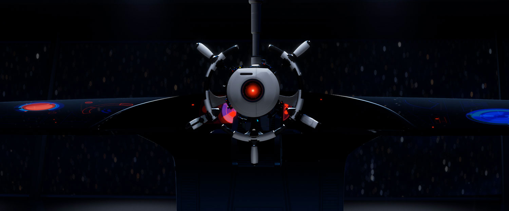
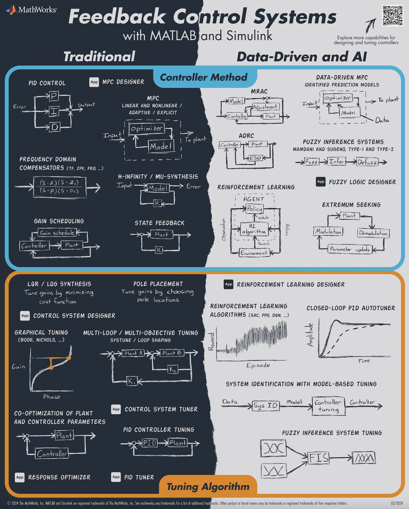

# Control

## Theory

### All of Control Theory

### Feedback Control System

### Resources

-   :material-hub-outline:{ .lg .middle } __Engineering Media 🏆__
  
    ---

    Owner: Brian Douglas

    [:octicons-arrow-right-24: <a href="https://engineeringmedia.com/" target="_blank"> Portal </a>](#)

-   :material-book:{ .lg .middle } __Fundamentals of Control Theory 🎯✅🏆__

    ---

    Author: Brian Douglas

    [:octicons-arrow-right-24: <a href="https://engineeringmedia.com/books" target="_blank"> Portal </a>](#)

-   :octicons-video-16:{ .lg .middle } __Control System Lectures 🎯🏆__
  
    ---

    Author: Brian Douglas

    [:octicons-arrow-right-24: <a href="https://engineeringmedia.com/videos" target="_blank"> Portal </a>](#)

