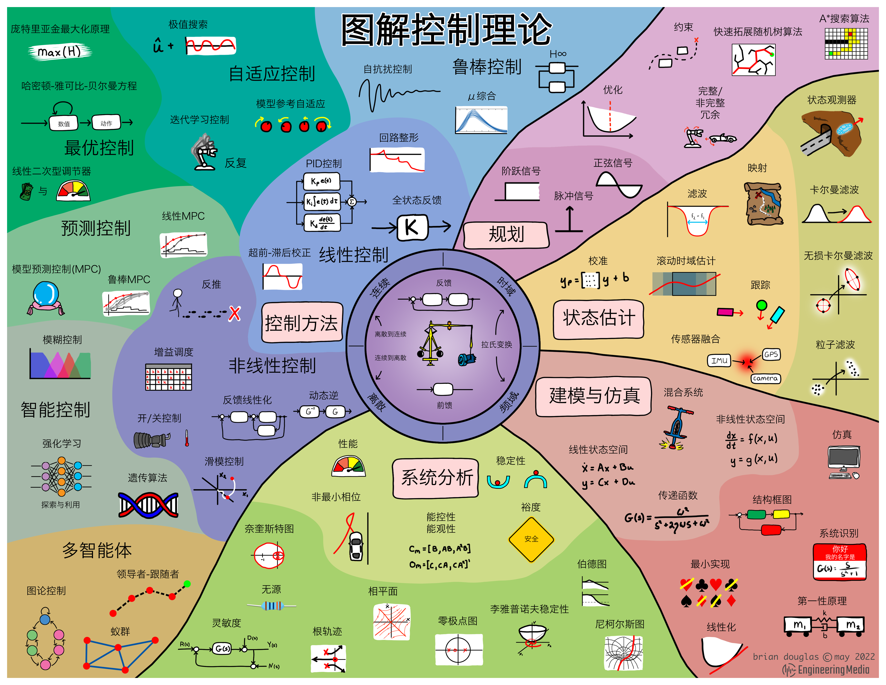

# 控制

## 理论

### 控制理论概览

### 反馈控制系统

### 资源

-   :material-hub-outline:{ .lg .middle } __工程资源库（Engineering Media）🏆__
  
    ---

    版权人: Brian Douglas

    [:octicons-arrow-right-24: <a href="https://engineeringmedia.com/" target="_blank"> 传送门 </a>](#)

-   :material-book:{ .lg .middle } __控制理论基础 🎯✅🏆__

    ---

    作者：Brian Douglas

    [:octicons-arrow-right-24: <a href="https://engineeringmedia.com/books" target="_blank"> 传送门 </a>](#)

-   :octicons-video-16:{ .lg .middle } __控制系统课程 🎯🏆__
  
    ---

    作者: Brian Douglas

    [:octicons-arrow-right-24: <a href="https://engineeringmedia.com/videos" target="_blank"> 传送门 </a>](#)

