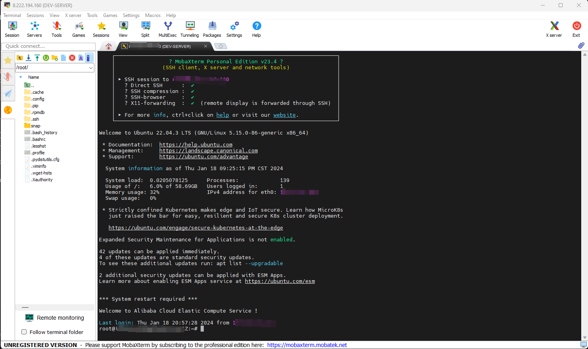

# How to Use RustDesk with Self-hosted Server

## Link

<div class="grid cards" markdown>

-   :material-remote-desktop:{ .lg .middle } __ RustDesk __

    ---

    A free and open-source remote desktop software, featuring support for self-hosted server.

    [:octicons-arrow-right-24: <a href="https://rustdesk.com/" target="_blank"> Portal </a>](#)

</div>

## What is RustDesk

RustDesk is a **free** and **open-source** remote desktop software. It is cross-platform and supports Windows, MacOS, and Linux. It is very easy to use and has a very friendly user interface. The most outstanding feature of RustDesk is that it supports **self-hosted server**. You can build your own server and use it to connect to your remote machine. This is very useful for those who want to control their remote machine but don't want to use public server.

## Client Installation and Use
The focus of this article is how to build your own server and use it to connect to your remote machine. Check the github link for client downloading and the official guide for installation and use.

<div class="grid cards" markdown>

-   :material-github:{ .lg .middle } __RustDesk Client__

    ---

    [:octicons-arrow-right-24: <a href="https://github.com/rustdesk/rustdesk/releases/tag/1.2.3" target="_blank"> Portal </a>](#)

-   :material-book:{ .lg .middle } __RustDesk Official Guide__

    ---

    [:octicons-arrow-right-24: <a href="https://rustdesk.com/docs/" target="_blank"> Portal </a>](#)

</div>

## Before We Start
I assume you have a cloud server running Linux. If you don't have one, you can follow the [this article](http://www.cuishuaiwen.com:8000/CLOUD/HANDS-ON/001-HAVE-A-SERVER/have-a-server/).

## References and Resources

<div class="grid cards" markdown>

-   :fontawesome-brands-bilibili:{ .lg .middle } __自建RustDesk远程桌面连接服务，私有化部署__

    ---

    In Chinese

    [:octicons-arrow-right-24: <a href="https://www.bilibili.com/video/BV148411i7DR/?spm_id_from=333.337.search-card.all.click&vd_source=5a427660f0337fedc22d4803661d493f" target="_blank"> Portal </a>](#)

-   :material-book:{ .lg .middle } __自建远程桌面连接服务，RustDesk搭建教程__

    ---

    In Chinese

    [:octicons-arrow-right-24: <a href="https://www.mintimate.cn/2023/08/27/guideToHostRustDesk/" target="_blank"> Portal </a>](#)

</div>

## Start of Our Journey
We start from Here!

## Connect to Your Server via SSH

In my case I use [MobaXterm](https://mobaxterm.mobatek.net/) to connect to my server via SSH. You can use any SSH client you like, for example, Termius, PuTTY, etc.



## Make a Directory for RustDesk

For my case, I made a directory called `RUSTDESK-Sever` in root directory `/`. To do that, run the following command:

```bash
cd /
```

then

```bash
sudo mkdir RUSTDESK-Server
```

and then go to the directory:

```bash
cd RUSTDESK-Server
```

## Download RustDesk Server


Go to the [🌐 RustDesk Server Release Page](https://github.com/rustdesk/rustdesk-server/releases) and pick the corresponding version for your server. For my case, I picked `rustdesk-server-linux-amd64.zip` and downloaded it to my server.

Right click on the downloaded file and copy the link address. Then run the following command to download it to your server:

```bash
wget <link for the downloaded file>
```

In my case, I ran the following command:

```bash
wget https://github.com/rustdesk/rustdesk-server/releases/download/1.1.9/rustdesk-server-linux-amd64fb.zip
```
Then we need to unzip the file. If you don't have unzip installed, run the following command to install it:

```bash
sudo apt-get install unzip
```

Then run the following command to unzip the file:

```bash
unzip rustdesk-server-linux-amd64.zip
```

After unzipping the file, you will see a folder called `amd64`. For convenience, lets rename it to `RustDesk`:

```bash
mv amd64 RustDesk
```
Then go to the folder:

```bash
cd RustDesk
```

## Try to Run RustDesk Server with Screen

### What is Screen
Screen is a terminal multiplexer. It allows you to run multiple terminal sessions inside one terminal window. It is very useful when you want to run a program in the background and don't want to keep the terminal window open. You can just detach the screen and close the terminal window. The program will keep running in the background. You can also reattach the screen and check the program's output.

### Install Screen

```bash
sudo apt-get install screen
```

### Check the Contents of the Folder with 'tree'

First, we need to install `tree`:

```bash
sudo apt-get install tree
```

Then run the following command to check the contents of the folder:

```bash
sudo tree
```

You will see the following output:

```bash
RustDesk
├── hbbr
├── hbbs
└── rustdesk-utils
```

!!! info
    - `hbbr` is the for relay server.
    - `hbbs` is the for ID server.
    - `rustdesk-utils` is a utility program.

### Run Screen and RustDesk Server

Now, we can use two Screens to run RustDesk hbbr and hbbs. First, run the following command to create a new Screen:

```bash
screen -R hbbr
```

Then run the following command to start RustDesk hbbr:

```bash
./hbbr
```

Then you will see some printouts on the screen if this step is successful. Then press `Ctrl + A + D` to detach the screen. Then run the following command to create a new Screen:

```bash
screen -R hbbs
```

Then run the following command to start RustDesk hbbs:

```bash
./hbbs
```

Then you will see some printouts on the screen if this step is successful. Then press `Ctrl + A + D` to detach the screen. Then run the following command to check the running screens:

```bash
screen -ls
```

You will see something like:

```bash
There are screens on:
        12345.hbbs      (Detached)
        12345.hbbr      (Detached)
2 Sockets in /run/screen/S-root.
```

### Copy the Public Key for Client Configuration

Now we can check the contents with `tree` again:

```bash
sudo tree
```

You will see the following output:

```bash
.
├── RustDesk
│   ├── db_v2.sqlite3
│   ├── db_v2.sqlite3-shm
│   ├── db_v2.sqlite3-wal
│   ├── hbbr
│   ├── hbbs
│   ├── id_ed25519
│   ├── id_ed25519.pub
│   └── rustdesk-utils
└── rustdesk-server-linux-amd64.zip

```

The key is in `id_ed25519.pub`. Run the following command to print the key:

```bash
cat id_ed25519.pub
```

or the command below:

```bash
more id_ed25519.pub
```

Copy the key and save it somewhere. We will use it later.

### Firewall Configuration
In your cloud server backend, you need to open the following ports:
- 21115 for TCP
- 21116 for TCP & UDP
- 21117 for TCP
- 21118 for TCP
- 21119 for TCP

If necessary, you also need to open the above ports in your OS firewall. (try first without this step)

### Clients Configuration and Connection

Ingredients for client configuration:
- Server IP address
- Public key

I assume you have installed RustDesk client on your local machine. If you haven't, please check the [official guide](https://rustdesk.com/docs/) for installation and use.

Open RustDesk client and find the ID of your computer in the column on the lefthand side. Then click the three dots button and then select the `Network` tab. 

- For `ID Server`, input the IP address of your server. This is for hbbs.
- For `Relay Server`, also input the IP address of your server. This is for hbbr.
- For `API Server`, you can keep it blank.
- For `Key`, input the public key you copied from your server.

The above procedures are same for both the PC to control and the PC to be controlled.

On the PC to start the connection, input the ID of the PC to be controlled and click `Connect`. Then you will see a window pop up. Input the password of the PC to be controlled and click `OK`. Then you will see the desktop of the PC to be controlled.

So far, we have successfully connected to the PC to be controlled. But we still need to do some configuration to make this process more elegant.

### Run RustDesk Server as a Service

The reason why we need to do this step is that we don't want to run RustDesk Server manually every time we restart our server. We want it to run automatically when the server starts.

There are two ways to do this:
1. Use pm2
2. Use systemd

#### Use pm2

This is the way recommended by the official guide. But I did not try this myself. Here are the steps you can follow:

First, you need to install nodejs and npm:

```bash
sudo apt-get install nodejs
```

Then install pm2:

```bash
sudo npm install pm2 -g
```

Then run the following command to start RustDesk Server:

```bash
# cd to the directory where you put RustDesk Server
pm2 start hbbr
pm2 start hbbs
```

Then run the following command to make pm2 run as a service:

```bash
pm2 startup
```

#### Use systemd

This is the way I tried myself. We need to create two service files for hbbr and hbbs respectively.

> For hbbs

First, create a file called `RustDeskHbbs.service` in `/usr/lib/systemd/system/`:

```bash
sudo vim /usr/lib/systemd/system/RustDeskHbbs.service
```

Then copy the following content to the file:

!!! note
    Do modify the contents in `<...>` according to your own situation.

```bash
[Unit]
Description=RustDesk Hbbs
After=network.target

[Service]
User=<your user name>
Type=simple
WorkingDirectory=<directory where you put RustDesk Server>
ExecStart=<directory where you put RustDesk Server>/hbbs
ExecStop=/bin/kill -TERM $MAINPID

[Install]
WantedBy=multi-user.target
```

> For hbbr

First, create a file called `RustDeskHbbr.service` in `/usr/lib/systemd/system/`:

```bash
sudo vim /usr/lib/systemd/system/RustDeskHbbr.service
```

Then copy the following content to the file:

!!! note
    Do modify the contents in `<...>` according to your own situation.

```bash
[Unit]
Description=RustDesk Hbbr
After=network.target

[Service]
User=<your user name>
Type=simple
WorkingDirectory=<directory where you put RustDesk Server>
ExecStart=<directory where you put RustDesk Server>/hbbr
ExecStop=/bin/kill -TERM $MAINPID

[Install]
WantedBy=multi-user.target
```

Then run the following command to start RustDesk Server:

```bash
sudo systemctl start RustDeskHbbs
sudo systemctl start RustDeskHbbr
```

or reload the systemd configuration:

```bash
sudo systemctl daemon-reload
```


### Enable Force Encryption

You can modify the service file to enable force encryption.

> For hbbs
reopen the service file:

```bash
sudo vim /usr/lib/systemd/system/RustDeskHbbs.service
```

Then modify the `ExecStart` line to:

```bash
[Unit]
Description=RustDesk Hbbs
After=network.target

[Service]
User=<your user name>
Type=simple
WorkingDirectory=<directory where you put RustDesk Server>
ExecStart=<directory where you put RustDesk Server>/hbbs -k _
ExecStop=/bin/kill -TERM $MAINPID

[Install]
WantedBy=multi-user.target
```

> For hbbr
reopen the service file:

```bash
sudo vim /usr/lib/systemd/system/RustDeskHbbr.service
```

Then modify the `ExecStart` line to:

```bash
[Unit]
Description=RustDesk Hbbr
After=network.target

[Service]
User=<your user name>
Type=simple
WorkingDirectory=<directory where you put RustDesk Server>
ExecStart=<directory where you put RustDesk Server>/hbbr -k _
ExecStop=/bin/kill -TERM $MAINPID

[Install]
WantedBy=multi-user.target
```

The End.