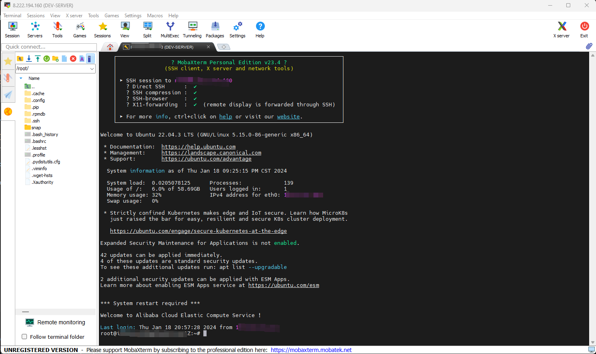
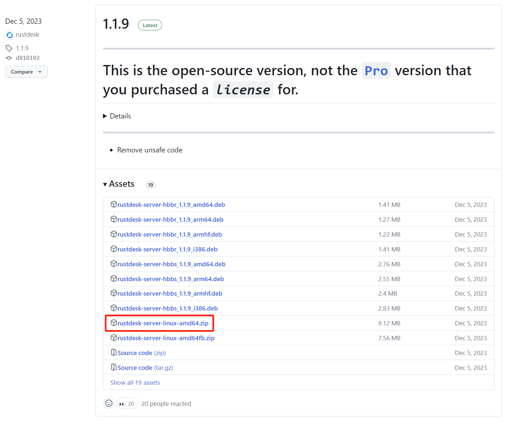

# 如何自建服务器使用RustDesk

## 链接

<div class="grid cards" markdown>

-   :material-remote-desktop:{ .lg .middle } __RustDesk__

    ---

    一款免费开源的远程桌面软件，支持自建服务器。

    [:octicons-arrow-right-24: <a href="https://rustdesk.com/" target="_blank"> 传送门 </a>](#)

</div>

## 什么是RustDesk

RustDesk是一款 **免费开源** 的远程桌面软件。它跨平台，支持Windows、MacOS和Linux。它非常容易使用，界面友好。其最大的特点是 **支持自建服务器** 。您可以构建自己的服务器并使用它来连接远程计算机。这对于那些想要控制远程计算机但又不想使用公共服务器的人来说非常有用。

## 客户端安装和使用

本文的重点是如何构建自己的服务器并使用它来连接远程计算机。客户端下载请参考github链接，安装和使用请参考官方指南。

<div class="grid cards" markdown>

-   :material-github:{ .lg .middle } __RustDesk 客户端__

    ---

    [:octicons-arrow-right-24: <a href="https://github.com/rustdesk/rustdesk/releases/tag/1.2.3" target="_blank"> 传送门 </a>](#)

-   :material-book:{ .lg .middle } __RustDesk 官方指南__

    ---

    [:octicons-arrow-right-24: <a href="https://rustdesk.com/docs/" target="_blank"> 传送门 </a>](#)

</div>


## 开始之前
假定您有一台运行Linux的云服务器。如果您没有，请参考[这篇文章](http://www.cuishuaiwen.com:8000/zh/CLOUD/HANDS-ON/001-HAVE-A-SERVER/have-a-server/)。

## 本教程参考资料

<div class="grid cards" markdown>

-   :fontawesome-brands-bilibili:{ .lg .middle } __自建RustDesk远程桌面连接服务，私有化部署__

    ---

    [:octicons-arrow-right-24: <a href="https://www.bilibili.com/video/BV148411i7DR/?spm_id_from=333.337.search-card.all.click&vd_source=5a427660f0337fedc22d4803661d493f" target="_blank"> 传送门 </a>](#)

-   :material-book:{ .lg .middle } __自建远程桌面连接服务，RustDesk搭建教程__

    ---

    [:octicons-arrow-right-24: <a href="https://www.mintimate.cn/2023/08/27/guideToHostRustDesk/" target="_blank"> 传送门 </a>](#)

</div>

## 教程开始
我们的教程从这里开始。

## 通过SSH连接到远程计算机

我使用[MobaXterm](https://mobaxterm.mobatek.net/)通过SSH连接我的云服务器。您可以使用任何您喜欢的SSH客户端，例如Termius、PuTTY等。



## 为RustDesk创建一个目录

对于我的情况，我在根目录`/`下创建了一个名为`RUSTDESK-Sever`的目录。要做到这一点，请运行以下命令：

```bash
cd /
```

然后

```bash
mkdir RUSTDESK-Sever
```

然后进入到这个目录

```bash
cd RUSTDESK-Sever
```

## 下载RustDesk服务器



前往[🌐 RustDesk Server 发布页面](https://github.com/rustdesk/rustdesk-server/releases) 选择合适的版本下载。我选择的是`rustdesk-server-linux-amd64.zip`。

右键单击要下载的文件，然后选择`复制链接地址`。然后运行以下语句：

```bash
wget <下载链接>
```

我个人的例子：

```bash
wget https://github.com/rustdesk/rustdesk-server/releases/download/1.1.9/rustdesk-server-linux-amd64fb.zip
```

然后我们需要解压缩这个文件，如果你没有安装unzip，请先安装unzip：

```bash
sudo apt-get install unzip
```

然后运行以下语句：

```bash
unzip rustdesk-server-linux-amd64.zip
```

解压之后，你会看到一个名为`amd64`的文件夹。为了方便，我们给它改个名字：

```bash
mv amd64 RustDesk
```

进入到这个文件夹：

```bash
cd RustDesk
```

## 使用Screen运行RustDesk服务器

### 什么是Screen
Screen是一个可以在远程计算机上运行的终端复用程序。它允许您在远程计算机上运行多个终端会话，并在断开SSH连接后继续运行这些会话。这对于在远程计算机上运行长时间运行的程序非常有用。

### 安装Screen

```bash
sudo apt-get install screen
```

### 使用tree查看文件夹内容和结构
首先，我们需要安装tree：

```bash
sudo apt-get install tree
```

然后，我们可以使用tree查看文件夹内容和结构：

```bash
sudo tree
```

然后你会看到这样的结果：

```bash
RustDesk
├── hbbr
├── hbbs
└── rustdesk-utils
```

!!! info
    - `hbbr`是中继服务器
    - `hbbs`是信令服务器
    - `rustdesk-utils`是RustDesk服务器的工具

### 运行Screen以及RustDesk服务器

现在，我们可以运行两个Screen会话，一个用于中继服务器，另一个用于信令服务器。

```bash
screen -R hbbr
```

然后，我们使用以下命令运行中继服务器：

```bash
./hbbr
```

然后我们可以看到一些输出，意味着中继服务器正在运行。然后按下`Ctrl+A`，然后按下`D`，以断开Screen会话。

然后，我们可以运行另一个Screen会话，用于信令服务器。

```bash
screen -R hbbs
```

然后，我们使用以下命令运行注册服务器：

```bash
./hbbs
```

然后看，我们可以看到一些输出，意味着信令服务器正在运行。然后按下`Ctrl+A`，然后按下`D`，以断开Screen会话。

我们可以查看Screen会话的状态：

```bash
screen -ls
```

然后你会看到类似这样的结果：

```bash
There are screens on:
        12345.hbbs      (Detached)
        12345.hbbr      (Detached)
2 Sockets in /run/screen/S-root.
```

### 复制公钥用于客户端配置

现在我们可以查看内容，使用`tree`：

```bash
sudo tree
```

然后你会看到类似这样的结果：

```bash
.
├── RustDesk
│   ├── db_v2.sqlite3
│   ├── db_v2.sqlite3-shm
│   ├── db_v2.sqlite3-wal
│   ├── hbbr
│   ├── hbbs
│   ├── id_ed25519
│   ├── id_ed25519.pub
│   └── rustdesk-utils
└── rustdesk-server-linux-amd64.zip

```
公钥文件是`id_ed25519.pub`。我们可以使用以下命令查看公钥文件的内容：

```bash
cat id_ed25519.pub
```
或者

```bash
more id_ed25519.pub
```

复制公钥文件的内容，我们将在客户端配置中使用它。

### 防火墙配置

在你的云服务提供商的控制面板中，打开防火墙配置，放行以下端口：
- 21115 for TCP
- 21116 for TCP & UDP
- 21117 for TCP
- 21118 for TCP
- 21119 for TCP

必要的话，还要在你的云服务器操作系统中放行以上端口。

### 客户端配置

需要准备的信息：
- 服务器IP地址
- 服务器公钥

假设你已经安装好了RustDesk客户端。如果没有，请参考[官方文档](https://rustdesk.com/docs/)。

打开RustDesk客户端，在左侧电脑ID一项最右边的三个点，点击它，选择网络设置。

- ID服务器地址：<你的服务器IP>
- 中继服务器地址：<你的服务器IP>
- API服务器地址：可以留空
- 秘钥：粘贴你的服务器公钥

以上的过程在主控端和被控端都要进行。

在主控端，输入被控端的ID，点击连接，然后输入被控端的密码，点击确定，就可以连接到被控端了。

到目前位置，我们已经实现了自建服务器使用RustDesk的目标。但是目前的配置还不够优雅，我们还需要做一些额外的配置。

### 将运行RustDesk服务器配置为系统服务

我们这样做的原因在于，我们不想每次重启服务器时都要手动运行RustDesk服务器。

有两种方式可以实现这一目标：
1. 使用pm2
2. 使用systemd

#### 使用pm2

我个人没有使用pm2，但是如果你想使用pm2，可以参考以下步骤：

首先安装nodejs 和 npm：

```bash
sudo apt-get install nodejs npm
```

然后安装pm2：

```bash
sudo npm install pm2 -g
```

然后运行以下命令启动RustDesk服务器：

```bash
pm2 start hbbr
pm2 start hbbs
```

然后运行以下命令将pm2配置为系统服务：

```bash
pm2 startup
```

#### 使用systemd

我个人使用systemd，如果你想使用systemd，可以参考以下步骤：

> hbbs

首先，我们需要创建一个名为`RustDeskHbbs.service`的文件，位于`/usr/lib/systemd/system/`目录下：

```bash
sudo vim /usr/lib/systemd/system/RustDeskHbbs.service
```

然后把以下信息复制到这个文件中：

!!! note
    `<...>` 中的内容请根据你个人情况进行修改。

```bash
[Unit]
Description=RustDesk Hbbs
After=network.target

[Service]
User=<your user name>
Type=simple
WorkingDirectory=<directory where you put RustDesk Server>
ExecStart=<directory where you put RustDesk Server>/hbbs
ExecStop=/bin/kill -TERM $MAINPID

[Install]
WantedBy=multi-user.target
```

> hbbr

首先，我们需要创建一个名为`RustDeskHbbr.service`的文件，位于`/usr/lib/systemd/system/`目录下：

```bash
sudo vim /usr/lib/systemd/system/RustDeskHbbr.service
```

然后把以下信息复制到这个文件中：

!!! note
    `<...>` 中的内容请根据你个人情况进行修改。

```bash
[Unit]
Description=RustDesk Hbbr
After=network.target

[Service]
User=<your user name>
Type=simple
WorkingDirectory=<directory where you put RustDesk Server>
ExecStart=<directory where you put RustDesk Server>/hbbr
ExecStop=/bin/kill -TERM $MAINPID

[Install]
WantedBy=multi-user.target
```

然后运行以下命令启动RustDesk服务器：

```bash
sudo systemctl start RustDeskHbbs
sudo systemctl start RustDeskHbbr
```

或者重载systemd配置：

```bash
sudo systemctl daemon-reload
```

### 启用强制加密

> hbbs
重新打开`/usr/lib/systemd/system/RustDeskHbbs.service`，修改以下内容ExecStart所在行：

```bash
sudo vim /usr/lib/systemd/system/RustDeskHbbr.service
```

```bash
[Unit]
Description=RustDesk Hbbs
After=network.target

[Service]
User=<your user name>
Type=simple
WorkingDirectory=<directory where you put RustDesk Server>
ExecStart=<directory where you put RustDesk Server>/hbbs -k _
ExecStop=/bin/kill -TERM $MAINPID

[Install]
WantedBy=multi-user.target
```

> hbbr

重新打开`/usr/lib/systemd/system/RustDeskHbbr.service`，修改以下内容ExecStart所在行：

```bash
sudo vim /usr/lib/systemd/system/RustDeskHbbr.service
```

```bash
[Unit]
Description=RustDesk Hbbr
After=network.target

[Service]
User=<your user name>
Type=simple
WorkingDirectory=<directory where you put RustDesk Server>
ExecStart=<directory where you put RustDesk Server>/hbbr -k _
ExecStop=/bin/kill -TERM $MAINPID

[Install]
WantedBy=multi-user.target
```

到此结束。