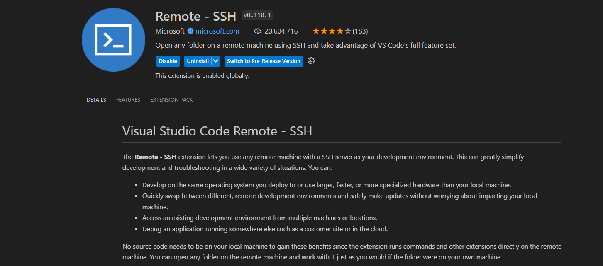
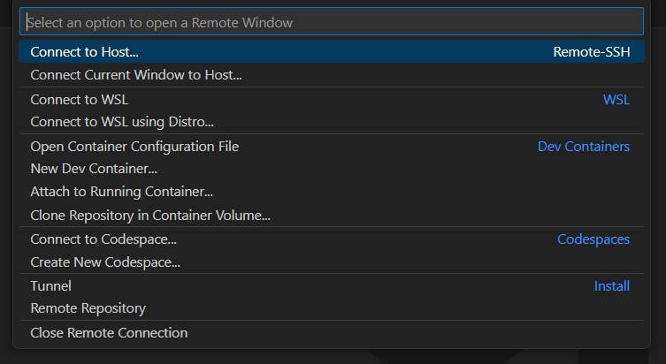

# VSCODE REMOTE SSH

!!! note
    Have you ever encountered a situation where you want to send local files to a remote server, but always have to edit the files locally and then transfer them to the remote server via ssh or other means, which is very cumbersome? The VSCode Remote SSH plugin can help you solve this problem. It allows you to edit files on the remote server directly on your local machine, and also supports debugging.

## Steps
1. Search for the Remote - SSH plugin in VSCode and install it.

2. After installation, click the  icon in the lower left corner and select `Remote-SSH: Connect to Host...`.

1. Add a new SSH host.
2. Enter the IP address of the remote server.
3. Select the configuration file address. If you don't know, choose the default configuration, which is the first one.
4. In the pop-up box in the lower right corner, select `Connect`.
5. Select the operating system category LINUX/WINDOWS/MACOS.
6. Input the password of the remote host, wait for the connection to be established, and then a new window will pop up for user operation.