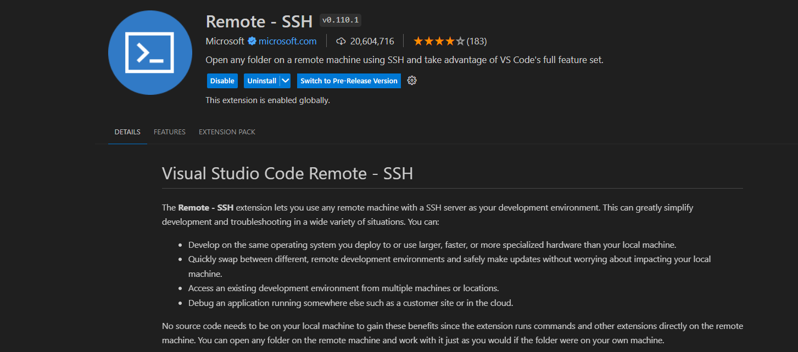
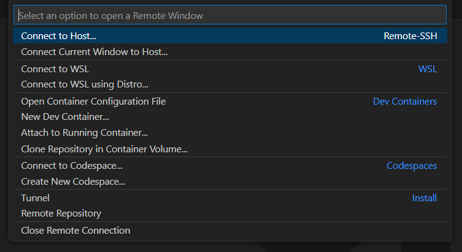

# VSCODE 远程 SSH
!!! note
    你是否遇到过这种状况，想要把本地文件发送到远程服务器，总是先在本地把文件编辑好再通过ssh等方式传送到远程服务器，这样的操作很繁琐。VSCode Remote SSH 插件可以帮助你解决这个问题，它可以让你直接在本地编辑远程服务器上的文件，而且还支持调试功能。

## 使用步骤
1. 在 VSCode 中搜索 Remote - SSH 插件并安装。

2. 安装完成后，点击左下角的  图标，选择 `Remote-SSH: Connect to Host...`。

3. 添加新的 SSH 主机
4. 输入远程服务器的 IP 地址
5. 选择配置文件地址，不知道的话选择默认配置，即第一个
6. 右下角弹框内选择连接`Connect`
7. 选择操作系统类别LINUX/WINDOWS/MACOS
8. 输入远程服务器密码，等待建立连接然后会弹出一个新的窗口供用户操作。
