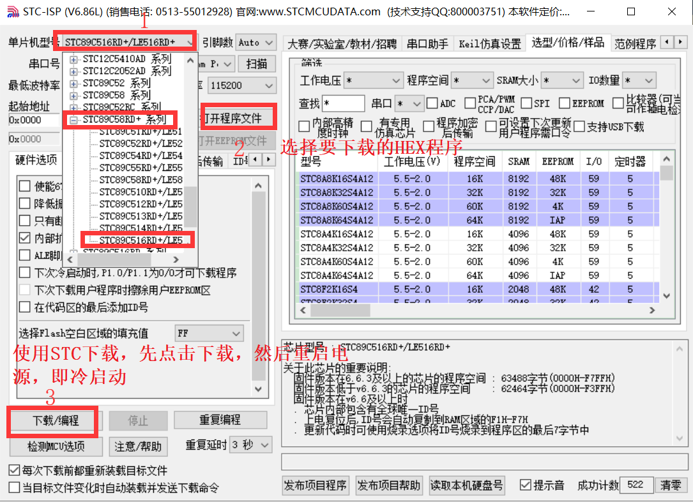

# CH01 - Preliminary

This series records my learning process of the 51 series video on Bilibili - Jiangxi Science and Technology College Embedded System Basic Course

-   :fontawesome-brands-bilibili:{ .lg .middle } __江科大51 🎯🏆🏆🏆__

    ---

    A Bilibili channel about embedded systems and programming， beginner-friendly, I strongly recommend it!

    [:octicons-arrow-right-24: <a href="https://www.bilibili.com/video/BV1Mb411e7re/?spm_id_from=333.999.0.0&vd_source=5a427660f0337fedc22d4803661d493f" target="_blank"> Portal </a>](#)

## Development Tools

### Development Board
Puzhong 51 single-chip development board - STC89C516RD+

### KEIL C51
For programming and debugging, you can download the installation package from the official website, and seek a crack method from Taobao for installation.

### STC-ISP
For flashing programs, you can download the installation package from the official website for installation.

## Programming Method
1. Open KEIL C51
2. Select Project -> New uVision Project
3. Select the project path, enter the project name, and click Save
4. Select the chip model and click OK - ATMEL -> AT89C52
5. Select Target -> Options for Target
6. Select C51 -> Output -> Select Hex, click OK
7. Select File -> New -> New File
8. Select C File, enter the file name, and click Save
9. Enter the code and click Save
10. Select Project -> Build Target
11. Open STC-ISP
12. Select the chip model and click OK
13. Select the file and click OK
14. Click Start programming, then reset the single-chip microcomputer (turn off and then turn on the power)

