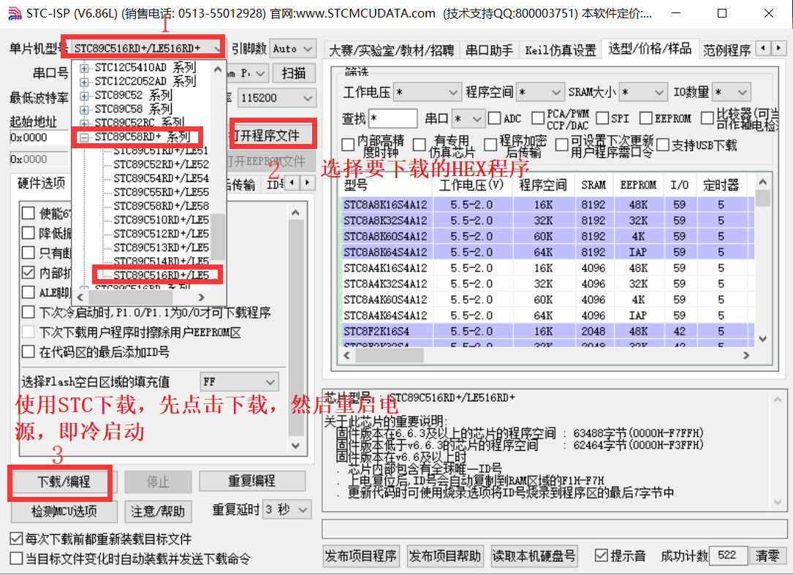

# CH01 - 准备工作

本系列记录本人学习b站江科大51系列视频 - 江科大嵌入式系统基础课程

-   :fontawesome-brands-bilibili:{ .lg .middle } __江科大51 🎯🏆🏆🏆__

    ---

    保姆级教学, 讲解非常细致，小白极度友好，强烈强烈强烈推荐。

    注意：本教程采用基于寄存器的编程方式，不使用库函数。

    [:octicons-arrow-right-24: <a href="https://www.bilibili.com/video/BV1Mb411e7re/?spm_id_from=333.999.0.0&vd_source=5a427660f0337fedc22d4803661d493f" target="_blank"> 传送门 </a>](#)

## 开发工具

### 开发板
普中51单片机开发板 - STC89C516RD+

### KEIL C51
用于编程和调试, 可以从官网下载安装包，从淘宝寻求破解方式进行安装。

### STC-ISP
用于烧录程序, 可以从官网下载安装包进行安装。

## 编程方法
1. 打开KEIL C51
2. 选择Project -> New uVision Project
3. 选择工程路径，输入工程名，点击Save
4. 选择芯片型号，点击OK - ATMEL -> AT89C52
5. 选择Target -> Options for Target
6. 选择C51 -> Output -> 选择Hex，点击OK
7. 选择File -> New -> New File
8. 选择C File，输入文件名，点击Save
9. 输入代码，点击保存
10. 选择Project -> Build Target
11. 打开STC-ISP
12. 选择芯片型号，点击确定
13. 选择文件，点击确定
14. 点击开始烧录，然后复位单片机（关闭再打开电源）

