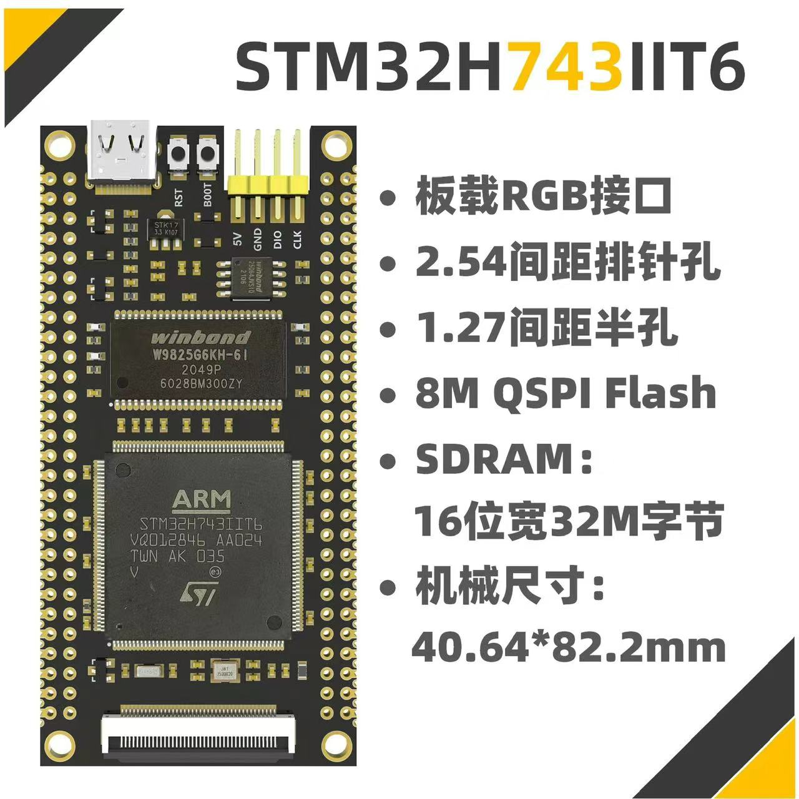

# MCU 开发硬件

## STM32

### 洋桃 STM32F103 开发板

### 洋桃 STM32F407 开发板

### 小熊派 STM32L431RCT6 开发板

-   :material-book:{ .lg .middle } __小熊派物联网开发板🏆__

    ---

    [:octicons-arrow-right-24: <a href="https://www.bearpi.cn/dev_board/bearpi/iot/std/" target="_blank"> Portal </a>](#)

-   :material-book:{ .lg .middle } __小熊派物联网开发板BILIBILI🏆__

    ---

    [:octicons-arrow-right-24: <a href="https://www.bilibili.com/video/BV1S5411x71A/?p=1" target="_blank"> Portal </a>](#)

### 野火 - STM32H743IIT6 挑战者

### 正点原子 - STM32H743IIT6 APPOLO 开发板

<!-- ### 反客 STM32H723 开发板 -->

### 反客 STM32H743IIT 开发板

-   :material-book:{ .lg .middle } __反客STM32H743IIT🏆__

    ---

    [:octicons-arrow-right-24: <a href="https://world.taobao.com/item/654531454761.htm?spm=a21wu.11804641-tw.shop-content.20.19eb12e9eETcJJ" target="_blank"> Portal </a>](#)

<!-- ### 极客STM32H743IIT6开发板 -->

### 安富莱 V7 开发板

-   :material-book:{ .lg .middle } __ARMFLY 官方🏆__

    ---

    [:octicons-arrow-right-24: <a href="https://www.anfulai.cn/index.shtml" target="_blank"> Portal </a>](#)

-   :material-book:{ .lg .middle } __ARMFLY 论坛🏆__

    ---

    [:octicons-arrow-right-24: <a href="https://www.armbbs.cn/" target="_blank"> Portal </a>](#)

#### 安富莱技术资料

- [x] 01-安富莱_STM32-V7开发板_硬件参考手册（V1.0）.pdf
- [ ] 02-安富莱_STM32-V7开发板_用户手册，含BSP驱动包设计（V3.5）.pdf [1-20,87,88]
- [ ] 03-安富莱_STM32-V7开发板_第2版DSP数字信号处理教程（V2.7）.pdf