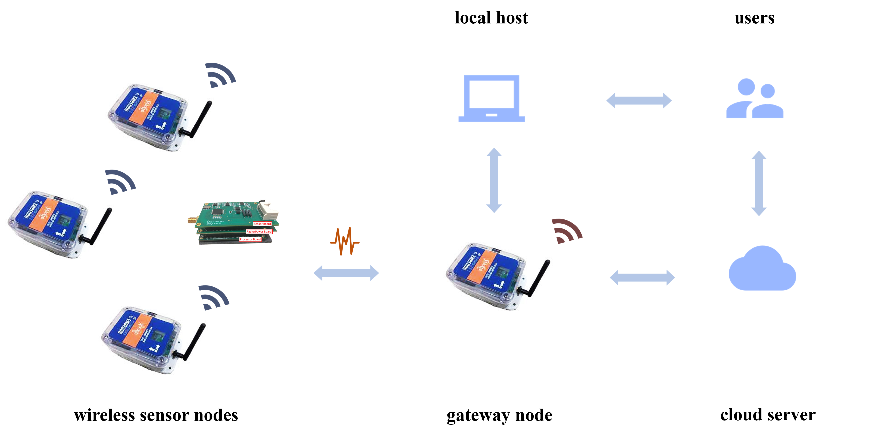

# Xnode 文档

## Xnode

Xnode 智能传感器被设计为高保真分布式传感的下一代解决方案。这种模块化多功能传感器平台可实现数据密集型应用（高分辨率、高采样率）的无线数据采集和处理，例如结构健康监测、制造和工业设备监测以及地震传感。在实践中，Xnode通常以无线传感器网络（WSN）的形式使用，通常是1个网关节点和多个传感器节点。每个传感器节点有 8 个可用通道用于数据收集，其中前 3 个通道通常用于加速度测量。原始数据和本地处理的数据由网关节点收集，然后通过蜂窝通信发送回云服务器以供应用使用。

## 官方网站

-   :material-web:{ .lg .middle } __Embedor Tech__

    ---

    [:octicons-arrow-right-24: <a href="https://embedor.tech/" target="_blank"> Portal </a>](#)

## 宣传册
<iframe src="http://www.cuishuaiwen.com:7500/DEV/XNODE/XNODE-DOCS/Xnode_Brochure.pdf" width="100%" height="1000px"></iframe>

## 快速入门指南
<iframe src="http://www.cuishuaiwen.com:7500/DEV/XNODE/XNODE-DOCS/Xnode_Quickstart_Guide.pdf" width="100%" height="1000px"></iframe>

## 开发工具链
- VSCode - 编辑. 串口调试
- Keil MDK-ARM Version 4 - 构建，调试，烧录
- JLINK/STLINK - 烧录
- Tera Term - 串口调试