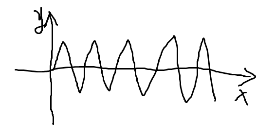
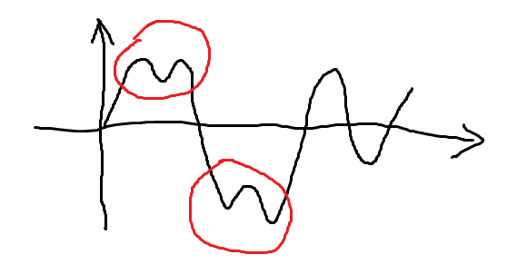
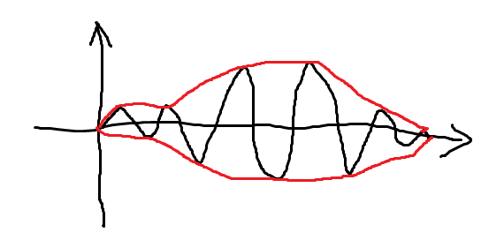
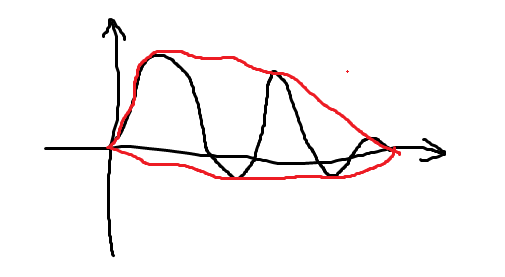
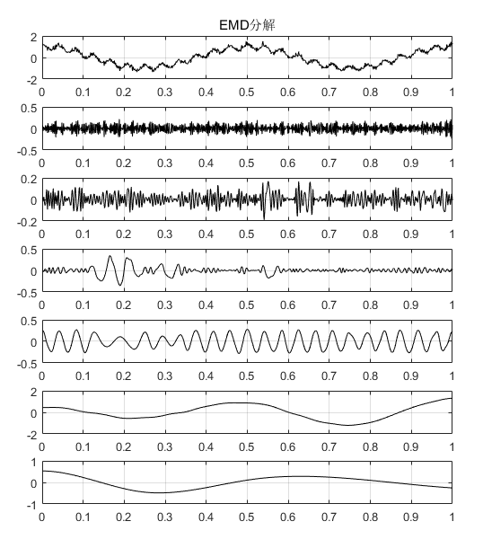
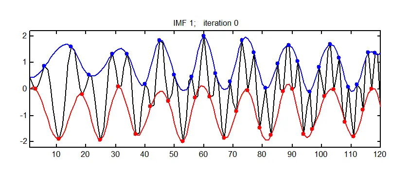
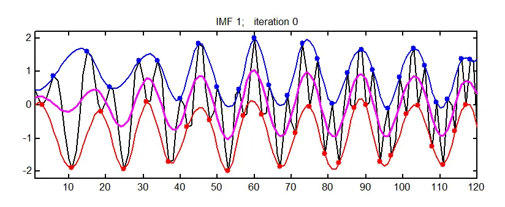
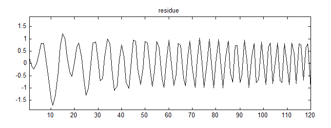
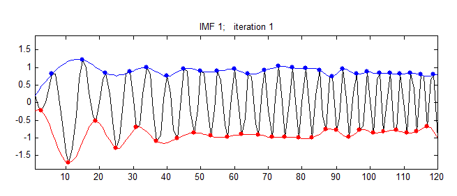
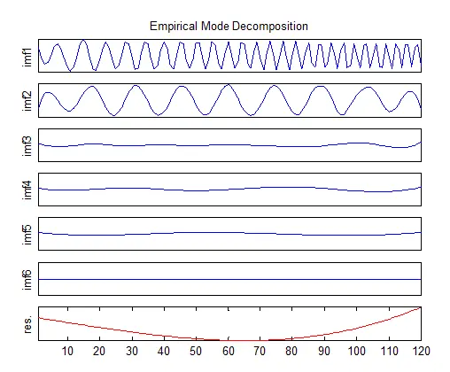

# 这篇文章能让你明白经验模态分解（EMD）——基础理论篇

!!! info
    原文地址：[🔗 专栏：信号处理有关的那些东东](https://zhuanlan.zhihu.com/p/138141521)

    本文为学习笔记。

## 1. 为什么要用EMD
在信号处理方面我们了解了时域处理方法（如有效值、峭度）、频域处理方法（如频谱、功率谱）以及一些时频域处理方法（如小波分析）（详见专栏文章与信号处理有关的那些东东）。时域和频域有各种的优势和适用范围，就不多说了，EMD（Empirical Mode Decomposition）作为时频域的处理方法，相对于同样是时频域方法的小波分析有什么好处呢？

EMD最显著的特点，就是其**克服了基函数无自适应性的问题**。啥意思呢？回忆小波分析部分的内容，我们会知道小波分析是需要选定某一个**小波基**的，小波基的选择对整个小波分析的结果影响很大，一旦确定了小波基，在整个分析过程中将无法更换，即使该小波基在全局可能是最佳的，但在某些局部可能并不是，所以**小波分析的基函数缺乏适应性**。

通俗的说，用EMD有什么好处呢？**对于一段未知信号，不需要做预先分析与研究，就可以直接开始分解。**这个方法会自动按照一些固模式按层次分好，而不需要人为设置和干预。

!!! note
    通俗一点，EMD就像一台机器，把一堆混在一起的硬币扔进去，他会自动按照1元、5毛、1毛、5分、1分地分成几份。

## 2. 内涵模态分量

内涵模态分量（Intrinsic Mode Functions, IMF）就是原始信号被EMD分解之后得到的各层信号分量。EMD的提出人黄锷认为，任何信号都可以拆分成若干个内涵模态分量之和。而**内涵模态分量**有两个**约束条件**：

- 1）在整个数据段内，极值点的个数和过零点的个数必须相等或相差最多不能超过一个。

- 2）在任意时刻，由局部极大值点形成的上包络线和由局部极小值点形成的下包络线的平均值为零，即上、下包络线相对于时间轴局部对称。

啥意思？

用不严谨的语言和灵魂画师来解释一下：

1）图线要反复跨越x轴，像这样：

而不能像这样某次穿过零点后出现多个极点：

2）包络线要对称，像这样：

而不能像这样：

洗洗眼睛，看个正常点的例子吧：

上图由7张图片组成，其中第1张为原始信号，后边依次为EMD分解之后得到的6个分量，分别叫做IMF1~IMF5，最后一张图为残差，每一个IMF分量代表了原始信号中存在的一种内涵模态分量。可以看出，每个IMF分量都是满足这两个约束条件的。

## 3. EMD分解步骤

EMD的分解过程是简单直观的：

1）根据原始信号上下极值点，分别画出上、下包络线。

2）求上、下包络线的均值，画出均值包络线。

3）原始信号减均值包络线，得到中间信号。

4）判断该中间信号是否满足IMF的两个条件，如果满足，该信号就是一个IMF分量；如果不是，以该信号为基础，重新做1）~4）的分析。IMF分量的获取通常需要若干次的迭代。

使用上述方法得到第一个IMF后，用原始信号减IMF1，作为新的原始信号，再通过1）~4）的分析，可以得到IMF2，以此类推，完成EMD分解。

