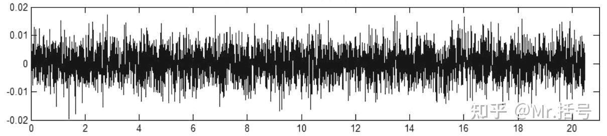
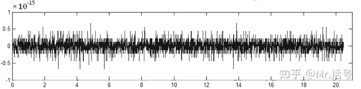
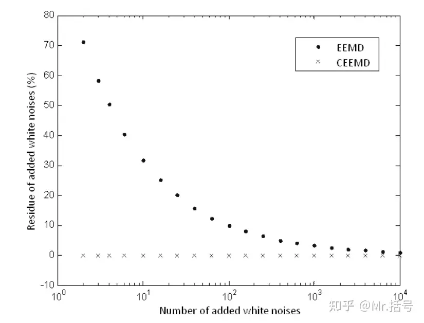

# 类EMD的“信号分解方法”及MATLAB实现（第二篇）—— CEEMD (COMPLEMENTARY ENSEMBLE EMPIRICAL MODE DECOMPOSITION)
!!! info
    原文地址：[🔗 专栏：信号处理有关的那些东东](https://zhuanlan.zhihu.com/p/138141521)

    本文为学习笔记。

## CEEMD（互补集合经验模态分解）的概念
上一篇我们介绍了EMD的一种最常见的衍生方法EEMD，这次要讲到的CEEMD（Complementary Ensemble Empirical Mode Decomposition，互补集合经验模态分解）是从EEMD方法进一步优化而来的，既然是优化那就必有所针对，CEEMD针对的就是EEMD的“**残余辅助噪声**”。

为什么会有残余辅助噪声呢？因为EEMD的前提是认为“多组白噪声的叠加近似等于0”。然而当处理的次数不够多的时候，白噪声往往不能被降低到忽略不计的程度。

反过来讲，如果使用EEMD方法时想要获得残余噪声较小的结果，就需要增加平均处理的次数，这样无疑会增加计算量。

为了解决这个问题，CEEMD的解决思路是：

CEEMD：将一对互为相反数的正负白噪声作为辅助噪声加入源信号当中，以消除原来 EEMD 方法分解后重构信号当中残留的多余的辅助白噪声，同时减少分解时所需的迭代次数，降低计算成本。
具体的方法可以说是非常简单直接了：与EEMD相比，CEEMD的区别仅仅在于添加白噪声的方式上。EEMD添加的是相互独立的白噪声；CEEMD添加的是成对的、互为相反数的白噪声序列。

为了对比残余噪声，我们分别计算使用EEMD和CEEMD方法对信号分解再重构之后的残余量：

EEMD方法的重构残余量

CEEMD方法的重构残余量
可以看出CEEMD方法的残余辅助噪声比EEMD要低十几个数量级。Yeh展示了在某段信号下两种方法处理后的白噪声残余随叠加次数M的变化趋势（下图），EEMD方法要在将近10000次累加之后才能将残余量降到CEEMD方法的水平，而CEEMD则在个位数的处理次数下就能达到这个水平。

## CEEMD的编程实现
~