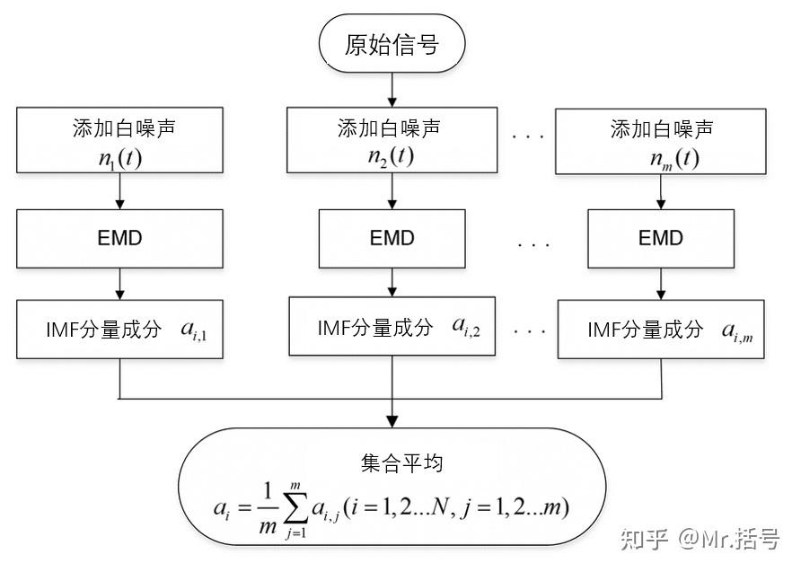
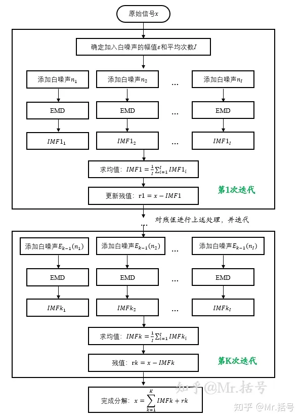

# 类EMD的“信号分解方法”及MATLAB实现（第三篇）——CEEMDAN (COMPLEMENTARY ENSEMBLE EMPIRICAL MODE DECOMPOSITION WITH ADAPTIVE NOISE)

!!! info
    原文地址：[🔗 专栏：信号处理有关的那些东东](https://zhuanlan.zhihu.com/p/138141521)

    本文为学习笔记。

## CEEMDAN（自适应噪声完备集合经验模态分解）的概念

CEEMDAN（Complete Ensemble Empirical Mode Decomposition with Adaptive Noise）的中文名称是**自适应噪声完备集合经验模态分解**，要注意这个方法并不是在CEEMD方法上改进而来的，而是从EMD的基础上加以改进，同时借用了EEMD方法中加入高斯噪声和通过多次叠加并平均以抵消噪声的思想。

在试图理解CEEMDAN算法流程之前，强烈建议先搞清楚EEMD算法的流程，然后对比一下EEMD和CEEMDAN的算法流程。请仔细对照下边两张流程图：

EEMD分解方法流程图

CEEMDAN方法流程图

流程图展示地很清楚了，简单地描述EEMD与CEEMDAN的区别大概是：

- EEMD方法是将添加白噪声后的M个信号直接做EMD分解，然后相对应的IMF间直接求均值；

- CEEMDAN方法是每求完一阶IMF分量，又重新给残值加入白噪声（或白噪声的IMF分量）并求此时的IMF分量均值，并逐次迭代。

点明几个需要注意的地方：

1.如果最终rk也算一个IMF分量的话，上图总共分解出了K+1个IMF分量；
2.图中Ek​(∗)为利用EMD算法产生的第k阶IMF分量，所以每次迭代添加都是最初始的那些白噪声的IMF分量（第一次迭代添加的是原始白噪声）。

CEEMDAN作为EEMD方法的改进型，它的优势主要体现在以下几个方面[1]：

1.完备性，即把分解后的各个分量相加能够获得原信号的性质。CEEMDAN在较小的平均次数下就可以有很好的完备性；而对于EEMD方法，较小的平均次数会导致较差的完备性，也即CEEMD那篇文章里提到的重构误差会很大。
2.更快的计算速度，正是由于上一条，相较于EEMD该方法不需要太多的平均次数，可以有效提升程序运算速度。
3.更好的模态分解结果，EEMD分解可能会出现多个幅值很小的低频IMF分量，这些分量对于信号分析意义不大，CEEMDAN方法可以减少这些分量数目。