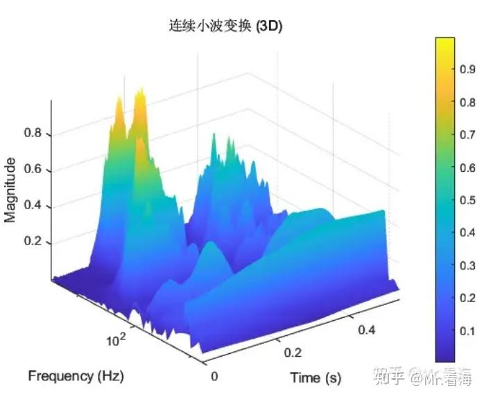
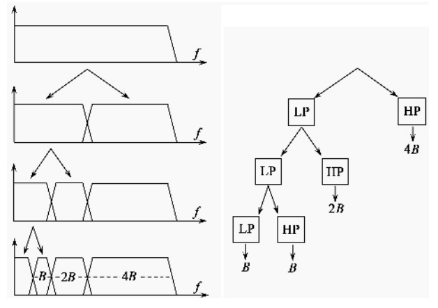
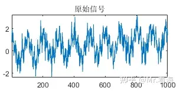
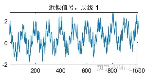
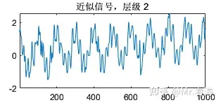
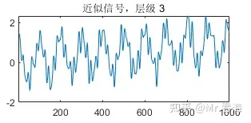
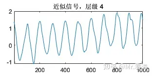
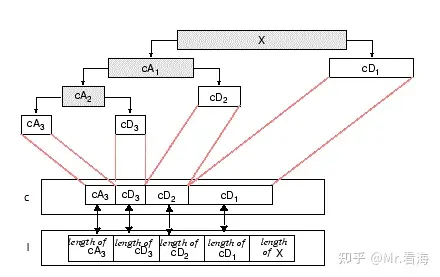
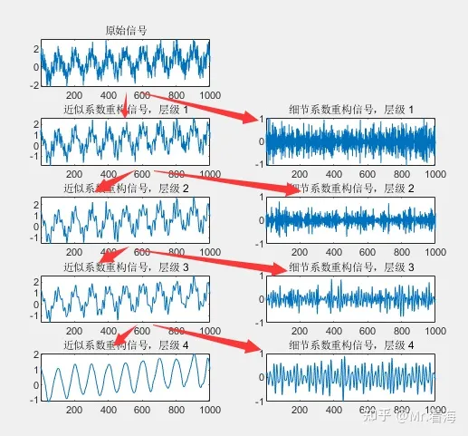
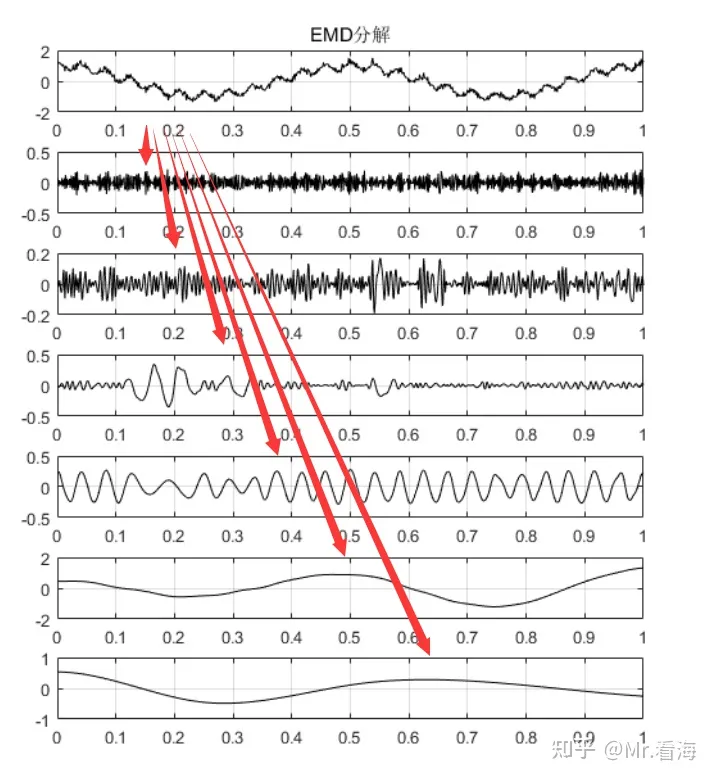

# 类EMD的“信号分解方法”及MATLAB实现（第八篇）——离散小波变换DWT（小波分解）

!!! info
    原文地址：[🔗 专栏：信号处理有关的那些东东](https://zhuanlan.zhihu.com/p/138141521)

    本文为学习笔记。

## 从小波分析到小波分解
小波分析是一种时频域分析方法，该方法兼顾了信号在时域和频域的信息。

对于连续小波变换（continuous wavelet transform, CWT），有几个缺点：运算量很大；只有数值解，没有解析解。

为了减少变换运算量，去除不必要的重复的系数，实际中使用的通常是离散小波变换（discrete wavelet transform, DWT）。

这里的“离散”指的是什么呢？

让我们先回到小波基波（也叫母小波）的表达式：

$$
\psi_{s,\tau}(t) = \frac{1}{\sqrt{s}}\psi(\frac{t-\tau}{s})
$$

其中**s**是尺度参数，表征频率；**t**是位移参数，表征时间。再看上一张图，xy坐标分别是SCALE和TRANSLATION，也就是s和t，他们在连续小波变换中是连续的。

所以，在离散小波变换中，“离散”的就是参数s和t。此时小波表达式写为：

$$
\psi_{j,k}(t) = \frac{1}{\sqrt{s_0^j}}\psi(\frac{t - k\tau_0s_0^j}{s_0^j})
$$
j和k都是整数，通常取s0=2，τ0=1。

可以看出，随着j取值的递增，我们可以得到一串不同的小波（子小波，也叫女儿小波...）。这些子小波的尺度参数以2的j次方的形式增长。当使用这一系列的子小波，对一个连续函数进行离散分析时，我们所获得的是一组小波分析的系数，这个分析过程称为**小波系列分解**。

上边说道，尺度参数表征的是频率，在子小波中尺度参数以2的倍数增长（即小波的“长度”被“拉长”了2倍），那么子小波对应能检测到的频率值也会以1/2的倍数缩小。母小波所对应的频谱位于频率谱的高端，具有最大的频率谱范围- 而其他的子小波的频率谱则依次向频谱图的低频端移动，同时它们所覆盖的频率谱范围也相应地递减。**在理想的情况下，所有的滤波器应该首尾相接互相覆盖。**

是的，每个子小波就相当于一个**滤波器，离散小波变换的过程就是逐级滤波的过程。**

具体流程是怎样的呢？

用一句话描述就是：一组离散信号通过一系列的低通和高通滤波器，分别可以得到近似信号（用字母A表示）和细节信号（用字母D表示）。

用一张图描述就是：

 LP为低通滤波器，HP为高通滤波器，B为带宽，2B为2倍带宽

用一个例子来描述就是：

这段合成信号是由多个成分叠加而成的：一个10 Hz的低频正弦波和一个振幅为0.5的50 Hz高频正弦波，这两者代表信号的周期性成分。同时，信号中还包括了一个线性趋势项，表示信号的非周期性变化。除此之外，信号还叠加了标准差为0.5的高斯白噪声，为信号添加了随机性。这里使用了 dB4（第4级Daubechies小波）作为去除噪音操作的母小波。

一阶小波分解的结果为：

二阶小波分解的结果为（即对A1信号做分解）：

三阶小波分解的结果为（即对A2信号做分解）：

四阶小波分解的结果为（即对A3信号做分解）：

至此我们已经能够得到较好的低通滤波结果了。可以看到原始信号被逐级的，无遗漏地进行了高、低通滤波，且越接近低频分段越细，几乎想要哪个频段的特征都能得到，因而这个方法有个霸气的名字，叫**filter banks**。

!!! info
    小波分解的多尺度可以类比为我们使用不同的“放大镜”去观察一个物体。想象一下你手里有一张非常复杂的画，画面上有大的物体，如山脉、树木，但也有非常细小的细节，如叶子上的纹理或昆虫的触角。

    **粗尺度（低分辨率）**：当你使用低倍的放大镜（或者站得很远）去看这幅画时，你可以看到大的物体，如山脉和树木，但可能看不到细小的纹理或昆虫。**在小波分解中，这就像我们查看信号的低频部分，捕获其主要的、宽泛的特征。**

    **细尺度（高分辨率）**：现在，如果你换一个高倍的放大镜（或者走近一些）去看同一幅画，你可能会失去对整体的感知，但可以清晰地看到叶子上的纹理或昆虫的触角等细节。**在小波分解中，这就像我们查看信号的高频部分，捕获其细节和快速的变化。**
    
    小波分解的美妙之处在于，它同时提供了多个尺度的视角，让我们既可以看到信号的整体特征，又可以看到其细节。这就像我们可以同时拥有多个不同倍率的放大镜，让我们在需要的时候选择合适的一个来观察画面。

!!! note
    小波分解从高频到低频，从细节到大致。每个层级，都分解出细节和大致两部分。细节部分是高频部分，大致部分是低频部分。每次都对大致部分进行进一步分解，直到达到所需的层级。

## 小波分解更深一步的理解
我们先看一下下边这张图：

小波分解中的c与l

乍一看这张图与之前的图片总结比较相像，不过仔细看下边的两个方框，即左侧分别标识了c和l的位置。

### （一）关于小波分解系数
c的那一行是指的就是小波分解的向量。需要注意这个向量**并不是**上边几张图里的近似信号和细节信号，这里边存储的是**小波分解的系数**。小波系数是没有量纲单位的结果，需要经过重构这些系数得到实际有量纲的信号。

在我们之前讲过的小波阈值去噪方法就是针对这些小波系数，c这行的每个独立的方框（比如cA3）都可以重构到时域成为对应的滤波后的信号，也可以几个方框共同重构，这就是小波分解分量的筛选重构过程，这个过程是有实际工程应用意义的，比如可以实现滤波。

### （二）小波分解和“其他类EMD分解方法”的区别
这里指的“其他类EMD方法”包括了EMD、EEMD、CEEMD、CEEMDAN、ICEEMDAN等。

小波分解与EMD分解最大的不同是源于**分解机理**的。

小波分解的分解结构是有**包含关系**的，每一层级的近似信号都要再分解为下一级的近似信号和细节信号，（这也直接导致在信号重构时不是那么随意），下图是一个典型信号的分解结果，我用红色箭头标出了其包含关系。

EMD通过连续地提取信号的局部极值，然后求解其上下包络，进而得到IMFs。这些IMFs是并列的关系，可以直接对选定的分量进行相加来实现重构，这种操作就比较直观了。

那么这种分解机理的区别，会带来分解效果和应用上的什么不同呢？

我认为有以下几点：

- 上边讲到小波分解方法是**多尺度**的，高频分量在多个层级上被逐步细化剥离开来，让我们可以用更精准的手术刀切割出特征信号段，这是EMD所不具备的特点。
  
- EMD可能会受到模态混叠的影响，导致不同模式的信号成分被混在一起；小波分解方法不同层级覆盖的频率范围不同，模态混叠现象会大大减少。
  
- EMD的分解阶数是**自适应**的，换句话说无法人为干预；小波分解的分解层数是可以指定的，这方面灵活性更强。

## 小波分解DWT的MATLAB代码实现

### （一）生成仿真信号

### （二）小波分解图

### （三）小波分解及频谱图

### （四）小波分解重构及画图

!!! warning
    小波分解的重构不同于EMD，EMD的重构是直接相加，小波分解的重构是需要逐级重构的，这一点需要注意。