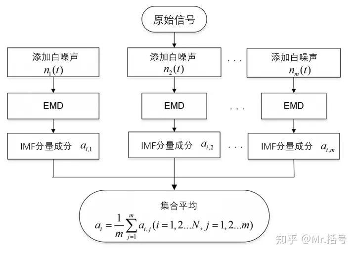

# 类EMD的“信号分解方法”及MATLAB实现（第一篇）—— EEMD (集合经验模态分解)

!!! info
    原文地址：[🔗 专栏：信号处理有关的那些东东](https://zhuanlan.zhihu.com/p/138141521)

    本文为学习笔记。

在专栏之前的文章里对EMD进行了一系列的介绍。在实际中也见到不少同学将该方法应用于各个领域，除了博主研究的故障诊断方向，还有用作去噪、图像处理以及金融分析的。同时也不断有同学想了解诸如EEMD、VMD等类似于EMD分解方法的信号分解方法。所以从今天开始，准备梳理一下各种“类EMD”方法，帮助准备研究这个方向的同学们理一理头绪。

关于为何要进行信号分离研究，有一篇讲的很好的文章[[1]](https://zhuanlan.zhihu.com/p/26491408)，不过我这里再赘述几句吧：

对于我们采集到的信号/数据，其中可能会蕴含着非常复杂的物理过程或经济过程，以及各种类型的干扰信息，而对于这些信息我们可能没有相关认知或者只有定性的了解。为了更清晰地分析对象的组成，我们要“**把一个信号从一个整体，从它原始的采样表示变成在一组有意义的基上，或者是有特定意义的 '描述'上进行展开，而这种展开能够提供更加丰富的信号里面的信息和结构。这就是所谓信号的分离。**”

!!! note
    我们总是希望把一个信号写成一系列的子信号的组合，然后加上一个性质不同的信号，所谓的残差信号或者剩余信号。[[1]](https://zhuanlan.zhihu.com/p/26491408)

今天从EMD的最常见的一个衍生方法讲起：EEMD。

## EEMD（集合经验模态分解）的概念

EEMD（Ensemble Empirical Mode Decomposition）是最常见的一种EMD改进方法。他的优势主要是解决EMD方法中的**模态混叠**现象。

说到**模态混叠**，顾名思义就是不同模态的信号混叠在一起，一般有两种情况：
- 一是不同特征尺度的信号在一个IMF分量中出现
- 另一种是同一个特征尺度的信号被分散到不同的IMF分量中。

EEMD是怎样解决这个问题的呢:

EEMD主要的改进思路是：**利用白噪声均值为0的特性**，通过在分解的过程中**多次引入均匀分布的白噪声**，**将信号本身的噪声通过多次人为添加的噪声掩盖过去**，从而得到更加精准的**上下包络线**。同时对分解结果进行平均处理，平均处理次数越多，噪声给分解带来的影响就越小。

!!! note
    个人觉得，该方法灵魂就在于利用白噪声均值为0。

下图展示的很明白了，EEMD分解主要分为4步：

（1）设定原始信号的处理次数m

（2）给这m个原始信号分别添加随机白噪声，组成一系列新的信号

（3）对这一系列的新信号分别进行EMD分解，得到一系列的IMF分量

（4）对相应模态的IMF分量分别求均值，得到EEMD分解结果

相较于EMD的（几乎）无参数傻瓜式自适应分解，EEMD就有一些参数需要调试了：分别是用于**平均处理的次数M**、**添加的白噪声的幅值**。其中白噪声的幅值通常用“白噪声幅值的标准差与原始信号幅值标准差之比”来表征。

## EEMD的编程实现
~