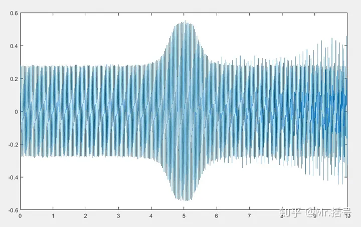
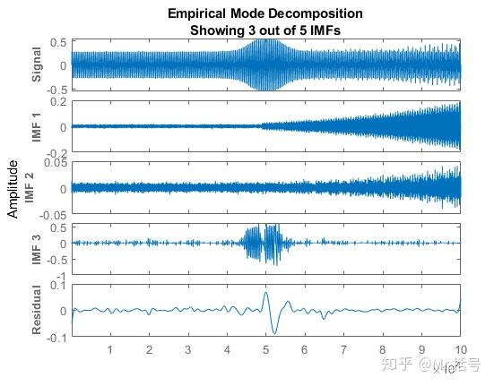
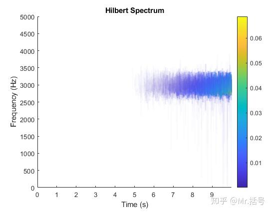
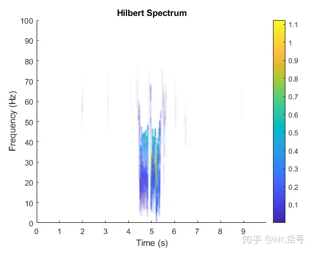
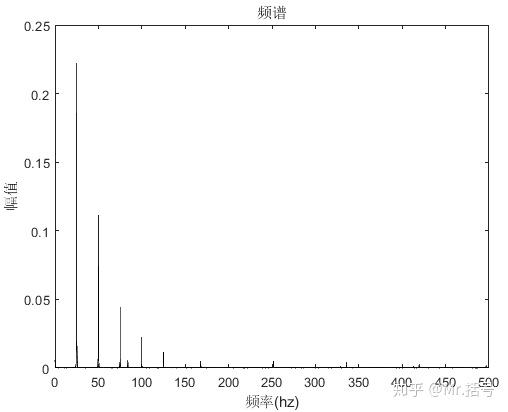
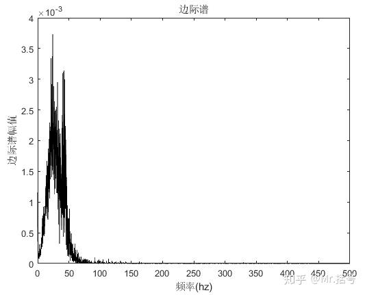
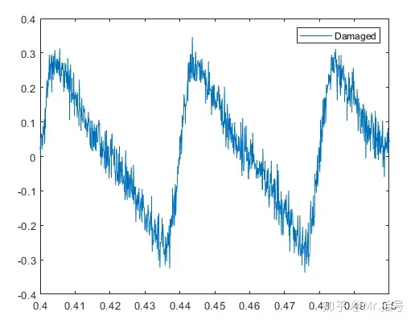
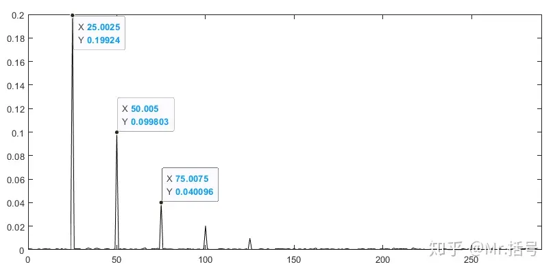

# 希尔伯特谱、边际谱、包络谱、瞬时频率/幅值/相位——Hilbert分析衍生方法及MATLAB实现

!!! info
    原文地址：[🔗 专栏：信号处理有关的那些东东](https://zhuanlan.zhihu.com/p/138141521)

    本文为学习笔记。

上一篇文章对希尔伯特-黄变换（HHT）的前世今生进行了介绍。

不过在研究中通常并不是到希尔伯特-黄变换就停止了。

而是要用到诸如希尔伯特谱、包络谱、边际谱、瞬时频率/幅值/相位等方法进一步分析。

这些方法究竟是什么含义，以及怎样使用、怎样实现呢？

## 希尔伯特谱（Hilbert Spectrum）
希尔伯特谱是希尔伯特-黄变换得到的最直观结果，（上一篇文章中倒数第二张图——经过HHT的“疯狂的M”），其反映的是信号时间、瞬时频率和幅值之间的关系。该图谱可以用于分析包含混合分量信号中各分量随时间变化的规律，以识别局部特征。需要注意的是，希尔伯特谱有时是将emd分解后所有imf分量作为分析对象的，而有些会有针对性地挑选出某个或某几个imf分量分析，具体怎样操作是要结合具体研究内容有针对性地选择的。

下边使用一个模拟的轴承故障信号，使用希尔伯特谱寻找缺陷。

模拟在轴承外圈引入一个缺陷，该缺陷导致一系列冲击，导致磨损逐渐加剧。这些冲击将在轴承的外环故障频率(BPFO)处重复出现。

模拟出的轴承故障振动特征信号如下图：

在4~6秒之间的尖峰是由于轴承振动激发的共振引起的[1]，而从5~10秒之间，信号中叠加了幅值逐渐增加的冲击信号。

对该信号进行EMD分解，其中的部分分量如下图。

对IMF1做希尔伯特谱，得到下图结果。随着轴承磨损的逐渐加剧，冲击能量增加，在2500~3500Hz范围内希尔伯特谱幅值随之增大。

对IMF3做希尔伯特谱，得到下图结果。这里将**轴承振动激发的共振信号**分离出来，其频率范围在0~100Hz之内。

需要再次强调的是，希尔伯特谱是一种**时频谱**，可以与之类比的是连续小波变换、短时傅里叶变换这种同样是时频分析的方法的谱图。这种谱反应的是信号频率成分随着时间的变化，是**做非平稳信号**（例如例子中的故障信号）的重要手段。使用这种类型的分析方法强调的就是**“变化”**，即特征在时间尺度上的改变——因为如果信号没有随时间发生变化，使用频域分析手段就够了。正因如此，HHT的方法在在生物医学（如血压变化）、地球物理（如地震、海浪分析）、工程领域（故障诊断等）的非平稳信号为主要研究对象的领域广泛应用。

## 边际谱（Marginal Spectrum）
边际谱是建立在已经算出**希尔伯特谱的基础上**的，计算方法是将希尔伯特谱在时间轴上进行积分，使之从幅值-时间-频率三者间的关系转变为幅值-频率两者间的关系，描述的是幅值（或能量）在频率轴上的分布。公式为：

$$
h(f) = \int_{0}^{T} H(t, f) dt
$$

现在问题来了：同样是幅频谱，傅里叶谱和边际谱有什么区别呢？

在傅里叶谱中，在某一频率上存在着能量意味着具有该频率的正弦或余弦波存在于信号的整个持续时间内；
而在边际谱中，在某一频率上存在着能量意味着具有该频率的波在信号的整个持续时间内某一时刻出现的可能性较高。
因此在一定程度上，Hilbert边际谱具有一定的概率意义，Hilbert边际谱可以看作是一种加权的联合幅值-频率-时间分布，而赋予每个时间-频率单元的权重即为局部幅值，从而在Hilbert边际谱中，在某一频率上存在着能量就意味着具有该频率的振动存在的可能性，而该振动出现的具体时刻在Hilbert谱中给出。

简单来说，傅里叶谱和边际谱有一定的相关性，但是在处理非平稳信号时，更适合使用边际谱，因为“傅里叶变换为了在数学上拟合原始数据的非平稳波形，不得不引入大量高频的'伪'谐波分量，这会导致傅里叶谱对低频能量的低估”。

下图为上边故障轴承信号的傅里叶谱和边际谱：

频谱中包含高频的‘伪’谐波分量

边际谱的能量更集中于低频部分

## 包络谱（Envelope Spectrum）
包络谱最常见的应用场景就是机械产品故障诊断（尤其是轴承）。不过需要区别于边际谱的是，包络谱不是基于希尔伯特谱。包络谱的求法是：**目标信号→希尔伯特变换→得到解析信号→求解析信号的模→得到包络信号→傅里叶变换→得到Hilbert包络谱**。

包络谱是一种解调方法，在某些轴承故障中（例如表面损伤）会在轴承运行中激发出一些列周期性冲击信号，这些信号会与高频固有振动发生调制。包络谱分析能够有效地将这种低频冲击信号进行解调提取。

不过包络分析结果往往会收到低频噪声的影响，**在分析前需要进行带通滤波以消除噪声干扰**，而带通滤波器的参数常常难以选择，因为事先并不知道共振频带的范围。此时就可以结合EMD的方法，**将原始信号进行EMD分解，选出包含共振频带的前几个IMF分量重构信号，再进行包络分析。**

需要注意的是，包络谱与频谱结果差异较大，包络谱更适用于做故障特征提取。

还是用轴承故障来举例说明，仿真生成一段轴承外环故障频率（83.33Hz）的轴承外圈故障信号:

轴承外圈故障信号

对这段信号直接做频谱图，只能观察到25Hz的转频频率分量。

使用包络谱则可以提取到该故障信号：

## 瞬时频率/幅值/相位
这里说的瞬时频率、瞬时幅值和瞬时相位这三个概念都是基于希尔伯特变换构造。 

## MATLAB代码实现