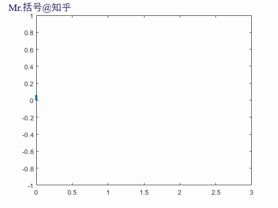
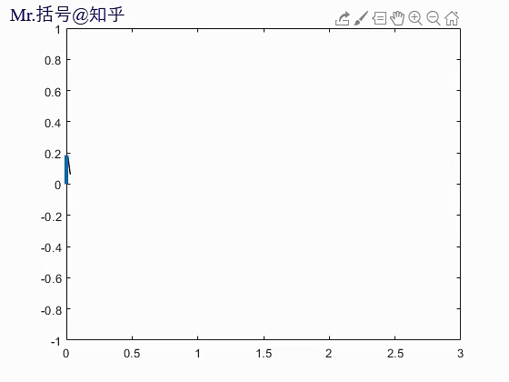
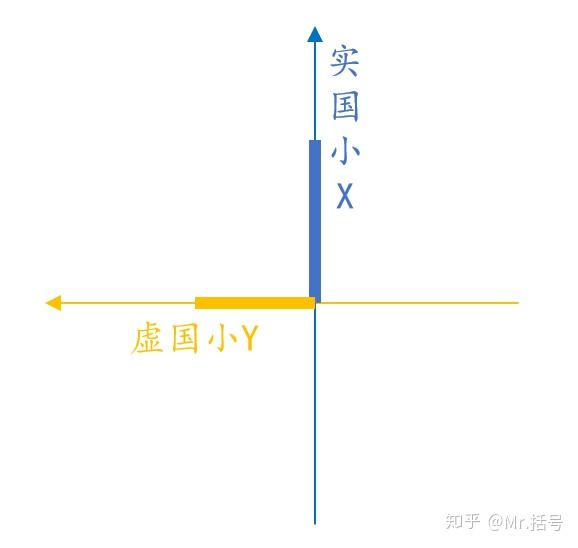
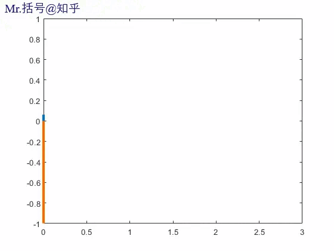
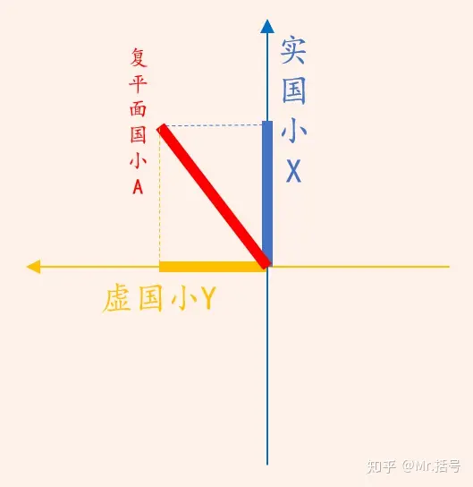
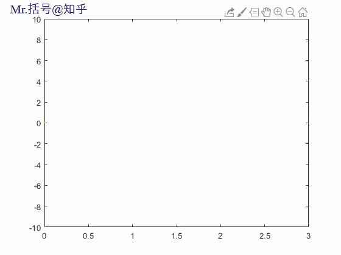
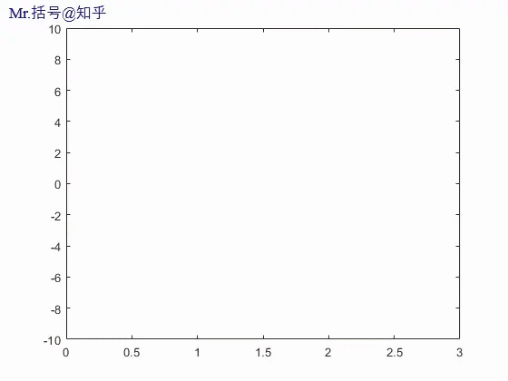
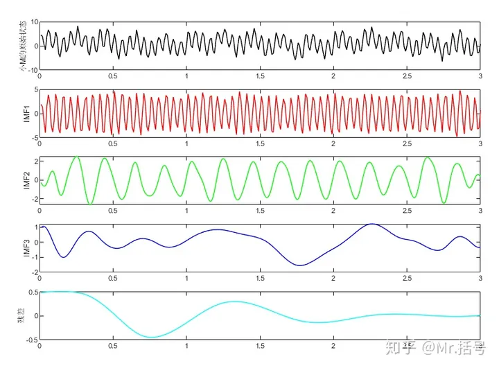
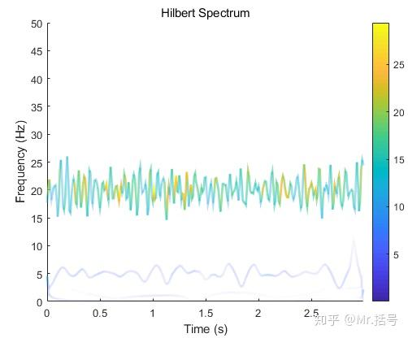

# 希尔伯特-黄变换（HHT）的前世今生——一个从瞬时频率讲起的故事

!!! info
    原文地址：[🔗 专栏：信号处理有关的那些东东](https://zhuanlan.zhihu.com/p/138141521)

    本文为学习笔记。

## 来自小X的疑问

从前有一个国家，叫做实国（一维国度），里边有个叫小X的小人儿。

小X是一根线段，他每天最爱做的事情就是跳舞。

因为小X的舞姿十分稳定，同伴们都说他的头部跳出了频率为1hz的正弦曲线。

天有不测风云，这天小x走路摔了一跤，在踉踉跄跄的3秒钟的时间里，小x的头部画出了这样的形状：

事后小X就在思考：

>在摔倒的这3s中，这个曲线的频率该怎么描述呢？一般来说要计算局部频率的值至少需要一个完整周期的正弦波形。像这样一个周期内振荡速率在明显改变的情况，就无法计算频率了？变化的频率要用瞬时频率表示才好，但是要怎样表示呢？

## 隐形的兄弟

多日之后小X逐渐淡忘了这个问题

这天走在路上的他遇到了一个叫H的智者（Hilbert）。

H说：

> 小X你知道么，你还有一个隐形的兄弟,他生活在一个叫虚国平行宇宙中,他的舞姿和你息息相关.

说罢，智者打开了天眼（Hilbert变换），小X看到了他本来无法观测到的世界，并看到了“隐形的兄弟”——小Y。

小X从舞步中看出，小Y比他滞后了$\frac{\pi}{2}$的相位（即余弦）。

此时有个名叫G的老头（Gabor）说：相位滞后只是表象,小X和小Y真正的联系在于,你们都是“复平面国”里的小A的投影。

G让他们看到了复平面国的小A：（Analysis Signal）

相比于小X和小Y伸缩的正弦/余弦舞姿，小A的舞姿则是一个圆。

小X回想起几天前摔倒的一幕，小Y和小A都表示自己那天也同样摔了一跤，他们摔出来的波形是这样的：

小X明白了，原来自己和小Y都是比小A低一维的生物，或者说只是一个亦步亦趋的影子，不由得十分沮丧。

## 由高维生物带来的启发

G安慰道：

不必沮丧，起码有小A在，困扰小X的瞬时频率就可以解决了
由于小A的运动轨迹是弧线
那么可以求出小A的瞬时相位角变化，此时单位是“弧度/秒”
再除以2π就是瞬时频率了

小X表示不忿：
他是他我是我，凭什么用它的瞬时频率代表我的瞬时频率。

G老头呵呵一笑：

因为这样定义，能满足人们在通常情况下的直观感知
而且解析信号（小A）和实信号（小X）的频谱完全相同
小A是小X的更高维度表达
最重要的是——我是数学家，我说了算*。(*注：解析信号法(Analytic Signal Method)求实数信号的瞬时频率的方法由Gabor提出，这是众多用于描述瞬时频率的理论中的一种。)

## 前来捣乱的非平稳信号

正在大家纷纷感叹G的高明时，突然闯入了来自实国的“疯狂的M”

 

大家发现用G的方法求他的瞬时频率时竟然出现了负频率

而负频率显然是没有意义的

众人一筹莫展之际，黄先生（黄锷）大喊一声：

都闪开，让我来！

只见黄先生掏出名叫EMD的武器，对“疯狂的M”展开攻击，转眼间M被斩作几段：

黄先生说：

大家莫慌，所谓的疯狂的M（非平稳信号），不过是几个普通人（平稳信号）叠罗汉的恶作剧罢了。
只要使用EMD就可以把他们分离开。
不如把被分离开的这几个家伙叫做IMF（内涵模态分量 Intrinsic Mode Functions）吧。
此时再对这几个IMF分量求瞬时频率就没大问题了。

## 希尔伯特-黄变换（HHT）及其意义

为了纪念故事中两位老先生（Hilbert和Huang）的突出贡献，人们决定把“经过EMD分解出的IMF分量再经过Hilbert变换，最终得到信号瞬时频率和瞬时幅值”的方法叫做希尔伯特黄变换（HHT，Hilbert-Huang Transform）。

经过HHT的“疯狂的M”（希尔伯特谱是时间-频率平面上勾勒出的瞬时幅值的图像）

话说回来，获得一个信号的HHT结果究竟有什么用呢？括号先森的理解是这样的：

- HHT的结果反映的是信号的**时频特征**，即**信号的频域特征随时间变化的规律**。相对于傅里叶变化得到的是信号的频率组成，HHT还可以获取频率成分随时间的“变化”。比如我们要分析的信号代表的是一个性能迅速退化的发动机（假设信号表征是某些IMF分量的频率逐渐升高），使用HHT就可以对该现象进行很好的捕捉。
- HHT可以对**局部特征**进行反映，这点主要得益于EMD的作用。**EMD可以自适应地进行时频局部化分析，有效提取原信号的特征信息。**
- “分解”往往可以对应着**“重构”**，从HHT结果中选择出满足要求的特征分量并重组信号，有利于将关注的特征从复杂的混合信号中分离出来。

由于这些优点，HHT方法与短时傅里叶变换（STFT）和小波变换（wavelet）等方法共同成为了时频域分析界的重要手段。

## 不一样的声音

一切似乎已经尘埃落地，但实国的围观人群中又传来了不同的声音：

Hilbert变换只能用于窄带信号吧~
EMD分解有模态混叠和端点效应，我觉得还可以改进
这个瞬时频率的定义我不同意！
如果我想指定IMF分量个数要怎么做呢？
...

大家持续热烈地讨论着，不过那就是另外几个故事了

## 附录

解析信号的表达式：

$$
x_a(t) = x(t) + j\hat{x}(t)
$$

瞬时幅值：

$$
A(t) = \sqrt{x(t)^2 + \hat{x}(t)^2}
$$

瞬时相位：

$$
\phi(t) = \arctan\left(\frac{\hat{x}(t)}{x(t)}\right)
$$

瞬时频率：

$$
f(t) = \frac{1}{2\pi}\frac{d\phi(t)}{dt} (unit: Hz)
$$
