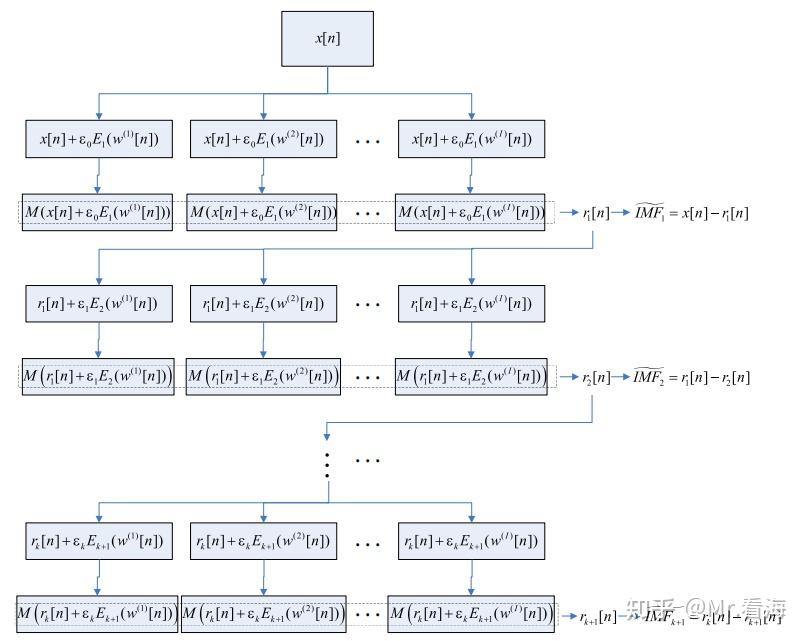
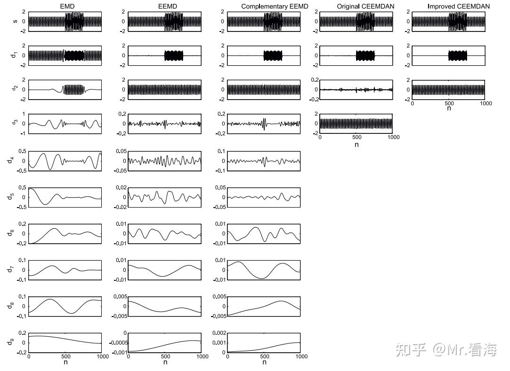

# 类EMD的“信号分解方法”及MATLAB实现（第五篇）——ICEEMDAN

!!! info
    原文地址：[🔗 专栏：信号处理有关的那些东东](https://zhuanlan.zhihu.com/p/138141521)

    本文为学习笔记。

继续完善“类EMD”方法系列，本篇是继EEMD、CEEMD、CEEMDAN、VMD后的第5篇，想要看前几种方法的点击链接可以跳转。

ICEEMDAN（Improved complete ensemble EMD）是2014年被提出的[1]，它是对CEEMDAN方法的改进算法。方法名字随着方法更新越来越长，颇有手机命名的风范。

## ICEEMDAN（改进的自适应噪声完备集合经验模态分解）的概念

据算法提出者Colominas的说法，ICEEMDAN的主要目的是解决CEEMDAN中**残留噪声**和**伪模态**的问题。

虽然只多了一个字母“I”，但是两个方法的思路却颇不相同。

有时候看起来复杂的算式是为了简洁，这里我们按照原文[1]中的思路引入两个算子：

（1）算子$E_j(\dot)$，代表求一个信号EMD分解的第j个IMF分量。

（2）算子$M(\dot)$，代表求信号的局部均值。这里的局部均值是什么含义呢，在讲EMD分解的时候我们提到过，我们在EMD分解的过程中是不断地(1)求信号的上下包络线均值→(2)原始信号减掉均值包络线→(3)反复迭代直至信号满足两个约束条件，此时就得到了一个IMF分量，而局部均值指的就是“原始信号减去此IMF得到的部分”。

搞明白这两个算子之后，那就把原文章里的流程图贴上来了：

针对上图再补充两点说明：

（1）上图中的$w^(i)[n]$指的是加入的第i组高斯白噪声，所以在每轮求IMF过程中，所加入的噪声信号都是原始噪声信号的IMF分量。

（2）上图中的$epsilon_j$指的是加入噪声分量时所乘的系数，该系数代表的是加入噪声的信噪比与该噪声分量标准差之比。换句话说，$epsilon_kE_{k+1}(w^(i)[n])$代表的是第i组高斯白噪声的第k个分量，乘以添加噪声相对于原信号的信噪比，再除以这组高斯白噪声的标准差。其中添加噪声相对于原信号的信噪比将是ICEEMDAN程序的入口参数之一，另外还有一个入口参数就是总共添加的白噪声组数。

相对于CEEMDAN方法以及之间介绍的几种算法，ICEEMDAN的主要优势在于更少的伪模态。论文中举了一个例子作为对比：

从左到右分别是EMD、EEMD、CEEMD、CEEMDAN、ICEEMDAN，可以看出ICEEMDAN方法确实减少了很多不必要的分量。

## ICEEMDAN的编程实现