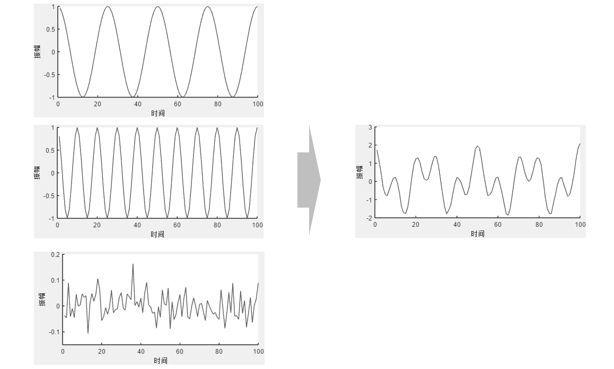
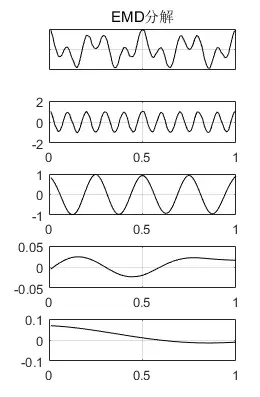

# 本征模态函数 - IMF

首先我们生成一段信号，它是由4Hz的正弦波、10Hz的正弦波和白噪声叠加而成的。如下图：

现在我们将合成后的信号进行EMD分解，结果如下图：

从EMD分解图中可以看出，IMF1为10Hz的分量，IMF2为4Hz的分量。**所以简单（且理想化）地说，IMF的各个分量分别代表了原始信号中的各频率分量，并按照从高频到低频的顺序依次排列。这也就是（非常简单的情况下的）IMF的物理含义。**

那IMF3等分量又代表了什么呢？在这个例子里，它们没有意义，属于EMD端点效应等带来的副作用，至于**端点效应**，在后续的文章里会讲到。

通过这个例子的说明，我们可以得到**EMD**的**一大特点**：**自适应地进行信号主要成分分析（不是PCA）。**也就是说，**EMD分解信号不需要事先预定或强制给定基函数，而是依赖信号本身特征而自适应地进行分解。**

当然，现实中的信号分量（IMF）不会像例子中一样保持完全稳定的频率和振幅，也常常无法从各分量中直接看出信号规律。**EMD分解经常被用作信号特征提取的一个预先处理手段**，将各IMF分量作为后续分析方法的输入，以完成更加复杂的工作。