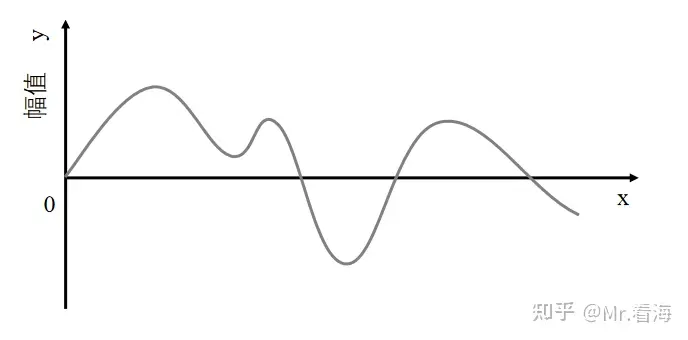
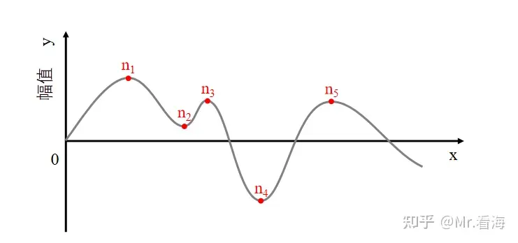
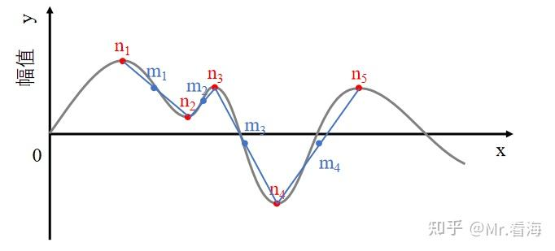
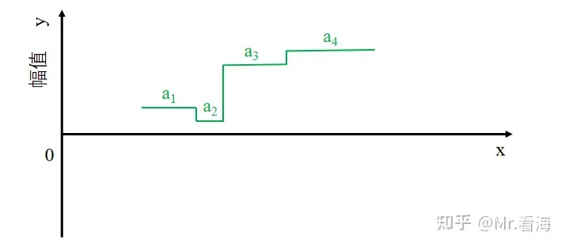
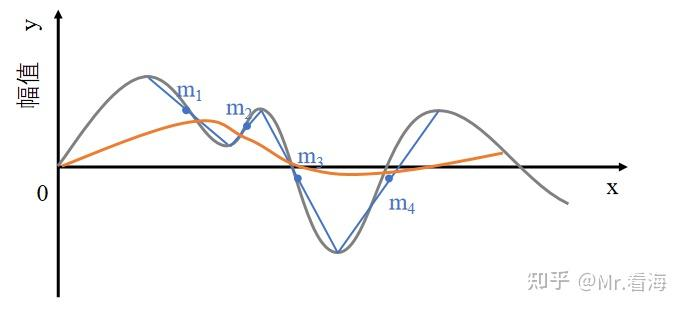
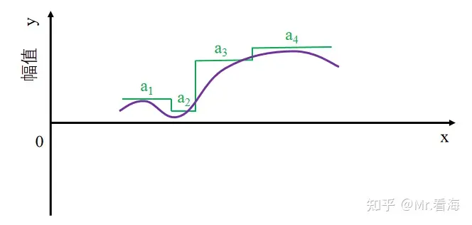

# 类EMD的“信号分解方法”及MATLAB实现（第六篇）——LMD (LOCAL MEAN DECOMPOSITION)
!!! info
    原文地址：[🔗 专栏：信号处理有关的那些东东](https://zhuanlan.zhihu.com/p/138141521)

    本文为学习笔记。

LMD（local mean decomposition，局部均值分解）方法是2005年由Smith等人[1]提出的，本质上是根据信号的包络特征自适应地将一个非线性、非平稳信号按频率递减的顺序逐级分离。**LMD的提出也是用来解决EMD分解的端点效应和模态混叠问题**，最开始是用来处理脑电数据的。
## LMD的概念

与EMD衍生的一系列方法不同，经过LMD分解得到的分量被称作“乘积函数(PF)”，即每个PF都是通过包络函数乘以纯调频函数得到的。其中包络函数是PF的瞬时幅值，纯调频函数的频率是PF的瞬时频率。

曲线为待分解曲线

图解一下分解步骤：

（1）找到信号中的全部极值点$n_i$。

（2）求出相邻极值点的局部均值点$m_i$。，也就是相邻两个极值点的中点。公式为：

$$
m_i = \frac{1}{2}(n_i + n_{i+1})
$$

蓝色标记为局部均值点

（3）求出相邻极值点的局部包络$a_i$。，也就是相邻两个极值点的幅值绝对值差值的一半。公式为 

$$ 
a_i = \frac{1}{2}|n_i - n_{i+1}|
$$

绿色标记为局部包络值

（4）将局部均值$m_i$的折线连线进行平滑处理，得到局部均值函数$m_11(t)$如下图中的橙色曲线。

橙色曲线为局部均值函数（示意）

（5）将局部包络同样进行平滑处理，得到局部包络估计函数$a_11(t)$ ，如下图紫色曲线。

（6）将$m_11(t)$从原始信号的序列里面分割出来，得到零均值信号$h_11(t)$。

$$
h_11(t) = x(t) - m_11(t)
$$

（7）对$h_11(t)$进行解调，通过$h_11(t)$除以$a_11(t)$可以得到$s_11(t)$。反复重复以上（1）~ (6)步骤，直到包络估计函数$a_{1(n+1)}(t)=1$，此时得到的$s_{1n}(t)$就是纯调频信号。 

（8）将上述迭代获得的全部局部包络估计函数进行乘法运算就可以得到包络信号$a_1(t)$。

$$
a_1(t) = a_11(t) \times a_12(t) \times \cdots \times a_1n(t)
$$

（9）第一个PF分量就可以写为：

$$
PF_1(t) = a_1(t) \times s_1n(t)
$$

（10）将原始信号减掉PF1，得到的剩余信号重复（1）~（9）步，直到剩余信号为单调函数为止，此时原始信号就被分解为k个PF和一个单调剩余信号。即：

$$
x(t) = \sum_{i=1}^{k}PF_i(t) + u_k(t)
$$

分解完成！

!!! note
    每次分解得到的乘积函数就是包络信号与调频信号的乘积，即PF = 包络信号 * 调频信号。而原始信号就等于乘积信号之和加上一个剩余信号。

## LMD的特点
对于LMD和EMD的区别，这里就直接引用论文了

（1）PF 分量和 IMF 分量的含义不相同。经过 EMD 分解后获得的 IMF 属于调频信号，而利用 LMD 分解后获得的 PF 分量属于调幅调频信号。要想得到 IMF 分量，必须保证原始信号极值点的数量绝对等于过零点的数量，或者两个数值的数值差的结果小于等于 1，因此 IMF 分量并不会显现出不过零点的局部波动；但 PF并不需要满足这个条件。综合上所述可以发现 PF 分量能够更准确的反映原始信号的所有特征信息。
（2）针对局部均值函数 EMD 和 LMD 的求解方法存在明显的差异。EMD 是分别对所有极值点采用三次样条插值获得原始信号的上包络线和下包络线，接下来使用平均值的方法就可以得到局部均值函数，采用这种方法更容易形成过包络或欠包络等缺陷；对于LMD 求解局部均值函数，求取相邻两个极值的平均值，并利用滑动平均算法对其进行平滑处理；LMD 能够避免 EMD 中存在的过包络和欠包络的缺点。因此通过对比可以发现LMD 的分解结果更加准确。
（3）LMD 和 EMD 对瞬时频率的求解思路不同。在 EMD 中，必须求解 Hilbert 才能获得 IMF 的瞬时频率，然后再利用对其瞬时相位的求取倒数，最终获得瞬时频率，当若干个 IMF 中的一个瞬时相位具有突变的时候，求解出来的瞬时频率可能会出现工程实际中难以解释的负值；但对于 LMD 则不会出现频率为负值的情况，因为瞬时频率的值可以直接通过分解后的 PF 分量直接计算得到，这种方法不但简单而且求出的瞬时频率值都属于正值。因此求解瞬时频率的时候 LMD 方法更占优势。
（4）LMD 和 EMD 的整个分解过程计算量有所不同。针对 EMD 的求解过程主要存在两个迭代过程，一个是获取所需要的若干个 IMF 分量，另一个则是将所有的 IMF 从原始信号中分离出来，最终得到一个残余分量；而 LMD 方法就相对于 EMD 复杂一些，其主要包含了三个迭代过程，第一个迭代是利用滑动平均算法对局部均值和局部包络的折线进行平滑处理，得到局部均值函数以及包络估计函数，第二个迭代是通过迭代过程获得一个纯调频函数，第三个迭代就是将所有的 PF 分量全部计算出来。针对计算量来说，LMD的并不占优势，其计算量相比于 EMD 稍大一些。

## LMD的编程实现