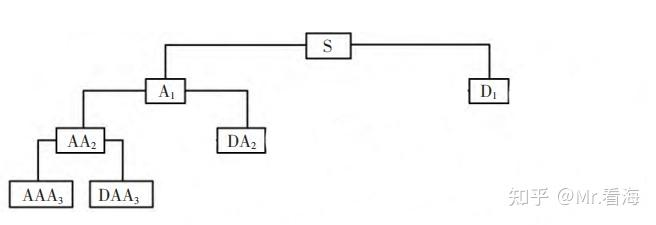
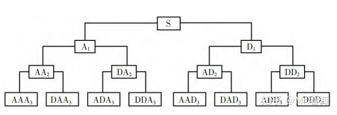

# 类EMD的“信号分解方法”及MATLAB实现（第九篇）——小波包变换（WPT）/小波包分解（WPD）

!!! info
    原文地址：[🔗 专栏：信号处理有关的那些东东](https://zhuanlan.zhihu.com/p/138141521)

    本文为学习笔记。

在建立了小波分解的基本概念后，我们现在转向小波包分解——一种更精细的小波分析方法。小波包分解在多分辨率分析的基础上，提供了一种全面的频率分析工具，这在许多复杂信号处理场合中被证明是极为宝贵的。

## 从小波分解到小波包分解
小波包分解（Wavelet Packet Decomposition，WPD）有时候也叫做小波包变换（Wavelet Packet Transform，WPT），是由Coifman等人在小波变换理论的基础上提出的。

小波包分解是在离散小波变换的基础上进一步发展的。

在DWT中，信号被分解为一系列高频和低频组分，但仅仅迭代分解低频部分。
相比之下，WPD在每一级分解中同时对高频和低频组分进行迭代分解。这意味着它能够更详细地分析信号的频率内容。

小波包具有小波变换的优势，能够获得时域特征信息和频域特征信息，这一优势使小波包变换能够对不稳定的信号进行有效的分解。同时，对于高频信号部分以及低频信号部分，小波包变换都有很好的信号处理效果，并保证时频分辨率相同。此外，小波包变换具有良好的连续性，能够提供关于原始信号更加丰富的特征信息。[1]

他们的结构区别一目了然[2]：

小波分解树状图

小波包分解树状图

与传统的小波分解相比，小波包分解的**关键优势**在于其对信号的**全频带分解能力**。传统的DWT忽略了在高频带中的分解，这在某些应用中可能会丢失重要的信号细节。WPD的这种全频带分析能力特别适用于那些信号特征不仅仅局限于低频范围的应用，由于其细粒度的分析特性，小波包分解在各种应用中显示出其独特的优势。它不仅在信号去噪和数据压缩方面提供了改进的性能，而且在生物医学信号处理、语音识别和地震数据分析中，小波包分解也显示出其无可比拟的能力。例如，在处理EEG信号时，小波包分解能够帮助识别更加细微的神经活动模式，这对于疾病诊断和大脑功能研究至关重要。

## 小波包分解的MATLAB代码实现
~

## 总结

通过将小波包分解的原理与传统的小波分解方法相对比，我们可以明显看到其在精细度和适用性方面的优势。WPD提供的全面频率分析工具不仅增强了我们对信号的理解，而且在实际应用中扩大了小波理论的边界。随着分解级别的加深，WPD赋予了分析师在时间-频率域内进行更加细致探查的能力，这是在传统的小波分解中所无法实现的。
