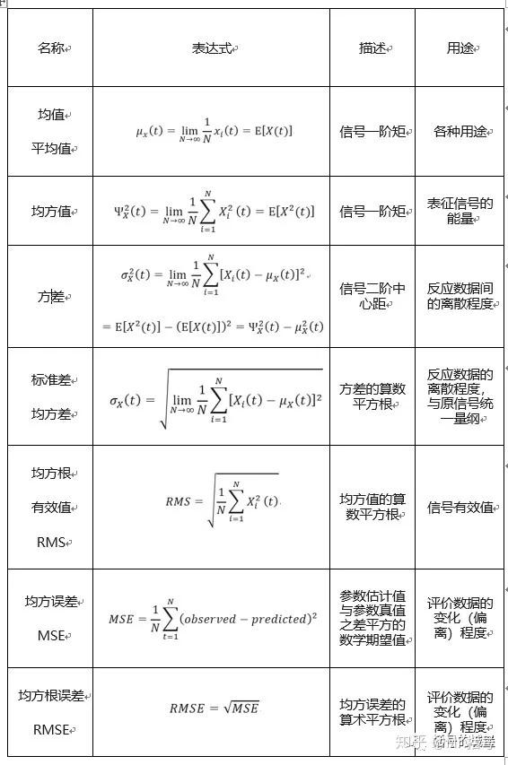

# Time Domain Analysis - Features with Units

!!! info
    Original article: [🔗 DSP-STUFF](https://zhuanlan.zhihu.com/p/138141521)

    This article serves as study notes.

Time-domain feature values are important indicators for measuring signal characteristics, typically classified into **dimensional parameters** and **dimensionless parameters**.

The term "dimension" is simply understood as "unit." Dimensional parameters have units, such as the average value. For example, the average value of a temperature signal (in degrees Celsius) still has units in degrees Celsius. Dimensionless parameters, on the other hand, lack units and are often expressed as the product or ratio of dimensional quantities. Strain, for instance, measures deformation and is defined as the ratio of length difference to the original length.

Dimensional feature values often have intuitive physical meanings and are the most commonly used feature indicators. Dimensional feature values mainly include: maximum value, minimum value, peak-to-peak value, mean, variance, standard deviation, mean square value, root mean square value (RMS), mean square error (MSE), root mean square error (RMSE), root amplitude, and more.

## 1 Mean

The mean, variance, mean square value, and root mean square value are inherently connected.

The mean is the average of a signal and is the **first moment**, expressed as:

$$ \mu_x(t) = \lim_{N \to \infty} \frac{1}{N} \sum_{i=1}^{N} x_i(t) = E[X(t)] $$

## 2 Mean Square Value

The mean square value is the average of the square of a signal (signal → square → average), representing the **energy of the signal**, and is the **second moment**, expressed as:

$$ \Psi_X^2(t) = \lim_{N \to \infty} \frac{1}{N} \sum_{i=1}^{N} X_i^2(t) = E[X^2(t)] $$

## 3 Variance

Variance is the average of the square of the difference between each sample value and the average value of all sample values. It represents the dynamic component of the signal's energy (the square of the mean is the static component), reflecting the degree of dispersion between data. Variance is the **second central moment** and can be expressed as:

$$ \sigma_X^2(t) = \lim_{N \to \infty} \frac{1}{N} \sum_{i=1}^{N} (X_i(t) - \mu_X(t))^2 = E[X^2(t)] - E[X(t)]^2 = \Psi_X^2(t) - \mu_X^2(t) $$

Different expressions for variance reveal various understandings of it:

(1)

$$ \lim_{N \to \infty}\frac{1}{N} \sum_{i=1}^{N}[X_i(t) - \mu_X(t)]^2 $$

In this expression, it can be observed that variance describes the signal's degree of dispersion, i.e., the distance of variables from their expected value.

(2)

$$ E[X^2(t)] - E[X(t)]^2 $$

In this expression, it can be seen that variance is the expectation of the square (mean square value) minus the square of the expectation.

(3)

Physically, the mean square value represents the signal's energy, the square of the expectation represents the signal's DC component, and variance represents the signal's AC component.

## 4 Standard Deviation

Standard deviation, also known as mean square deviation, is the square root of the variance. Standard deviation reflects the data's degree of dispersion.

Now, the question arises: since variance and standard deviation both represent the data's degree of dispersion, why have standard deviation when we already have variance?

To ensure **consistent units** with the original signal.

## 5 Root Mean Square Value

Root mean square (RMS), also known as effective value, is obtained by squaring all values, taking their average, and then finding the square root. Alternatively, RMS is the square root of the mean square value. It can be expressed as:

$$ RMS = \sqrt{\frac{1}{N} \sum_{i=1}^{N} X_i^2(t)} $$

Its physical meaning can be understood as follows: passing both AC and DC currents through the same resistor, if the electrical energy consumed (or the generated Joule heat) is equal in the same amount of time, then the numerical value of the DC current is called the effective value of the AC current. (Effective value of signal power)

## 6 Mean Square Error

Mean square error (MSE) is, in a sense, a variance. MSE is the mathematical expectation of the square of the difference between the estimated parameter value and the true parameter value. If we consider the mathematical expectation E of a random variable as the estimated parameter value (future), and the random variable itself as the true parameter value, then mean square error is the ordinary variance.

$$ MSE = \frac{1}{N} \sum_{i=1}^{N} (observed - predicted)^2 $$

## 7 Root Mean Square Error

Mean square error (MSE) can assess the degree of variation (deviation) of data. A smaller MSE value (in comparison with others, not with the true parameter value) indicates that the predictive model has better accuracy in describing experimental data.

Mean square error is often used as a measure of error in machine learning.

## 8 Root Mean Square Error

Root mean square error (RMSE) is the square root of mean square error:

$$ RMSE = \sqrt{MSE} $$

