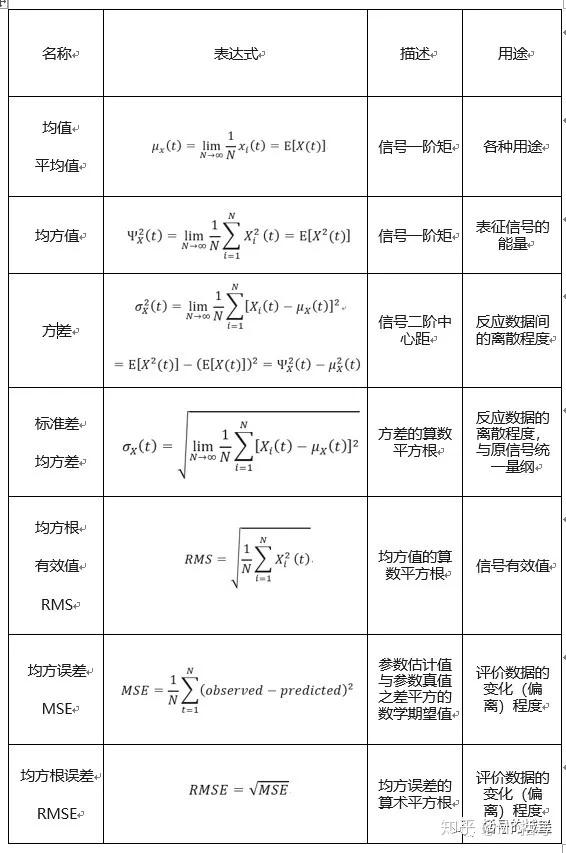

# 时域分析——有量纲特征值含义一网打尽

!!! info
    原文地址：[🔗 专栏：信号处理有关的那些东东](https://zhuanlan.zhihu.com/p/138141521)

    本文为学习笔记。

时域特征值是衡量信号特征的重要指标，时域特征值通常分为**有量纲参数**与**无量纲参数**。

所谓“量纲”，简单地理解就是“单位”。有量纲的参数就是有单位的，比如平均值，一段温度信号（单位℃）的平均值依旧是℃；无量纲的参数没有单位，无量纲量常写作两个有量纲量之积或比，但其最终的纲量互相消除后会得出无量纲量，比如，应变是量度形变的量，定义为长度差与原先长度之比。

有量纲的特征值往往具有直观的物理含义，是最为常用的特征指标。有量纲特征值主要包括：最大值、最小值、峰峰值、均值、方差、标准差、均方值、均方根值（RMS）、均方误差（MSE）、均方根误差（RMSE）、方根幅值等。

## 1 均值

均值、方差、均方值、均方根值之间有内在的联系。

均值是信号的平均，是 **一阶矩** ，可以表示为：

$$ \mu_x(t) = \lim_{N \to \infty} \frac{1}{N} \sum_{i=1}^{N} x_i(t) = E[X(t)] $$

## 2 均方值

均方值是信号的平方的平均（信号→平方→平均值），代表了 **信号的能量** ，是 **二阶矩** ，可以表示为：

$$ \Psi_X^2(t) = \lim_{N \to \infty} \frac{1}{N} \sum_{i=1}^{N} X_i^2(t) = E[X^2(t)] $$

## 3 方差

方差是每个样本值与全体样本值的平均数之差的平方值的平均数，代表了信号能量的动态分量（均值的平方是静态分量），反应数据间的离散程度，是 **二阶中心距** ，可以表示为：

$$ \sigma_X^2(t) = \lim_{N \to \infty} \frac{1}{N} \sum_{i=1}^{N} (X_i(t) - \mu_X(t))^2 = E[X^2(t)] - E[X(t)]^2 = \Psi_X^2(t) - \mu_X^2(t) $$

方差的不同表达方式，可以看出方差的几种理解方式：

(1)

$$ \lim_{N \to \infty}\frac{1}{N} \sum_{i=1}^{N}[X_i(t) - \mu_X(t)]^2 $$

式中可以看出：方差描述的是信号的离散程度，也就是变量离其期望值的距离。

(2)

$$ E[X^2(t)] - E[X(t)]^2 $$

式中可以看出：方差即平方的期望（均方值）减掉期望的平方。

(3)

从物理含义上讲，均方值代表信号的能量，期望的平方代表信号的直流分量，而方差代表信号的交流分量。

## 4 标准差

标准差又叫均方差，是方差的算数平方根。标准差反应的是数据的离散程度。

问题来了，方差和标准差都表示数据的离散程度，那么既然有了方差，为什么还要有标准差呢？

为了和原始信号 **统一量纲** 。

## 5 均方根值

均方根（RMS）又叫有效值。将所有值平方求和，求其均值，再开平方，就得到均方根值。或者说均方根值等于均方值的算数平方根。

$$ RMS = \sqrt{\frac{1}{N} \sum_{i=1}^{N} X_i^2(t)} $$

其物理含义可以这样理解：让交流电与直流电分别通过同一电阻，若两者在相同的时间内所消耗的电能相等（或产生的焦耳热相同），那么该直流电的数值就叫做交流电的有效值。(信号功率的有效值)

## 6 均方误差

均方误差（MSE）是某种意义上的方差，均方误差是指参数估计值与参数真值之差平方的数学期望值。如果我们把随机变量的数学期望E认为是参数估计值（未来的），把随机变量本身作为参数真值，那么均方误差就是普通方差。

$$ MSE = \frac{1}{N} \sum_{i=1}^{N} (observed - predicted)^2 $$

## 7 均方根误差

均方误差MSE可以评价数据的变化（偏离）程度，MSE的值越小（相互之间的比较，而不是跟参数真值的比较），说明预测模型描述实验数据具有更好的精确度。

均方误差在机器学习中常作为一种误差量度。

## 8 均方根误差

均方根误差（RMSE）就是均方误差的算术平方根：

$$ RMSE = \sqrt{MES} $$

{ width=100% }
