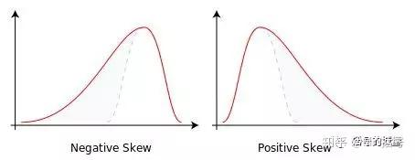

# Time Domain Analysis - Features without Units

!!! info
    Original article: [🔗 DSP-STUFF](https://zhuanlan.zhihu.com/p/138141521)

    This article serves as study notes.

# Dimensionless Indicators in Signal Characterization

When characterizing signals, dimensional indicators, although sensitive to signal features, can vary due to changes in working conditions (such as loads) and are highly susceptible to environmental interference. They exhibit the drawback of insufficient stability in performance. In comparison, dimensionless indicators can eliminate the influence of these disturbance factors, making them widely applied in the field of feature extraction.

Dimensionless indicators mainly include peak factor, pulse factor, crest factor, kurtosis factor, waveform factor, kurtosis factor, and skewness factor.

## 1 Peak Factor

The peak factor is the ratio of the signal peak value to the root mean square (RMS) value, used to detect statistical indicators of impacts in the signal. The peak is a non-stationary parameter that varies significantly at different times. Due to the poor stability of the peak and its low sensitivity to impacts, this indicator has gradually been replaced by kurtosis in fault diagnosis.

$$ \text{Peak Factor} = \frac{\text{Peak Value}}{\text{RMS Value}} $$

## 2 Pulse Factor

The pulse factor is the ratio of the signal peak value to the rectified mean (absolute average value). The difference between pulse factor and peak factor lies in the denominator; since the rectified mean is less than the RMS value for the same set of data, the pulse factor is greater than the peak factor. The pulse factor is also used to detect the presence of impacts in the signal.

$$ \text{Pulse Factor} = \frac{\text{Peak Value}}{\text{Rectified Mean}} $$

## 3 Crest Factor

The crest factor is the ratio of the signal peak value to the root amplitude. Similar to the peak factor, the root amplitude and root mean square (RMS) value are corresponding quantities. The formula for root mean square is the square root of the average of the signal squares, while the root amplitude is the square of the average of the square roots (a bit convoluted). The crest factor can be used to detect the wear condition of mechanical equipment.

$$ \text{Crest Factor} = \frac{\text{Peak Value}}{\text{Root Amplitude}} $$

## 4 Waveform Factor

The waveform factor is the ratio of the RMS value to the rectified mean. In the field of electronics, its physical meaning can be understood as the ratio of direct current relative to alternating current with equal power, and its value is greater than or equal to 1. You might have noticed by now that the waveform factor is equal to the pulse factor divided by the peak factor.

$$ \text{Waveform Factor} = \frac{\text{RMS Value}}{\text{Rectified Mean}} $$

## 5 Kurtosis Factor

Kurtosis factor indicates the smoothness of the waveform and is used to describe the **distribution of variables**. The kurtosis of a normal distribution is equal to 3, and when kurtosis is less than 3, the distribution curve is relatively "flat," while when greater than 3, the curve is relatively "steep."

## 6 Skewness Factor

Skewness factor: Skewness, also called skewness or asymmetry. Skewness and kurtosis are somewhat correlated; kurtosis is the ratio of the fourth central moment to the fourth power of the standard deviation, while skewness is the ratio of the third central moment to the cube of the standard deviation. Similar to kurtosis, skewness describes the distribution. In simple terms, for a unimodal distribution, negative skewness represents the "head" of the distribution curve on the right and the "tail" on the left; positive skewness is the opposite. See the figure below:

{ width=100% }

In summary, the physical meanings of peak factor, pulse factor, and crest factor are similar. Peak factor and pulse factor are indicators used to detect impacts in the signal, while crest factor is often used to detect the wear condition of mechanical equipment. Kurtosis factor also reflects the impact characteristics of vibration signals, but its formula differs significantly from the first three.

When evaluating the performance of these indicators, sensitivity and stability are commonly used measures. Pulse indicators, peak indicators, and kurtosis are sensitive to impact-type faults, especially in the early stages, showing a noticeable increase. However, as faults gradually develop, they decrease, indicating high sensitivity to early faults but poor stability. The RMS value has good stability but is insensitive to early fault signals. To achieve better results, they are often applied simultaneously.

