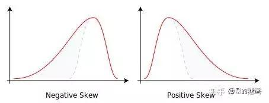

# 时域分析——无量纲特征值含义一网打尽

!!! info
    原文地址：[🔗 专栏：信号处理有关的那些东东](https://zhuanlan.zhihu.com/p/138141521)

    本文为学习笔记。

在信号表征时，有量纲指标虽然对信号特征比较敏感，但也会因工作条件（如负载）的变化而变化，并极易受环境干扰的影响，具有表现不够稳定的缺陷。相比而言，无量纲指标能够排除这些扰动因素的影响，因而被广泛应用于特征提取的领域当中。

无量纲指标主要包括峰值因子，脉冲因子，裕度因子，峭度因子，波形因子以及峭度因子和偏度因子等。

## 1 峰值因子

峰值因子是信号峰值与有效值（RMS）的比值，用来检测信号中是否存在冲击的统计指标。峰值是一个时不稳参数，不同的时刻变动很大。由于峰值的稳定性不好，对冲击的敏感度也较差，因此在故障诊断中，该指标逐渐被峭度指标取代。

$$ \text{峰值因子} = \frac{\text{峰值}}{\text{有效值}} $$

## 2 脉冲因子

脉冲因子是信号峰值与整流平均值（绝对值的平均值）的比值。脉冲因子和峰值因子的区别在分母上，由于对于同一组数据整流平均值小于有效值，所以脉冲因子大于峰值因子。脉冲因子也同样用以检测信号中是否存在冲击。
 
$$ \text{脉冲因子} = \frac{\text{峰值}}{\text{整流平均值}} $$

## 3 裕度因子

裕度因子是信号峰值与方根幅值的比值。与峰值因子类似，方根幅值和均方根值（有效值）是对应的，均方根的公式是信号平方和的平均值的算术平方根，方根幅值是算术平方根的平均值的平方（有点绕）。裕度因子可以用于检测机械设备的磨损情况。

$$ \text{裕度因子} = \frac{\text{峰值}}{\text{方根幅值}} $$

## 4 波形因子

波型因子是有效值（RMS）与整流平均值的比值。在电子领域其物理含义可以理解为直流电流相对于等功率的交流电流的比值，其值大于等于1。说到这儿也许你已经发现了，波形因子=脉冲因子/峰值因子。

$$ \text{波形因子} = \frac{\text{有效值}}{\text{整流平均值}} $$

## 5 峭度因子

峭度因子是表示波形平缓程度的，用于描述 **变量的分布** 。正态分布的峭度等于3，峭度小于3时分布的曲线会较“平”，大于3时分布的曲线较“陡”。

## 6 偏度因子

偏度因子：偏度也叫偏斜度、偏态。偏度和峭度是有一定的相关性的，峭度因子是四阶中心矩和标准差的四次方的比值；偏度因子是三阶中心矩和标准差的三次方的比值。偏度与峭度相同，描述的是分布。物理含义简单理解的话，对于单峰分布，负偏度代表分布图线的“头”在右侧，“尾”在左侧；正偏度反之。参看下图：

{ width=100% }

综合来说：峰值因子、脉冲因子和裕度因子的物理意义是相似的，峰值因子和脉冲因子都是用来检测信号中有无冲击的指标，裕度因子常用来检测机械设备的磨损状况。峭度因子也是对振动信号冲击特性的反应，不过公式的表达形式上与前三个差异较大。

在评价这些指标的性能时，通常使用敏感性与稳定性来衡量。脉冲指标、峰值指标和峭度都对冲击类故障比较敏感，特别是当故障早期发生时，它们有明显的增加；但上升到一定程度后，随故障的逐渐发展，反而会下降，表明它们对早期故障有较高的敏感性，但稳定性不好。有效值的稳定性较好，但对早期故障信号不敏感。为了取得较好的效果，常常会将它们同时应用。

{ width=100% }