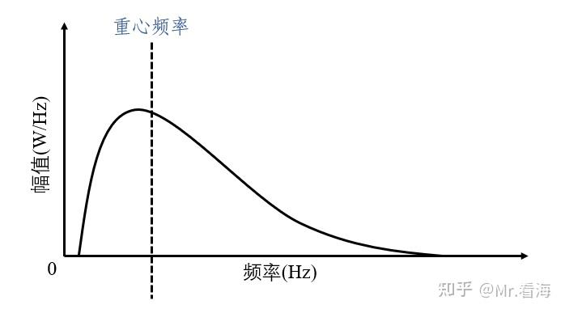
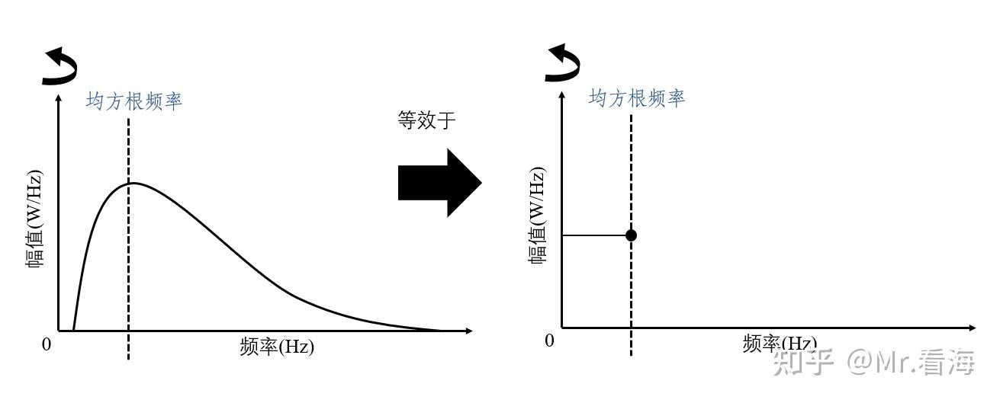
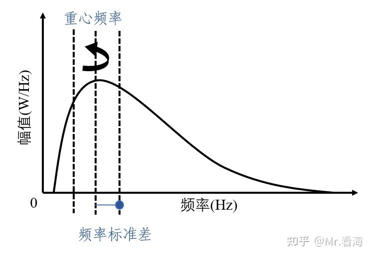

# Frequency Domain Feature Indices and Their Matlab Code

!!! info
    Original article: [🔗 DSP-STUFF](https://zhuanlan.zhihu.com/p/138141521)

    This article serves as study notes.

# Frequency Domain Feature Indicators

Previously, we outlined commonly used dimensional time-domain feature indicators and dimensionless time-domain feature indicators. In feature extraction methods, some frequency domain feature indicators are also very useful.

The following frequency domain feature indicators are obtained based on the signal's power spectrum. In fault diagnosis or other application scenarios, they can be used as part of the feature vector along with time-domain indicators and other metrics to enrich the variety of features and enhance diagnostic accuracy.

## Power Spectrum

The following frequency domain features are all calculated based on the power spectrum. But why not use the frequency spectrum? Personally, I believe it is because the power spectrum is more versatile in expressing the frequency characteristics of power signals and even random signals, as frequency spectrum is not suitable for power signals.

## 1 Center Frequency

The center frequency can describe the frequency of signal components with larger amplitudes in the spectrum, reflecting the distribution of the signal power spectrum. In other words, for a given frequency band, the energy contained in the frequency range below the center frequency is half of the total signal energy.

Another way to understand it is that the center frequency is a weighted average with the amplitude of the power spectrum as weights. Therefore, the center frequency moves towards positions with greater amplitude (i.e., larger weights).

To illustrate more vividly, if you consider the area enclosed by the power spectrum curve in the figure below as a wooden board, placing this board on the wire at the center frequency dashed line allows the board to remain balanced.

{ width=100% }

Center frequency formula:

$$ FC = \frac{\int_0^\infty fP(f)df}{\int_0^\infty P(f)df} $$

## 2 Root Mean Square Frequency

The root mean square frequency is the square root of the mean square frequency. It also has a physically intuitive meaning: if you consider the area enclosed by the power spectrum curve in the figure below as a wooden board, when this board rotates around the y-axis, the distance from the root mean square frequency to the origin is the inertia radius of the rotating body (referring to the distance from the assumed center of mass to the axis of rotation).

{ width=100% }

Mean square frequency formula:

$$ MSF = \frac{\int_0^\infty f^2P(f)df}{\int_0^\infty P(f)df} $$

## 3 Mean Frequency

The mean frequency is the square of the root mean square frequency.

Unlike the center frequency, the mean frequency is the weighted average of the square of the signal frequency. It is also weighted by the amplitude of the power spectrum.

Center frequency, mean frequency, and root mean square frequency all describe the distribution of the power spectrum's main frequency band.

$$ RMSF = \sqrt{MSF} $$

## 4 Frequency Standard Deviation

Similarly, considering the area enclosed by the power spectrum curve in the figure below as a wooden board, the frequency standard deviation is the inertia radius with the center frequency as the center.

If the amplitude of the spectrum near the center is large, the frequency standard deviation is small. If the spectrum near the center is small, the frequency standard deviation is large. The frequency standard deviation is used to describe the dispersion degree of the power spectrum's energy distribution.

{ width=100% }

Frequency standard deviation formula:

$$ RVF = \sqrt{VF} $$

## 5 Frequency Variance

Frequency variance is the square of the frequency standard deviation, providing another dimension to measure the dispersion degree of the power spectrum's energy distribution. I won't describe it in detail.

Frequency variance formula:

$$ VF = \frac{\int_0^\infty (f-FC)^2P(f)df}{\int_0^\infty P(f)df} $$
