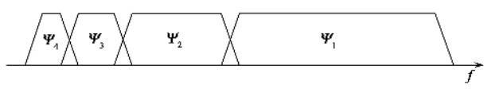
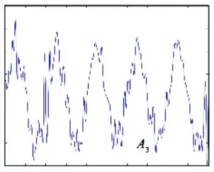
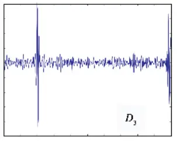
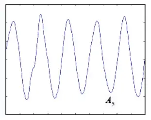
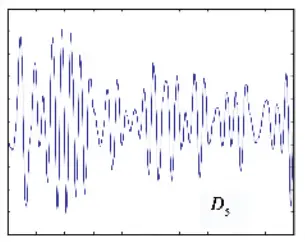

# Matlab Code for Time-Frequency Domain Feature Extraction

!!! info
    Original article: [🔗 DSP-STUFF](https://zhuanlan.zhihu.com/p/138141521)

    This article serves as study notes.

## 1. Spectrogram

Generally speaking, spectrogram analysis refers to the Fourier transform of the signal for analysis. Spectrogram analysis includes two graphs: **amplitude spectrogram** and **phase spectrogram**. However, the most commonly used is the amplitude spectrogram.

**FT (Fourier Transformation)**: Fourier transform. It is the concept we learned in theory, but it cannot be used on the computer for continuous signals. Both the time domain signal and the frequency domain signal are continuous.

**DTFT (Discrete-time Fourier Transform)**: Discrete-time Fourier transform. Here, "discrete time" refers to the time domain, that is, the computer has sampled. However, the result of the Fourier transform is still continuous.

**DFT (Discrete Fourier Transform)**: Discrete Fourier transform. After DTFT, the result of Fourier transform is also discretized, which is DFT.

That is to say: FT time domain continuous, frequency domain continuous; DTFT time domain discrete, frequency domain continuous; DFT time domain discrete, frequency domain discrete.

**FFT (Fast Fourier Transformation)**: Fast Fourier transform. It is a fast algorithm for calculating DFT (Discrete Fourier Transform) and IDFT (Discrete Fourier Inverse Transform). Generally, the fast algorithm is used in engineering applications.

**FS (Fourier Series)**: Fourier series. It is proposed for the continuous periodic signal in the time domain, and the result is a discrete frequency domain result.

**DFS (Discrete Fourier Series)**: Discrete Fourier series. It is proposed for the discrete periodic signal in the time domain. The essence of DFS and DFT is the same.

In addition, add some related knowledge:

- In actual calculation, fast Fourier transform (FFT) is usually used. It is a fast algorithm for calculating DFT (Discrete Fourier Transform) and IDFT (Discrete Fourier Inverse Transform).

- Random signals cannot be Fourier transformed (*here to add again)

## 2. Energy Spectrum

To understand the energy spectrum and power spectrum, you must first understand the energy-limited signal and the power-limited signal (see the previous article for the difference between energy signal and power signal).

The energy spectrum is also called the energy spectrum density. The energy spectrum density describes how the energy of a signal or time series is distributed with frequency. The energy spectrum is the square of the original signal Fourier transform.

## 3. Power Spectrum

The power spectrum is the abbreviation of the power spectrum density function (PSD), which is defined as the signal power in the unit frequency band.

The power spectrum is for power signals. **The derivation formula of the power spectrum is relatively complicated, but fortunately, the Wiener-Khinchin theorem proves that: the power spectrum of a segment of the signal is equal to the Fourier transform of the autocorrelation function of this segment of the signal.**

So there are two ways to calculate the power spectrum:

- 1. (Square of Fourier transform) / (interval length);
- 2. Fourier transform of autocorrelation function.

## Issues with Power Spectral Density (PSD)

1. **Unit of Power Spectral Density (PSD):**
   The unit of PSD is W/Hz. When expressed in dB, it involves taking the logarithm (10logX). Logarithmic scaling is applied to highlight lower amplitude components relative to higher amplitude ones, making it easier to observe periodic signals hidden in low-amplitude noise.

2. **Differences in Methods for Calculating PSD:**
   In principle, there doesn't seem to be much difference. However, based on MATLAB simulation results, the method involving the autocorrelation function demonstrates better noise suppression, resulting in smoother curves. (Refer to the MATLAB code implementation for frequency domain feature extraction – spectrum, PSD, cepstrum.)

3. **FFT vs. PSD:**
   Both FFT and PSD represent frequency domain characteristics, aiding in identifying peak positions. However, PSD is specifically introduced for the analysis of random signals. Signals are categorized as deterministic (energy signals and power signals), and random signals are inherently power signals. According to Dirichlet conditions, energy signals can undergo direct Fourier transformation, but power signals cannot. For signals where direct Fourier transformation is not feasible, a detour is taken by first calculating the autocorrelation and then performing the Fourier transformation. Physically, this corresponds to the power spectrum.

4. **FFT on Random Signals:**
   Directly applying FFT to random signals is essentially truncating them into energy signals for processing. Although this deviates from the definition of random signals, it serves as an approximate approach for short-time frequency domain analysis.

To summarize, **spectrum** and **energy spectrum (also known as energy spectral density)** are results of the Fourier transform expressed as complex numbers and their modulus squared. In contrast, the concept of **power spectrum (i.e., power spectral density)** is introduced specifically for the analysis of random signals.

## 4. Cepstrum (Inverse Spectrum)

Cepstrum, also known as inverse spectrum, liftering, quadratic spectrum, and log power spectrum, is defined in engineering as the result of taking the inverse Fourier transform of the logarithm of the signal's power spectrum (Signal → Power Spectrum → Logarithm → Inverse Fourier Transform).

### Why "Inverse Spectrum"?

The term "inverse spectrum" is attributed to the fact that while the spectrum (power spectrum) reflects frequency characteristics with the horizontal axis being the frequency f (Hz), the corresponding feature points in cepstrum have the horizontal axis as time t (s), and f and t are reciprocal. It's noteworthy that despite being called "spectrum," the horizontal axis in cepstrum is not frequency but time.

### Advantages of Cepstrum

The analysis method of cepstrum is convenient for extracting and analyzing periodic signals that are difficult to identify visually in the original spectrum. It simplifies groups of sideband spectra into single spectra, and it is less affected by the sensor's measuring point location and transmission path.

#### 1. Convenient Extraction of Periodic Signals

Frequencies in the spectrum can exhibit modulation and sidebands. Modulation, whether amplitude or frequency modulation, results in a mixture of high and low-frequency signals. Taking gear vibration as an example, the modulation of high-frequency meshing vibrations and low-frequency gear shaft rotational vibrations creates sidebands in the frequency domain.

Modulation mathematically involves multiplication in the time domain and convolution in the frequency domain. The modulated signal, both in the time and frequency domains, exhibits additional components, forming sidebands around the characteristic frequencies. Extracting these periodic signals from the original spectrum is a primary advantage of cepstrum.

#### 2. Less Affected by Sensor Position and Transmission Path

The second advantage lies in cepstrum being less influenced by the location of sensors and transmission paths. Due to the separation of the vibration effects and transmission path effects in cepstrum, the frequency components representing gear vibration characteristics are nearly identical. While slight variations may exist in the low cepstral frequency range due to differences in transfer functions, these differences have minimal impact.

During cepstrum analysis, there's no need to consider the effects of attenuation and calibration coefficients during signal acquisition, making this feature highly valuable for fault detection.

For a detailed example, refer to [🔗](http://sbgl.jdzj.com/Article/200809/20080924084252_6032.html).

## 5. Wavelet Analysis

Wavelet analysis is a time-frequency domain analysis method that combines information about a signal in both the time and frequency domains. There's an insightful article on Zhihu explaining the concept of wavelet analysis. It is highly recommended for students unfamiliar with the concept. [Link](https://zhuanlan.zhihu.com/p/162124832)

The article concludes with the result of a continuous wavelet transform (CWT):

{ : width=100% }

It looks impressive, but there are two issues: high computational complexity and only numerical solutions without analytical solutions. The wavelet analysis method shown above is called Continuous Wavelet Transform (CWT).

To reduce computational complexity and eliminate unnecessary repeated coefficients, the commonly used method in practice is Discrete Wavelet Transform (DWT).

What does "discrete" mean in this context?

Let's first go back to the expression of the wavelet base wave (also called the mother wavelet):

\[ \Psi_{s\tau}(t) = \frac{1}{\sqrt{s}}\Psi\left(\frac{t-\tau}{s}\right) \]

Here, \( s \) is the scale parameter, representing frequency, and \( t \) is the shift parameter, representing time. As mentioned in the referenced link, in the continuous wavelet transform, \( s \) and \( t \) are continuous.

In discrete wavelet transform, "discrete" refers to the parameters \( s \) and \( t \). The wavelet expression becomes:

\[ \Psi_{j,k}(t) = \frac{1}{\sqrt{s_0^j}}\Psi\left(\frac{t-k\tau_0s_0^j}{s_0^j}\right) \]

Here, \( j \) and \( k \) are integers, usually taking \( s_0=2 \) and \( \tau_0=1 \).

As \( j \) increases, we obtain a series of different wavelets (daughter wavelets). The scale parameters of these daughter wavelets grow exponentially by powers of 2. When using this series of daughter wavelets to discretely analyze a continuous function, we obtain a set of wavelet analysis coefficients. This analysis process is called wavelet series decomposition.

As mentioned earlier, the scale parameter characterizes the frequency. In the series of daughter wavelets, the scale parameter grows by powers of 2 (i.e., the "length" of the wavelet is "stretched" by a factor of 2). Consequently, the corresponding frequencies that daughter wavelets can detect decrease by half. The frequency spectrum of the mother wavelet is located at the high end of the frequency spectrum with the maximum frequency range. The frequency spectra of other daughter wavelets move towards the low-frequency end, and the frequency range they cover decreases accordingly. Ideally, all filters should overlap and cover each other.

{ : width=100% }

Coverage of different scales of daughter wavelets on the wavelet frequency spectrum

Yes, each daughter wavelet acts as a filter, and the process of discrete wavelet transform is a step-by-step filtering process.

What is the specific procedure?

In a nutshell: A set of discrete signals passes through a series of low-pass and high-pass filters, resulting in an approximate signal (denoted as A) and a detail signal (denoted as D).

Describing it with an image:

{ : width=100% }

LP stands for low-pass filter, HP stands for high-pass filter, B is the bandwidth, and 2B is twice the bandwidth.

Illustrating it with an example:

Filtering the original signal: The original signal consists of a continuous low-frequency sine wave (frequency 0.5) and two high-frequency (frequency 10) high-amplitude sine pulses randomly superimposed. Here, dB5 (Daubechies wavelet of the fifth order) is used as the mother wavelet for noise removal.

{ : width=70% }

Original signal

The result of the first-level wavelet decomposition is:

{ : width=70% }

Approximate signal (low-pass result) of the first-level wavelet decomposition

{ : width=70% }

Detail signal (high-pass result) of the first-level wavelet decomposition

The result of the second-level wavelet decomposition (i.e., decomposing A1 signal):

{ : width=70% }

Approximate signal (low-pass result) of the second-level wavelet decomposition

{ : width=70% }

Detail signal (high-pass result) of the second-level wavelet decomposition

The result of the third-level wavelet decomposition (i.e., decomposing A2 signal):

{ : width=70% }

Approximate signal (low-pass result) of the third-level wavelet decomposition

{ : width=70% }

Detail signal (high-pass result) of the third-level wavelet decomposition

The result of the fourth-level wavelet decomposition (i.e., decomposing A3 signal):

{ : width=70% }

Approximate signal (low-pass result) of the fourth-level wavelet decomposition

{ : width=70% }

Detail signal (high-pass result) of the fourth-level wavelet decomposition

At this point, we have obtained a good filtering result (i.e., A5). However, the pulse signal has also been filtered out. To preserve this signal, a threshold setting method can be used, but this is not elaborated here. It can be observed that the original signal has been filtered layer by layer, comprehensively and without omission, through high-pass and low-pass filtering. The closer to the low-frequency segme

