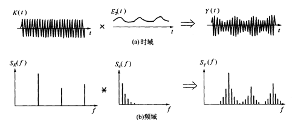

# 信号频域分析方法的理解（频谱、能量谱、功率谱、倒频谱、小波分析）

!!! info
    原文地址：[🔗 专栏：信号处理有关的那些东东](https://zhuanlan.zhihu.com/p/138141521)

    本文为学习笔记。

信号的频域分析方法多种多样，这里针对较为常见的（频谱、能量谱、功率谱、倒频谱、小波分析）集中进行说明。

## 1.频谱

一般来说，频谱分析指的是将信号做傅里叶变换从而进行分析。频谱分析是包括 **幅频谱** 和 **相频谱** 两张图的。不过最常用的是幅频谱。

**FT（Fourier Transformation）**：傅里叶变换。就是我们理论上学的概念，但是对于连续的信号无法在计算机上使用。其时域信号和频域信号都是连续的。

**DTFT（Discrete-time Fourier Transform）**：离散时间傅里叶变换。这里的“离散时间”指的是时域上式离散的，也就是计算机进行了采样。不过傅里叶变换后的结果依然是连续的。

**DFT（Discrete Fourier Transform）**：离散傅里叶变换。在DTFT之后，将傅里叶变换的结果也进行离散化，就是DFT。

也就是说：FT时域连续、频域连续；DTFT时域离散、频域连续；DFT时域离散、频域离散。

**FFT（Fast Fourier Transformation）**：快速傅里叶变换。就是DFT的快速算法，一般工程应用时用的都是这种算法。

**FS（Fourier Series）**：傅里叶级数。是针对时域连续周期信号提出的，结果是离散的频域结果。

**DFS（Discrete Fourier Series）**：离散傅里叶级数。是针对时域离散周期信号提出的，DFS与DFT的本质是一样的。

另外补充几点相关知识：

- 在实际计算中通常使用快速傅里叶变换（FFT）。它是一种用来计算DFT（离散傅里叶变换）和IDFT（离散傅里叶反变换）的一种快速算法。
- 随机信号是无法做傅里叶变换的（*这里要再补充）

## 2.能量谱

要理解能量谱和功率谱，首先要弄明白能量有限信号和功率有限信号（参看之前的文章能量信号和功率信号的分别）。

能量谱也叫能量谱密度，能量谱密度描述了信号或时间序列的能量如何随频率分布。能量谱是原信号傅立叶变换的平方。

## 3.功率谱

功率谱是功率谱密度函数（PSD）的简称，它定义为单位频带内的信号功率。

功率谱是针对功率信号来说的。**功率谱的推导公式相对复杂，不过幸运的是维纳-辛钦定理证明了：一段信号的功率谱等于这段信号自相关函数的傅里叶变换。**

所以求功率谱就有了两种方法：

- 1.(傅立叶变换的平方)/(区间长度)；
- 2.自相关函数的傅里叶变换。

这两种方法分别叫做直接法和相关函数法。

功率谱这里存在着一些问题，整理如下：

1.功率谱密度的单位是什么，看有的写的是dB，还有的说是W/Hz。

功率谱的单位是W/Hz，单位是dB时是做了对数处理（10logX）。取对数的目的是使那些振幅较低的成分相对高振幅成分得以拉高，以便观察掩盖在低幅噪声中的周期信号。

2.求功率谱的两种方法有什么区别么？

从原理上讲似乎没什么区别，从MATLAB仿真结果上来看， **相关函数法对噪声的抑制效果更好** ，图线更平滑。（见频域特征值提取的MATLAB代码实现（频谱、功率谱、倒频谱））

3.FFT和PSD都是表示的频谱特性，帮助我们找出峰值的位置，那么有了FFT为什么还要提出PSD？

信号分为确定信号和随机信号，而确定信号又分为能量信号和功率信号，随机信号一定是功率信号。根据狄里赫利条件，能量信号可以直接进行傅里叶变换，而功率信号不行。对于无法做傅里叶变换的信号，只能走一步弯路，先求自相关，再做傅里叶。但是物理意义上就是功率谱了。不过总之得到了信号的频率特性。

4.既然为什么随机信号的一次FFT没有意义却还能(傅立叶变换的平方)/(区间长度)得到功率谱？

对随机信号直接做FFT的做法其实就是截断成能量信号进行处理，这种处理不符合随机信号定义，但之所以这样做，是做短时频域分析下作的近似处理。

所以总结，**频谱** 和 **能量谱（也叫能量谱密度）** 是傅里叶变换得到的 **复数结果** 和 **模平方的关系** ； 而功率谱（也就是功率谱密度）是针对随机信号分析提出的概念。

## 4.倒频谱

倒频谱（Cepstrum）也叫倒谱、二次谱和对数功率谱等。**倒频谱的工程型定义是：信号功率谱对数值进行傅立叶逆变换的结果。（信号→求功率谱→求对数→求傅里叶逆变换）**

为什么翻译作倒频谱呢？我个人的理解是，频谱（功率谱）反应的频率特征点横坐标是频率f（Hz），在倒频谱中对应的特征点的横坐标是时间t(s)，而f与t互为倒数。**从这里也可以看出，虽然倒频谱也叫“频谱”，其横坐标却并不是频率，而是时间。**

那么倒频谱有什么好处呢？

“该分析方法方便提取、分析原频谱图上肉眼难以识别的周期性信号，能将原来频谱图上成族的边频带谱线简化为单根谱线，受传感器的测点位置及传输途径的影响小。”
这都是啥意思？一条条解释：

1.方便提取、分析原频谱图上肉眼难以识别的周期性信号

我们知道，频谱分析就是为了提取原始信号中的周期性信号的，怎么频谱中的信号还会有周期性？这就又涉及到两个概念：**调制** 和 **边频带** 。

调制分为 **幅值调制** 和 **频率调制** 。下面以齿轮的幅值调制为例进行说明：齿轮的振动信号主要包括两部分，分别是齿轮啮合振动信号（高频）和齿轮轴的转频振动信号（低频），时域和频域曲线分别如下图所示：

{ : style="height:400px;width:300px" }

高频信号和低频信号时域波形

{ : style="height:400px;width:300px" }

高频信号和低频信号的频域波形

调制就是高低频率信号的混合。幅值调制从数学上看，相当于两个信号在时域上相乘；而在频域上，相当于两个信号的卷积。调制后的信号在时域和频域上分别变为：

{ : style="height:400px;width:300px" }

调制后的时域信号

{ : style="height:400px;width:300px" }

调制后的频域信号

我们发现，调制后的信号中，除原来的啮合频率分量外，增加了一对分量，它们是以高频信号特征频率为中心，对称分布于两侧，所以称为边频带。

实际实验中齿轮啮合振动信号（高频）和齿轮轴的转频振动信号（低频）的特征频率可能是有多组的，其调制后的频域信号近似于一组频率间隔较大的脉冲函数和一组频率间隔较小的脉冲函数的卷积，从而在频谱上形成若干组围绕啮合频率及其倍频成分两侧的边频族，如下图：

{ : width=100% }

边频带的形成

说了一大堆，终于回归到上边提到的问题：倒频谱“方便提取、分析原频谱图上肉眼难以识别的周期性信号”。这里指的周期性信号，就是重复出现的边频带。

2.受传感器的测点位置及传输途径的影响小

这是倒频谱的第二个好处。对于布置在不同位置的传感器，由于传递路径不同，其功率谱也不相同。但在倒频谱上，由于信号源的 **振动效应** 和 **传递途径** 的效应分离开来，代表齿轮振动特征的倒频率分量几乎完全相同，只是低倒频率段存在由于传递函数差异而产生的影响。**在进行倒频谱分析时，可以不必考虑信号测取时的衰减和标定系数所带来的影响。** 这一优点对于故障识别极为有用。

具体的例子参考 [🔗](http://sbgl.jdzj.com/Article/200809/20080924084252_6032.html)

## 5.小波分析

小波分析是一种时频域分析方法，该方法兼顾了信号在时域和频域的信息。知乎上有一篇文章对小波分析的理解进行了生动的讲解，强烈建议对小波分析概念不熟的同学先看一下。咚懂咚懂咚：能不能通俗的讲解下傅立叶分析和小波分析之间的关系？这篇文章中最后给出的小波变换的结果是这样的：

{ : width=100% }

连续小波变换

看起来十分厉害，不过同时会发现两个问题：运算量很大；只有数值解，没有解析解。上述这种小波分析方法叫连续小波变换（continuous wavelet transform, CWT）。

为了减少变换运算量，去除不必要的重复的系数，实际中使用的通常是离散小波变换（discrete wavelet transform, DWT）。

这里的“离散”指的是什么呢？

让我们先回到小波基波（也叫母小波）的表达式：

$$ \Psi_{s\tau}(t) = \frac{1}{\sqrt{s}}\Psi(\frac{t-\tau}{s}) $$

其中s是 **尺度参数** ，表征 **频率** ；t是 **位移参数** ，表征 **时间** 。这部分在答友的连接里也提到了。再看上一张图，xy坐标分别是SCALE和TRANSLATION，也就是s和t，他们在连续小波变换中是连续的。

所以，在离散小波变换中，“离散”的就是参数s和t。此时小波表达式写为：

$$ \Psi_{j,k}(t) = \frac{1}{\sqrt{s_0^j}}\Psi(\frac{t-k\tau_0s_0^j}{s_0^j}) $$

j和k都是整数，通常取s0=2，τ0=1。

可以看出，随着j取值的递增，我们可以得到一串不同的小波（子小波，也叫女儿小波...）。这些子小波的尺度参数以2的j次方的形式增长。当使用这一系列的子小波，对一个连续函数进行离散分析时，我们所获得的是一组小波分析的系数，这个分析过程称为小波系列分解。

上边说道，尺度参数表征的是频率，在子小波中尺度参数以2的倍数增长（即小波的“长度”被“拉长”了2倍），那么子小波对应能检测到的频率值也会以1/2的倍数缩小。母小波所对应的频谱位于频率谱的高端，具有最大的频率谱范围- 而其他的子小波的频率谱则依次向频谱图的低频端移动，同时它们所覆盖的频率谱范围也相应地递减。在理想的情况下，所有的滤波器应该首尾相接互相覆盖。

{ : width=100% }

不同尺度的子小波在小波频率谱上的覆盖

是的，每个子小波就相当于一个滤波器， **离散小波变换的过程就是逐级滤波的过程** 。

具体流程是怎样的呢？

**用一句话描述就是：一组离散信号通过一系列的低通和高通滤波器，分别可以得到近似信号（用字母A表示）和细节信号（用字母D表示）。**

用一张图描述就是：

{ : width=100% }

LP为低通滤波器，HP为高通滤波器，B为带宽，2B为2倍带宽

用一个例子来描述就是：

对原始信号滤波：原始信号是在一个连续的低频正弦波信号（频率为0.5）上随机叠加了两个高频（频率为 10）高振幅的正弦脉冲，这里使用了 dB5（第五级Daubechies小波）作为去除噪音操作的母小波。

{ : width=70% }

原始信号

一阶小波分解的结果为：

{ : width=70% }

一阶小波分解的近似信号（低通结果）

{ : width=70% }

一阶小波分解的细节信号（高通结果）

二阶小波分解的结果为（即对A1信号做分解）：

{ : width=70% }

二阶小波分解的近似信号（低通结果）

{ : width=70% }

二阶小波分解的细节信号（高通结果）

三阶小波分解的结果为（即对A2信号做分解）：

{ : width=70% }

三阶小波分解的近似信号（低通结果）

{ : width=70% }

三阶小波分解的细节信号（高通结果）

四阶小波分解的结果为（即对A3信号做分解）：

{ : width=70% }

四阶小波分解的近似信号（低通结果）

{ : width=70% }

四阶小波分解的细节信号（高通结果）

至此我们已经能够得到较好的滤波结果了（即A5，不过脉冲信号也被滤掉了，用设置门限的方法可以保留住该信号，这里不做展开）。可以看到原式信号被逐级的，无遗漏地进行了高、低通滤波，且越接近低频分段越细，几乎想要哪个频段的特征都能得到，因而这个方法有个霸气的名字，叫filter banks。

小波变换大致讲完了，那么它有哪些特点，可以用来做什么呢？

首先当然是 **滤除噪声** 。

其次，由于离散小波变换是可逆的，所以还可以用来做图像、信号的 **无损压缩** 。

另外，可以检测信号的非连续性。奇异信号会在细节信号D中展现。

除此之外，还可以进行图像边界检测等工作。