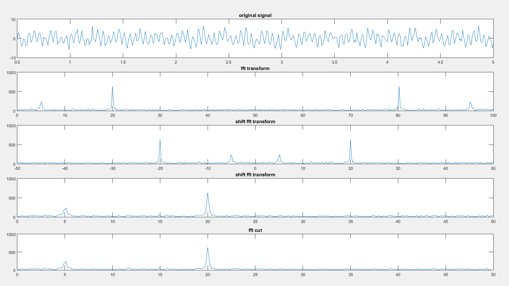
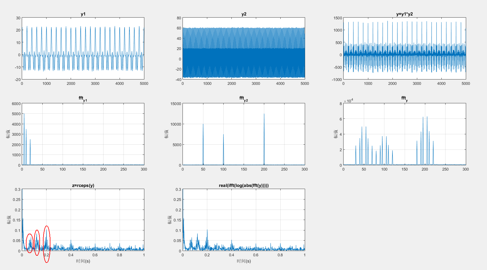

# MATLAB code implementation of frequency domain eigenvalue extraction (spectrum, power spectrum, cepstrum)

## Spectrum

The main functions used for spectrum analysis are fft and fftshift.

Three key points to note:

1. The result of direct fft has the first half corresponding to the frequency range [0, fs/2], and the second half corresponding to [-fs/2, 0]. Refer to the second image in the spectrum result for visualization. To center the zero frequency point in the spectrum, the fftshift function is used, as shown in the third image in the spectrum result.

2. Typically, we are interested in the positive frequency range, and there are two ways to extract it. One approach is to take the second half after fftshift, and the other is to take the first half before fft. The results are the same, but the latter method is more concise. Refer to the fourth and fifth images in the spectrum result for details.

3. According to the Nyquist theorem, the sampling frequency (1/t_s) must be greater than twice the maximum frequency of the signal.

```matlab
t_s = 0.01; %采样周期
t_start = 0.5; %起始时间
t_end = 5;     %结束时间
t = t_start : t_s : t_end;
y = 1.5*sin(2*pi*5*t)+3*sin(2*pi*20*t)+randn(1,length(t));  %生成信号

%%%%%%%%%%%%%%%%%%%%%%%%%%%%%%%频谱%%%%%%%%%%%%%%%%%%%%%%%%%%%%%%%%%%%%%%%
y_f = fft(y); %傅里叶变换
subplot(5,1,1);
plot(t,y);title('original signal');   %绘制原始信号图
Druation = t_end -t_start;  %计算采样时间
Sampling_points = Druation/t_s +1;  %采样点数，fft后的点数就是这个数
f_s = 1/t_s; %采样频率
f_x = 0:f_s/(Sampling_points -1):f_s;  %注意这里和横坐标频率对应上了，频率分辨率就是f_s/(Sampling_points -1)
t2 = f_x-f_s/2;
shift_f = abs(fftshift(y_f));
subplot(5,1,2);
plot(f_x,abs(y_f));title('fft transform');
subplot(5,1,3);
plot(f_x-f_s/2,shift_f);title('shift fft transform');  %将0频率分量移到坐标中心
subplot(5,1,4);
plot(t2(length(t2)/2:length(t2)),shift_f(length(shift_f)/2:length(shift_f)));title('shift fft transform');   %保留正频率部分
subplot(5,1,5);
plot(f_x(1:length(f_x)/2),abs(y_f(1:length(f_x)/2)));title('fft cut');  %直接截取fft结果的前半部分
```


## Power Spectrum

There are two methods for calculating the power spectrum:

- (Square of the Fourier transform)/(Interval length);

- Fourier transform of the autocorrelation function.

These two methods are respectively called the direct method and the autocorrelation function method. (Refer to Understanding Various Frequency Domain Analysis Methods for Signals - Spectrum, Energy Spectrum, Power Spectrum, Inverse Spectrum, Wavelet Analysis)

In the following code, the direct method is implemented using the (Square of the Fourier transform)/(Interval length) approach, yielding results equivalent to using the MATLAB function periodogram (periodogram method). Although theoretically the direct method and the autocorrelation function method are equivalent, simulation results show that the autocorrelation function method provides better noise suppression, resulting in smoother curves.

```matlab
Fs = 1000;
nfft = 1000;  %fft采样点数

%产生序列
n = 0:1/Fs:1;
xn = cos(2*pi*100*n) + 3*cos(2*pi*200*n)+(randn(size(n)));
subplot(5,1,1);plot(xn);title('加噪信号');xlim([0 1000]);grid on
%FFT
Y = fft(xn,nfft);
Y = abs(Y);
subplot(5,1,2);plot((10*log10(Y(1:nfft/2))));title('FFT');xlim([0 500]);grid on
%FFT直接平方
Y2 = Y.^2/(nfft);
subplot(5,1,3);plot(10*log10(Y2(1:nfft/2)));title('直接法');xlim([0 500]);grid on
%周期图法
window = boxcar(length(xn));  %矩形窗
[psd1,f] = periodogram(xn,window,nfft,Fs);
psd1 = psd1 / max(psd1);
subplot(5,1,4);plot(f,10*log10(psd1));title('周期图法');ylim([-60 10]);grid on
%自相关结果
cxn = xcorr(xn,'unbiased');  %计算自相关函数
%自相关法
CXk = fft(cxn,nfft);
psd2 = abs(CXk);
index = 0:round(nfft/2-1);
k = index*Fs/nfft;
psd2 = psd2/max(psd2);
psd2 = 10*log10(psd2(index+1));
subplot(5,1,5);plot(k,psd2);title('间接法');grid on
```

下图中的纵坐标都进行了取对数的处理（10log），取对数的目的是使那些振幅较低的成分相对高振幅成分得以拉高，以便观察掩盖在低幅噪声中的信号特征。


## Inverse Spectrum

The function for calculating the inverse spectrum is rceps (real cepstrum). In MATLAB's documentation, the calculation formula for rceps is given as real(ifft(log(abs(fft(y))))), where the signal is transformed into the frequency domain, then logarithm is taken, and finally, the inverse Fourier transform is applied. However, in the definition of the inverse spectrum, it is stated as signal → power spectrum → logarithm → inverse Fourier transform, where the power spectrum is substituted for the frequency spectrum. This substitution is likely due to the fact that the power spectrum is the square of the magnitude of the frequency spectrum, and taking the logarithm introduces a coefficient of 2, which has minimal impact on subsequent calculations, allowing for an approximate equivalence between the two approaches.

To observe the effect of the inverse spectrum in simulation, a set of modulated signals needs to be manually generated. The following program modulates high-frequency (with main frequencies of 50/100/200Hz) and low-frequency (with main frequencies of 5/10/20Hz) signals, and plots the time-domain and frequency-domain graphs for the low-frequency, high-frequency, and modulated signals. In the ftt_y graph, the formation of sidebands can be observed. (For concepts related to sidebands, refer to Understanding Various Frequency Domain Analysis Methods for Signals - Spectrum, Energy Spectrum, Power Spectrum, Inverse Spectrum, Wavelet Analysis)

```matlab
sf = 1000;
nfft = 1000;
x = 0:1/sf:5;
y1=10*cos(2*pi*5*x)+7*cos(2*pi*10*x)+5*cos(2*pi*20*x)+0.5*randn(size(x));
y2=20*cos(2*pi*50*x)+15*cos(2*pi*100*x)+25*cos(2*pi*200*x)+0.5*randn(size(x));
for i = 1:length(x)
    y(i) = y1(i)*y2(i);
end
subplot(3,3,1)
plot(y1);xlim([0 5000]);title('y1');
subplot(3,3,2)
plot(y2);xlim([0 5000]);title('y2');
subplot(3,3,3)
plot(y);xlim([0 5000]);title('y=y1*y2');

t = 0:1/sf:(nfft-1)/sf;
nn = 1:nfft;
subplot(3,3,4)
ft = fft(y1,nfft);
Y = abs(ft);
plot(0:nfft/2-1,((Y(1:nfft/2))));
title('fft_y_1');
ylabel('幅值');xlim([0 300]);
grid on;
subplot(3,3,5)
ft = fft(y2,nfft);
Y = abs(ft);
plot(0:nfft/2-1,((Y(1:nfft/2))));
title('fft_y_2');
ylabel('幅值');xlim([0 300]);
grid on;
subplot(3,3,6)
ft = fft(y,nfft);
Y = abs(ft);
plot(0:nfft/2-1,((Y(1:nfft/2))));
title('fft_y');
ylabel('幅值');xlim([0 300]);
grid on;

subplot(3,3,7)
z = rceps(y);
plot(t(nn),abs(z(nn)));
title('z=rceps(y)');ylim([0 0.3]);
xlabel('时间(s)');
ylabel('幅值');
grid on;
subplot(3,3,8)
yy = real(ifft(log(abs(fft(y))))); %信号→傅里叶→对数→傅里叶逆变换
plot(t(nn),abs(yy(nn)));
title('real(ifft(log(abs(fft(y)))))');ylim([0 0.3]);
xlabel('时间(s)');
ylabel('幅值');
grid on;
```


