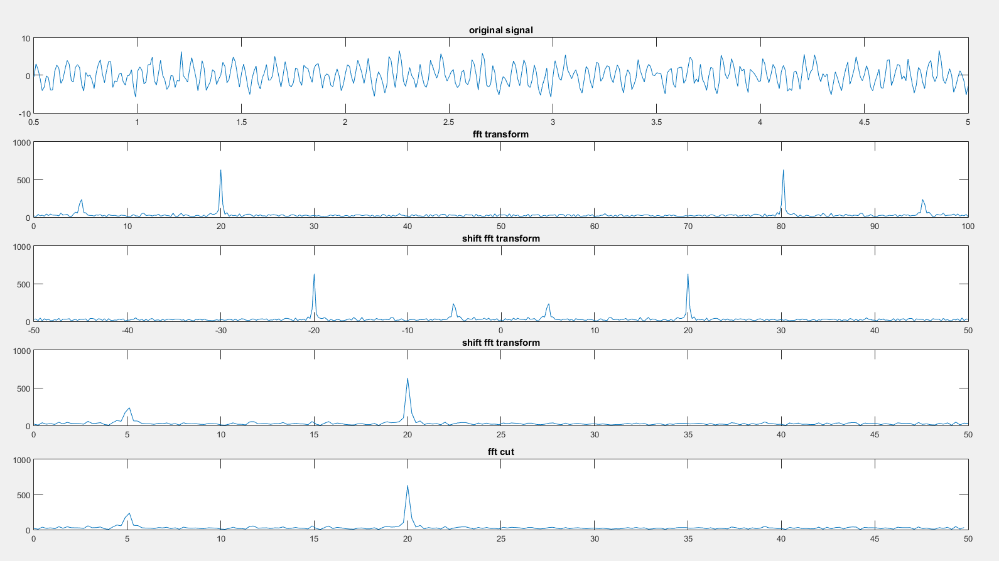
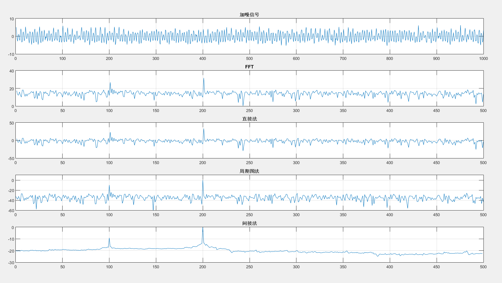
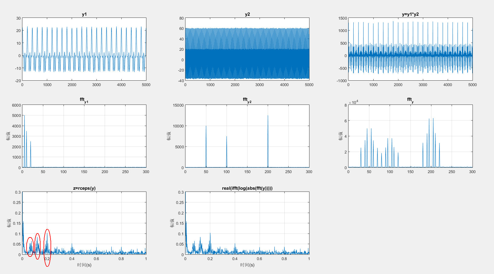

# 频域特征值提取的MATLAB代码实现（频谱、功率谱、倒频谱）

## 频谱

频谱用到的函数主要是fft和fftshift。

需要注意的主要有三点：

1.直接做fft的结果，信号的前半部分对应频率[0,fs/2]，后半部分对应[-fs/2,0]。参见频谱结果图的第2张。为了将零频点移到频谱中间，需要使用fftshift函数，结果参见频谱结果图的第3张。

2.通常我们关心的都是正频率区间的结果，有两种截取方法，一种是在fftshift的结果中截后半段，一种是在fft的结果中截前半段，其结果是一样的。后一种方法更简洁。具体参见频谱结果图的第4、5张。

3.根据奈奎斯特定理，信号的采样频率（1/t_s）必须大于信号频率最大值的两倍。

```matlab
t_s = 0.01; %采样周期
t_start = 0.5; %起始时间
t_end = 5;     %结束时间
t = t_start : t_s : t_end;
y = 1.5*sin(2*pi*5*t)+3*sin(2*pi*20*t)+randn(1,length(t));  %生成信号

%%%%%%%%%%%%%%%%%%%%%%%%%%%%%%%频谱%%%%%%%%%%%%%%%%%%%%%%%%%%%%%%%%%%%%%%%
y_f = fft(y); %傅里叶变换
subplot(5,1,1);
plot(t,y);title('original signal');   %绘制原始信号图
Druation = t_end -t_start;  %计算采样时间
Sampling_points = Druation/t_s +1;  %采样点数，fft后的点数就是这个数
f_s = 1/t_s; %采样频率
f_x = 0:f_s/(Sampling_points -1):f_s;  %注意这里和横坐标频率对应上了，频率分辨率就是f_s/(Sampling_points -1)
t2 = f_x-f_s/2;
shift_f = abs(fftshift(y_f));
subplot(5,1,2);
plot(f_x,abs(y_f));title('fft transform');
subplot(5,1,3);
plot(f_x-f_s/2,shift_f);title('shift fft transform');  %将0频率分量移到坐标中心
subplot(5,1,4);
plot(t2(length(t2)/2:length(t2)),shift_f(length(shift_f)/2:length(shift_f)));title('shift fft transform');   %保留正频率部分
subplot(5,1,5);
plot(f_x(1:length(f_x)/2),abs(y_f(1:length(f_x)/2)));title('fft cut');  %直接截取fft结果的前半部分
```


## 功率谱
功率谱有两种求法：

- (傅立叶变换的平方)/(区间长度)；

- 自相关函数的傅里叶变换。

这两种方法分别叫做直接法和相关函数法。（参见信号的各种频域分析方法的理解（频谱、能量谱、功率谱、倒频谱、小波分析））

下述代码中，直接法就用了(傅立叶变换的平方)/(区间长度)的方法求解的，其结果和使用MATLAB的函数periodogram（周期图法）结果相同；虽然理论上直接法和相关函数法相同，不过仿真结果中相关函数法对噪声的抑制效果更好，图线更平滑。

```matlab
Fs = 1000;
nfft = 1000;  %fft采样点数

%产生序列
n = 0:1/Fs:1;
xn = cos(2*pi*100*n) + 3*cos(2*pi*200*n)+(randn(size(n)));
subplot(5,1,1);plot(xn);title('加噪信号');xlim([0 1000]);grid on
%FFT
Y = fft(xn,nfft);
Y = abs(Y);
subplot(5,1,2);plot((10*log10(Y(1:nfft/2))));title('FFT');xlim([0 500]);grid on
%FFT直接平方
Y2 = Y.^2/(nfft);
subplot(5,1,3);plot(10*log10(Y2(1:nfft/2)));title('直接法');xlim([0 500]);grid on
%周期图法
window = boxcar(length(xn));  %矩形窗
[psd1,f] = periodogram(xn,window,nfft,Fs);
psd1 = psd1 / max(psd1);
subplot(5,1,4);plot(f,10*log10(psd1));title('周期图法');ylim([-60 10]);grid on
%自相关结果
cxn = xcorr(xn,'unbiased');  %计算自相关函数
%自相关法
CXk = fft(cxn,nfft);
psd2 = abs(CXk);
index = 0:round(nfft/2-1);
k = index*Fs/nfft;
psd2 = psd2/max(psd2);
psd2 = 10*log10(psd2(index+1));
subplot(5,1,5);plot(k,psd2);title('间接法');grid on
```

下图中的纵坐标都进行了取对数的处理（10log），取对数的目的是使那些振幅较低的成分相对高振幅成分得以拉高，以便观察掩盖在低幅噪声中的信号特征。



## 倒频谱

倒频谱的求解函数为rceps（实倒频谱），在MATLAB的帮助文档中，rceps的计算公式为real(ifft(log(abs(fft(y)))))，即信号→频谱→对数→傅里叶逆变换，而倒频谱的定义表述中却是信号→功率谱→对数→傅里叶逆变换。即功率谱被换成了频谱。私以为是因为功率谱为频谱值的平方，在取对数后平方会变成系数2，对后续计算影响不大，因而可以近似认为结果相同。

在仿真中要看出倒频谱的作用，需要手动生成一组调制信号。下列程序将高频（主频为50/100/200Hz）和低频（主频为5/10/20Hz）信号进行调制，分别画出低频、高频和调制信号的时域图和频谱图。在图ftt_y中可以看到边频带的形成。（边频带相关概念参见信号的各种频域分析方法的理解（频谱、能量谱、功率谱、倒频谱、小波分析）

```matlab
sf = 1000;
nfft = 1000;
x = 0:1/sf:5;
y1=10*cos(2*pi*5*x)+7*cos(2*pi*10*x)+5*cos(2*pi*20*x)+0.5*randn(size(x));
y2=20*cos(2*pi*50*x)+15*cos(2*pi*100*x)+25*cos(2*pi*200*x)+0.5*randn(size(x));
for i = 1:length(x)
    y(i) = y1(i)*y2(i);
end
subplot(3,3,1)
plot(y1);xlim([0 5000]);title('y1');
subplot(3,3,2)
plot(y2);xlim([0 5000]);title('y2');
subplot(3,3,3)
plot(y);xlim([0 5000]);title('y=y1*y2');

t = 0:1/sf:(nfft-1)/sf;
nn = 1:nfft;
subplot(3,3,4)
ft = fft(y1,nfft);
Y = abs(ft);
plot(0:nfft/2-1,((Y(1:nfft/2))));
title('fft_y_1');
ylabel('幅值');xlim([0 300]);
grid on;
subplot(3,3,5)
ft = fft(y2,nfft);
Y = abs(ft);
plot(0:nfft/2-1,((Y(1:nfft/2))));
title('fft_y_2');
ylabel('幅值');xlim([0 300]);
grid on;
subplot(3,3,6)
ft = fft(y,nfft);
Y = abs(ft);
plot(0:nfft/2-1,((Y(1:nfft/2))));
title('fft_y');
ylabel('幅值');xlim([0 300]);
grid on;

subplot(3,3,7)
z = rceps(y);
plot(t(nn),abs(z(nn)));
title('z=rceps(y)');ylim([0 0.3]);
xlabel('时间(s)');
ylabel('幅值');
grid on;
subplot(3,3,8)
yy = real(ifft(log(abs(fft(y))))); %信号→傅里叶→对数→傅里叶逆变换
plot(t(nn),abs(yy(nn)));
title('real(ifft(log(abs(fft(y)))))');ylim([0 0.3]);
xlabel('时间(s)');
ylabel('幅值');
grid on;
```




