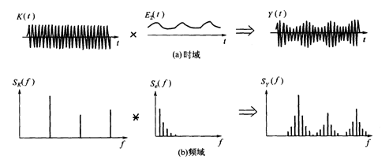
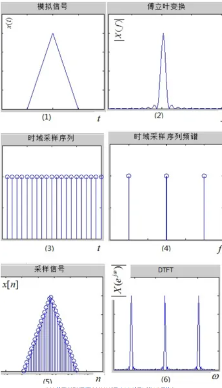

# 时频域分析的一些常用概念补充（线性时不变系统、卷积、冲激响应、窗函数等）

!!! info
    原文地址：[🔗 专栏：信号处理有关的那些东东](https://zhuanlan.zhihu.com/p/138141521)

    本文为学习笔记。

## 相加性和齐次性

由于这两个概念是线性系统必须满足的两个条件，所以放在一起来说。这两个概念很好理解，是符合大众日常认知的。

用一个不太恰当的比喻，大概就是“等价交换”。

一毛钱买一块糖，十毛钱买十块糖就是相加性。即f(ax)=af(x)

一毛钱买一块糖，一个贝壳换一个金子，用一毛钱和一个贝壳能换一块糖和一个金子，就是齐次性。即f(x+y)=f(x)+f(y)

满足相加性和齐次性的系统就是线性系统。这种系统是很“直白”的，给他什么输入，能得到什么输出是很容易计算和理解的。

## 时不变

“直白”的线性系统固然不错，但他会不会变呢，会不会哪天给十毛钱的时候只能换到5块糖了呢。有一些是会变的，但有一些不会。对于这些意志坚定不随时间变化的线性系统，我们叫他线性时不变系统。

## 卷积

卷积的连续的定义为：

$$ y(t) = \int_{-\infty}^{\infty} x(\tau)h(t-\tau)d\tau $$

卷积只适用于线性时不变系统。

卷积的概念理解了，他有一些重要的特征需要牢记：

**性质1：时域的卷积等于频域相乘；频域卷积等于时域相乘。**

一个例子：

图中（a）为高频和低频信号在时域上的调制（相乘），（b）就是在频域上做卷积的结果。

边频带的形成又验证了卷积的第二个性质：

**性质2：与脉冲函数的卷积，在每个脉冲的位置上将产生一个波形的镜像。**

## 冲激响应

系统在单位冲激函数激励下引起的零状态响应被称之为该系统的“冲激响应”。

形象的理解，冲激响应就是上边例子中，被打了一巴掌（单位脉冲）后鼓起来的“包”。不同人（不同系统）在受到同样力度巴掌（单位脉冲）后鼓起来的包的形状、持续时间都是不同的（冲激响应不同）。但是对于相同的人（线性时不变系统），每次的包都是相同的。所以只要知道了巴掌在何时以何种力度打下去的（信号输入），通过卷积就能知道脸会肿成什么形状。（系统输出）

所以在时域上，只要知道了冲击响应，就能根据输入算出输出。这就将复杂的输出结果的计算过程拆成了简单的两步：

- 1.计算系统的冲激响应；

- 2.输入与冲激响应做卷积。

细心地话会发现，上边的过程是在时域中进行的，时域上的卷积就是频域上的相乘，所以： **冲激响应的频域变换=输出的频域变换÷输入的频域变换=传递函数** 。是的， **冲激响应的频域变换就是系统在频域的传递函数。**

说到这儿，有一句话，大家试着理解一下：

任何一个线性时不变系统都可以看做是数字滤波器

数字滤波器的概念还没提到，不过看这个专栏的同学们应该不会陌生。根据上面的描述可知， **线性时不变系统在时域上可以抽象成冲激响应，频域上可以抽象成传递函数** 。从频域分析来看， **信号通过线性系统后，输出信号的频谱将是输入信号的频谱与系统传递函数的乘积** 。传递函数某些频率成分有较大的模。因此，原始信号中这些频率成分将得到加强，而另外一些频率成分处的模很小甚至为零，原始信号中这部分频率分量将被削弱或消失。因此， **系统的作用相当于对输入信号的频谱进行加权** 。对于任意线性时不变系统，虽然加强或削弱的频率分量不同，但是其起到的频率筛选的作用是相同的。

