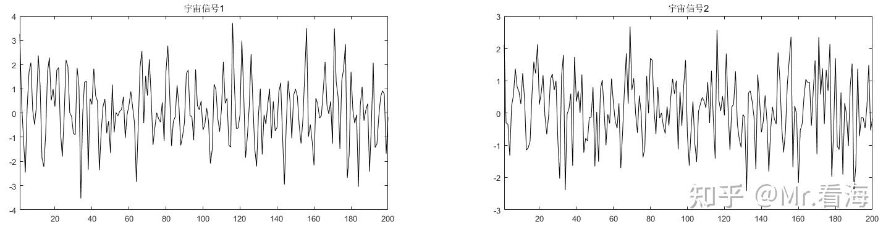
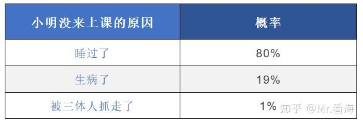
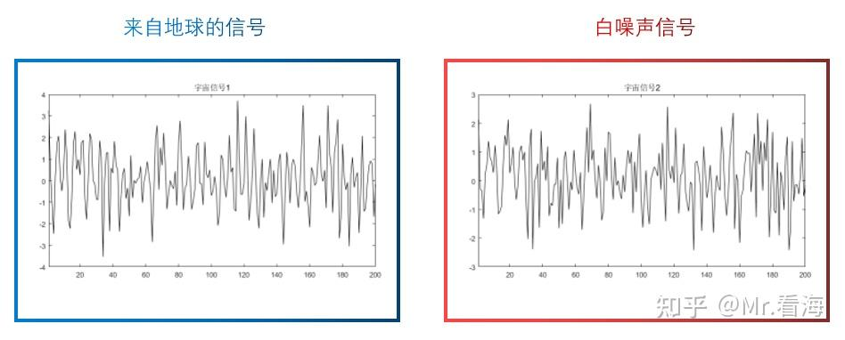
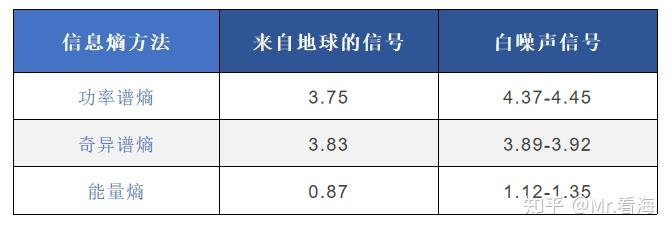

# 【熵与特征提取】基于“信息熵”的特征指标及其MATLAB代码实现（功率谱熵、奇异谱熵、能量熵）

!!! info
    原文地址：[🔗 专栏：信号处理有关的那些东东](https://zhuanlan.zhihu.com/p/138141521)

    本文为学习笔记。

下边这两张图中，其中一张是线性分布的白噪声信号，一张是包含“智能调剂”信息的信号，你能做出分辨吗？

两段信号都采集了200个数据点，你能看出哪段信号中包含了“智能调剂”过的信息吗？

人类的眼睛还不行，但是 **“信息熵”** 可以。

## 1. 关于信息熵
信息熵借用了熵的概念。信息熵的来历和热力学的熵有所不同，之所以信息熵也叫“熵”据说是当年香农提出此概念时参考了热力学的熵，并且两者表达式上有所相似。

信息熵可以很好对 **“信息量”** 进行定量描述，其基本思想是：**发生概率低的事件，包含的信息量更高**。

### 1.1 举个例子

显然，发生概率最低的“被三体人抓走了”，包含的信息量是最多的，就像是“此处省略了一万字”。
香农先生把信息量进行了量化，事件的自信息被定义为：
$$
I(x) = -\log(P(x)) or I(x) = \log_2(P(x))
$$

如果对数log的底数为e，那么 $I(x)$ 的单位就是奈特(nats)；如果以2为底数，单位就是比特(bit)。

信息被量化之后，就可以对**信息熵**下定义了：**信息熵是信息量的期望**。对于离散量其公式为：

$$
H(X) = -\sum_{i=1}^{n}P(x_i)\log(P(x_i))
$$

具体到上边小明没上学的例子中，可以具体算出：

此时的信息熵总和就是0.1785+0.3155+0.0461=0.5401

### 1.2 思考一下
**确定事件的信息熵：** 如果小明没来上课的原因100%是因为睡过了，那信息熵是多少呢？代入公式后就能发现，是0。所以**确定的事件信息熵值为零**。

**时间不确定时的信息熵**：如果小明没来上课的三个原因概率相等，都等于33.33%，带入公式得到信息熵等于1.0986，这是这个例子中的信息熵极值。

所以我们可以得到一个结论：

**信息熵越大，代表不确定性越大，信号中包含的信息量越少。**

**换句话说，信号越无秩序/越接近于白噪声，则信息熵越大。**

!!! note
    从热力学和信息学角度看，“熵”是混乱程度的度量。熵越大，混乱程度越高。

## 2.信息熵的三种求法
回到三体监听员的例子。根据上述结论，当监听员检测到信号信息熵突然变小时，就说明此时的信号中包含了特别的信息。

但是，直接对时域信号求信息熵并不是一个好点子，要在求信息熵之前对原始信号进行一些处理，常用的预先处理方法包括 **①求功率谱**、**②奇异值分解** 以及 **③求信号分解分量的能量**等 。

### 2.1 功率谱熵

有些信号的特征比较容易从频域空间反映出来，比如包含了周期性波动的信号。通过频域计算方法可以获得信号在频域空间内的能量分布情况，将这种能量分布与信息熵结合即可以实现信号在频域空间的定量描述。

#### 2.1.1 功率谱熵的定义
功率谱熵是用来表示信号能量在功率谱划分下的不确定性，当信号中频率组成简单时，功率谱集中在部分频率成分，对应的频率谱线也会比较少，与之对应的组分概率就会越少，从而导致得到的功率谱熵的值就会变小。与之相反，如果信号较为复杂时，信号对应的功率谱越分散，对应的功率谱线会增多，得到的功率谱熵值就会变大，因此，**功率谱熵是对信号在频域上能量分布的复杂程度的定量描述**。
信号越接近白噪声，功率谱越分散，功率谱熵越大。

#### 2.1.2 功率谱熵的计算

功率谱熵的计算分三步：

1. 求信号的功率谱
2. 求各个频段的能量占总能量的比重大小（也可以将每个频率点视作一个频段），得到概率密度函数$P(x)$
3. 将概率密度函数带入以下信息熵公式，得到功率谱熵。
$$
H(X) = -\sum_{i=1}^{n}P(x_i)\log(P(x_i))
$$

**验证一下：**

两段“宇宙信号”中有一段是白噪声信号。

如果监听员试着不断把截取长度为200的信号放到功率谱熵公式里计算，会发现其功率谱熵在4.37-4.45的范围内跳动（探测器采集到的是白噪声）。此时监听员可以设置一个报警阈值，比如4.2，然后就可以去喝咖啡了。

当另外一段宇宙信号输入进来时，功率谱熵是3.75，低于报警阈值，检测器报警。

可靠又简便。

### 2.2 奇异谱熵

#### 2.2.1 奇异谱熵的定义

奇异谱熵是用来表示信号在奇异值分解下的不确定性，奇异谱熵是对信号在奇异值分解下的能量分布的复杂程度的定量描述。

奇异谱熵方法是一种通过奇异谱和信息熵相结合的分析方法。这个方法中将奇异值分解结果作为信息熵求解对象。其适用于采样点数较少、采集到的信号中含有噪声的应用场合。

!!! quote "奇异谱熵"
    信号的奇异谱分析是以动力学分析为基础的现代谱分析技术，其基本思想是通过对系统的时域信号序列进行相空间重构和奇异值分解，获取其**内在复杂性特征**。在信号的奇异谱分析基础上，计算奇异谱的信息熵（简称奇异谱熵），则可**定量描述时间序列的复杂状态特征**。

#### 2.2.2 奇异谱熵的计算

奇异谱熵的计算分四步：

1. 将原始信号$x_t$处理成矩阵A：
$$
A = \begin{bmatrix}
x_1 & x_2 & \cdots & x_{N-m+1} \\
x_2 & x_3 & \cdots & x_{N-m+2} \\
\vdots & \vdots & \ddots & \vdots \\
x_m & x_{m+1} & \cdots & x_N
\end{bmatrix}
$$
2. 对矩阵A进行奇异值分解，得到奇异值谱$\lambda_1 \geq \lambda_2 \geq \cdots \geq \lambda_m$。
3. 求各个奇异值的能量占总能量的比重大小，得到概率密度函数$P(x)$
4. 将概率密度函数带入以下信息熵公式，得到奇异谱熵。

### 2.3 能量熵

#### 2.3.1 能量熵的定义

能量熵是用来表示信号在信号分解分量的能量分布下的不确定性，能量熵是对信号在信号分解分量的能量分布的复杂程度的定量描述。

能量熵有多种求法，因为能量熵通常与信号分解算法相结合，比如EMD、CEEMD、VMD、小波分解等等。

假设一组信号经过分解得到M个分量［S1,S2, …,Sm］，计算每个分量的能量值。以每个分量的能量占总能量的比例作为概率密度函数，计算信息熵。

使用能量熵的方法可以将各种分解方法的特色融合进来，比如结合EMD分解，由于IMF分量包含了不同频段的信息，原始信号处于不同状态时，信号在某些分量上的能量分布就会发生改变；如果结合小波分析，可以将信号时域信息和频域信息相结合。

#### 2.3.2 能量熵的计算

能量熵的求法分为三步：

1.使用某种方法对信号进行分解。
2.分别计算每个分解出来的分量的能量值，即平方和。
3.求各个分量的能量占总能量的比重大小，得到概率密度函数$P(x)$
4.将概率密度函数带入以下信息熵公式，得到能量熵。
$$
H(X) = -\sum_{i=1}^{n}P(x_i)\log(P(x_i))
$$

### 2.4 来自地球的信号
使用以上三种方法，可以对地球信号进行分析，找出其中包含的特殊信息。
揭晓一下谜底，第一张图中左边的图为加入了“智能调剂”，即来自地球的信号，你猜对了吗？

左边的信号中叠加了一个正弦波

使用上述功率谱熵、奇异谱熵、能量熵得到的值分别如下：

奇异值谱和能量谱在分辨上述案例的时候效果相对弱一些。这是跟处理的信号特征相关的，不代表奇异值谱法和能量谱在所有场合都不好用。

### 2.5 补充

除了我们提到的功率谱熵、奇异谱熵、能量熵，还有一些其他的熵，如近似熵，样本熵，排列熵，模糊熵等。这些熵的计算方法各有不同，适用于不同的场合。