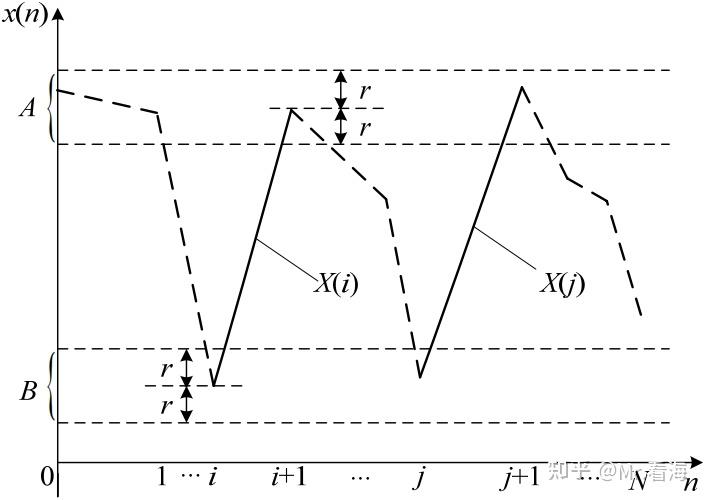

# 【熵与特征提取】从近似熵，到样本熵，到模糊熵，再到排列熵，究竟实现了什么？（第一篇）——“近似熵”及其MATLAB实现

!!! info
    原文地址：[🔗 专栏：信号处理有关的那些东东](https://zhuanlan.zhihu.com/p/138141521)

    本文为学习笔记。

在特征提取领域，近似熵、样本熵、排列熵和模糊熵是比较经常出现的概念。

首先一句话总结一下：这几个熵值都是用来表征信号序列复杂程度的无量纲指标，熵值越大代表信号复杂度越大。信号复杂程度的表征在机械设备状态监测、故障诊断以及心率、血压信号检测中都十分有用；能够抵抗环境干扰的影响，广泛应用于特征提取的领域当中。

从本篇开始，将依次介绍上述几个熵特征的概念。

今天从近似熵开始。

## 1. 近似熵

近似熵(Approximate Entropy，ApEn)概念最早是由 Steven M. Pincus 于 1991年从衡量信号序列复杂性的角度提出的，用于度量信号中产生新模式概率的大小，越复杂的时间序列对应的近似熵越大，越规则的时间序列对应的近似熵则越小。

近似熵的计算也可理解为求取一个时间序列在模式上的**自相似程度**。对于一个信号序列的变化，可以利用近似熵值的改变达到有效识别的目的。近似熵的计算最大的优点是**不需要很长的数据量**，多数实测的时间序列都能够满足要求，得到的结果稳健可靠。

### 1.1 近似熵的含义

下面相对形象但不那么严谨地解释一下近似熵的含义。

假设待分析信号序列为$x(1), x(2), \cdots, x(N)$。

（1）【序列定义】给定模式维数m，可以构造出一组m维矢量：
$$ X(i) = [x(i), x(i+1), \cdots, x(i+m-1)]$$
其中$i = 1, 2, \cdots, N-m+1$, 通常m取2，当m=2时，$X(i) = [x(i), x(i+1)]$。

（2）【近似的含义】上图中的折线是待分析信号（m取2），X(i)和X(j)是图中实线部分。
X(i)的端点处设置一个相似容限阈值r，图中A、B区间分别表示x(i)和x(i+1)的容限范围，如果X(j)的对应端点都在容限范围内，则认为2维特征向量X(i)和X(j)的模式在r下近似。

在确定的i值下，遍历所有的X(i)和X(j)的组合（包括i与j相等的情况，总共会有N-m+1种），记录出近似的数量。

（3）【近似比例】将近似数量与总数量的比值记为 $C_i^m(r)$，即在给定模式维数m下，长度为N的时间序列中，近似的比例。

（4）此时再求得：$\Phi^m(r) = \frac{1}{N-m+1} \sum_{i=1}^{N-m+1} \log C_i^m(r)$，即为近似熵的定义。

（5）将维数加1变为m+1，重复以上步骤，得到 $\Phi^{m+1}(r)$。

（6）【近似熵】求得信号序列的近似熵为：$A_p^{En}(m, r) = \Phi^m(r) - \Phi^{m+1}(r)$。

上式中m通常取2，r通常取(0.1~0.25)SD(x)，其中SD(x)代表信号序列的标准差。

### 1.2 近似熵的特点

结合近似熵的数学定义可见，近似熵的物理本质就是衡量当**维数变化时**信号序列中**新模式出现的对数条件概率均值**，因此**理论上近似熵在表征信号序列的不规则性和复杂性方面具有较大的意义**。需要指出的是，在实际应用中，我们更关注的是各信号近似熵值的相对大小。
① 近似熵具有较好的抗噪及抗干扰的能力。因为产生这类干扰的数据点所具有的独特性，使得这些数据点与相邻点所构成的线段与x(i)的距离较远，容限阈值r 使得这些干扰点得到有效去除。
② 近似熵的分析效果比均差、方差、标准差等统计算法更加有效，因为**近似熵保留了原始信号序列中的时间序列信息，反映了信号序列在结构分布上的特性**。这一特性使得近似熵测度能够更加准确有效地提取出故障信号中的特征信息。
③ 近似熵只需要**较少的数据点**，就可达到对信号序列从统计性角度描述的目的。
④ 近似熵分析具有**较强的通用能力**，可用于随机信号、确定性信号以及两者的混合所组成的信号。

### 1.3 近似熵的参数选择

近似熵在计算之前我们需要对影响近似熵值大小的3个参数m 、r 、N 来进行确定。

1) m的选择。m可以被称之为模式维数，它是用来计算近似熵的时序列的窗口长度。在一般情况下，选择m=2会优于m=1，因为在序列的联合概率在动态重构时候，就会有更多的信息。我们一般不会选择m>2 ，因为在m>2 时，N就应该在数千个点之上，然而我们一般不会让N大于5000，因为当N大于5000时，就不能确保事物的状态有相同的性质；相反，在N选定之后，在m>2的情况下，同时我们还想获得比较理想的结果下，r就必须较大，在分析想要得到的序列的分布就会不得不失去很多信息。因此，我们通常选择m=2 。

2) r的选择。r即相似容限阈值。当r的值较大时，会丢失较多的信息，而当r的值较小时，又会不能理想的估计出系统的统计特性。在经过Pincus等人的不懈努力，总结得到当r 在0.1和0.25SD(x)(SD(x)是序列的标准差)之间， ApEn有比较合理的统计特性。

3) N的选择。Pincus等人通过大量的实验表明，对于给定的数据，一般输入点数要控制在100到5000这个范围内才能保证会有有效的统计特性以及较小的误差。

### 1.4 近似熵算法的局限性
第一点。简单地说，上边第（2）步中求X(i)和X(j)的近似时，是将自身数据段也算在其中了，比如X(1)和X(1)之间必然是相似的，而这一个相似也被计入到近似的总数量当中了，这样做是为了避免$C_i^m(r)$等于0的情况，而ln0显然是没有意义的。但是，将自身数据段引入到计算当中又不可避免地会带来计算偏差。

第二点。上边讲到了，当数据长度N在100-5000的范围内近似熵才可以得到有效的计算结果，也就是说计算样本熵值收到数据长度制约，这也限制了该算法的使用范围。

因此其后研究者们又提出了不同的改进方法，这就是后边的文章要讲的了。