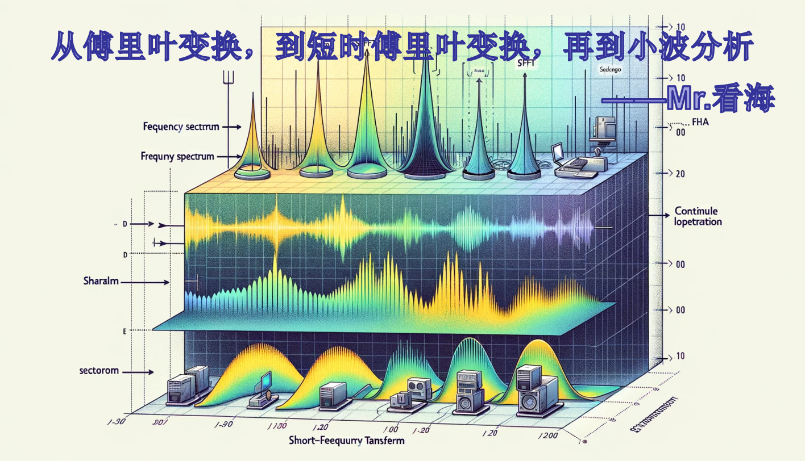
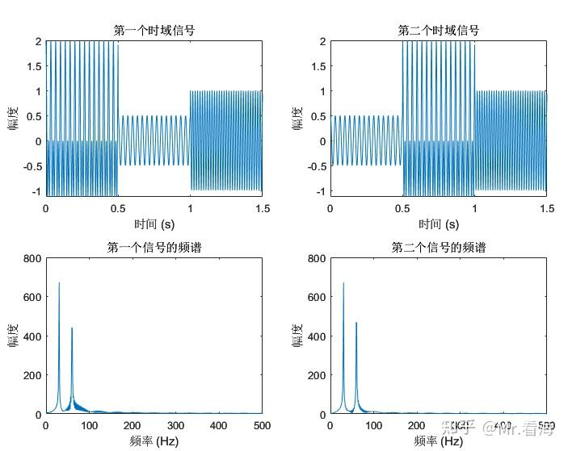
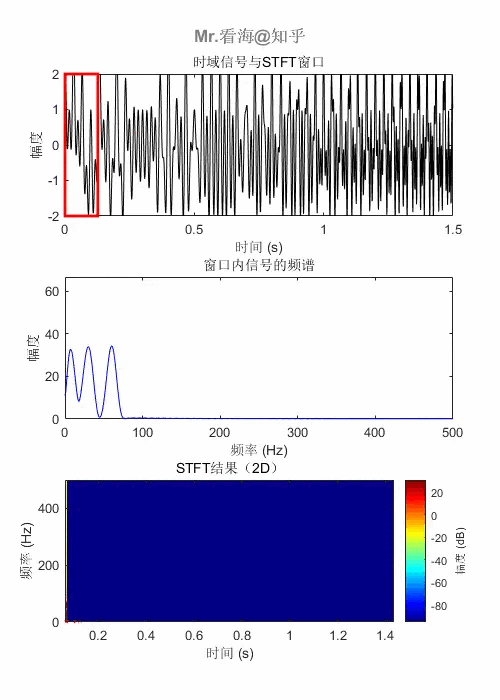
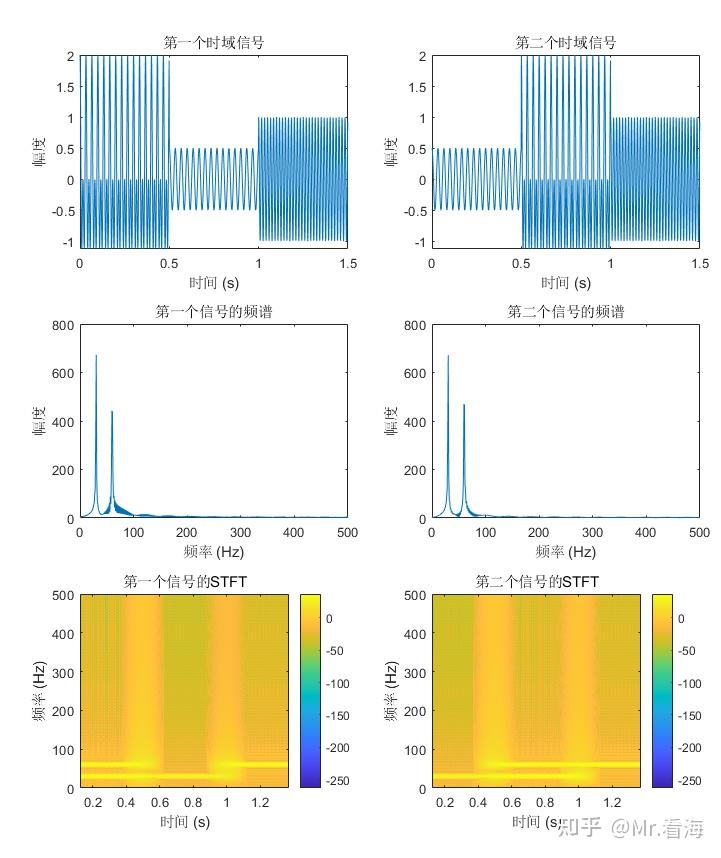
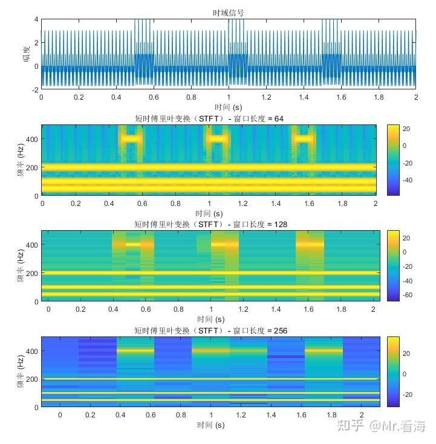
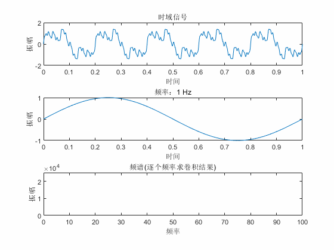
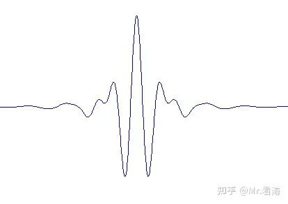
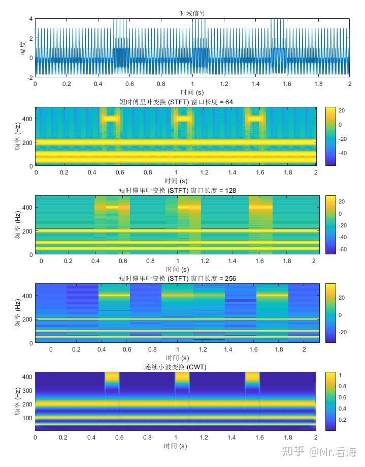

# 从傅里叶变换，到短时傅里叶变换，再到小波分析（CWT），看这一篇就够了

!!! info
    原文地址：[🔗 专栏：信号处理有关的那些东东](https://zhuanlan.zhihu.com/p/138141521)

    本文为学习笔记。

本篇将回归本源，讲一讲从 傅里叶变换 → 短时傅里叶变换 → 小波分析的过程。

为了让大家更直观得理解算法原理和推导过程，这篇文章将主要使用图片案例。

## 1. 频谱分析？——还不够
频谱分析可以告诉我们一个信号包含哪些频率的信息以及这些频率的强度。

通过频谱分析我们可以将信号从其原始的时间域（即随时间变化的形式）转换到频域（即按频率分布的形式）。

频谱分析是如此常用的工具，如果你在做信号处理的研究领域，几乎不可能没听过它。

然而，传统的傅里叶变换有一个限制：它假设信号是平稳的，即其频率成分不会随时间改变。

对于那些随时间变化其频率特性的信号（比如音乐或语音），这种假设并不成立，因此传统的频谱分析无法准确地描绘这些信号的频率随时间的变化情况。

举个可能不太恰当的例子，当你唱“宫廷玉液酒”和“玉液宫廷酒”时，声音信号可能在频谱上差别不大。

我们可以用一张图演示这个现象：

可见当信号的频率成分随时间显著变化时，即所谓的非平稳信号，传统频谱分析就不太合适了。举几个例子：

- 研究信号的局部特性：如爆炸声、机器的故障噪声等，这些信号的特性在短时间内变化很大。
- 语音处理：在自动语音识别和语音合成中，语音的特征如音高和音量随着时间而变化。
- 雷达和无线电信号分析：雷达信号的特性依赖于时间和观测的角度，需分析这些信号随时间的变化。
- 生物医学信号分析：比如心电图（ECG）和脑电图（EEG）这样的生理信号，它们的频率特性随时间改变。

## 2. 直观的解决思路——给频谱分析加窗
传统的频谱分析是全面的，它给出了整个信号的平均频率内容，却无法告诉我们这些频率成分是怎样随时间变化的。

这就好比是我们闭上眼睛听整首曲子，然后试图回忆每个乐器何时加入。这个任务对于我们的大脑来说是非常困难的，对于数学工具来说也同样困难。

这里就需要一种方法来解决这个问题，而“加窗”提供了一个直观的解决思路。

加窗，简单来说，就是在分析信号时不是一次性看整个信号，而是只看信号的一个小段，这个小段就是一个“窗口”。

通过在信号上滑动这个窗口，我们可以逐渐查看整个信号，就像是通过一系列快照来观察它的变化。

>这个过程可以用一个日常的比喻来说明：想象你正在看一场烟花表演，你决定用相机拍摄整个表演。如果使用长时间曝光，你最终得到的照片将是所有烟花的叠加，这相当于传统的频谱分析；然而，如果你使用一连串短时间曝光的快照，每张照片将捕捉到表演的一个瞬间，这就类似于“加窗”的频谱分析。

在实际应用中，我们选择一段时间内的信号，对它进行傅里叶变换，这样得到的频谱只代表了那段时间内的信号。然后，我们移动窗口到下一个时间段，再做一次变换，如此反复。最后，我们将所有的频谱组合起来，就能够得到一个动态的频谱图，这个图不仅展示了信号的频率成分，还展示了它们是如何随时间变化的——这个过程就是短时傅里叶变换（Short-Time Fourier Transform， STFT）。

其计算过程可以用一张动图生动地展示出来：

STFT图就是频谱图在时间轴上的连续展开，这个图有三个轴：

- 时间轴：表示信号分析的持续时间。
- 频率轴：它表示了信号中存在的各种频率成分。
- 幅度轴：幅度轴垂直于时间-频率平面，通常通过颜色的深浅来表示。强度表示在特定时间和频率下信号的能量大小。

STFT图也有二维形式，这种形式中是使用颜色来代表幅度大小的，其生成过程如下：

返回到上边“宫廷玉液酒”和“玉液宫廷酒”的例子，我们画一下其STFT图：

对比第一个信号和第二个信的STFT图，可以看到在不同时间段内频率成分的变化。

通过比较这些图，可以直观地看出STFT与传统傅里叶变换的区别。STFT揭示了信号的局部时频特性。这就是为什么STFT特别适用于显示信号中频率成分随时间的变化。

## 3. 成也窗口，败也窗口——从短时傅里叶变换到小波分析
在短时傅里叶变换（STFT）中，窗口函数及其大小选择是分析的关键。窗口函数决定了在任何给定时间点，信号的哪一部分被用于分析。窗口大小的选择直接影响了分析结果的时间分辨率和频率分辨率，这是进行有效STFT分析的最重要的权衡。

**窗口大小的时间分辨率影响：**时间分辨率与窗口的宽度密切相关。一个窄窗口提供较高的时间分辨率，因为它捕捉了信号在很短时间内的变化。这对于分析包含快速变化的瞬态事件，如敲击声或爆炸声，是非常有用的。然而，较小的窗口将限制频率分辨率，因为频率分析需要足够的周期来准确估计。

**窗口大小的频率分辨率影响：**频率分辨率与窗口的宽度呈反比。一个宽窗口覆盖了信号的较长时间段，提供了较高的频率分辨率。这是因为更多的周期可以在窗口内被分析，从而更准确地确定低频成分。但是，这会牺牲时间分辨率，因为窗口中的信号被假定在这段时间内是平稳的。

只靠文字可能不够直观，还是来看图吧：

- 小窗口长度（例如64样本）： 小窗口提供较高的时间分辨率，这意味着可以更精确地看到频率变化的时间位置（即0.5s-0.6s）。例如，短暂的频率跳变将在图中更清晰地显示为突然的颜色变化。然而，频率分辨率较低，这意味着看不清楚具体是哪个频率发生了变化，频率成分可能会显得模糊。
- 中等窗口长度（例如128样本）： 中等大小的窗口提供了时间分辨率和频率分辨率之间的折衷。会看到频率跳变不如小窗口那样清晰，但频率的分辨率会更好一些，使得不同的频率成分更加明显。
- 大窗口长度（例如256样本）： 大窗口提供较高的频率分辨率，您将能够看到信号中不同频率成分的细节，就像200Hz的频率可以被很好得识别出来。然而，时间分辨率较低，这意味着短暂事件的精确时间定位可能不太清晰，图中跳变的时间段都延展到0.4-0.6s了，而实际上它是0.5-0.6s。
总结一句话，上述矛盾体现了所谓的测不准原理，即时空域和频域无法同时准确。

在实际的信号处理工作中，选择窗口大小常常是基于对信号特性的了解以及对分析精度需求的权衡。如果事件的时间特性是分析的关键，那么小窗口可能更合适；如果频率分辨率是关键，那么大窗口可能更优。

那有没有一种可能，窗口大小是可调的呢？

是的——小波分析就可以实现！

## 4. 小波分析到底是怎么计算的

### 4.1 卷积
我们回忆一下卷积的重要特性：频域相乘等于时域的卷积。

那么频域分析我们可以从一种独特的视角来看：想象一下，我们从频率为0的正弦波开始，逐渐增加这个频率，同时记录每个频率的正弦波与原始信号卷积的结果。这样，我们可以绘制出一张图，其横轴表示频率，纵轴表示卷积结果的强度。请问得到的结果是什么？

是的，就（近似）是频谱！

为什么？因为1Hz的频谱为一个在1Hz处的脉冲，这个脉冲乘以原始信号的频谱得到的就是原始信号1Hz处的频谱幅值，转换到时域上就是原始信号与这个1Hz的正弦信号的卷积。

动图又来了，看过后相信你就能明白：

频谱计算的一种理解视角——频谱可以被视为一系列不同频率的正弦波与原始信号进行卷积的结果。

然而，这种方法只能提供频率上的信息，毕竟中间图中的正弦无论如何平移，都不会影响到频谱的结果。

聪明的你应该想到解决方案了。

### 4.2 小波分析的卷积
是的，我们可以将无限延展周期性的正弦波换成时变的信号，比如这样的：

这样一个信号，就同时可以做拉伸（频率上变换）和平移（延迟时间上变换）了。

依然采用上述卷积计算的方式，来求小波变换的结果，此时画出来的图就不是频谱这样的二维图，而是一个三维图了，就像下边这样：

我们重点看中间的小波的图像，它在时间轴上进行平移，每平移一次进行一次卷积运算，计算结果在第三张图上按照对应的时间（由位置决定）和频率（由尺度决定）画出计算结果。仔细观察小波的变换，可以发现其特点：**高频部分具有较高的时间分辨率和较低的频率分辨率，而低频部分具有较高的频率分辨率和较低的时间分辨率，这就恰好解决了STFT的痛点。**（PS：**小波是复信号，上图中只画了实部投影**）

再回到反映STFT中时空域和频域测不准原理这张图，如果我们用小波分析处理同样的信号，得到的结果是这样的：

在最下边这张图中可以清晰地显示信号中的所有频率分量及其随时间的变化。三个突变信号的边缘清晰锐利、三个主要频率的分辨也较为清晰可辨，在时间分辨率和频率分辨率的取舍中找到了完美的平衡点。

最后以一个优美（误）的比喻来结束理论讲解部分吧：

>频谱分析是长曝光的艺术，揭示了振动的连续舞蹈；短时傅里叶变换像是定焦的高速连拍，捕捉时间的每一跳动。而小波分析赋予了相机变焦的魔力，让每帧都能自适应地聚焦于故事的精髓，无论是宏伟的篇章还是微妙的细节。
