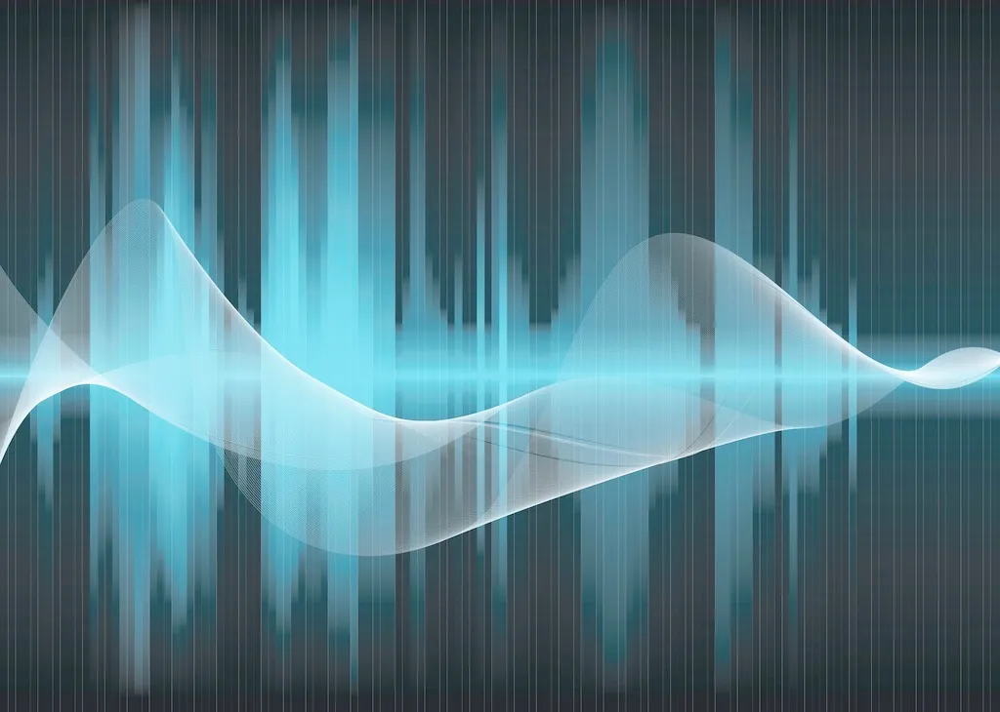

# 数字信号处理

## 理论

-   :material-book:{ .lg .middle } __理解数字信号处理 🎯__

    ---

    作者: Richard G. Lyons

    阅读进度: [2/13]

    [:octicons-arrow-right-24: <a href="https://learning.oreilly.com/library/view/understanding-digital-signal/9780137028450/" target="_blank"> 传送门 </a>](#)

-  :simple-coursera:{ .lg .middle } __数字信号处理 🎯__

    ---

    由EPFL制作

    [:octicons-arrow-right-24: <a href="https://www.coursera.org/specializations/digital-signal-processing#courses" target="_blank"> 传送门 </a>](#)

-  :fontawesome-solid-blog:{ .lg .middle } __信号处理有关的那些东东 🎯__

    ---

    作者：Mr.看海

    阅读进度：

        时频域分析：[12/18]    
        经验模态分解： [0/17]
        神经网络：[0/2]       
        滤波降噪： [0/7]
        时间序列：[0/2]       
        数据降维： [0/4]
        剩余寿命预测：[0/4]   
        概念辨析： [0/6]
        Matlab 小技巧：[0/2]  

    [:octicons-arrow-right-24: <a href="https://zhuanlan.zhihu.com/p/138141521" target="_blank"> 传送门 </a>](#)

