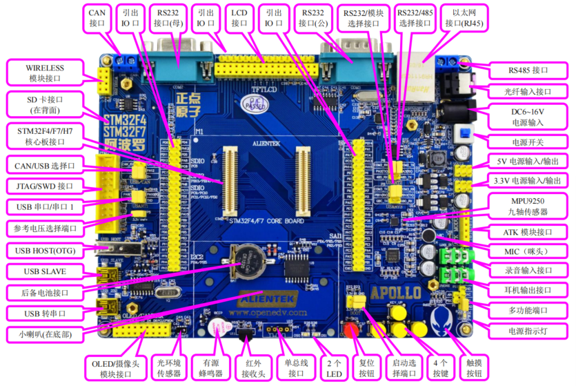
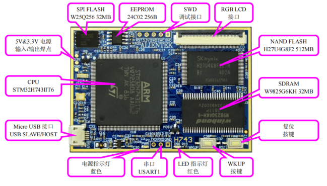

# CH01 实验平台简介

本章将分为如下两节：
1.1，ALIENTEK 阿波罗 STM32F4/F7/H7 开发板资源初探；
1.2，ALIENTEK 阿波罗 STM32F4/F7/H7 开发板资源说明；

## 1.1 ALIENTEK 阿波罗 STM32F4/F7/H7 开发板资源初探
阿波罗 STM32 开发板采用 **核心板+底板** 的形式

### 1.1.1 阿波罗 STM32 开发板底板资源

ALIENTEK 阿波罗 STM32 开发板底板板载资源如下：

- 1 个核心板接口，支持 STM32F429/F767/H743 等核心板
- 1 个电源指示灯（蓝色）
- 2 个状态指示灯（DS0：红色，DS1：绿色）
- 1 个红外接收头，并配备一款小巧的红外遥控器
- 1 个九轴（陀螺仪+加速度+磁力计）传感器芯片，MPU9250
- 1 个高性能音频编解码芯片，WM8978
- 1 个无线模块接口，支持 NRF24L01 无线模块
- 1 路光纤输入接口（音频，仅 F7 支持）
- 1 路 CAN 接口，采用 TJA1050 芯片
- 1 路 485 接口，采用 SP3485 芯片
- 2 路 RS232 串口（一公一母）接口，采用 SP3232 芯片
- 1 路单总线接口，支持 DS18B20/DHT11 等单总线传感器
- 1 个 ATK 模块接口，支持蓝牙/GPS/MPU6050/激光测距/手势识别/RGB 灯等模块
- 1 个光环境传感器（光照、距离、红外三合一）
- 1 个标准的 2.4/2.8/3.5/4.3/7 寸 LCD 接口，支持电阻/电容触摸屏
- 1 个摄像头模块接口
- 1 个 OLED 模块接口
- 1 个 USB 串口，可用于程序下载和代码调试（USMART 调试）
- 1 个 USB SLAVE 接口，用于 USB 从机通信
- 1 个 USB HOST(OTG)接口，用于 USB 主机通信
- 1 个有源蜂鸣器
- 1 个 RS232/RS485 选择接口
- 1 个 RS232/模块选择接口
- 1 个 CAN/USB 选择接口
- 1 个串口选择接口
- 1 个 SD 卡接口（在板子背面）
- 1 个百兆以太网接口（RJ45）
- 1 个标准的 JTAG/SWD 调试下载口 
- 1 个录音头（MIC/咪头）
- 1 路立体声音频输出接口
- 1 路立体声录音输入接口
- 1 个小扬声器（在板子背面）
- 1 组多功能端口（DAC/ADC/PWM DAC/AUDIO IN/TPAD）
- 1 组 5V 电源供应/接入口
- 1 组 3.3V 电源供应/接入口
- 1 个参考电压设置接口
- 1 个直流电源输入接口（输入电压范围：DC6~24V）
- 1 个启动模式选择配置接口
- 1 个 RTC 后备电池座，并带电池
- 1 个复位按钮，可用于复位 MCU 和 LCD
- 4 个功能按钮，其中 KEY_UP(即 WK_UP)兼具唤醒功能
- 1 个电容触摸按键
- 1 个电源开关，控制整个板的电源
- 独创的一键下载功能
- 引出 110 个 IO 口

### 1.1.2 阿波罗 STM32 开发板核心板资源

ALIENTEK STM32H743 核心板板载资源如下：

- CPU：STM32H743IIT6，LQFP176，FLASH：2MB，SRAM：1060KB
- 外扩 SDRAM：W9825G6KH，32M 字节
- 外扩 NAND FLASH：H27U4G8F2（或 MT29F4G08），512M 字节
- 外扩 SPI FLASH：W25Q256，32M 字节
- 外扩 EEPROM：24C02，256 字节
- 2 个板对板接口（在底部），引出 110 个 IO，方便接入各种底板
- 1 个 5V&3.3V 焊点，支持外接电源或输出电源给外部
- 1 个 Micro USB 接口，可作 USB SLAVE/HOST(OTG)使用
- 1 个电源指示灯（蓝色）
- 1 个状态指示灯（红色）
- 1 个 TTL 串口（USART1）
- 1 个复位按钮，可用于复位 MCU 和 LCD
- 1 个功能按钮，WKUP，可以用作 MCU 唤醒
- 1 个 RGB LCD 接口，支持 RGB 接口的 LCD 屏（RGB565 格式）
- 1 个 SWD 调试接口

## 1.2 ALIENTEK 阿波罗 STM32F4/F7/H7 开发板资源说明

### 1.2.1 硬件资源说明

!!! info
    以下为底板资源

#### 1. WIERELESS 模块接口
这是开发板板载的无线模块接口（U4），可以插入 **NRF24L01 模块/WIFI 模块**等无线模块，从而实现无线通信功能。注意：接 NRF24L01 模块进行无线通信的时候，必须同时有 2 个模块和 2 个板子，才可以测试，单个模块/板子例程是不能测试的。

#### 2. SD 卡接口
这是开发板板载的一个标准 SD 卡接口（SD_CARD），该接口在开发板的背面，采用大 SD卡接口（即相机卡，TF 卡是不能直接插的，TF 卡得加卡套才行），SDMMC 方式驱动，有了这个 SD 卡接口，就可以满足海量数据存储的需求。

#### 3.STM32F429/F767/H743 核心板接口
这是开发板底板上面的核心板接口，由 2 个 2*30 的贴片板对板接线端子（3710F 母座）组成，可以用来插 ALIENTEK 的 STM32F429 核心板、STM32H743 核心板、STM32H743 核心板等，从而学习 STM32F429/STM32H743/STM32H743 等芯片，达到一个开发板，学习多款 MCU的目的，减少重复投资。

#### 4. CAN/SUB 接口
这是一个 CAN/USB 的选择接口（P10），因为 STM32 的 USB 和 CAN 是共用一组 IO（PA11和 PA12），所以我们通过跳线帽来选择不同的功能，以实现 USB/CAN 的实验。

#### 5. JTAG/SWD 接口
这是开发板板载的 20 针标准 **JTAG** 调试口（JTAG），该 JTAG 口直接可以和 ULINK、JLINK（V9 或者以上版本）或者 STLINK 等调试器（仿真器）连接，同时由于 STM32 支持 **SWD** 调试，这个 JTAG 口也可以用 SWD 模式来连接。
用标准的 JTAG 调试，需要占用 5 个 IO 口，有些时候，可能造成 IO 口不够用，而用 SWD则只需要 2 个 IO 口，大大节约了 IO 数量，但他们达到的效果是一样的，所以我们强烈建议仿真器使用 SWD 模式！

#### 6. USB 串口/串口 1
这是 USB 串口同 STM32 的串口 1 进行连接的接口（P4），标号 RXD 和 TXD 是 USB 转串口的 2 个数据口（对 CH340G 来说），而 PA9(TXD)和 PA10(RXD)则是 STM32 的串口 1 的两个数据口（复用功能下）。他们通过跳线帽对接，就可以和连接在一起了，从而实现 STM32 的串口通信。
设计成 USB 串口，是出于现在电脑上串口正在消失，尤其是笔记本，几乎清一色的没有串口。所以板载了 USB 串口可以方便大家调试。而在板子上并没有直接连接在一起，则是出于使用方便的考虑。这样设计，你可以把阿波罗 STM32 开发板当成一个 USB 转 TTL 串口，来和其他板子通信，而其他板子的串口，也可以方便地接到开发板上。

#### 7. 参考电压选择端口（核心板指示灯控制口）
这是 STM32 的参考电压选择端口（P5），我们默认是接开发板的 3.3V（VDDA）。如果大家想设置其他参考电压，只需要把你的参考电压源接到 Vref+和 GND 即可 。特别注意：P5 还有控制核心板指示灯亮灭的功能，当 P5 的 Vref+接 3.3V 的时候（默认），核心板的所有指示灯，都停止工作。当 Vref+悬空的时候，核心板的指示灯才正常工作。

#### 8. USB HOST(OTG)
这是开发板板载的一个侧插式的 USB-A 座（USB_HOST），由于 STM32F4/F7/H7 的 USB是支持 HOST 的，所以我们可以通过这个 USB-A 座，连接 U 盘/USB 鼠标/USB 键盘等其他 USB从设备，从而实现 USB 主机功能。不过特别注意，由于 USB HOST 和 USB SLAVE 是共用 PA11和 PA12，所以两者不可以同时使用。

#### 9. USB SLAVE
这是开发板板载的一个 MiniUSB (已经改为type-C) 头（USB_SLAVE），用于 USB 从机（SLAVE）通信，一般用于 STM32 与电脑的 USB 通信。通过此 MiniUSB (已经改为type-C)  头，开发板就可以和电脑进行 USB 通信了。注意：该接口不能和 USB HOST 同时使用。
开发板总共板载了两个 MiniUSB (已经改为type-C) 头，一个（USB_232）用于 USB 转串口，连接 CH340G芯片；另外一个（USB_SLAVE）用于 STM32 内带的 USB。同时开发板可以通过此 MiniUSB头供电，板载两个 MiniUSB 头（不共用），主要是考虑了使用的方便性，以及可以给板子提供更大的电流（两个 USB 都接上）这两个因素。

#### 10. 后备电池接口
这是 STM32 后备区域的供电接口，可以用来给 STM32 的后备区域提供能量，在外部电源断电的时候，维持后备区域数据的存储，以及 RTC 的运行。

#### 11. USB 转串口
这是开发板板载的另外一个 MiniUSB 头(已经改为type-C)，用于 USB 连接 CH340G 芯片，从而实现 **USB 转串口**。同时，此 MiniUSB 接头(已经改为type-C)也是开发板的**电源提供口**。

#### 12. 小喇叭
这是开发板自带的一个 8Ω 2W 的小喇叭，安装在开发板的背面，并带了一个小音腔，可以用来播放音频。该喇叭由 WM8978 直接驱动，最大输出功率可达 0.9W。

#### 13. OLED/摄像头模块接口
这是开发板板载的一个 OLED/摄像头模块接口（P7），如果是 **OLED 模块**，靠左插即可（右边两个孔位悬空）。如果是**摄像头模块（ALIENTEK 提供）**，则刚好插满。通过这个接口，可以分别连接多个外部模块，从而实现相关实验。

#### 14. 光环境传感器
这是开发板板载的一个光环境三合一传感器（U12），它可以作为：**环境光传感器**、**近距离（接近）传感器**和**红外传感器**。通过该传感器，开发板可以感知周围环境光线的变化，接近距离等，从而可以实现类似手机的自动背光控制。

#### 15.有源蜂鸣器
这是开发板的板载蜂鸣器（BEEP），可以实现简单的报警/闹铃。让开发板可以听得见。

#### 16. 红外接收头
这是开发板的红外接收头（U11），可以实现红外遥控功能，通过这个接收头，可以接受市面常见的各种遥控器的红外信号，大家甚至可以自己实现万能红外解码。当然，如果应用得当，该接收头也可以用来传输数据。

#### 17. 单总线接口
这是开发板的一个单总线接口（U10），该接口由 4 个镀金排孔组成，可以用来接
DS18B20/DS1820 等单总线数字温度传感器。也可以用来接 DHT11 这样的单总线数字温湿度传感器。实现一个接口，多个功能。不用的时候，大家可以拆下上面的传感器，放到其他地方去用，使用上是十分方便灵活的。

#### 18. 2 个 LED
这是开发板板载的两个 LED 灯（DS0 和 DS1），DS0 是红色的，DS1 是绿色的，主要是方便大家识别。两个 LED，一般的应用足够了，在调试代码的时候，使用 LED 来指示程序状态，是非常不错的一个辅助调试方法。阿波罗 STM32 开发板几乎每个实例都使用了 LED 来指示程序的运行状态。

#### 19. 复位按钮
这是开发板板载的复位按键（RESET），用于复位 STM32，还具有复位液晶的功能，因为液晶模块的复位引脚和 STM32 的复位引脚是连接在一起的，当按下该键的时候，STM32 和液晶一并被复位。

#### 20. 选择启动端口
这是开发板板载的启动模式选择端口（BOOT），STM32 有 BOOT0（B0）和 BOOT1（B1）两个启动选择引脚，用于选择复位后 STM32 的启动模式，作为开发板，这两个是必须的。在开发板上，我们通过跳线帽选择 STM32 的启动模式。关于启动模式的说明，请看 2.1.8 小节。

#### 21. 4个按键
这是开发板板载的 4 个机械式输入按键（KEY0、KEY1、KEY2 和 KEY_UP），其中 KEY_UP具有唤醒功能，该按键连接到 STM32 的 WAKE_UP（PA0）引脚，可用于待机模式下的唤醒，在不使用唤醒功能的时候，也可以做为普通按键输入使用。
其他 3 个是普通按键，可以用于人机交互的输入，这 3 个按键是直接连接在 STM32 的 IO口上的。这里注意 KEY_UP 是高电平有效，而 KEY0、KEY1 和 KEY2 是低电平有效，大家在使用的时候留意一下。

#### 22. 触摸按钮
这是开发板板载的一个电容触摸输入按键（TPAD），利用电容充放电原理，实现触摸按键检测。

#### 23. 电源指示灯
这是开发板板载的一颗蓝色的 LED 灯（PWR），用于指示电源状态。在电源开启的时候（通过板上的电源开关控制），该灯会亮，否则不亮。通过这个 LED，可以判断开发板的上电情况。

#### 24. 多功能端口
这是 1 个由 6 个排针组成的一个接口（P1&P11）。不过大家可别小看这 6 个排针，这可是本开发板设计的很巧妙的一个端口（由 P1 和 P11 组成），这组端口通过组合可以实现的功能有：ADC 采集、DAC 输出、PWM DAC 输出、外部音频输入、电容触摸按键、DAC 音频、PWM DAC音频、DAC ADC 自测等，所有这些，你只需要 1 个跳线帽的设置，就可以逐一实现。

#### 25. 耳机输出接口
这是开发板板载的音频输出接口（PHONE），该接口可以插 3.5mm 的耳机，当 WM8978放音的时候，就可以通过在该接口插入耳机，欣赏音乐。

#### 26. 录音输入接口
这是开发板板载的外部录音输入接口（LINE_IN）,通过咪头我们只能实现单声道的录音，而通过这个 LINE_IN，我们可以实现立体声录音。

#### 27. MIC（咪头）
这是开发板的板载录音输入口（MIC），该咪头直接接到 WM8978 的输入上，可以用来实现录音功能。

#### 28. ATK 模块接口
这是开发板板载的一个 ALIENTEK 通用模块接口（U5），目前可以支持 ALIENTEK 开发的 GPS 模块、蓝牙模块、MPU6050 模块和全彩 RGB 灯模块等，直接插上对应的模块，就可以进行开发。后续我们将开发更多兼容该接口的其他模块，实现更强大的扩展性能。

#### 29. MPU9250 九轴传感器
这是开发板板载的一个九轴传感器（U6），MPU9250 是一个高性能的九轴传感器，内部集成 1 个三轴加速度传感器、1 个三轴陀螺仪和 1 个三轴磁力传感器，并且带 MPL 功能，该传感器在四轴飞控方面应用非常广泛。所以喜欢玩四轴的朋友，也可通过本开发板进行学习。

#### 30. 3.3V 电源输入/输出
这是开发板板载的一组 3.3V 电源输入输出排针（2*3）（VOUT1），用于给外部提供 3.3V的电源，也可以用于从外部接 3.3V 的电源给板子供电。
大家在实验的时候可能经常会为没有 3.3V 电源而苦恼不已，有了阿波罗 STM32 开发板，你就可以很方便的拥有一个简单的 3.3V 电源（最大电流不能超过 500mA）。

#### 31. 5V 电源输入/输出
这是开发板板载的一组 5V 电源输入输出排针（2*3）（VOUT2），该排针用于给外部提供5V 的电源，也可以用于从外部接 5V 的电源给板子供电。
同样大家在实验的时候可能经常会为没有 5V 电源而苦恼不已，ALIENTEK 充分考虑到了大家需求，有了这组 5V 排针，你就可以很方便的拥有一个简单的 5V 电源（USB 供电的时候，最大电流不能超过 500mA，外部供电的时候，最大可达 1000mA）。

#### 32. 电源开关
这是开发板板载的电源开关（K1）。该开关用于控制整个开发板的供电，如果切断，则整个开发板都将断电，电源指示灯（PWR）会随着此开关的状态而亮灭。

#### 33. DC6~16V 电源输入
这是开发板板载的一个外部电源输入口（DC_IN），采用标准的直流电源插座。开发板板载了 DC-DC 芯片（MP2359），用于给开发板提供高效、稳定的 5V 电源。由于采用了 DC-DC 芯片，所以开发板的供电范围十分宽，大家可以很方便的找到合适的电源（只要输出范围在DC6~16V 的基本都可以）来给开发板供电。在耗电比较大的情况下，比如用到 4.3 屏/7 寸屏/网口的时候，建议使用外部电源供电，可以提供足够的电流给开发板使用。

#### 34. 光纤输入接口
这是开发板板载的音频光纤输入接口（OPTICAL），可以接收光纤传递过来的数字音频信号。注意：此接口仅在使用 STM32H7/H7 核心板的时候才有用，STM32F429 核心板无法使用。

#### 35. RS485 接口
这是开发板板载的 RS485 总线接口（RS485），通过 2 个端口和外部 485 设备连接。这里提醒大家，RS485 通信的时候，必须 A 接 A，B 接 B。否则可能通信不正常！

#### 36. 以太网接口（RJ45）
这是开发板板载的网口（EARTHNET），可以用来连接网线，实现网络通信功能。该接口使用 STM32 内部的 MAC 控制器外加 PHY 芯片，实现 10/100M 网络的支持。

#### 37. RS232/485 选择接口
这是开发板板载的 RS232（COM2）/485 选择接口（P8），因为 RS485 基本上就是一个半双工的串口，为了节约 IO，我们把 RS232（COM2）和 RS485 共用一个串口，通过 P9 来设置当前是使用 RS232（COM2）还是 RS485。这样的设计还有一个好处。就是我们的开发板既可以充当 RS232 到 TTL 串口的转换，又可以充当 RS485 到 TTL485 的转换。（注意，这里的 TTL高电平是 3.3V）

#### 38. RS232/模块选择接口
这是开发板板载的一个 RS232（COM3）/ATK 模块接口（U5）选择接口（P9），通过该选择接口，我们可以选择 STM32 的串口 3 连接在 COM3 还是连接在 ATK 模块接口上面，以实现不同的应用需求。该接口，同样也可以充当 RS232 到 TTL 串口的转换。

#### 39. RS232 接口（公）
这是开发板板载的一个 RS232 接口（COM3），通过一个标准的 DB9 公头和外部的串口连接。通过这个接口，我们可以连接带有串口的电脑或者其他设备，实现串口通信。

#### 40. 引出 IO 口（总共有三处）
这是开发板 IO 引出端口，总共有三组主 IO 引出口：P2、P3 和 P6。其中，P2 和 P3 分别采用 2*22 排针引出，总共引出 86 个 IO 口，P6 采用 1*16 排针，按顺序引出 FSMC_D0~D15等 16 个 IO 口。另外，还通过：P4、P8、P9 和 P10 引出 8 个 IO，总共引出 110 个 IO 口。

#### 41. LCD 接口
这是开发板板载的 LCD 模块接口（16 位 80 并口），兼容 ALIENTEK 全系列 LCD 模块，包括：2.4 寸、2.8 寸、3.5 寸、4.3 寸和 7 寸等 TFTLCD 模块，并且支持电阻/电容触摸功能。

#### 42. RS232 接口（母）
这是开发板板载的另外一个 RS232 接口（COM2），通过一个标准的 DB9 母头和外部的串口连接。通过这个接口，我们可以连接带有串口的电脑或者其他设备，实现串口通信

#### 43. CAN 接口
这是开发板板载的 CAN 总线接口（CAN），通过 2 个端口和外部 CAN 总线连接，即 CANH和 CANL。这里提醒大家：CAN 通信的时候，必须 CANH 接 CANH，CANL 接 CANL，否则可能通信不正常！

!!! info
    以下为核心板资源

#### 1. 5V&3.3V 电源
这里实际上由 3 个焊点组成：5V、3.3V、GND。通过这三个焊点，我们可以给核心板提供电源，也可以由核心板给外部提供电源（3.3V 对外供电时，电流不要超过 300mA）。方便应用到各种场景中去。

#### 2. CPU
这是核心板的 CPU（U1），型号为：STM32H743IIT6。该芯片采用六级流水线，自带指令和数据 Cache、集成 JPEG 编解码器、集成双精度硬件浮点计算单元（DPFPU）和 DSP 指令，并具有 1060KB SRAM、2048KB FLASH、18 个 16 位定时器、2 个 32 位定时器、4 个 DMA 控制器、6 个 SPI、1 个 QSPI 接口、3 个全双工 I2S、4 个 SAI、4 个 IIC、9 个串口、2 个 USB（支持 HOST /SLAVE）、2 个 CAN、3 个 16 位 ADC、2 个 12 位 DAC、1 个 SPDIF RX 接口、1 个RTC（带日历功能）、2 个 SDMMC 接口、1 个 FMC 接口、1 个 TFTLCD 控制器（LTDC）、1个 10/100M 以太网 MAC 控制器、1 个摄像头接口、1 个硬件随机数生成器、以及 140 个通用IO 口等。

#### 3. Micro USB 接口 (type-C)
这是核心板的 USB 接口（USB），采用 Micro USB 接口，和手机数据线通用，此接口既可以作为 USB SLAVE 使用，也可以做 USB HOST(OTG)使用，当作为 HOST 使用的时候，需要外接一根 USB OTG 线。同时，这个接口也是核心板电源的主要提供口（单独使用核心板时）。

#### 4. 电源指示灯
这是核心板自带的液晶电源指示灯（PWR），为蓝色。当核心板正常供电时，此 LED 会亮。
不过，该 LED 默认受 VREF+控制，当 VREF+悬空时，才正常工作，当 VREF+接 3.3V 时，则一直关闭。想要 LED 不受 VREF+控制，把核心板的 R13 拆了即可。注意，当核心板插在底板上时，可以通过拔掉底板上 P5 的跳线帽，即可实现 VREF+悬空，从而指示灯亮。

#### 5. 串口
这是核心板引出的串口 1（USART1），可用于串口通信。注意：排针默认没有焊接，需要自行焊接。

#### 6. LED 指示灯
这是核心板自带的一个状态指示灯（DS0），红色，可以表示程序运行状态，该指示灯与底板上的 DS0 共用一个 IO。同样，当 VREF+悬空时，才正常工作，受限条件同电源指示灯。

#### 7. WKUP 按键
这是核心板板载的一个功能按键（WKUP），并且具有唤醒功能，该按键和底板上的 KEY_UP共用一个 IO 口（PA0），该按键也是高电平有效。

#### 8. 复位按键
这是核心板板载的复位按键（RST），用于复位 STM32，另外还具有复位液晶的功能，因为液晶模块的复位引脚和 STM32 的复位引脚是连接在一起的，当按下该键的时候，STM32 和液晶一并被复位。此按键和底板上的复位按键功能完全一样。

#### 9. SDRAM
这是核心板外扩的 SDRAM 芯（U3）片，型号为：W9825G6KH，容量为 32M 字节，轻松应对各种大内存需求场景，比如 GUI 设计、算法设计、大数据处理等。

#### 10. NAND FLASH
这是核心板外扩的 NAND FLASH 芯（U4）片，型号为：H27U4G8F2/MT29F4G08，容量为 512M 字节，可以实现大数据存储，满足各种应用需求。另外，大家可以自行更换更大容量的 NAND FLASH，满足项目需要。

#### 11. RGB LCD 接口
这是核心板自带的 RGB LCD 接口（LCD），可以连接各种 ALIENTEK 的 RGB LCD 屏模块，并且支持触摸屏（电阻/电容屏都可以）。为了节省 IO 口，采用的是 RGB565 格式，虽然降低了颜色深度，但是节省了 IO，且 RGB565 格式，程序上更通用一些。

#### 12. SWD 接口
这是核心板自带的调试接口（SWD），可以用于代码下载和仿真调试。采用 SWD 接口，只需最少 3 根线（SWD、SWC 和 GND），即可实现代码下载和仿真调试。注意：排针默认没有焊接，需要自行焊接。

#### 13. EEPROM
这是核心板板载的 EEPROM 芯片（U5），型号为：24C02，容量为 2Kb，也就是 256 字节。用于存储一些掉电不能丢失的重要数据，比如系统设置的一些参数/触摸屏校准数据等。有了这个就可以方便的实现掉电数据保存。

#### 14. SPI FLASH
这是核心板外扩的 SPI FLASH 芯片（U6），型号为：W25Q256，容量为 256Mbit，即 32M字节，可用于存储字库和其他用户数据，满足大容量数据存储要求。

最后，STM32H743 核心板的接口，是在底部，通过两个 2*30 的板对板端子（3710M 公座）组成，总共引出了 110 个 IO，通过这个接口，可以实现与阿波罗 STM32 开发板的对接。

### 1.2.2 软件资源说明
~
### 1.2.3 阿波罗 IO 引脚分配
~