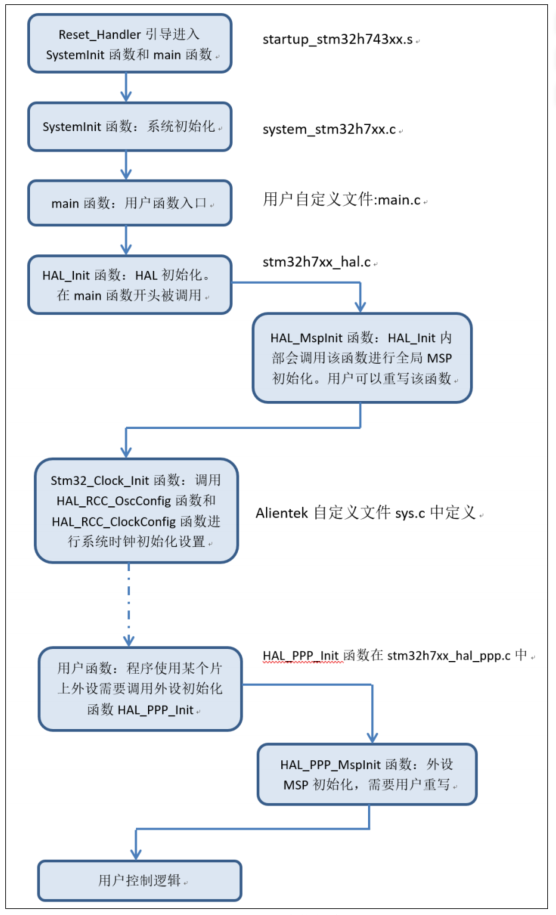

# CH03 MDK5 软件入门

本章将向大家介绍 MDK5 软件的使用，通过本章的学习，我们最终将建立一个自己的
MDK5 工程，同时本章还将向大家介绍 MDK5 软件的一些使用技巧，希望大家在本章之后，能
够对 MDK5 这个软件有个比较全面的了解。
本章分为如下个小结：
3.1，MDK5 简介；
3.2，新建 MDK5 工程；
3.3，MDK5 使用技巧；

## 3.1 MDK5 简介
~
## 3.2 STM32CubeH7 简介
STM32Cube 是 ST 提供的一套性能强大的免费开发工具和嵌入式软件模块，能够让开发人员在 STM32 平台上快速、轻松地开发应用。它包含两个关键部分：
1、 图形配置工具 STM32CubeMX。允许用户通过图形化向导来生成 C 语言工程。
2、嵌入式软件包（STM32Cube 库）。包含完整的 HAL 库（STM32 硬件抽象层 API），配套的中间件（包括 RTOS，USB，TCP/IP 和图形），以及一系列完整的例程。嵌入式软件包完全
兼容 STM32CubeMX。对于图形配置工具 STM32CubeMX 入门使用，由于需要 STM32H7 基础才能入门使用，所以我们安排在后面 4.8 小节给大家讲解。本小节，我们主要讲解 STM32Cube的嵌入式软件包部分。在讲解之前，首先我们来看看库函数和寄存器开发的关系。

### 3.2.1 库开发与寄存器开发的关系
其实一句话就可以概括：固件库就是函数的集合，固件库函数的作用是向下负责与寄存器直接打交道，向上提供用户函数调用的接口（API）

### 3.2.2 STM32CubeH7 固件包介绍

## 3.3 新建基于 HAL 库的工程模板和工程结构讲解 🎯
这个教程在于教读者理解，而真正使用的时候更多的是使用CubeMX来生成工程，然后再在MDK中打开工程进行编程。所以这个教程的重点是让读者理解工程的结构，以及如何在MDK中打开工程进行编程。

### 3.3.1 新建基于 HAL 库工程模板
参考文档。

### 3.3.2 工程模板解读

#### 3.3.2.1 关键文件介绍

#### 3.3.2.2 HAL 库中__weak 修饰符讲解
weak 顾名思义是“弱”的意思，所以如果函数名称前面加上__weak 修饰符，我们一般称这个函数为“弱函数”。加上了__weak 修饰符的函数，用户可以在用户文件中重新定义一个同名函数，最终编译器编译的时候，会选择用户定义的函数，如果用户没有重新定义这个函数，那么编译器就会执行__weak 声明的函数，并且编译器不会报错。

#### 3.3.2.3 Msp 回调函数执行过程解读

#### 3.3.2.4 程序执行流程图

## 3.4 程序下载与调试 🎯

### 3.4.1 STM32H7 程序下载 

### 3.4.2 STM32H7 在线调试

## 3.5 MDK5 使用技巧

### 3.5.1 文本美化

### 3.5.2 语法检测&代码提示

### 3.5.3 代码编辑技巧
1）TAB 键的妙用
Tab: 缩进
Shift+Tab: 反缩进
支持块操作，选中一段代码，按 Tab 键，可以对选中的代码进行缩进操作。

2） 快速定位函数/变量被定义的地方
需要再编译时，output里面勾选browse information，然后在编辑器中右键点击函数名，选择go to definition，就可以快速定位到函数定义的地方。

3） 快速注释与快速消注释

!!! tip
    个人觉得使用VScode编辑文本要快得多，这里技巧再多能有VScode好使吗？

### 3.5.4 其他小技巧